# Architecture Diagrams - Visual Reference

> **Renderização**: Estes diagramas Mermaid são renderizados automaticamente no GitHub e VS Code com extensões adequadas.

## 📐 Visão Geral - Contexto C4

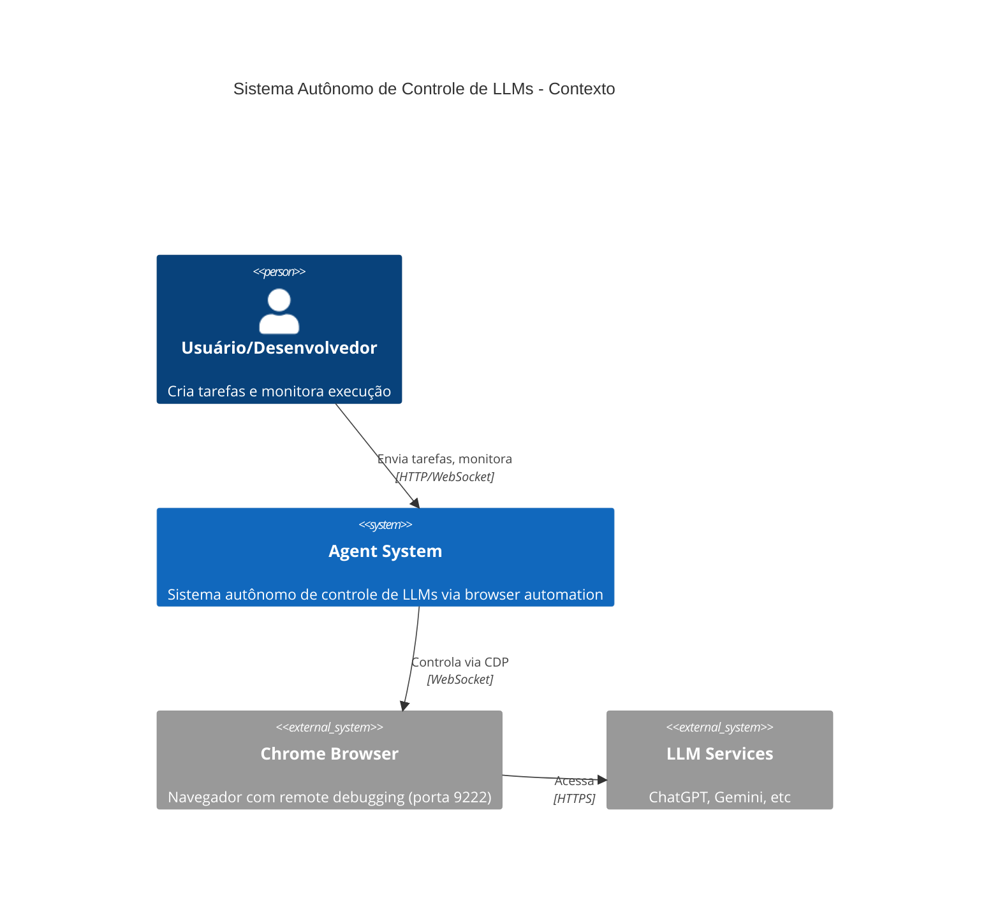

## 🏗️ Arquitetura de Containers

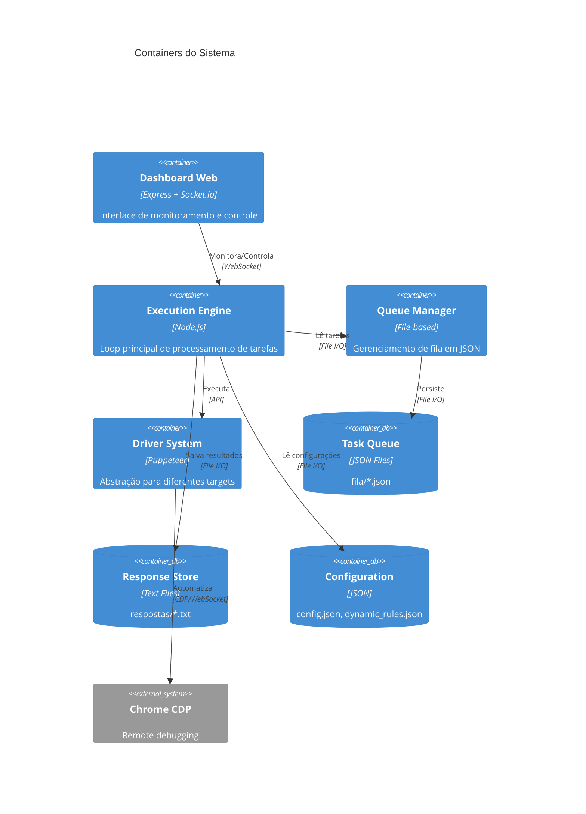

## 🔄 Fluxo de Processamento de Tarefas

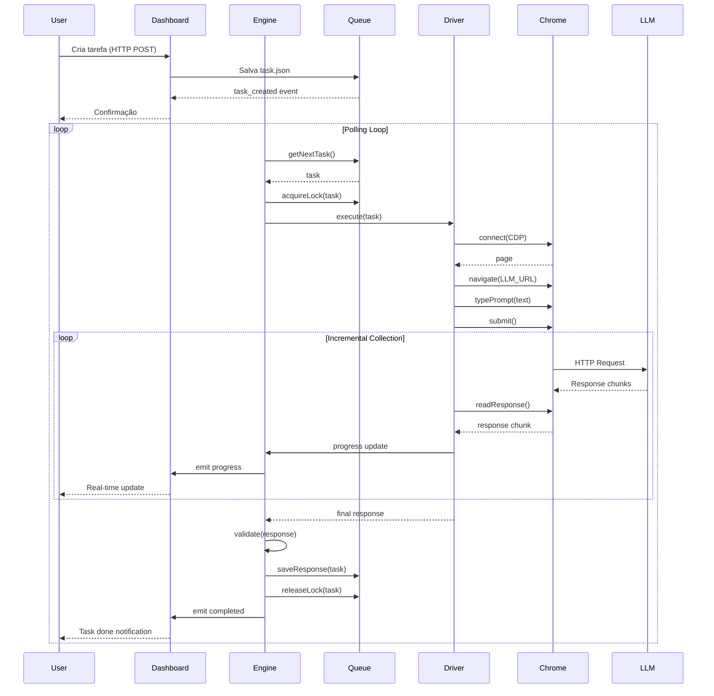

## 🧩 Componentes do Driver System

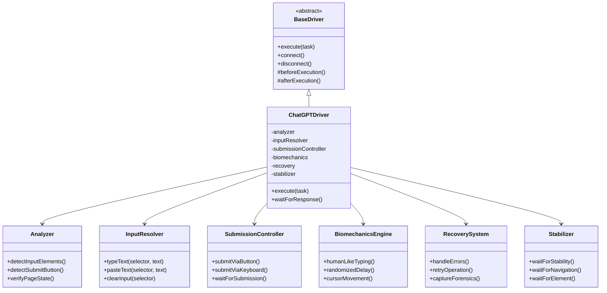

## 📊 Estados de Tarefa (State Machine)

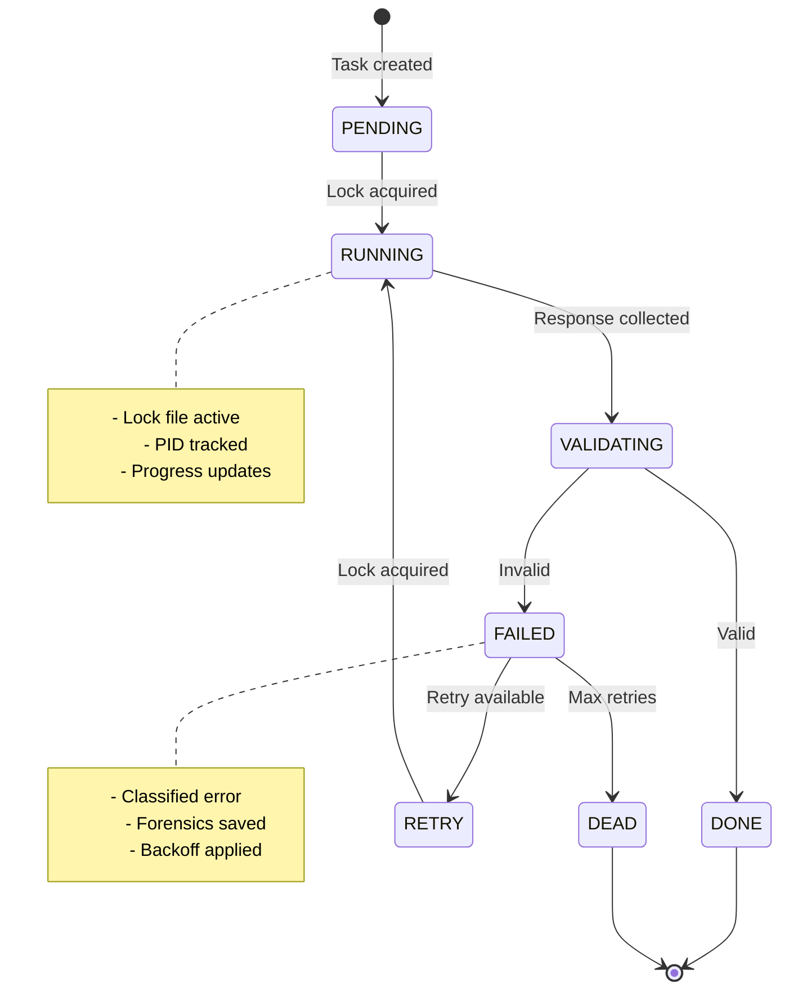

## 🔐 Sistema de Locks (Concorrência)

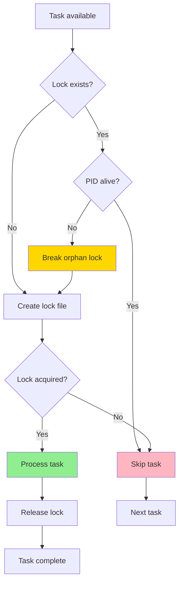

## 🌐 Arquitetura NERV (IPC)

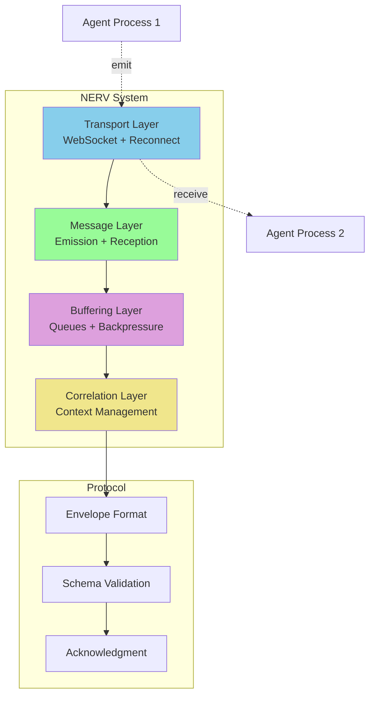

## 📦 Estrutura de Dados

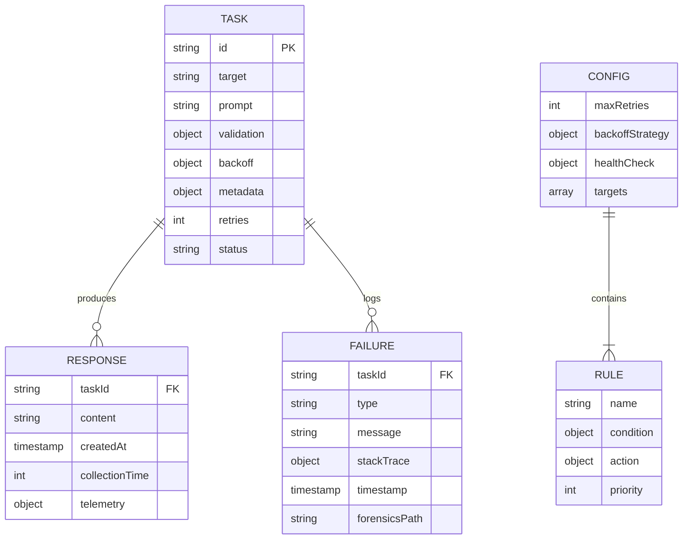

## 🚀 Deployment Architecture

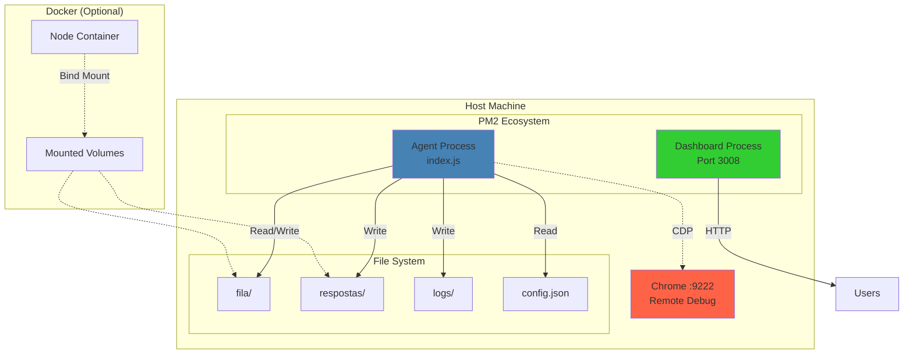

## 📈 Performance Monitoring Flow

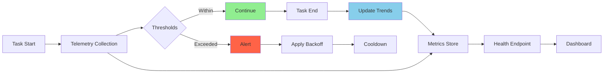

## 🔄 Estratégia de Backoff

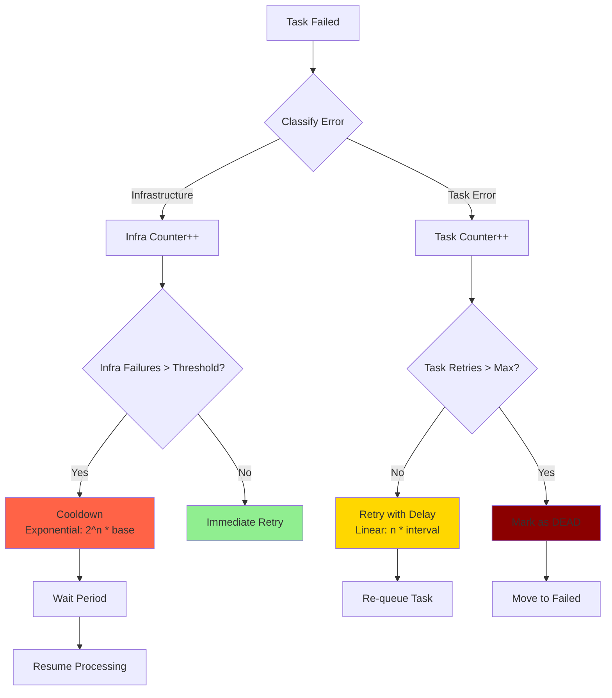

---

## 🛠️ Como Gerar Imagens dos Diagramas

### Opção 1: VS Code (Recomendado)

```bash
# Instale a extensão Mermaid Preview
code --install-extension bierner.markdown-mermaid
```

### Opção 2: GitHub

Abra este arquivo no GitHub - renderização automática.

### Opção 3: CLI (se precisar de PNGs)

```bash
# Usando mmdc (Mermaid CLI)
npm install -g @mermaid-js/mermaid-cli
mmdc -i ARCHITECTURE_DIAGRAMS.md -o output/diagrams/
```

### Opção 4: Online

Visite: https://mermaid.live/

---

## 📚 Referências

- **Mermaid Documentation**: https://mermaid.js.org/
- **C4 Model**: https://c4model.com/
- **PlantUML**: https://plantuml.com/
- **Structurizr**: https://structurizr.com/
