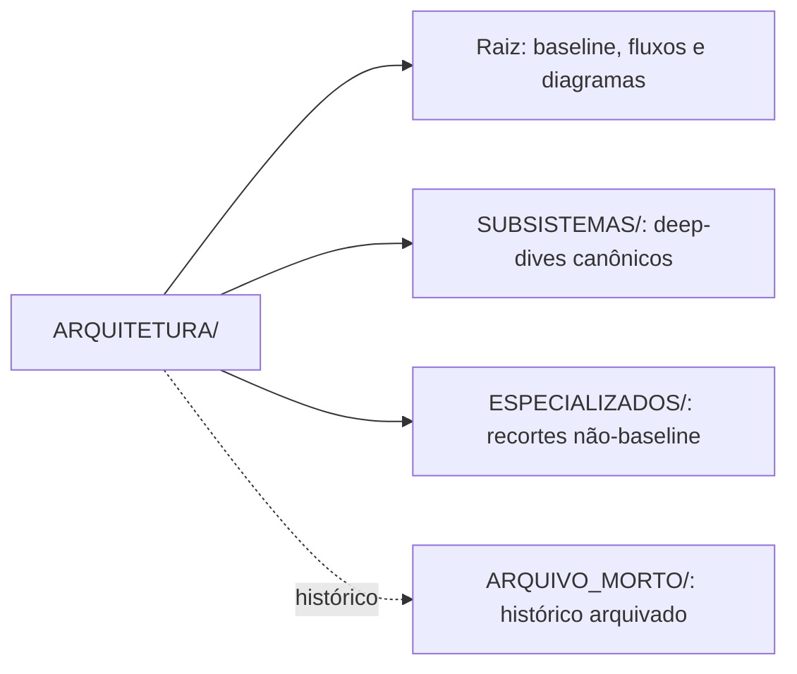
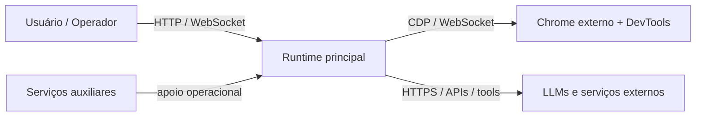
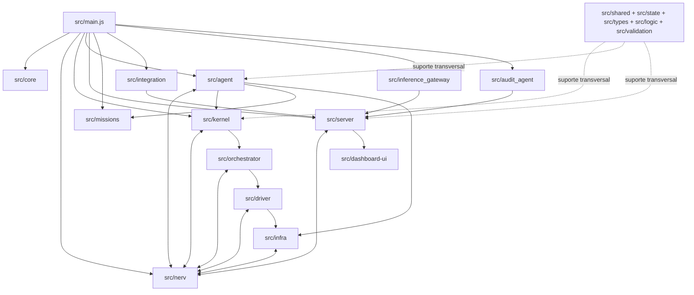
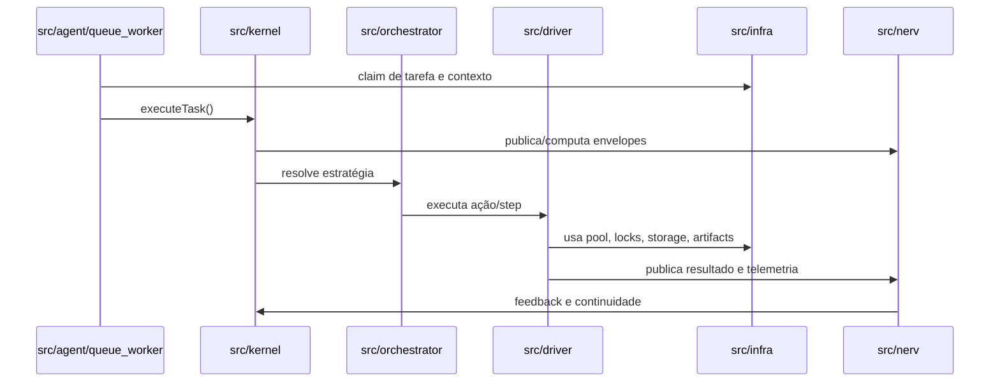
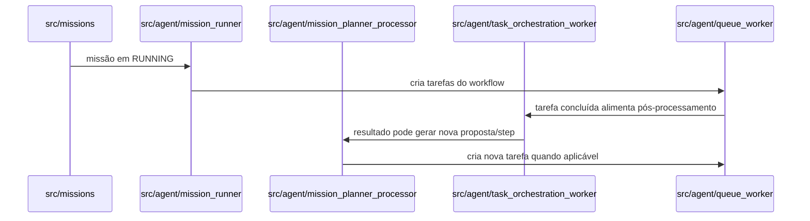
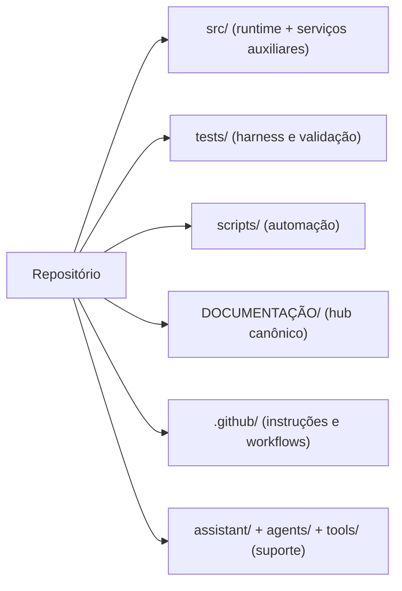

# Diagramas da Arquitetura Oficial

**Propósito**: oferecer uma referência visual alinhada à topologia atual do runtime.  
**Status documental**: Canônico de apoio.  
**Público**: engenharia, manutenção, auditoria e agentes de IA.  
**Quando consultar**: ao precisar visualizar a relação entre `kernel`, `orchestrator`, `agent`,
`driver`, `infra` e as superfícies externas.  
**Documento-mestre relacionado**: [ARCHITECTURE.md](./ARCHITECTURE.md).  
**Última atualização**: 28 de fevereiro de 2026.

## Visão geral

Os diagramas abaixo refletem a arquitetura vigente. Eles já incluem `src/agent/` como plano
operacional do runtime e não descrevem versões históricas ou superseded.

## Mapa documental da arquitetura

## Contexto do sistema

## Planos arquiteturais do runtime

## Fluxo de despacho de tarefa

## Fluxo de missão

## Mapa visual de diretórios estáveis

## Como manter os diagramas

- Se um novo plano estrutural surgir, ele deve aparecer aqui.
- Se `src/agent/` ganhar novos loops centrais, atualize o diagrama de fluxo.
- Se a taxonomia física de `ARQUITETURA/` mudar, atualize o mapa documental acima.
- Mantenha `DIAGRAMS/diagrama.mmd` e `DIAGRAMS/diagrams/architecture.mmd` coerentes com esta página.
- Não reintroduza diagramas históricos como se fossem baseline atual.
