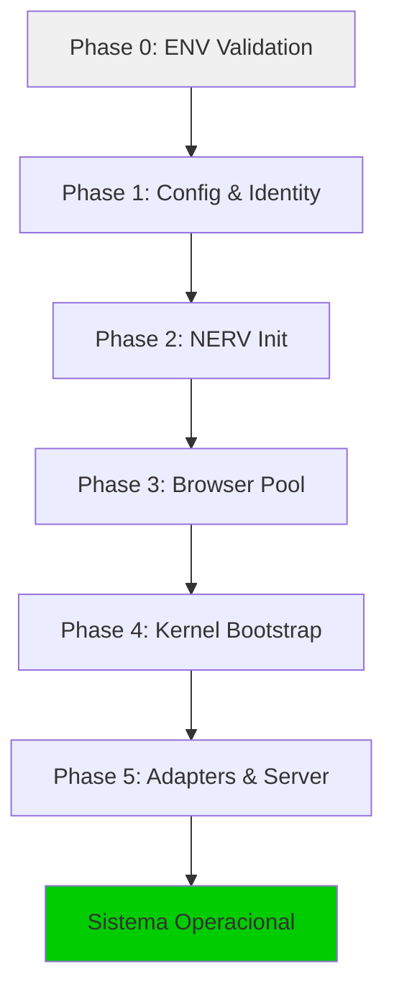

# Análise Arquitetural Profunda — Versão 1.0

> **Data**: 2 de março de 2026
> **Escopo**: Análise completa do codebase `chatgpt-docker-puppeteer`
> **Metodologia**: Inspeção estática de 287 arquivos JS/MJS (87.512 LOC)

---

## 1. Visão Geral

| Métrica               | Valor                                              |
| --------------------- | -------------------------------------------------- |
| **Arquivos JS**       | 287 (.js) + 15 (.mjs) = 302 totais                |
| **Linhas de Código**  | ~87.500 LOC (src/ apenas)                          |
| **Módulos**           | 20 domínios sob `src/`                             |
| **Testes**            | 800 specs (798 passing, 2 falhas pré-existentes)   |
| **Runtime**           | Node.js 24+ (ESM obrigatório)                      |
| **Validação**         | Zod 4.x para schemas, Pino para logging            |
| **Browser**           | Puppeteer 24+ (conexão a Chrome externo via DevTools)|
| **Dependências**      | 33 prod + 27 dev                                   |

## 2. Mapa de Módulos

```
src/
├── main.js                 # Bootstrap canônico (17 imports)
├── core/        (44 files) # Config, logging, identity, schemas, context
├── infra/       (57 files) # DB, storage, browser pool, queues, locks, proxy
├── server/      (45 files) # Express API, Socket.io, middleware, realtime
├── nerv/        (24 files) # Event bus neural (IPC/telemetria)
├── driver/      (16 files) # Automação browser (Puppeteer adapters)
├── agent/       (12 files) # Workers: fila, missão, watchdog, heartbeat
├── kernel/      (10 files) # Motor de execução, policy engine, loop 20Hz
├── orchestrator/ (6 files) # Context, checkpoint, validation services
├── shared/      (14 files) # Utilitários: NERV schemas, biomechanics, health
├── integration/ (12 files) # MCP, LSP, RAG, Ollama (.mjs)
├── inference_gateway/ (7)  # Gateway LLM, routing, Ollama supervisor
├── audit_agent/ (8 files)  # Agente autônomo de auditoria/LLM
├── logic/       (7 files)  # Regras de validação, scoring adaptativo
├── missions/    (5 files)  # Domínio de missões, workflow generator
├── dashboard-ui/ (18+)     # Frontend Vue.js/Vite (workspace separado)
├── types/       (2 files)  # Type guards runtime
├── validation/  (1 file)   # LLM judge
└── state/       (0 files)  # ⚠️ Módulo vazio (apenas README.md)
```

## 3. Boot Sequence (6 Fases)



| Fase | Responsabilidade                                    | Falha = |
| ---- | --------------------------------------------------- | ------- |
| 0    | `.env.local`, validação de variáveis, defaults      | Exit    |
| 1    | `CONFIG.reload()`, `identityManager.initialize()`   | Exit    |
| 2    | NERV event bus (local + Socket.io híbrido)          | Exit    |
| 3    | Chrome DevTools (porta 9224, 3 instâncias)          | Retry×10|
| 4    | Execution engine, policy system, kernel loop 20Hz   | Exit    |
| 5    | Driver↔NERV bridge, Server↔NERV bridge, HTTP:3008  | Exit    |

### Shutdown Sequence

```
SIGTERM/SIGINT → triggerShutdown()
  ├─ Server Adapter    → disconnect clients
  ├─ Driver Adapter    → close browser connections
  ├─ Kernel            → stop loop, flush state
  ├─ Browser Pool      → release connections
  ├─ NERV              → stop transports
  └─ Cleanup Profiles  → remove temp data
```

## 4. NERV — Neural Event Relay Vector

### Arquitetura

```
┌─────────────────────────────────────────────────────────────┐
│                         NERV                                 │
│  ┌──────────┐  ┌──────────┐  ┌──────────┐  ┌──────────┐   │
│  │ Emission  │  │ Reception│  │ Buffers  │  │ Health   │   │
│  │ (emit*)   │  │ (on*)    │  │ (in/out) │  │ (status) │   │
│  └────┬─────┘  └────┬─────┘  └────┬─────┘  └──────────┘   │
│       │              │              │                         │
│  ┌────┴──────────────┴──────────────┴────┐                  │
│  │       Hybrid Transport                 │                  │
│  │  (local EventEmitter + Socket.io)      │                  │
│  └───────────────────────────────────────┘                  │
│       │                                                      │
│  ┌────┴──────────┐  ┌──────────┐  ┌──────────┐             │
│  │ Correlation   │  │ Telemetry│  │ Discovery│             │
│  └───────────────┘  └──────────┘  └──────────┘             │
└─────────────────────────────────────────────────────────────┘
```

### Fluxo de Mensagens

| Padrão             | Exemplo                                           |
| ------------------ | ------------------------------------------------- |
| **emit → onEvent** | `Driver → NERV → Kernel` (task completed)         |
| **emitCommand**    | `Server → NERV → Kernel` (suspend task)           |
| **emitAck**        | `Kernel → NERV → Requestor` (command acknowledged)|

### Tipos de Envelope

```javascript
{
  header: { id, timestamp, message_type, action_code },
  identity: { actor, robot_id },
  payload: { /* dados do evento */ },
  meta: { correlation_id, causation_id }
}
```

## 5. Kernel — Motor de Decisão

| Componente             | Responsabilidade                              |
| ---------------------- | --------------------------------------------- |
| `kernel.js`            | Factory SSOT-first com gateway mode           |
| `kernel_loop.js`       | Loop 20Hz (50ms ticks), state machine         |
| `execution_engine.js`  | Execução de tasks, retry logic                |
| `policy_engine.js`     | Rate limits, resource caps                    |
| `task_runtime.js`      | Estados: ACTIVE, SUSPENDED, COMPLETED, ERROR  |
| `observation_store.js` | Log de observações para histórico             |
| `kernel_telemetry.js`  | Métricas de performance                       |
| `kernel_nerv_bridge.js`| Adaptador NERV, recebe comandos               |

### Modelo de Execução

- **SSOT-First**: Database é fonte canônica; NERV broadcast
- **Gateway Mode**: Kernel controla todo acesso a execução
- **Non-Blocking**: async/await, 50ms ticks
- **Pump-based**: NERV pub/sub dirige mudanças de estado

## 6. Driver — Automação Browser

```
Driver/
├── core/           BaseDriver, TargetDriver
├── targets/        ChatGPTDriver
├── modules/        triage, input_resolver, frame_navigator,
│                   biomechanics_engine, recovery_system,
│                   submission_controller, handle_manager
├── extractors/     structured_extractor (parse HTML)
├── guards/         DriverReadinessGuard
├── trackers/       PageSessionTracker
├── nerv_adapter/   driver_nerv_adapter
├── lifecycle/      DriverLifecycleManager
└── factory/        Create drivers dynamically
```

**Padrões-chave**:
- Módulos como serviços (cada módulo é independente)
- Recovery com exponential backoff
- Comportamento humano (ghost-cursor)
- **Nunca `puppeteer.launch()`** — apenas Chrome externo via DevTools

## 7. Infraestrutura

### Database (SQLite via better-sqlite3)

| Repositório          | Tabela(s)                        |
| -------------------- | -------------------------------- |
| `task_repo`          | tasks                            |
| `mission_repo`       | missions                         |
| `mission_step_repo`  | mission_steps                    |
| `artifact_repo`      | artifacts                        |
| `event_repo`         | events                           |
| `audit_job_repo`     | audit_jobs                       |
| `inference_model_repo`| inference_models                |

### Browser Pool

| Componente             | Papel                               |
| ---------------------- | ----------------------------------- |
| `pool_manager`         | Pool de conexões Chrome (3 instâncias)|
| `circuit_breaker`      | Detecção de falhas                  |
| `PageValidator`        | Health checks de página             |
| `PeriodicHealthMonitor`| Probes periódicos                   |
| `puppeteer_guard`      | Impede `puppeteer.launch()`         |

### Queue & Locks

- **Scheduler**: agendamento de tasks
- **Task Loader**: carrega tasks do DB
- **Lock Manager**: coordenação distribuída de locks
- **Resilient Lock**: locks com fallback
- **Process Guard**: guards a nível de processo

## 8. Server — API & Realtime

### Camada HTTP

```
Server/
├── engine/
│   ├── app.js       Express factory
│   ├── server.js    HTTP server (porta 3008)
│   ├── socket.js    Socket.io setup
│   └── lifecycle.js Server lifecycle
├── api/
│   ├── router.js    Route aggregator
│   └── controllers/ (14 controllers)
├── middleware/
│   ├── auth.js, authorize.js, schema_guard.js
│   ├── error_handler.js, request_id.js
│   └── deny_if_delegated.js
├── handlers/
│   ├── openai-handler.js (proxy OpenAI)
│   └── mcp-handler.js (MCP protocol)
└── realtime/
    ├── ssot_event_feed.js
    ├── pm2_bridge.js
    └── log_tail.js
```

### Controllers (14 endpoints)

| Controller         | Rota base      | Autenticação |
| ------------------ | -------------- | ------------ |
| `tasks`            | /api/tasks     | JWT          |
| `missions`         | /api/missions  | JWT          |
| `control`          | /api/control   | JWT          |
| `health`           | /api/health    | Público      |
| `dna`              | /api/dna       | JWT          |
| `dashboard_*`      | /api/dashboard | JWT          |
| `audit`            | /api/audit     | JWT          |
| `metrics`          | /api/metrics   | JWT          |

## 9. Agent Workers

| Worker                        | Tick (ms) | Papel                            |
| ----------------------------- | --------- | -------------------------------- |
| `queue_worker`                | 250       | Polling de fila de tasks         |
| `task_control_watcher`        | 500       | Monitoramento de sinais          |
| `mission_runner`              | 1000      | Execução de missões              |
| `task_orchestration_worker`   | 1250      | Orquestração de tasks            |
| `attempt_watchdog`            | 1500      | Timeout de tentativas            |
| `mission_planner_processor`   | 1500      | Planejamento de missões          |
| `heartbeat_watchdog`          | —         | Heartbeat do processo            |

Coordenação via `AgentLoop` com intervals independentes. Cada worker é async-safe.

## 10. Integrations

| Integração         | Arquivos | Protocolo    |
| ------------------ | -------- | ------------ |
| **MCP**            | 4 (.mjs) | stdio/HTTP   |
| **LSP**            | 2 (.mjs) | tsserver     |
| **RAG**            | 2 (.mjs) | LanceDB      |
| **Ollama**         | 3 (.mjs) | HTTP/REST    |
| **Error Classifier**| 1 (.mjs)| Internal     |

## 11. Aliases de Import

```javascript
#agent/*          → ./src/agent/*.js
#core/*           → ./src/core/*.js
#core/constants   → ./src/core/constants/index.js
#driver/*         → ./src/driver/*.js
#infra/*          → ./src/infra/*.js
#integration/*    → ./src/integration/*.mjs
#kernel/*         → ./src/kernel/*.js
#logic/*          → ./src/logic/*.js
#nerv/*           → ./src/nerv/*.js
#orchestrator/*   → ./src/orchestrator/*.js
#server/*         → ./src/server/*.js
#shared/*         → ./src/shared/*.js
#types/*          → ./src/types/*.js
#validation/*     → ./src/validation/*.js
```

## 12. Modos de Deploy

| Modo            | Descrição                                    |
| --------------- | -------------------------------------------- |
| **Integrado**   | Processo único, HTTP embutido (padrão Docker)|
| **Split**       | Maestro + HTTP server separados (PM2)        |
| **Delegated**   | Multi-instância com autoridade delegada      |

---

## 13. Problemas Identificados

### 13.1 Problemas Críticos (P0)

#### P0-1: JSON.parse Error Swallowing
**Localização**: `src/infra/db/task_repo.js` (linhas 129-143)

```javascript
// blocked_details_json — erro silenciado
try {
    task.state.blocked_details = JSON.parse(row.blocked_details_json);
} catch (_) {
    task.state.blocked_details = row.blocked_details_json; // fallback silencioso
}

// result_json — mesmo padrão
try {
    task.result_db = JSON.parse(row.result_json);
} catch (_) {
    task.result_db = row.result_json; // fallback silencioso
}
```

**Impacto**: Corrupção de dados passa despercebida. Tasks com JSON inválido continuam operando com strings raw, causando erros downstream difíceis de diagnosticar.

**Ocorrências similares**: `dashboard_tasks.js`, `dashboard_missions.js` (padrão de fallback em payloads JSON).

#### P0-2: NERV Shutdown Incompleto
**Localização**: `src/nerv/nerv.js` (linhas 177-187)

```javascript
async shutdown() {
    if (hybridTransport) hybridTransport.stop();
    if (transport && transport.stop) transport.stop();
    if (socketAdapter && socketAdapter.stop) socketAdapter.stop();
    // ⚠️ Faltam: health, telemetry, buffers, correlation, reception cleanup
}
```

**Impacto**: Subsistemas internos (health listeners, buffers pendentes, telemetria) não são limpos no shutdown, podendo causar resource leaks em processos de longa duração.

### 13.2 Problemas Altos (P1)

#### P1-1: Main.js Tight Coupling
**Localização**: `src/main.js` (linhas 41-57)

17 imports diretos criam acoplamento forte entre o bootstrap e todos os subsistemas. O main.js funciona como "God Object" com ~1200+ LOC no boot sequence.

**Mitigação proposta**: Extrair `BootstrapFactory` ou `BootPhaseRunner`.

#### P1-2: Módulo `src/state/` Morto
**Localização**: `src/state/` — contém apenas `README.md`

Módulo vazio referenciado na documentação mas sem implementação. Confunde desenvolvedores e polui a árvore de diretórios.

#### P1-3: Inconsistência .js/.mjs
**Localização**: `src/integration/` — 15 arquivos .mjs vs resto do projeto em .js

O projeto inteiro é ESM (`"type": "module"`), tornando a extensão .mjs redundante. Cria inconsistência e confusão nos aliases de import.

### 13.3 Problemas Médios (P2)

#### P2-1: Health Listeners Sem Limite
**Localização**: `src/nerv/health/health.js` (linha 89)

```javascript
const listeners = new Set();
```

Listeners são adicionados via `onChange()` que retorna unsubscribe, mas não há limite máximo de listeners nem logging quando o Set cresce excessivamente.

#### P2-2: Hardcoded Socket URL
**Localização**: `src/nerv/nerv.js` (linha 35)

```javascript
url: config.socketUrl || process.env.NERV_SOCKET_URL || 'http://localhost:3008',
```

O fallback `http://localhost:3008` é razoável para dev, mas pode causar conexões espúrias em produção se a env var não for definida.

#### P2-3: Dashboard Tasks Controller — _parseJson sem Logging
**Localização**: `src/server/api/controllers/dashboard_tasks.js`

Função `_parseJson()` faz fallback silencioso sem logging, similar ao task_repo.

## 14. Cobertura de Testes

### Módulos com Cobertura

| Módulo           | Arquivos de Teste | Status    |
| ---------------- | ----------------- | --------- |
| core/            | 6 specs           | ✅ Coberto |
| driver/          | 3 specs           | ✅ Coberto |
| nerv/            | 3 specs           | ✅ Coberto |
| server/          | 11+ specs         | ✅ Coberto |
| kernel/          | 6 specs           | ✅ Coberto |
| orchestrator/    | 3 specs           | ✅ Coberto |
| agent/           | 3 specs           | ✅ Coberto |
| audit_agent/     | 7 specs           | ✅ Coberto |
| inference_gateway/| 6 specs          | ✅ Coberto |
| infra/ (parcial) | 2 specs           | ⚠️ Parcial |
| shared/ (parcial)| 2 specs           | ⚠️ Parcial |
| integration/     | 2 specs           | ⚠️ Mínimo  |

### Módulos SEM Testes

| Módulo      | Criticidade | Risco     |
| ----------- | ----------- | --------- |
| logic/      | Alta        | 🔴 Alto   |
| validation/ | Alta        | 🔴 Alto   |
| missions/   | Média       | 🟡 Médio  |
| infra/db/   | Crítica     | 🔴 Crítico|
| infra/proxy/| Média       | 🟡 Médio  |

## 15. Métricas de Qualidade

| Métrica                    | Valor    | Meta     | Status |
| -------------------------- | -------- | -------- | ------ |
| Lint (ESLint)              | 0 erros  | 0 erros  | ✅     |
| Testes passando            | 798/800  | 100%     | ⚠️     |
| Módulos com testes         | 11/20    | 20/20    | ⚠️     |
| JSDoc coverage             | ~80%     | 100%     | ⚠️     |
| Circular deps              | ~0       | 0        | ✅     |
| Dead modules               | 1        | 0        | ⚠️     |

## 16. Pontos Fortes da Arquitetura V1

1. **Isolamento via NERV**: Módulos se comunicam apenas por eventos — zero acoplamento direto
2. **SSOT database-first**: Estado canônico no SQLite, broadcast via NERV
3. **Graceful degradation**: Circuit breakers, retry policies, health checks em cada camada
4. **Boot determinístico**: 6 fases com validação — falha = exit rápido
5. **Puppeteer Guard**: Proteção arquitetural contra `puppeteer.launch()`
6. **Aliases de import**: Mapeamento claro de módulos via `#prefix/*`
7. **Schemas Zod**: Validação runtime forte para config e schemas
8. **Worker isolation**: Cada agent worker é independente e async-safe

## 17. Recomendações para Arquitetura 2.0

1. **Logging em catch blocks**: Substituir catch silenciosos por logging estruturado
2. **NERV lifecycle completo**: Cleanup de TODOS os subsistemas no shutdown
3. **Bootstrap modular**: Extrair fases do main.js para módulos dedicados
4. **Remover módulo morto**: Eliminar ou implementar `src/state/`
5. **Padronizar extensões**: Migrar .mjs → .js (projeto já é ESM)
6. **Health listener limits**: Adicionar max listeners e warning
7. **Testes para módulos críticos**: Priorizar logic/, validation/, infra/db/
8. **Input validation**: Zod schemas em todos os endpoints da API

---

*Documento gerado por análise automatizada do codebase. Atualizado em 2 de março de 2026.*
