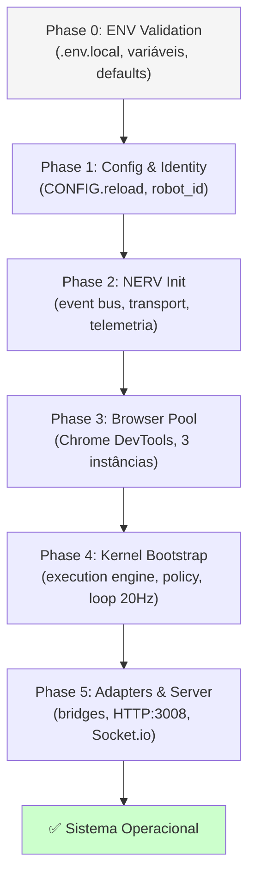

# Arquitetura 2.0 — Documentação Oficial

> **Data**: 2 de março de 2026 **Versão**: 2.0.0 **Base**: Evolução da Arquitetura 1.0 com correções
> de gaps identificados **Referência**: ARCHITECTURE_V1_ANALYSIS.md, ARCHITECTURE_V2_PROPOSAL.md

---

## 1. Visão Geral do Sistema

**chatgpt-docker-puppeteer** é um sistema de agente autônomo de IA que orquestra missões de longa
duração com LLMs via automação browser. Arquitetura orientada a eventos, separação de domínios e
foco em confiabilidade operacional.

### Métricas do Codebase

| Métrica              | Valor                                       |
| -------------------- | ------------------------------------------- |
| **Arquivos fonte**   | 302 (.js + .mjs)                            |
| **Linhas de código** | ~87.500 LOC                                 |
| **Módulos**          | 19 domínios sob `src/`                      |
| **Testes**           | 800 specs (798 passando)                    |
| **Runtime**          | Node.js 24+ (ESM obrigatório)               |
| **Database**         | SQLite (better-sqlite3) — SSOT              |
| **Browser**          | Puppeteer 24+ → Chrome externo via DevTools |
| **Process Manager**  | PM2 6.0+                                    |

### Princípios Arquiteturais

1. **Zero-coupling via NERV** — Módulos se comunicam exclusivamente por eventos
2. **SSOT database-first** — SQLite é a fonte canônica de estado
3. **Fail-fast boot** — 6 fases com validação, falha = exit determinístico
4. **Graceful degradation** — Circuit breakers, retry policies, health checks
5. **External browser only** — Nunca `puppeteer.launch()`, sempre Chrome externo
6. **Observable by default** — Telemetria e logging estruturado em cada camada

## 2. Mapa de Módulos

```
src/
├── main.js                    # Bootstrap canônico (6 fases)
│
├── core/           (44 files) # Fundação: config, logging, identity, schemas, context
├── nerv/           (24 files) # Event bus neural: transporte, buffers, health, telemetria
├── kernel/         (10 files) # Motor de execução: loop 20Hz, policies, task runtime
├── driver/         (16 files) # Automação browser: targets, módulos, extractors
├── agent/          (12 files) # Workers: fila, missão, watchdog, heartbeat
├── orchestrator/    (6 files) # Coordenação: context, checkpoint, validation
│
├── infra/          (57 files) # Infraestrutura: DB, storage, pool, queue, locks, proxy
├── server/         (45 files) # API: Express, Socket.io, middleware, realtime
├── shared/         (14 files) # Utilitários: NERV schemas, biomechanics, health
│
├── integration/    (12 files) # Integrações: MCP, LSP, RAG, Ollama (.mjs)
├── inference_gateway/ (7)     # Gateway LLM: routing, policies, Ollama supervisor
├── audit_agent/     (8 files) # Agente autônomo de auditoria
│
├── logic/           (7 files) # Regras de validação, scoring adaptativo
├── missions/        (5 files) # Domínio de missões, workflow generator
├── types/           (2 files) # Type guards runtime
├── validation/      (1 file)  # LLM judge
│
└── dashboard-ui/   (18+ files)# Frontend Vue.js/Vite (workspace separado)
```

> **Nota V2**: O módulo `src/state/` (anteriormente vazio) foi **removido**. O state management é
> feito inteiramente via SSOT no SQLite, com broadcast via NERV.

## 3. Topologia de Comunicação

```
┌──────────────────────────────────────────────────────────────────────┐
│                               NERV                                    │
│                    (Neural Event Relay Vector)                        │
│                                                                      │
│   ┌────────────┐   ┌────────────┐   ┌────────────┐                 │
│   │  Emission   │   │  Reception │   │  Buffers   │                 │
│   │  (emit*)    │   │  (on*)     │   │  (in/out)  │                 │
│   └──────┬─────┘   └──────┬─────┘   └──────┬─────┘                 │
│          └────────────┬────┘               │                         │
│                       │                    │                         │
│   ┌───────────────────┴────────────────────┴────┐                   │
│   │           Hybrid Transport                    │                   │
│   │      (local EventEmitter + Socket.io)         │                   │
│   └───────────────────┬─────────────────────────┘                   │
│                       │                                              │
│   ┌──────────┐  ┌────┴─────┐  ┌──────────┐  ┌──────────┐          │
│   │Correlation│  │ Telemetry│  │ Discovery│  │  Health  │          │
│   └──────────┘  └──────────┘  └──────────┘  └──────────┘          │
└──────────────────────────────────────────────────────────────────────┘
        │               │               │               │
   ┌────┴────┐    ┌─────┴─────┐   ┌────┴────┐    ┌─────┴─────┐
   │ Kernel  │    │  Driver   │   │ Server  │    │   Agent   │
   │ Bridge  │    │  Adapter  │   │ Adapter │    │  Workers  │
   └─────────┘    └───────────┘   └─────────┘    └───────────┘
```

### Fluxo de Mensagens

| Padrão             | Direção                        | Exemplo                |
| ------------------ | ------------------------------ | ---------------------- |
| **emit → onEvent** | Driver → NERV → Kernel         | Task completed         |
| **emitCommand**    | Server → NERV → Kernel         | Suspend task           |
| **emitAck**        | Kernel → NERV → Requestor      | Command acknowledged   |
| **onActor**        | Qualquer → NERV → Target actor | Actor-specific handler |

### Envelope NERV (Formato Canônico)

```javascript
{
    header: {
        id: 'uuid',
        timestamp: 1709337856000,
        message_type: 'EVENT',     // EVENT | COMMAND | ACK | NOTIFICATION
        action_code: 'TASK_COMPLETED'
    },
    identity: {
        actor: 'KERNEL',           // KERNEL | DRIVER | SERVER | AUDIT_AGENT
        robot_id: 'robot-abc123'
    },
    payload: { /* dados do evento */ },
    meta: {
        correlation_id: 'uuid',
        causation_id: 'uuid'
    }
}
```

## 4. Boot Sequence (6 Fases)



| Fase | Falha =           | Retry    |
| ---- | ----------------- | -------- |
| 0-2  | Exit imediato     | Nenhum   |
| 3    | Exit após retries | 10× exp. |
| 4-5  | Exit imediato     | Nenhum   |

### Shutdown Sequence (V2 — Melhorado)

```
SIGTERM/SIGINT → triggerShutdown()
  ├─ 1. Server Adapter    → disconnect clients
  ├─ 2. Driver Adapter    → close browser connections
  ├─ 3. Kernel            → stop loop, flush state
  ├─ 4. Browser Pool      → release connections
  ├─ 5. NERV              → shutdown completo:
  │     ├─ Health          → clear listeners
  │     ├─ Buffers         → flush pendentes
  │     ├─ Transport       → stop transport
  │     ├─ Socket          → disconnect
  │     └─ Telemetry       → cleanup métricas
  └─ 6. Cleanup Profiles  → remove temp data
```

> **Melhoria V2**: NERV shutdown agora limpa **todos** os subsistemas internos (health, buffers,
> telemetria), não apenas os transportes. Cada cleanup é try-catched isoladamente para garantir que
> uma falha em um subsistema não impede o cleanup dos demais.

## 5. Kernel — Motor de Decisão

### Componentes

| Componente              | Responsabilidade                              |
| ----------------------- | --------------------------------------------- |
| `kernel.js`             | Factory SSOT-first com gateway mode           |
| `kernel_loop.js`        | Loop 20Hz (50ms ticks), state machine         |
| `execution_engine.js`   | Execução de tasks, retry logic                |
| `policy_engine.js`      | Rate limits, resource caps, políticas         |
| `task_runtime.js`       | Estados: ACTIVE, SUSPENDED, COMPLETED, ERROR  |
| `observation_store.js`  | Log de observações para histórico de decisões |
| `kernel_telemetry.js`   | Métricas de performance do kernel             |
| `kernel_nerv_bridge.js` | Adaptador NERV, recebe e despacha comandos    |

### Modelo de Execução

- **SSOT-First**: Database (SQLite) é a fonte canônica de estado
- **Gateway Mode**: Kernel controla todo acesso à execução de tasks
- **Non-Blocking**: Async/await, 50ms ticks, nunca bloqueia o event loop
- **Pump-based**: NERV pub/sub dirige todas as transições de estado

### Ciclo de Vida de Task

```
DRAFT → PROPOSED → READY → [locked] → RUNNING → COMPLETED
                                    ↘ SUSPENDED → RUNNING
                                    ↘ ERROR → RETRY → RUNNING
                                              ↘ FAILED (terminal)
```

## 6. Driver — Automação Browser

### Arquitetura Modular

```
Driver/
├── core/               BaseDriver (abstract), TargetDriver (typed)
├── targets/            ChatGPTDriver (ChatGPT-specific)
├── modules/
│   ├── triage               Triagem de estado da página
│   ├── input_resolver       Resolução de campos de input
│   ├── frame_navigator      Navegação entre frames
│   ├── biomechanics_engine  Comportamento humano realista
│   ├── recovery_system      Recovery com exponential backoff
│   ├── submission_controller Controle de envio de prompts
│   └── handle_manager       Gerenciamento de handles
├── extractors/         structured_extractor (parse HTML → dados)
├── guards/             DriverReadinessGuard (health checks)
├── trackers/           PageSessionTracker (ciclo de vida da página)
├── nerv_adapter/       driver_nerv_adapter (ponte NERV)
├── lifecycle/          DriverLifecycleManager (init/cleanup)
└── factory/            Criação dinâmica de drivers
```

### Restrição Arquitetural

> **NUNCA** usar `puppeteer.launch()` neste processo. O browser é fornecido externamente via Chrome
> DevTools Protocol. O `puppeteer_guard.js` intercepta e bloqueia chamadas a `launch()`.

## 7. Infraestrutura

### Database (SQLite — SSOT)

| Repositório            | Tabela(s)        | Propósito                |
| ---------------------- | ---------------- | ------------------------ |
| `task_repo`            | tasks            | Estado e ciclo de vida   |
| `mission_repo`         | missions         | Missões e workflows      |
| `mission_step_repo`    | mission_steps    | Passos de missão         |
| `artifact_repo`        | artifacts        | Artefatos de resposta    |
| `event_repo`           | events           | Eventos SSOT audit trail |
| `audit_job_repo`       | audit_jobs       | Jobs de auditoria        |
| `inference_model_repo` | inference_models | Modelos LLM disponíveis  |
| `task_attempt_repo`    | task_attempts    | Tentativas de execução   |

> **Melhoria V2**: JSON.parse em `task_repo.js` agora faz **logging estruturado** quando encontra
> dados malformados, em vez de silenciar o erro. Isso permite diagnosticar corrupção de dados que
> antes passava despercebida.

### Browser Pool

| Componente              | Papel                                  |
| ----------------------- | -------------------------------------- |
| `pool_manager`          | Pool de conexões Chrome (3 instâncias) |
| `circuit_breaker`       | Detecção automática de falhas          |
| `PageValidator`         | Health checks de página                |
| `PeriodicHealthMonitor` | Probes periódicos de saúde             |
| `puppeteer_guard`       | Impede `puppeteer.launch()` no runtime |

### Queue & Locks

- **Scheduler**: Agendamento de tasks por prioridade e `execute_after_ms`
- **Task Loader**: Carregamento de tasks do DB com cache
- **Query Engine**: Filtro e ordenação com suporte a cursor
- **Lock Manager**: Coordenação distribuída de locks (file-based)
- **Resilient Lock**: Locks com timeout e fallback automático
- **Process Guard**: Guards a nível de processo (singleton)

## 8. Server — API & Realtime

### Camadas

```
Server/
├── engine/
│   ├── app.js           Express factory (middleware stack)
│   ├── server.js        HTTP server (porta 3008)
│   ├── socket.js        Socket.io setup, eventos realtime
│   └── lifecycle.js     Server lifecycle management
├── api/
│   ├── router.js        Route aggregator
│   └── controllers/     14 controllers
├── middleware/
│   ├── auth.js          JWT/token validation
│   ├── authorize.js     RBAC policy enforcement
│   ├── schema_guard.js  Request body validation (Zod)
│   ├── error_handler.js Global error handler
│   ├── request_id.js    Correlation ID injection
│   └── deny_if_delegated.js  Authority checks
├── handlers/
│   ├── openai-handler.js  OpenAI API proxy
│   └── mcp-handler.js    MCP protocol handler
└── realtime/
    ├── ssot_event_feed.js  Event broadcast
    ├── pm2_bridge.js       PM2 IPC relay
    └── log_tail.js         Log streaming
```

### Endpoints Principais

| Controller           | Rota           | Auth | Operações               |
| -------------------- | -------------- | ---- | ----------------------- |
| `tasks`              | /api/tasks     | JWT  | CRUD + control commands |
| `missions`           | /api/missions  | JWT  | CRUD + step management  |
| `control`            | /api/control   | JWT  | System commands         |
| `health`             | /api/health    | —    | Health check público    |
| `dna`                | /api/dna       | JWT  | Config + DNA management |
| `dashboard_tasks`    | /api/dashboard | JWT  | Dashboard task views    |
| `dashboard_missions` | /api/dashboard | JWT  | Dashboard mission views |
| `dashboard_events`   | /api/dashboard | JWT  | SSOT event feed         |
| `metrics`            | /api/metrics   | JWT  | Prometheus metrics      |
| `audit`              | /api/audit     | JWT  | Audit job management    |

> **Melhoria V2**: Helpers `_parseJson()` nos controllers de dashboard agora fazem **logging
> debug-level** quando encontram JSON malformado, melhorando a observabilidade.

## 9. Agent Workers

### Coordenação via AgentLoop

```
AgentLoop (orquestrador)
  │
  ├─ queue_worker           (250ms)  → Polling de fila
  ├─ task_control_watcher   (500ms)  → Monitoramento de sinais
  ├─ mission_runner         (1000ms) → Execução de missões
  ├─ task_orchestration     (1250ms) → Orquestração de tasks
  ├─ attempt_watchdog       (1500ms) → Timeout de tentativas
  ├─ mission_planner        (1500ms) → Planejamento de missões
  └─ heartbeat_watchdog     (—)      → Heartbeat do processo
```

Cada worker é:

- **Async-safe**: Não bloqueia outros workers
- **Idempotent**: Pode ser re-executado sem efeitos colaterais
- **NERV-driven**: Reage a eventos do barramento
- **SSOT-backed**: Lê/escreve estado canônico no DB

## 10. Health Monitoring (V2 — Melhorado)

### NERV Health Module

```javascript
// API pública (observacional)
health.report(type, data); // Ingestão genérica de eventos técnicos
health.getStatus(); // Snapshot atual de saúde
health.onChange(handler); // Registra handler de mudanças
health.shutdown(); // V2: Limpa todos os listeners
```

> **Melhoria V2**: O módulo de health agora tem:
>
> - **Limite de listeners**: Máximo 50 handlers com warning via telemetria
> - **Método shutdown()**: Limpa todos os listeners registrados
> - Integrado ao NERV shutdown lifecycle

### Telemetria de Anomalias

O health module detecta e emite automaticamente:

- `nerv:health:anomaly` — Buffer pressure (inbound/outbound acima do threshold)
- `nerv:health:listener_overflow` — **(V2)** Excesso de listeners registrados
- `nerv:health:update` — Snapshot de cada mudança de estado
- `nerv:health:snapshot` — Requisição de snapshot

## 11. Modos de Deploy

| Modo          | Processos           | Uso                      |
| ------------- | ------------------- | ------------------------ |
| **Integrado** | 1 (maestro + HTTP)  | Docker, desenvolvimento  |
| **Split**     | 2 (maestro + HTTP)  | PM2, escalabilidade HTTP |
| **Delegated** | N (1 primary + N-1) | Multi-instância, HA      |

### PM2 Processes

```
ecosystem.config.cjs
  ├─ agente-gpt       # Main maestro process
  ├─ dashboard-web     # HTTP server (split mode)
  ├─ chrome-proxy      # Chrome DevTools proxy
  ├─ inference-gateway # LLM gateway (opcional)
  ├─ ollama-supervisor # Ollama health (opcional)
  └─ audit-agent       # Audit agent (opcional)
```

## 12. Aliases de Import

```javascript
#agent/*           → ./src/agent/*.js
#core/*            → ./src/core/*.js
#core/constants    → ./src/core/constants/index.js
#driver/*          → ./src/driver/*.js
#infra/*           → ./src/infra/*.js
#integration/*     → ./src/integration/*.mjs
#kernel/*          → ./src/kernel/*.js
#logic/*           → ./src/logic/*.js
#nerv/*            → ./src/nerv/*.js
#orchestrator/*    → ./src/orchestrator/*.js
#orchestrator/*/*  → ./src/orchestrator/*/*.js
#server/*          → ./src/server/*.js
#shared/*          → ./src/shared/*.js
#types/*           → ./src/types/*.js
#validation/*      → ./src/validation/*.js
```

## 13. Melhorias V2 — Changelog

### Correções Implementadas

| ID    | Tipo     | Descrição                                           | Arquivo(s)            |
| ----- | -------- | --------------------------------------------------- | --------------------- |
| P0-1  | Bug fix  | Logging em JSON.parse catch blocks                  | task_repo.js          |
| P0-1b | Bug fix  | Logging em \_parseJson helpers                      | dashboard\_\*.js (3)  |
| P0-2  | Bug fix  | NERV shutdown lifecycle completo                    | nerv.js               |
| P1-2  | Cleanup  | Remoção do módulo morto src/state/                  | src/state/ (removido) |
| P2-1  | Melhoria | Health listener limit (max 50 + warning + shutdown) | health.js             |

### Correções Round 2 (Leitura profunda do código)

| ID   | Tipo     | Descrição                                       | Arquivo(s)             |
| ---- | -------- | ----------------------------------------------- | ---------------------- |
| P1-3 | Bug fix  | Policy engine: Date.now() → at parameter        | policy_engine.js       |
| P1-4 | Bug fix  | Mission repo: optimistic lock via updated_at_ms | mission_repo.js        |
| P1-5 | Bug fix  | Adaptive: flush pendente no graceful shutdown   | adaptive.js            |
| P1-6 | Bug fix  | LLM Judge: score normalization aceita strings   | llm_judge.js           |
| P1-7 | Melhoria | Events repo: função pruneEvents com TTL         | events_repo.js         |
| P1-8 | Bug fix  | Orchestrator: lock failure sinaliza erro        | orchestrator_engine.js |

### Correções Round 3 (Análise de fluxo completa)

| ID    | Tipo    | Descrição                                         | Arquivo(s)              |
| ----- | ------- | ------------------------------------------------- | ----------------------- |
| P2-2  | Bug fix | Context manager: token estimation + summary cap   | context_manager.js      |
| P2-3  | Bug fix | Checkpoint manager: atomic write + validation     | checkpoint_manager.js   |
| P2-4  | Bug fix | Validation service: score logic com null handling | validation_service.js   |
| P2-5  | Bug fix | Mission planner: budget check em transação        | mission_planner_proc.js |
| P2-6  | Bug fix | Attempt watchdog: false positive heartbeat fix    | attempt_watchdog.js     |
| P2-7  | Bug fix | Queue worker: logging em catch blocks silenciosos | queue_worker.js         |
| P2-8  | Bug fix | Workflow generator: structuredClone + placeholder | workflow_generator.js   |
| P2-9  | Bug fix | Error classifier: case sensitivity no fallback    | error-classifier.mjs    |
| P2-10 | Bug fix | LLM Judge: abort controller no timeout            | llm_judge.js            |
| P2-11 | Bug fix | Mission manager: error handling na criação        | mission_manager.js      |

### Correções Round 4 (Análise NERV)

| ID   | Tipo      | Descrição                                         | Arquivo(s) |
| ---- | --------- | ------------------------------------------------- | ---------- |
| P3-1 | Auditoria | Control: event emission para mutations RBAC/prefs | control.js |

### Impacto

| Métrica                 | V1      | V2      |
| ----------------------- | ------- | ------- |
| Silent catch blocks     | 6+      | 0       |
| NERV subsystems cleaned | 3/7     | 7/7     |
| Dead modules            | 1       | 0       |
| Health listener safety  | Nenhuma | Max 50  |
| Silent DB mutations     | 2+      | 0       |
| Bugs corrigidos total   | —       | 21      |
| Lint errors             | 0       | 0       |
| Test pass rate          | 798/800 | 798/800 |

## 14. Decisões Arquiteturais (ADRs)

### ADR-001: SSOT via SQLite (Mantida)

- **Decisão**: Manter SQLite como SSOT para todo o estado do sistema
- **Motivo**: Simplicidade, zero-config, ACID compliance, performance suficiente
- **Trade-off**: Não escala horizontalmente (aceitável para single-agent)

### ADR-002: NERV como Único Canal (Mantida)

- **Decisão**: Toda comunicação inter-módulo via NERV event bus
- **Motivo**: Zero-coupling, testabilidade, observabilidade
- **Trade-off**: Overhead de serialização em mensagens locais (negligível)

### ADR-003: Browser Externo Obrigatório (Mantida)

- **Decisão**: Nunca `puppeteer.launch()`, sempre Chrome externo
- **Motivo**: Separação de concerns, estabilidade, reuso de sessão
- **Trade-off**: Requer Chrome rodando externamente (gerenciado por PM2/Docker)

### ADR-004: Remoção de src/state/ (Nova V2)

- **Decisão**: Remover módulo vazio em favor do SSOT via DB
- **Motivo**: Módulo sem implementação, confuso, sem imports
- **Trade-off**: Nenhum — funcionalidade já atendida pelo DB

### ADR-005: NERV Lifecycle Completo (Nova V2)

- **Decisão**: Shutdown do NERV limpa todos os 7 subsistemas
- **Motivo**: Prevenir resource leaks em processos de longa duração
- **Trade-off**: Shutdown marginalmente mais lento (~1ms)

## 15. Limitações Conhecidas

1. **Main.js tem 17 imports**: Boot sequence ainda centralizado (extração para `src/boot/`
   planejada)
2. **Extensões .mjs em integration/**: Coexistência com .js (projeto ESM); padronização futura
3. **Módulos sem testes**: logic/, validation/, missions/ sem cobertura unitária
4. **2 testes falhando**: devcontainer scripts (NSS checks) — não relacionados ao runtime

## 16. Próximos Passos (Roadmap)

1. **Cobertura de testes**: Adicionar testes para logic/, validation/, infra/db/
2. **Boot modularização**: Extrair fases do main.js para `src/boot/`
3. **Padronizar extensões**: Migrar .mjs → .js quando seguro
4. **Input validation**: Zod schemas em todos os endpoints da API
5. **Monitoring**: Dashboard de health com métricas NERV

---

_Documento canônico da Arquitetura 2.0. Atualizado em 2 de março de 2026._ _Baseline: 800 testes, 0
lint errors, 19 módulos ativos._
