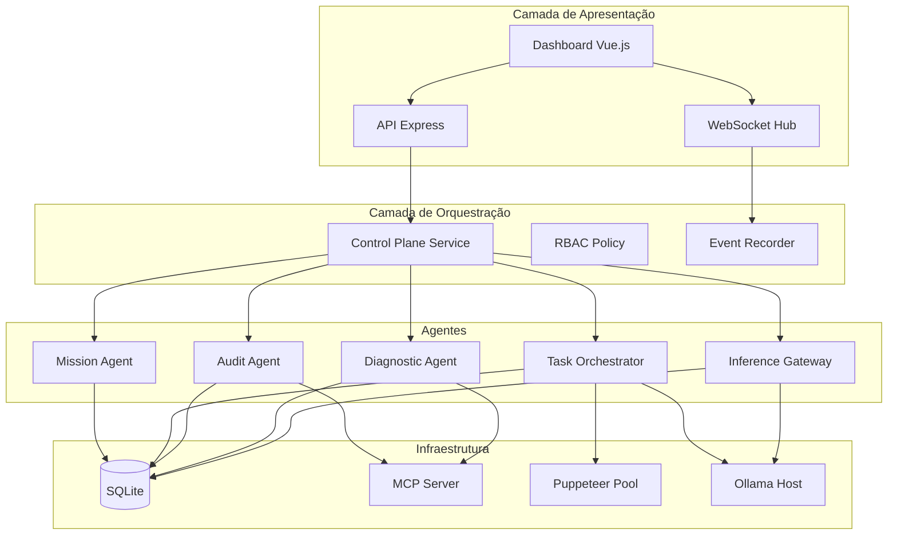
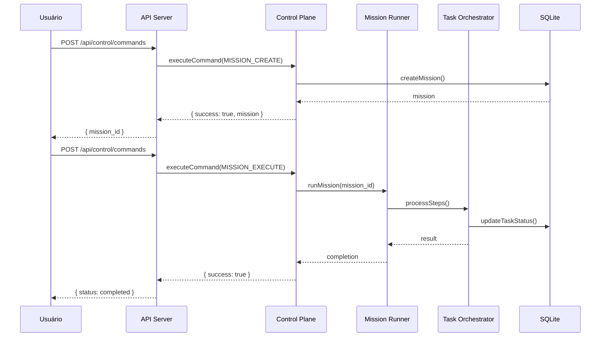
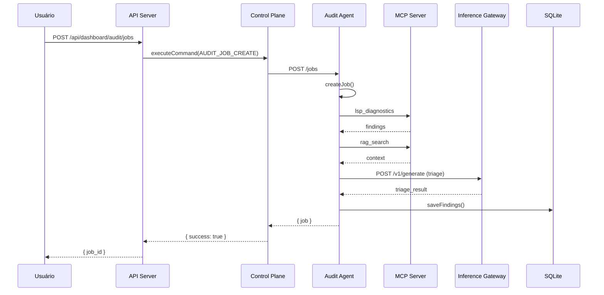
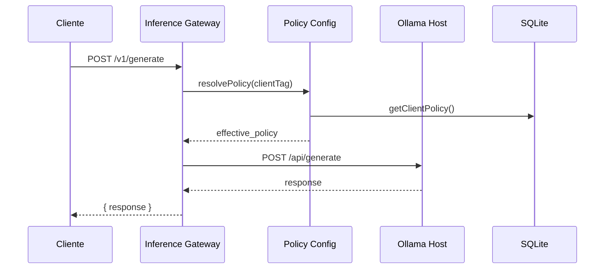
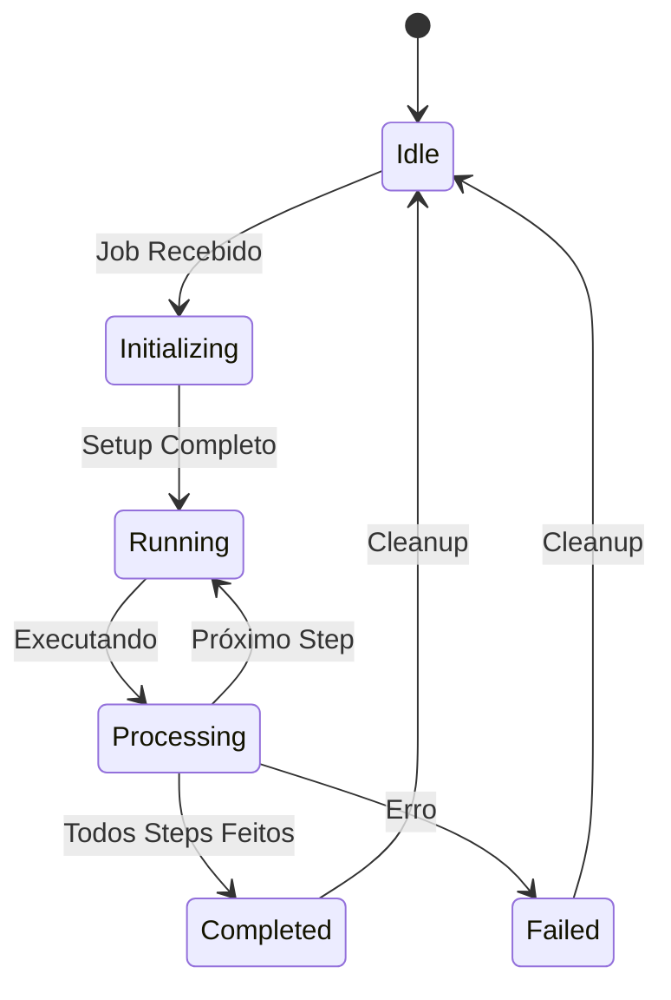

# Arquitetura Completa do Sistema - chatgpt-docker-puppeteer

## Sumário

1. [Visão Geral da Arquitetura](#1-visão-geral-da-arquitetura)
2. [Diagrama de Componentes](#2-diagrama-de-componentes)
3. [Módulos e Responsabilidades](#3-módulos-e-responsabilidades)
4. [Tecnologias e Dependências](#4-tecnologias-e-dependências)
5. [Padrões de Projeto Aplicados](#5-padrões-de-projeto-aplicados)
6. [Fluxos de Comunicação](#6-fluxos-de-comunicação)
7. [Estrutura de Diretórios](#7-estrutura-de-diretórios)
8. [Interfaces de API](#8-interfaces-de-api)
9. [Gerenciamento de Estado](#9-gerenciamento-de-estado)
10. [Tratamento de Erros](#10-tratamento-de-erros)
11. [Segurança](#11-segurança)
12. [Escalabilidade](#12-escalabilidade)
13. [Plataforma de Agentes](#13-plataforma-de-agentes)
14. [Integrações Externas](#14-integrações-externas)
15. [Melhorias Futuras](#15-melhorias-futuras)

---

## 1. Visão Geral da Arquitetura

O **chatgpt-docker-puppeteer** é uma plataforma de automação de tarefas baseada em agentes LLM, projetada para executar operações complexas de engenharia de software através de um sistema de missões e tarefas orquestradas. A arquitetura segue um padrão de **microserviços cooperativos** com um barramento de controle centralizado.

### 1.1 Objetivos Arquiteturais

- **Autonomia Controlada**: Agentes operam com diferentes níveis de autonomia (manual, semi-auto, automático)
- **Persistência Primeiro**: Todo estado é persistido em SQLite para recoverability
- **Governança Centralizada**: Todas as mutações passam pelo Control Plane
- **Observabilidade Completa**: Logging estruturado, métricas e eventos em tempo real
- **Extensibilidade**: Sistema de plugins para novos agentes e ferramentas

### 1.2 Camadas Arquiteturais

```
┌─────────────────────────────────────────────────────────────────┐
│                    CAMADA DE APRESENTAÇÃO                        │
│  ┌─────────────┐  ┌─────────────┐  ┌─────────────────────────┐  │
│  │  Dashboard  │  │   API REST  │  │  Realtime (WebSocket)  │  │
│  │    (Vue)    │  │   Express   │  │    Socket.io Hub      │  │
│  └─────────────┘  └─────────────┘  └─────────────────────────┘  │
├─────────────────────────────────────────────────────────────────┤
│                    CAMADA DE ORQUESTRAÇÃO                        │
│  ┌─────────────────────────────────────────────────────────────┐│
│  │              CONTROL PLANE (control_command_service)          ││
│  │  ┌──────────┐ ┌──────────┐ ┌──────────┐ ┌──────────────┐  ││
│  │  │ MISSION  │ │  TASK    │ │  AUDIT   │ │  INFERENCE   │  ││
│  │  │ CONTROL  │ │ CONTROL  │ │  AGENT   │ │   GATEWAY    │  ││
│  │  └──────────┘ └──────────┘ └──────────┘ └──────────────┘  ││
│  └─────────────────────────────────────────────────────────────┘│
├─────────────────────────────────────────────────────────────────┤
│                    CAMADA DE EXECUÇÃO                            │
│  ┌─────────────┐  ┌─────────────┐  ┌─────────────────────────┐  │
│  │   Agent     │  │   Audit     │  │    Inference           │  │
│  │  (Mission/  │  │   Agent     │  │    Gateway             │  │
│  │   Task)     │  │  (Puppeteer│  │    (Ollama)           │  │
│  └─────────────┘  └─────────────┘  └─────────────────────────┘  │
├─────────────────────────────────────────────────────────────────┤
│                    CAMADA DE INFRAESTRUTURA                      │
│  ┌─────────────┐  ┌─────────────┐  ┌─────────────────────────┐  │
│  │  Database   │  │    MCP      │  │    Puppeteer           │  │
│  │  (SQLite)   │  │   Server   │  │    (Browser Pool)      │  │
│  └─────────────┘  └─────────────┘  └─────────────────────────┘  │
└─────────────────────────────────────────────────────────────────┘
```

---

## 2. Diagrama de Componentes



---

## 3. Módulos e Responsabilidades

### 3.1 Módulo Core (`src/core/`)

O módulo core fornece infraestrutura compartilhada para toda a aplicação.

| Arquivo | Responsabilidade |
|---------|-----------------|
| [`config.js`](src/core/config.js) | Gerenciamento centralizado de configurações via variáveis de ambiente com validação e defaults |
| [`logger.js`](src/core/logger.js) | Sistema de logging estruturado com múltiplos níveis e sinks |
| [`boot_resilience_manager.js`](src/core/boot_resilience_manager.js) | Gerenciamento de startup resiliente com retry e circuit breaker |
| [`env_validator.js`](src/core/env_validator.js) | Validação de variáveis de ambiente obrigatórias |
| [`runtime_resource_registry.js`](src/core/runtime_resource_registry.js) | Registro de recursos em runtime (memória, CPU, browsers) |
| [`doctor.js`](src/core/doctor.js) | Sistema de diagnóstico de saúde da aplicação |

#### 3.1.1 Submódulos Core

- **`constants/`**: Constantes compartilhadas (browser, logging, tasks, shared)
- **`context/`**: Engine de contexto para extração e transformação de dados
- **`schemas/`**: Schemas de validação (Bootstrap, DNA, Task)
- **`validators/`**: Validadores específicos de domínio

### 3.2 Módulo Server (`src/server/`)

O módulo server expõe a interface HTTP/WebSocket da aplicação.

| Arquivo | Responsabilidade |
|---------|-----------------|
| [`main.js`](src/server/main.js) | Servidor Express principal (40KB) - ponto de entrada HTTP |
| `api/controllers/*` | Controladores de API REST |
| `domain/*` | Lógica de domínio (Mission Control, Task Control, Control Commands) |
| `middleware/*` | Middlewares Express (autenticação, rate limiting, logging) |

#### 3.2.1 Controladores de API

| Controlador | Endpoints Principais | Descrição |
|-------------|---------------------|-----------|
| [`dashboard.js`](src/server/api/controllers/dashboard.js) | `/api/dashboard/*` | Portal principal |
| [`dashboard_missions.js`](src/server/api/controllers/dashboard_missions.js) | `/api/dashboard/missions/*` | Gestão de missões |
| [`dashboard_tasks.js`](src/server/api/controllers/dashboard_tasks.js) | `/api/dashboard/tasks/*` | Gestão de tarefas |
| [`dashboard_audit.js`](src/server/api/controllers/dashboard_audit.js) | `/api/dashboard/audit/*` | Painel de auditoria |
| [`dashboard_inference.js`](src/server/api/controllers/dashboard_inference.js) | `/api/dashboard/inference/*` | Gestão de inferência |
| [`dashboard_diagnostic.js`](src/server/api/controllers/dashboard_diagnostic.js) | `/api/dashboard/diagnostic/*` | Diagnósticos |
| [`control.js`](src/server/api/controllers/control.js) | `/api/control/*` | Execução de comandos |
| [`health.js`](src/server/api/controllers/health.js) | `/health` | Verificação de saúde |
| [`metrics.js`](src/server/api/controllers/metrics.js) | `/metrics` | Métricas Prometheus |

### 3.3 Módulo Agent (`src/agent/`)

O módulo agent implementa o sistema de execução de tarefas e missões.

| Arquivo | Responsabilidade |
|---------|-----------------|
| [`mission_runner.js`](src/agent/mission_runner.js) | Execução de missões com steps orquestrados |
| [`mission_execution_service.js`](src/agent/mission_execution_service.js) | Serviço de execução de missões |
| [`task_orchestration_worker.js`](src/agent/task_orchestration_worker.js) | Orquestrador de tarefas (44KB) |
| [`task_state_projector.js`](src/agent/task_state_projector.js) | Projeção de estado de tarefas (52KB) |
| [`queue_worker.js`](src/agent/queue_worker.js) | Processador de fila de tarefas |
| [`attempt_watchdog.js`](src/agent/attempt_watchdog.js) | Monitor de tentativas de execução |
| [`heartbeat_watchdog.js`](src/agent/heartbeat_watchdog.js) | Monitor de heartbeat de agentes |
| [`mission_planner_processor.js`](src/agent/mission_planner_processor.js) | Planejador de missões |

### 3.4 Módulo Audit Agent (`src/audit_agent/`)

Agente de auditoria contínua que analisa código, encontra bugs e propõe patches.

| Arquivo | Responsabilidade |
|---------|-----------------|
| [`main.js`](src/audit_agent/main.js) | Processo PM2 do Audit Agent |
| [`runtime.js`](src/audit_agent/runtime.js) | Runtime de execução de jobs de auditoria |
| [`server.js`](src/audit_agent/server.js) | Servidor HTTP interno (porta 3098) |
| [`context_builder.js`](src/audit_agent/context_builder.js) | Coletor de contexto via MCP (LSP/RAG) |
| [`triage_llm.js`](src/audit_agent/triage_llm.js) | Cliente LLM para triagem de issues |
| [`patch_author_llm.js`](src/audit_agent/patch_author_llm.js) | Cliente LLM para geração de patches |
| [`contracts.js`](src/audit_agent/contracts.js) | Contratos de validação |
| [`db_store.js`](src/audit_agent/db_store.js) | Persistência SQLite |

### 3.5 Módulo Diagnostic Agent (`src/diagnostic_agent/`)

Agente de diagnóstico de infraestrutura (candidado à fusão).

| Arquivo | Responsabilidade |
|---------|-----------------|
| [`main.js`](src/diagnostic_agent/main.js) | Processo do Diagnostic Agent |
| [`diagnostic-agent.js`](src/diagnostic_agent/diagnostic-agent.js) | Motor de diagnósticos |
| [`services/health-checker.js`](src/diagnostic_agent/services/health-checker.js) | Verificador de saúde |
| [`services/system-monitor.js`](src/diagnostic_agent/services/system-monitor.js) | Monitor de sistema |
| [`services/model-analyzer.js`](src/diagnostic_agent/services/model-analyzer.js) | Analisador de modelos LLM |
| [`services/code-analyzer.js`](src/diagnostic_agent/services/code-analyzer.js) | Analisador de código |
| [`services/report-generator.js`](src/diagnostic_agent/services/report-generator.js) | Gerador de relatórios |

### 3.6 Módulo Inference Gateway (`src/inference_gateway/`)

Gateway de inferência LLM com políticas e circuit breaker.

| Arquivo | Responsabilidade |
|---------|-----------------|
| [`main.js`](src/inference_gateway/main.js) | Processo PM2 do Gateway |
| [`gateway.js`](src/inference_gateway/gateway.js) | Motor de roteamento de inferência |
| [`server.js`](src/inference_gateway/server.js) | Servidor HTTP (porta 3099) |
| [`client_tags.js`](src/inference_gateway/client_tags.js) | Definição de clientTags |
| [`policy_config.js`](src/inference_gateway/policy_config.js) | Resolução de políticas |
| [`persistence.js`](src/inference_gateway/persistence.js) | Carregamento de políticas do DB |
| [`ollama_host_supervisor.js`](src/inference_gateway/ollama_host_supervisor.js) | Supervisor do host Ollama |

### 3.7 Módulo Infraestrutura (`src/infra/`)

Camada de persistência e serviços de infraestrutura.

| Diretório | Responsabilidade |
|-----------|-----------------|
| `db/` | Repositórios SQLite (missions, tasks, audit, inference) |
| `browser_pool/` | Pool de browsers Puppeteer |
| `mcp/` | Servidor MCP (LSP, RAG, Ollama tools) |

---

## 4. Tecnologias e Dependências

### 4.1 Runtime

- **Node.js 24+** com ESM (`"type": "module"`)
- **SQLite** via `better-sqlite3` para persistência

### 4.2 Frameworks Principais

| Dependência | Versão | Uso |
|-------------|--------|-----|
| Express | ^4.x | Servidor HTTP |
| Vue.js | ^3.x | Dashboard UI |
| Puppeteer | ^21.x | Automação de browser |
| better-sqlite3 | ^9.x | Banco de dados |
| Socket.io | ^4.x | Realtime |
| Zod | ^3.x | Validação de schemas |

### 4.3 Bibliotecas de Suporte

- **Logging**: Pino (via `src/core/logger.js`)
- **Validação**: Zod + custom validators
- **HTTP Client**: Native fetch API
- **Date/Time**: date-fns

---

## 5. Padrões de Projeto Aplicados

### 5.1 Command Pattern (Control Plane)

O Control Plane implementa o padrão Command para todas as operações:

```javascript
// Exemplo: Estrutura de comando
const COMMANDS = Object.freeze({
    MISSION_CREATE: 'MISSION_CREATE',
    TASK_CREATE: 'TASK_CREATE',
    AUDIT_JOB_CREATE: 'AUDIT_JOB_CREATE',
    // ...
});

async function executeCommand({ command, payload, actor }) {
    // Validação -> Execução -> Persistência -> Evento
}
```

### 5.2 Repository Pattern

Cada domínio possui seu repositório com operações CRUD:

```javascript
// Exemplo: Estrutura de repositório
export function createMission(data) { /* ... */ }
export function getMissionById(id) { /* ... */ }
export function listMissions(filter) { /* ... */ }
export function updateMission(id, data) { /* ... */ }
```

### 5.3 Service Layer

Lógica de negócio isolada em serviços de domínio:

```javascript
// src/server/domain/mission_control_service.js
export async function createMissionCommand({ actor, reason, payload }) { /* ... */ }
export async function executeMissionCommand({ missionId, actor, reason }) { /* ... */ }
```

### 5.4 Observer/Event-Driven

Eventos de sistema são gravados para auditoria:

```javascript
// src/infra/db/events_repo.js
recordEvent({ entityType, entityId, eventType, payload });
```

### 5.5 Circuit Breaker

O Inference Gateway implementa circuit breaker:

```javascript
// src/inference_gateway/gateway.js
async function generateWithCircuitBreaker(clientTag, prompt) {
    if (circuitBreaker.isOpen()) {
        return fallbackResponse();
    }
    try {
        return await generate(clientTag, prompt);
    } catch (error) {
        circuitBreaker.recordFailure();
        throw error;
    }
}
```

---

## 6. Fluxos de Comunicação

### 6.1 Fluxo de Execução de Missão



### 6.2 Fluxo de Auditoria



### 6.3 Fluxo de Inferência



---

## 7. Estrutura de Diretórios

```
src/
├── main.js                    # Entry point do servidor
├── agent/                     # Motor de missões/tarefas
│   ├── mission_runner.js
│   ├── mission_execution_service.js
│   ├── task_orchestration_worker.js
│   ├── task_state_projector.js
│   └── ...
├── audit_agent/              # Agente de auditoria contínua
│   ├── main.js              # Processo PM2
│   ├── runtime.js           # Execução de jobs
│   ├── server.js            # HTTP interno (:3098)
│   ├── context_builder.js   # Coletor de contexto MCP
│   ├── triage_llm.js        # Cliente de triagem LLM
│   ├── patch_author_llm.js  # Cliente de geração de patches
│   └── db_store.js          # Persistência
├── diagnostic_agent/        # Agente de diagnóstico (a fundir)
│   ├── main.js
│   ├── diagnostic-agent.js
│   ├── services/
│   │   ├── health-checker.js
│   │   ├── system-monitor.js
│   │   ├── model-analyzer.js
│   │   ├── code-analyzer.js
│   │   └── report-generator.js
│   └── utils/
├── inference_gateway/        # Gateway de inferência LLM
│   ├── main.js              # Processo PM2
│   ├── gateway.js           # Motor de roteamento
│   ├── server.js            # HTTP interno (:3099)
│   ├── policy_config.js     # Resolução de políticas
│   ├── client_tags.js       # Definições de tags
│   └── ollama_host_supervisor.js
├── core/                    # Infraestrutura compartilhada
│   ├── config.js           # Gerenciamento de config
│   ├── logger.js           # Sistema de logging
│   ├── boot_resilience_manager.js
│   ├── doctor.js
│   ├── constants/
│   ├── context/
│   ├── schemas/
│   └── validators/
├── server/                   # Servidor HTTP e API
│   ├── main.js             # Express app
│   ├── domain/              # Lógica de domínio
│   │   ├── control_command_service.js
│   │   ├── mission_control_service.js
│   │   └── task_control_service.js
│   ├── api/controllers/    # Controladores REST
│   ├── middleware/         # Middlewares Express
│   └── engine/             # Engine de runtime
├── infra/                   # Infraestrutura
│   ├── db/                 # Repositórios SQLite
│   ├── browser_pool/       # Pool Puppeteer
│   └── mcp/               # Servidor MCP
├── driver/                  # Drivers de browser
├── shared/                  # Utilitários compartilhados
├── state/                   # Gerenciamento de estado
├── types/                   # Tipos e augmentations
└── validation/              # Validadores

tests/
├── unit/                   # Testes unitários
├── integration/            # Testes de integração
└── regression/             # Testes de regressão

scripts/
├── audit/                  # Scripts de auditoria
├── analysis/               # Scripts de análise
└── ops/                    # Scripts operacionais
```

---

## 8. Interfaces de API

### 8.1 Control Plane API

```
POST /api/control/commands
Authorization: Bearer <token>

{
  "command": "MISSION_CREATE",
  "payload": { /* ... */ },
  "actor": { "id": "user", "role": "admin" },
  "reason": "Creating new mission",
  "idempotency_key": "unique-key"
}
```

### 8.2 Dashboard APIs

| Método | Endpoint | Descrição |
|--------|----------|-----------|
| GET | `/api/dashboard/missions` | Listar missões |
| POST | `/api/dashboard/missions` | Criar missão |
| GET | `/api/dashboard/missions/:id` | Detalhar missão |
| POST | `/api/dashboard/missions/:id/execute` | Executar missão |
| GET | `/api/dashboard/tasks` | Listar tarefas |
| POST | `/api/dashboard/tasks` | Criar tarefa |
| GET | `/api/dashboard/audit/jobs` | Listar jobs de auditoria |
| POST | `/api/dashboard/audit/jobs` | Criar job de auditoria |
| GET | `/api/dashboard/inference/profiles` | Listar perfis de inferência |
| POST | `/api/dashboard/inference/profiles` | Criar perfil |

### 8.3 Agentes Internos

| Serviço | Porta | Endpoints |
|---------|-------|-----------|
| Audit Agent | 3098 | `/health`, `/metrics`, `/jobs`, `/jobs/:id/run` |
| Inference Gateway | 3099 | `/health`, `/v1/generate`, `/v1/models`, `/v1/policies` |
| Diagnostic Agent | 3097 | `/health`, `/jobs`, `/jobs/:id/run` |

---

## 9. Gerenciamento de Estado

### 9.1 Persistência SQLite

O sistema utiliza SQLite como Single Source of Truth:

```javascript
// Estrutura de banco típica
const DBSchema = {
    missions: ['id', 'name', 'status', 'created_at', 'updated_at'],
    tasks: ['id', 'mission_id', 'status', 'result_json', 'created_at'],
    audit_jobs: ['id', 'kind', 'status', 'result_json', 'created_at'],
    audit_job_runs: ['id', 'job_id', 'status', 'started_at', 'finished_at'],
    audit_findings: ['id', 'job_id', 'severity', 'message', 'file_path'],
    audit_patch_proposals: ['id', 'job_id', 'status', 'patch_unified_diff'],
    inference_profiles: ['id', 'name', 'purpose', 'enabled'],
    inference_client_policies: ['id', 'client_tag', 'profile_id', 'enabled'],
};
```

### 9.2 Estado em Memória

Alguns estados são mantidos em memória para performance:

- Cache de jobs do Audit Agent em execução
- Estado do circuit breaker do Inference Gateway
- Contadores de métricas em tempo real

### 9.3 Reconciliation

O sistema implementa reconciliação periódica:

```javascript
// Exemplo: Job reconciliation
function reconcileJobs() {
    const dbJobs = getAllJobs();
    const memoryJobs = getInMemoryJobs();
    
    for (const job of memoryJobs) {
        if (!dbJobs.has(job.id)) {
            // Job órfão - persistir
            persistJob(job);
        }
    }
}
```

---

## 10. Tratamento de Erros

### 10.1 Estratégia de Erros

O sistema segue uma estratégia de erros em camadas:

1. **Validação de Entrada**: Zod schemas validam payloads na entrada da API
2. **Validação de Domínio**: Services validam regras de negócio
3. **Tratamento de Exceções**: Middlewares centralizam tratamento de erros HTTP
4. **Logging Estruturado**: Todo erro é logado com stack trace e contexto

### 10.2 Categorias de Erros

| Código | Categoria | Exemplo |
|--------|-----------|---------|
| `VALIDATION_ERROR` | Erros de validação | Payload inválido |
| `NOT_FOUND` | Recurso não encontrado | Mission não existe |
| `PERMISSION_DENIED` | Permissão negada | Usuário sem acesso |
| `AGENT_UNAVAILABLE` | Agente indisponível | Audit Agent fora do ar |
| `INFERENCE_FAILED` | Falha de inferência | Ollama indisponível |
| `COMMAND_FAILED` | Falha de comando | Execução falhou |

### 10.3 Retry e Circuit Breaker

```javascript
// Exemplo: Retry com backoff
async function withRetry(fn, options = {}) {
    const { maxRetries = 3, baseDelay = 1000 } = options;
    
    for (let attempt = 0; attempt < maxRetries; attempt++) {
        try {
            return await fn();
        } catch (error) {
            if (attempt === maxRetries - 1) throw error;
            const delay = baseDelay * Math.pow(2, attempt);
            await sleep(delay);
        }
    }
}
```

---

## 11. Segurança

### 11.1 RBAC (Role-Based Access Control)

O sistema implementa controle de acesso baseado em funções:

```javascript
const RBAC_PERMISSIONS = Object.freeze({
    MISSION_CREATE: 'mission:create',
    MISSION_EXECUTE: 'mission:execute',
    TASK_CREATE: 'task:create',
    CONTROL_EXECUTE: 'control:execute',
    // ...
});
```

### 11.2 Validação de Comandos

Todos os comandos passam por validação:

```javascript
function validateCommand({ command, payload, actor }) {
    // 1. Verificar se comando existe
    // 2. Verificar permissão do ator
    // 3. Validar payload contra schema
    // 4. Verificar idempotency_key
}
```

### 11.3 Sanitização de Entrada

- Zod schemas com validação estrita
- Sanitização de SQL via parameterized queries
- Headers de segurança (CSP, CORS)

---

## 12. Escalabilidade

### 12.1 Arquitetura de Processos

O sistema utiliza PM2 para gerenciamento de processos:

```javascript
// ecosystem.config.cjs
module.exports = {
    apps: [
        { name: 'dashboard-web', script: 'src/server/main.js' },
        { name: 'audit-agent', script: 'src/audit_agent/main.js', instances: 1 },
        { name: 'inference-gateway', script: 'src/inference_gateway/main.js', instances: 1 },
    ]
};
```

### 12.2 Estratégias de Escalabilidade

| Estratégia | Implementação |
|------------|---------------|
| **Processos Múltiplos** | PM2 cluster mode |
| **Conexões Pooled** | SQLite connection pooling |
| **Cache** | Cache em memória com TTL |
| **Async Processing** | Filas de tarefas assíncronas |

---

## 13. Plataforma de Agentes

### 13.1 Taxonomia de Agentes

| Agente | Tipo | Descrição |
|--------|------|-----------|
| **Mission Agent** | Orquestrador | Gerencia missões compostas por tasks |
| **Task Agent** | Executor | Executa tarefas individuais |
| **Audit Agent** | Background | Auditoria contínua de código |
| **Diagnostic Agent** | On-demand | Diagnósticos de infraestrutura |
| **Inference Gateway** | Gateway | Orquestração de LLMs |

### 13.2 Níveis de Autonomia

```javascript
const AUTONOMY_MODES = Object.freeze({
    MANUAL: 'manual',           // Requer aprovação humana
    SEMI_AUTO: 'semi_auto',     // Executa, requer aprovação para risky
    AUTO: 'auto',              // Executa automaticamente
});
```

### 13.3 Ciclo de Vida de um Agente



---

## 14. Integrações Externas

### 14.1 MCP (Model Context Protocol)

O sistema expõe ferramentas via MCP:

- **`lsp_*`**: Ferramentas LSP (diagnostics, definition, references)
- **`rag_*`**: Ferramentas RAG (search, expand)
- **`ollama_*`**: Ferramentas Ollama (generate, embed)

### 14.2 Ollama

- Host: Configurável via `OLLAMA_HOST`
- Modelos: Gerenciados via Inference Gateway
- Políticas: Rate limiting, budgets, circuit breaker

### 14.3 Puppeteer

- Pool de browsers para execução de tarefas
- Page lifecycle monitoring
- Human-like interactions via `src/shared/biomechanics/human.js`

---

## 15. Melhorias Futuras

### 15.1 Curto Prazo (Q1 2026)

- [ ] **Fusão Diagnostic → Audit Agent**: Unificar agentes de diagnóstico
- [ ] **Pipeline LLM V1.1**: Patch author com output schema estruturado
- [ ] **Dashboard UI**: Telas dedicadas para audit findings/patches
- [ ] **Cache Distribuído**: Redis para cache cross-instance

### 15.2 Médio Prazo (Q2 2026)

- [ ] **Multi-tenant**: Suporte a múltiplos workspaces
- [ ] **Audit Trail**: Blockchain-style audit log imutável
- [ ] **Auto-healing**: Agentes que se auto-corrigem
- [ ] **Metrics API**: Prometheus/Grafana nativo

### 15.3 Longo Prazo (Q3+ 2026)

- [ ] **Agentes Especializados**: Agentes por domínio (security, performance)
- [ ] **Distributed**: Execução distribuída via message queue
- [ ] **ML Ops**: Auto-tuning de parâmetros de LLM
- [ ] **Self-healing Infrastructure**: Infra que se auto-repara

---

## Anexo: Variáveis de Ambiente Principais

| Variável | Descrição | Default |
|----------|-----------|---------|
| `NODE_ENV` | Ambiente de execução | `development` |
| `PORT` | Porta do servidor principal | `3000` |
| `AUDIT_AGENT_PORT` | Porta do Audit Agent | `3098` |
| `INFERENCE_GATEWAY_PORT` | Porta do Inference Gateway | `3099` |
| `DIAGNOSTIC_AGENT_PORT` | Porta do Diagnostic Agent | `3097` |
| `OLLAMA_HOST` | Host do Ollama | `http://localhost:11434` |
| `AUDIT_AGENT_ENABLED` | Habilitar Audit Agent | `false` |
| `INFERENCE_GATEWAY_ENABLED` | Habilitar Inference Gateway | `false` |

---

## Referências

- [Documentação de Auditoria](DOCUMENTAÇÃO/BUGS/CODEX_AUDIT_TRACKER.md)
- [Plano Mestre do Audit Agent](DOCUMENTAÇÃO/BUGS/CODEX_AUDIT_AGENT_MASTER_PLAN.md)
- [Regras do Workspace](../.kilocode/rules/workspace_rules_kilo.md)
- [Convenções de Código](../.kilocode/rules/workspace_rules_kilo.md#3-padrões-de-código)
