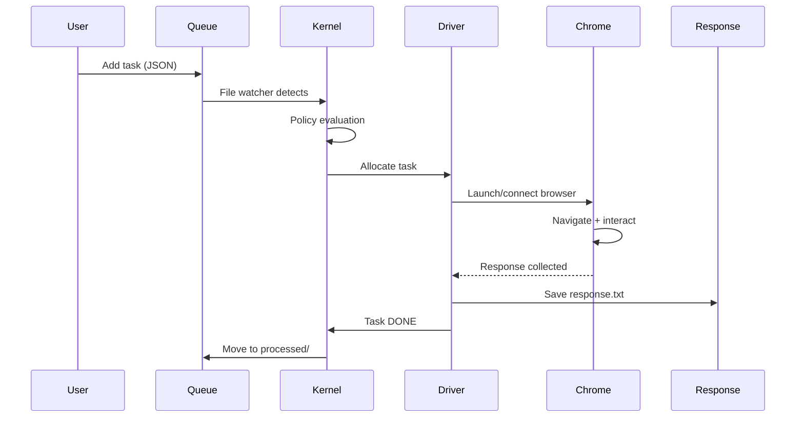

# 📚 Plano de Organização: Documentação Canônica

**Data**: 21/01/2026
**Versão**: 1.0
**Status**: PLANEJAMENTO
**Objetivo**: Estruturar documentação base, permanente e sistêmica do projeto

---

## 🎯 Filosofia e Princípios

### Propósito
Criar documentação **estrutural e arquitetural** que:
- **Não muda frequentemente** - Representa decisões fundamentais do projeto
- **Explica desde a base** - Do "por quê" ao "como", do conceito à implementação
- **Visão sistêmica** - Mostra interconexões, não apenas componentes isolados
- **Onboarding-first** - Qualquer desenvolvedor pode entender o projeto do zero

### Princípios Guia

1. **Permanência**: Documenta arquitetura e decisões fundamentais (não detalhes voláteis)
2. **Progressividade**: Do overview (10,000 ft) ao detalhe (código), em camadas
3. **Interconectividade**: Cada doc referencia outros (grafo navegável)
4. **Completude**: Cobre 100% dos conceitos arquiteturais essenciais
5. **Clareza**: Linguagem precisa, diagramas visuais, exemplos práticos
6. **Acessibilidade**: Do iniciante ao expert (diferentes níveis de profundidade)

---

## 📊 Estado Atual do Projeto

### Estrutura Existente (13 módulos)

```
chatgpt-docker-puppeteer/
├── src/
│   ├── core/          # Config, logger, schemas, identity (DNA), context
│   ├── nerv/          # Event bus (IPC central) - 13 subcomponentes
│   ├── kernel/        # Task execution engine - 6 subcomponentes
│   ├── infra/         # Browser pool, locks, queue, storage, fs
│   ├── driver/        # Target automation (ChatGPT, Gemini) - factory
│   ├── server/        # Dashboard + API (Express + Socket.io)
│   └── logic/         # Adaptive delays, context assembly
├── scripts/           # Automação (bash/bat) - v3.0 cross-platform
├── tests/             # 14 testes funcionais + integração
├── Makefile           # Build system v2.4 (58+ targets)
├── config.json        # Configuração runtime
└── DOCUMENTAÇÃO/
    ├── AUDITORIAS/    # 14 auditorias completas + 2 relatórios implementação
    └── [outros 25+ docs técnicos]
```

### Características Arquiteturais Chave

1. **NERV-Centric Architecture**
   - Event bus central (zero acoplamento direto entre componentes)
   - Comunicação via envelopes (messageType, payload, correlationId)
   - Buffers, transport layers, adapters

2. **Domain-Driven Design**
   - Kernel = domínio de execução de tarefas
   - Driver = domínio de automação específica (ChatGPT, Gemini)
   - Infra = domínio de recursos compartilhados

3. **Cross-Platform First**
   - Windows + Linux support obrigatório
   - Scripts duplicados (.bat/.sh)
   - Make-driven build system

4. **Audit-Driven Quality**
   - 14 auditorias completas (P1-P9)
   - 40+ correções implementadas
   - Rating médio ~9.2/10

### Documentação Atual (50+ arquivos)

**Auditorias** (14 docs):
- 8 subsistemas: CORE, INFRA, KERNEL, NERV, DRIVER, SERVER, LOGIC, Docker
- 6 cross-cutting: Puppeteer, IPC/NERV, Error Handling, LOGIC, SECURITY, PERFORMANCE

**Técnicos** (25+ docs):
- ARCHITECTURE.md (existente - 700 LOC, outdated)
- API.md (existente - 400 LOC, incomplete)
- CROSS_PLATFORM_SUPPORT.md (285 LOC, v2.1)
- DEVELOPER_WORKFLOW.md
- CONFIG_FILES.md
- [Outros especializados]

**Gap Atual**: Documentação fragmentada, sem visão unificada, alguns docs desatualizados.

---

## 📐 Hierarquia de Documentação Proposta

### 3 Camadas de Abstração

```
LAYER 1: CONCEITUAL (O QUÊ e POR QUÊ)
├── README.md (renovado)               # Elevator pitch + Quick Start
├── ARCHITECTURE.md (refatorado)       # Visão sistêmica 10,000 ft
└── PHILOSOPHY.md (novo)               # Decisões arquiteturais fundamentais

LAYER 2: ESTRUTURAL (COMO - Arquitetura)
├── SYSTEM_DESIGN.md (novo)            # C4 Model: Context, Container, Component
├── DATA_FLOW.md (novo)                # Fluxos de dados end-to-end
├── SUBSYSTEMS.md (novo)               # Deep dive em 13 módulos + interações
└── PATTERNS.md (novo)                 # Padrões arquiteturais usados

LAYER 3: OPERACIONAL (USO e MANUTENÇÃO)
├── CONFIGURATION.md (refatorado)      # Todos os parâmetros config.json + .env
├── API_REFERENCE.md (refatorado)      # REST + WebSocket completo
├── DEPLOYMENT.md (refatorado)         # Docker + PM2 + HTTPS
├── DEVELOPMENT.md (novo)              # Setup dev + workflows + debugging
├── TESTING.md (novo)                  # Estratégia de testes completa
└── CONTRIBUTING.md (refatorado)       # Git workflow + code standards

LAYER 4: REFERÊNCIA (Consulta Rápida)
├── GLOSSARY.md (novo)                 # Termos técnicos (DNA, NERV, envelope, etc)
├── TROUBLESHOOTING.md (novo)          # Problemas comuns + soluções
├── FAQ.md (novo)                      # Perguntas frequentes
└── CHANGELOG.md (manutenção)          # Histórico de mudanças
```

### Documentos por Prioridade

**TIER 0 - Fundação (3 docs, 8h)**
1. **PHILOSOPHY.md** (novo) - 2h
   - Decisões arquiteturais fundamentais
   - NERV-centric: por quê event bus?
   - Cross-platform: por quê não apenas Linux?
   - Audit-driven: por quê P-levels?
   - Domain-driven: por quê separar Kernel/Driver/Infra?

2. **ARCHITECTURE.md** (refatorar) - 4h
   - Overview sistêmico completo
   - 13 módulos + interações
   - Fluxo de vida de uma task (end-to-end)
   - Diagramas C4: Context, Container

3. **SYSTEM_DESIGN.md** (novo) - 2h
   - C4 Component diagrams (detalhado)
   - Sequence diagrams (key scenarios)
   - State machines (task lifecycle, browser health)

**TIER 1 - Estrutural (4 docs, 10h)**
4. **DATA_FLOW.md** (novo) - 2h
   - Fluxo de task: fila → kernel → driver → resposta
   - Fluxo de eventos: NERV buffers → transport → receptors
   - Fluxo de browser: pool → allocation → page → release
   - Diagramas de sequência detalhados

5. **SUBSYSTEMS.md** (novo) - 4h
   - 13 módulos, cada um com:
     * Responsabilidades
     * Interfaces públicas
     * Dependências
     * Padrões internos
     * Exemplos de uso

6. **PATTERNS.md** (novo) - 2h
   - Event-driven architecture (NERV)
   - Factory pattern (DriverFactory)
   - Observer pattern (file watchers, health monitors)
   - Circuit breaker (browser pool)
   - Two-phase commit (locks)
   - Memoization (JSON cache)

7. **GLOSSARY.md** (novo) - 2h
   - Termos técnicos com definições
   - DNA, Envelope, NERV, Kernel, Driver, etc.
   - Audit Levels (P1-P9)
   - Task states (PENDING, RUNNING, DONE, FAILED)

**TIER 2 - Operacional (6 docs, 12h)**
8. **CONFIGURATION.md** (refatorar) - 2h
   - Todos os parâmetros config.json
   - Todas as variáveis .env
   - Defaults, ranges, validações
   - Tunning guide por ambiente

9. **API_REFERENCE.md** (refatorar) - 3h
   - REST endpoints completos (request/response)
   - WebSocket events (emit/receive)
   - Autenticação e rate limiting
   - Exemplos curl + JavaScript

10. **DEPLOYMENT.md** (refatorar) - 2h
    - Docker setup (dev + prod)
    - PM2 configuration
    - HTTPS/TLS com Nginx (P8.11)
    - Monitoring e backup

11. **DEVELOPMENT.md** (novo) - 2h
    - Setup ambiente dev (Node.js, PM2, Chrome)
    - Workflow com Makefile
    - Debugging (VSCode launch configs)
    - Profiling (clinic.js, node --prof)

12. **TESTING.md** (novo) - 2h
    - Estratégia de testes (unit, integration, e2e)
    - Como rodar testes (make test-fast, etc)
    - Escrever novos testes (patterns)
    - Coverage atual + goals

13. **CONTRIBUTING.md** (refatorar) - 1h
    - Git workflow (branches, commits)
    - Code standards (ESLint v9 flat config)
    - PR process (templates, reviews)
    - Testing requirements

**TIER 3 - Referência (3 docs, 4h)**
14. **TROUBLESHOOTING.md** (novo) - 2h
    - Problemas comuns (categorias)
    - Browser crashes, lock timeouts, queue stuck
    - Soluções passo-a-passo
    - Comandos de diagnóstico

15. **FAQ.md** (novo) - 1h
    - Perguntas frequentes (25-30)
    - Respostas curtas + links para docs
    - Organizado por categoria

16. **SECURITY.md** (novo - P8.6) - 1h
    - Política de rotação de credenciais
    - Hardening guide
    - Vulnerability reporting
    - Compliance (rate limiting, sanitization)

---

## 🔗 Mapa de Interconexões

### Grafo de Navegação

```
README.md
    ↓
ARCHITECTURE.md ←→ PHILOSOPHY.md
    ↓
SYSTEM_DESIGN.md ←→ DATA_FLOW.md
    ↓
SUBSYSTEMS.md ←→ PATTERNS.md
    ↓
┌─────────────────────────┬──────────────────────┬───────────────────┐
↓                         ↓                      ↓                   ↓
CONFIGURATION.md    API_REFERENCE.md    DEPLOYMENT.md    DEVELOPMENT.md
    ↓                         ↓                      ↓                   ↓
    └─────────────────────────┴──────────────────────┴───────────────────┘
                                    ↓
                        ┌───────────┴───────────┐
                        ↓                       ↓
                    TESTING.md          CONTRIBUTING.md
                        ↓                       ↓
            ┌───────────┴───────────┐           ↓
            ↓                       ↓           ↓
    TROUBLESHOOTING.md          FAQ.md      SECURITY.md
            ↓                       ↓
        GLOSSARY.md ←───────────────┘
```

### Links Cross-Document (Exemplos)

**ARCHITECTURE.md** referencia:
- PHILOSOPHY.md para "por quê" das decisões
- SYSTEM_DESIGN.md para diagramas detalhados
- SUBSYSTEMS.md para deep dive em módulos
- GLOSSARY.md para termos técnicos

**API_REFERENCE.md** referencia:
- CONFIGURATION.md para parâmetros de endpoints
- DEPLOYMENT.md para HTTPS setup
- TROUBLESHOOTING.md para erros comuns

**DEVELOPMENT.md** referencia:
- ARCHITECTURE.md para entender estrutura
- TESTING.md para rodar testes
- CONTRIBUTING.md para standards

---

## 📝 Templates e Guidelines

### Estrutura Padrão de Documento

```markdown
# [Título do Documento]

**Versão**: X.Y
**Última Atualização**: DD/MM/YYYY
**Público-Alvo**: [Iniciante|Intermediário|Avançado]
**Tempo de Leitura**: ~XX min

## 📖 Visão Geral
[3-5 parágrafos contextualizando o documento]

## 🎯 Objetivos
- O que o leitor aprenderá
- Pré-requisitos (links)

## 📚 Conteúdo Principal
[Seções organizadas hierarquicamente]

### Conceitos Fundamentais
[Base teórica]

### Implementação Prática
[Como aplicar]

### Exemplos
[Código, comandos, outputs]

## 🔗 Referências
- Docs relacionados (links internos)
- Recursos externos (se aplicável)

## ❓ FAQ (seção mini)
- 3-5 perguntas comuns específicas deste doc

---
*Última revisão: [Data] | Contribuidores: [Lista]*
```

### Níveis de Profundidade

**OVERVIEW (10,000 ft)**:
- O que é? Por que existe?
- Analogia simples
- Diagrama de contexto

**STRUCTURAL (1,000 ft)**:
- Como funciona internamente?
- Componentes principais
- Diagrama de containers/componentes

**DETAILED (100 ft)**:
- APIs, interfaces, contratos
- Exemplos de código
- Edge cases

**IMPLEMENTATION (10 ft)**:
- Código fonte (links)
- Testes (examples)
- Troubleshooting específico

### Guidelines de Escrita

1. **Clareza**:
   - Frases curtas (15-20 palavras)
   - Evitar jargão sem definição
   - Usar analogias quando possível

2. **Estrutura**:
   - Hierarquia clara (H1 → H2 → H3, max 4 níveis)
   - Listas numeradas para sequências
   - Listas bullet para coleções

3. **Visualização**:
   - Diagramas obrigatórios em docs TIER 0-1
   - Mermaid.js para fluxos/sequências
   - ASCII art para hierarquias simples

4. **Exemplos**:
   - Código real do projeto (não pseudocódigo)
   - Comandos testados (com outputs)
   - Links para arquivos reais

5. **Referências**:
   - Links relativos para docs internos
   - Line numbers para código: `[file.js](path/file.js#L10-L20)`
   - Glossário para termos técnicos

---

## 🎨 Diagramas Padronizados

### C4 Model - Context Diagram (ARCHITECTURE.md)

```
┌────────────────────────────────────────────────────────┐
│                    SISTEMA EXTERNO                      │
│                                                         │
│  ┌──────────┐      ┌──────────────────┐      ┌──────┐ │
│  │ Usuário  │─────→│  chatgpt-agent   │←────→│Chrome│ │
│  │ (Manual) │      │  (PM2 process)   │      │ Ext  │ │
│  └──────────┘      └──────────────────┘      └──────┘ │
│       ↓                     ↓                     ↓    │
│  ┌──────────┐      ┌──────────────────┐      ┌──────┐ │
│  │Dashboard │      │   Fila (JSON)    │      │ChatGPT│ │
│  │  (Web)   │      │   Respostas      │      │Gemini │ │
│  └──────────┘      └──────────────────┘      └──────┘ │
│                                                         │
└────────────────────────────────────────────────────────┘
```

### C4 Model - Container Diagram (ARCHITECTURE.md)

```
┌─────────────────────────────────────────────────────────────┐
│                     chatgpt-agent                           │
├─────────────────────────────────────────────────────────────┤
│  ┌──────────┐  ┌──────────┐  ┌──────────┐  ┌──────────┐   │
│  │  KERNEL  │  │   NERV   │  │  DRIVER  │  │  SERVER  │   │
│  │(Executor)│←→│(EventBus)│←→│(Puppeteer│←→│(Express) │   │
│  └──────────┘  └──────────┘  └──────────┘  └──────────┘   │
│       ↓             ↓              ↓              ↓         │
│  ┌──────────────────────────────────────────────────────┐  │
│  │              INFRA (Shared Services)                 │  │
│  │  [Browser Pool] [Queue Cache] [Lock Manager] [I/O]  │  │
│  └──────────────────────────────────────────────────────┘  │
│       ↓             ↓              ↓              ↓         │
│  ┌──────────────────────────────────────────────────────┐  │
│  │              CORE (Foundation)                       │  │
│  │    [Config] [Logger] [Schemas] [DNA] [Context]      │  │
│  └──────────────────────────────────────────────────────┘  │
└─────────────────────────────────────────────────────────────┘
```

### Task Lifecycle Sequence (DATA_FLOW.md)



### NERV Message Flow (SUBSYSTEMS.md)

```
┌─────────────┐                    ┌─────────────┐
│  Component  │                    │  Component  │
│     A       │                    │     B       │
└──────┬──────┘                    └──────┬──────┘
       │                                  │
       │ 1. emit(event, payload)          │
       ↓                                  │
┌─────────────────────────────────────────┐
│         NERV Event Bus                  │
│  ┌──────────┐  ┌──────────┐  ┌────────┐│
│  │ Buffers  │→ │Transport │→ │Receptors││
│  └──────────┘  └──────────┘  └────────┘│
└─────────────────────────────────────────┘
                                  ↓
                       2. on(event, handler)
                                  │
                                  ↓
                          [Component B executes]
```

---

## 🛠️ Ferramentas e Automação

### Geração de Diagramas

**Mermaid.js** (inline em Markdown):
- Sequence diagrams
- Flowcharts
- State machines
- GitHub renderiza nativamente

**PlantUML** (se necessário):
- C4 model plugins
- Component diagrams complexos
- Gera PNG via CLI

**ASCII Art** (simples):
- Hierarquias de diretórios
- Boxes e setas básicas
- Portável (plain text)

### Validação de Links

```bash
# Script para validar links internos
find DOCUMENTAÇÃO -name "*.md" -exec grep -H "\[.*\](.*\.md)" {} \; | \
while read line; do
    # Extract link and validate file exists
done
```

### Checklist de Qualidade

Cada documento TIER 0-1 deve ter:
- [ ] Diagrama visual (mínimo 1)
- [ ] 3+ exemplos práticos
- [ ] Links para 3+ docs relacionados
- [ ] Seção FAQ (mínimo 3 perguntas)
- [ ] Revisão técnica (2+ pessoas)
- [ ] Glossário de termos novos
- [ ] Público-alvo definido
- [ ] Tempo de leitura estimado

---

## 📅 Roadmap de Implementação

### FASE 1: Fundação (8h - 1 dia)
**Objetivo**: Estabelecer base conceitual e arquitetural

**Dia 1 - Manhã (4h)**:
1. PHILOSOPHY.md (2h)
   - Escrever decisões arquiteturais fundamentais
   - Por quê NERV-centric?
   - Por quê cross-platform?
   - Por quê audit-driven?

2. Refatorar ARCHITECTURE.md - Parte 1 (2h)
   - Overview sistêmico (reescrever introdução)
   - 13 módulos (lista + responsabilidades)
   - Diagrama C4 Context

**Dia 1 - Tarde (4h)**:
3. Refatorar ARCHITECTURE.md - Parte 2 (2h)
   - Diagrama C4 Container
   - Fluxo de vida de task (overview)
   - Interconexões principais

4. SYSTEM_DESIGN.md (2h)
   - C4 Component diagrams (3-4 key components)
   - Sequence diagrams (task execution, NERV message)

**Deliverable**: Base conceitual completa (visão 10,000 ft + 1,000 ft)

---

### FASE 2: Estrutural (10h - 1.5 dias)

**Dia 2 - Manhã (4h)**:
5. DATA_FLOW.md (2h)
   - Fluxo de task end-to-end (detalhado)
   - Fluxo de eventos NERV (buffers → transport)
   - Fluxo de browser (pool → page)

6. SUBSYSTEMS.md - Parte 1 (2h)
   - CORE (5 subcomponentes)
   - NERV (13 subcomponentes)
   - KERNEL (6 subcomponentes)

**Dia 2 - Tarde (4h)**:
7. SUBSYSTEMS.md - Parte 2 (2h)
   - INFRA (browser_pool, queue, locks, storage)
   - DRIVER (factory, ChatGPT, Gemini, modules)
   - SERVER (Express, Socket.io, API)

8. PATTERNS.md (2h)
   - Event-driven (NERV)
   - Factory (Driver)
   - Observer (watchers)
   - Circuit breaker, locks, memoization

**Dia 3 - Manhã (2h)**:
9. GLOSSARY.md (2h)
   - Termos técnicos (30-40 definições)
   - Task states, audit levels, componentes
   - Organizado alfabeticamente + por categoria

**Deliverable**: Estrutura arquitetural completa (visão 100 ft)

---

### FASE 3: Operacional (12h - 2 dias)

**Dia 3 - Tarde (4h)**:
10. CONFIGURATION.md (2h)
    - config.json completo (todos os campos)
    - .env completo (todas as variáveis)
    - Defaults, ranges, validações
    - Tuning guide

11. API_REFERENCE.md (2h)
    - REST endpoints (request/response schemas)
    - Health endpoints (/api/health, /api/health-metrics)
    - Queue endpoints (/api/queue, /api/queue/add)

**Dia 4 - Manhã (4h)**:
12. API_REFERENCE.md - Parte 2 (1h)
    - WebSocket events (emit/receive)
    - Autenticação e rate limiting
    - Exemplos curl + JavaScript

13. DEPLOYMENT.md (2h)
    - Docker setup (dev + prod)
    - PM2 configuration
    - HTTPS/TLS com Nginx (P8.11)
    - Monitoring (logs, PM2 dashboard)

14. DEVELOPMENT.md - Parte 1 (1h)
    - Setup ambiente dev
    - Dependências (Node.js 20+, PM2, Chrome)

**Dia 4 - Tarde (4h)**:
15. DEVELOPMENT.md - Parte 2 (1h)
    - Workflow com Makefile (58+ targets)
    - Debugging (VSCode launch.json)

16. TESTING.md (2h)
    - Estratégia de testes (unit, integration, e2e)
    - Como rodar (make test-fast, test-all)
    - Escrever novos testes (helpers.js patterns)
    - Coverage atual (14/19 passing)

17. CONTRIBUTING.md (1h)
    - Git workflow (branches, commits convencionais)
    - Code standards (ESLint v9, Prettier)
    - PR templates e process

**Deliverable**: Docs operacionais completos (visão 10 ft)

---

### FASE 4: Referência (4h - 0.5 dia)

**Dia 5 - Manhã (4h)**:
18. TROUBLESHOOTING.md (2h)
    - Problemas comuns (10-15 categorias)
    - Browser crashes, lock timeouts, queue stuck
    - Soluções passo-a-passo
    - Comandos de diagnóstico

19. FAQ.md (1h)
    - 25-30 perguntas frequentes
    - Respostas curtas + links
    - Categorias: Setup, Troubleshooting, Performance, Security

20. SECURITY.md (1h) - P8.6 pendente
    - Política de rotação de credenciais (90 dias)
    - Hardening guide
    - Vulnerability reporting
    - Compliance

**Deliverable**: Docs de referência completos

---

### FASE 5: Revisão e Refinamento (4h)

**Dia 5 - Tarde (4h)**:
21. Validação de Links (1h)
    - Verificar todos os links internos
    - Corrigir broken links
    - Garantir navegação fluida

22. Revisão de Diagramas (1h)
    - Validar Mermaid.js renderiza
    - Ajustar ASCII art se necessário
    - Garantir consistência visual

23. Checklist de Qualidade (1h)
    - Aplicar checklist em docs TIER 0-1
    - Validar exemplos funcionam
    - Tempo de leitura estimado

24. README.md Final (1h)
    - Reescrever com links para nova estrutura
    - Quick Start atualizado
    - Badges e status

**Deliverable**: Documentação canônica completa e validada

---

## 📊 Métricas de Sucesso

### Cobertura
- ✅ 100% dos conceitos arquiteturais documentados
- ✅ 100% dos 13 módulos explicados
- ✅ 100% dos endpoints API documentados
- ✅ 100% dos parâmetros config.json/env explicados

### Qualidade
- ✅ Diagramas em todos os docs TIER 0-1
- ✅ 3+ exemplos práticos por documento
- ✅ Links cross-document validados
- ✅ Glossário com 30+ termos

### Usabilidade
- ✅ Onboarding <2h (README → ARCHITECTURE → DEVELOPMENT)
- ✅ FAQ com 25+ perguntas
- ✅ TROUBLESHOOTING com 10+ problemas comuns
- ✅ Tempo de leitura estimado em cada doc

### Manutenibilidade
- ✅ Docs estruturais não mudam frequentemente
- ✅ Separation of concerns (arquitetura ≠ detalhes voláteis)
- ✅ Versionamento de docs (semver)
- ✅ Last update date em todos os docs

---

## 🚀 Próximos Passos Imediatos

### Decisão Requerida
Antes de começar FASE 1, confirmar:

1. **Estrutura de Docs**:
   - Concordam com hierarquia de 4 layers?
   - 16 documentos é adequado (ou muito/pouco)?

2. **Prioridade**:
   - Seguir roadmap proposto (FASE 1 → 5)?
   - Ou priorizar algum documento específico?

3. **Diagramas**:
   - Mermaid.js é suficiente?
   - Ou usar PlantUML/draw.io para diagramas complexos?

4. **Tempo**:
   - Estimativa: ~38h de escrita
   - Dividir em sprints de 4-8h?
   - Ou fazer tudo de uma vez?

### Iniciar FASE 1
Se aprovado, começar por:
1. **PHILOSOPHY.md** (2h) - Fundamentos conceituais
2. **ARCHITECTURE.md refactoring** (4h) - Visão sistêmica
3. **SYSTEM_DESIGN.md** (2h) - Diagramas detalhados

---

## 📝 Apêndice: Exemplo de Estrutura

### PHILOSOPHY.md (Exemplo)

```markdown
# 🧠 Filosofia e Decisões Arquiteturais

## Por quê NERV-Centric?

### Problema
Arquiteturas tradicionais criam acoplamento direto:
- Kernel chama Driver.execute()
- Driver chama Server.broadcast()
- Server chama Kernel.getStatus()

Resultado: **Grafo de dependências cíclicas**, dificulta testes, manutenção.

### Solução: Event Bus Central (NERV)
```
Kernel ─→ NERV ─→ Driver
  ↑                 ↓
  └────── NERV ←────┘
```

**Benefícios**:
- Zero acoplamento direto
- Testes unitários isolados
- Extensibilidade (novos componentes só conhecem NERV)
- Observabilidade (todos os eventos logados)

### Trade-offs
- Complexidade inicial (curva de aprendizado)
- Overhead de serialização (mitigado por P9.5 JSON memoization)
- Debugging indireto (mitigado por correlationId)

**Decisão**: Benefícios superam custos em longo prazo.
```

---

**Total**: 16 documentos canônicos, ~3,000 linhas, ~38h de escrita, estrutura permanente e navegável.

**Status**: PRONTO PARA APROVAÇÃO E EXECUÇÃO
