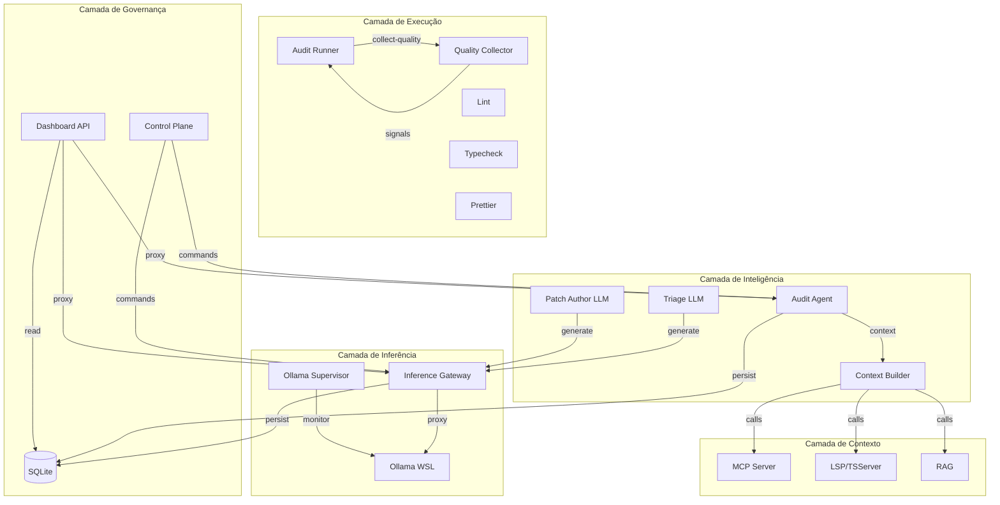
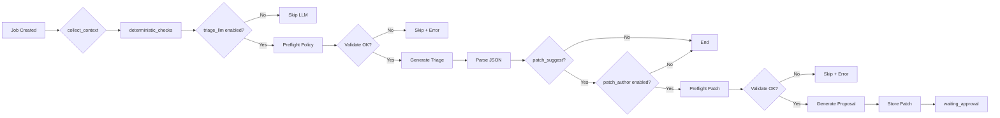
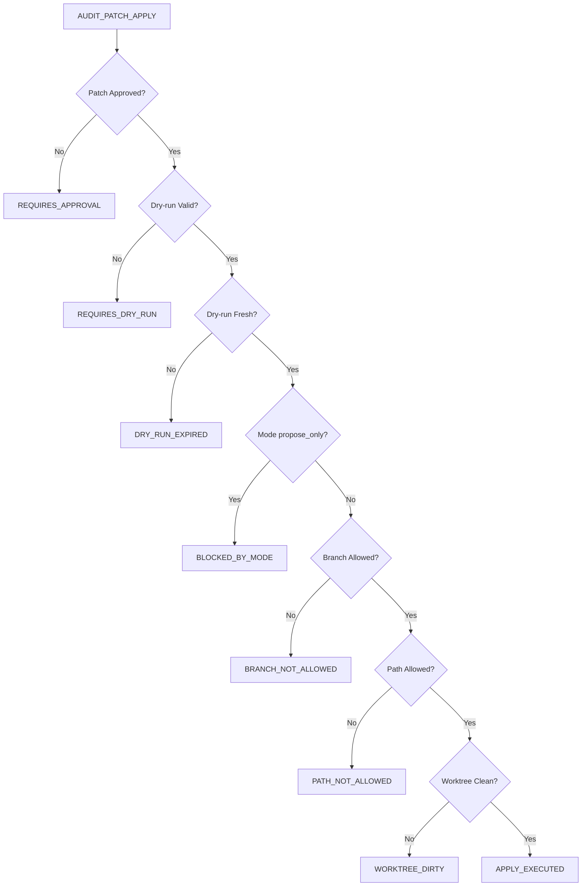

# Análise Completa do Sistema de Auditoria e Rastreamento de Bugs (CODEX AUDIT)

**Data de Criação:** 2026-02-23 **Versão:** 1.0 **Status:** Análise Concluída **Última
Atualização:** 2026-02-23T05:20:00Z

---

## Índice

1. [Resumo Executivo](#1-resumo-executivo)
2. [Mapeamento de Arquivos e Módulos](#2-mapeamento-de-arquivos-e-módulos)
3. [Análise de Funcionalidades Implementadas](#3-análise-de-funcionalidades-implementadas)
4. [Problemas, Inconsistências e Áreas de Melhoria](#4-problemas-inconsistências-e-áreas-de-melhoria)
5. [Integrações e Dependências Externas](#5-integrações-e-dependências-externas)
6. [Recomendações e Próximos Passos](#6-recomendações-e-próximos-passos)
7. [Diagramas de Arquitetura](#7-diagramas-de-arquitetura)
8. [Anexo: Contratos de Qualidade](#8-anexo-contratos-de-qualidade)

---

## 1. Resumo Executivo

### 1.1 Visão Geral do Sistema

O sistema de auditoria CODEX é uma plataforma комплексная de engenharia de software que combina:

- **Audit Agent**: Agente LLM de engenharia em background que analisa código, encontra bugs, sugere
  patches e executa validações seguras
- **Inference Gateway**: Gateway de inferência local (Ollama) com governança, políticas e fallback
- **Audit Runner**: Motor determinístico de checks, contratos e qualidade
- **Control Plane**: Ponto único de mutação via `control_command_service`
- **Dashboard**: Interface de observação e operação
- **MCP/RAG/LSP**: Camadas de contexto semântico

### 1.2 Status Atual

| Componente        | Status                 | Versão |
| ----------------- | ---------------------- | ------ |
| Audit Agent       | Ativo (F0-F9 parciais) | 1.0.0  |
| Inference Gateway | Ativo                  | 1.0.0  |
| Audit Runner      | Ativo                  | 1.0.0  |
| Control Plane     | Ativo                  | 1.0.0  |
| Dashboard API     | Ativo                  | 1.0.0  |
| Quality Contracts | Ativo (10 contratos)   | v3     |

### 1.3 Principais Marcos

- **F0-F1**: Governança e baseline - CONCLUÍDO
- **F2**: Ollama host permanente + supervisor sidecar - CONCLUÍDO
- **F3**: Inference Gateway + config avançada - CONCLUÍDO
- **F4**: Domínio Audit Agent (DB + repos) - CONCLUÍDO
- **F5**: Processo PM2 audit-agent - CONCLUÍDO
- **F6**: Integração SSOT + Control Plane - CONCLUÍDO
- **F7**: Context Builder semântico (MCP + LSP/RAG) - CONCLUÍDO
- **F8**: Pipeline LLM (triage -> patch -> dry-run) - CONCLUÍDO
- **F9**: API + Dashboard + Realtime - CONCLUÍDO
- **F10-F12**: Segurança, RBAC, Rollout progressivo - PENDENTE

---

## 2. Mapeamento de Arquivos e Módulos

### 2.1 Módulos Principais

#### 2.1.1 Audit Agent (`src/audit_agent/`)

| Arquivo               | Descrição                              | Linhas  |
| --------------------- | -------------------------------------- | ------- |
| `main.js`             | Processo HTTP + tick periódico         | ~3,876  |
| `runtime.js`          | Loop de jobs em memória + tick híbrido | ~21,086 |
| `server.js`           | HTTP local (/health, /metrics, /jobs)  | ~3,746  |
| `context_builder.js`  | Coleta contexto via MCP/LSP/RAG        | ~14,986 |
| `triage_llm.js`       | Cliente HTTP para Inference Gateway    | ~5,786  |
| `patch_author_llm.js` | Geração de propostas de patch          | ~11,449 |
| `contracts.js`        | Contratos do domínio Audit Agent       | ~1,461  |
| `db_store.js`         | Persistência SQLite                    | ~4,348  |

#### 2.1.2 Inference Gateway (`src/inference_gateway/`)

| Arquivo                     | Descrição                       | Linhas  |
| --------------------------- | ------------------------------- | ------- |
| `main.js`                   | Processo HTTP do gateway        | ~1,806  |
| `gateway.js`                | Lógica de governança + fallback | ~11,293 |
| `server.js`                 | Endpoints REST                  | ~3,932  |
| `persistence.js`            | Loader de policies do SQLite    | ~3,466  |
| `ollama_host_supervisor.js` | Polling + circuit breaker       | ~9,242  |
| `client_tags.js`            | Definição de clientTags         | ~2,225  |
| `policy_config.js`          | Configuração de políticas       | ~5,595  |

#### 2.1.3 Control Plane (`src/server/domain/`)

| Arquivo                      | Descrição                                | Linhas  |
| ---------------------------- | ---------------------------------------- | ------- |
| `control_command_service.js` | SSOT de comandos AUDIT*\* e INFERENCE*\* | ~58,454 |
| `mission_control_service.js` | Controle de missões                      | ~20,276 |
| `task_control_service.js`    | Controle de tarefas                      | ~25,705 |
| `rbac_policy.js`             | Políticas RBAC                           | ~1,355  |

#### 2.1.4 Dashboard APIs (`src/server/api/controllers/`)

| Arquivo                  | Descrição                                      | Linhas  |
| ------------------------ | ---------------------------------------------- | ------- |
| `dashboard_audit.js`     | API de auditoria (jobs, patches, findings)     | ~26,991 |
| `dashboard_inference.js` | API de inferência (profiles, policies, models) | ~21,541 |
| `dashboard.js`           | Router principal                               | ~14,995 |
| `dashboard_tasks.js`     | API de tarefas                                 | ~24,260 |
| `dashboard_missions.js`  | API de missões                                 | ~17,945 |

#### 2.1.5 Repositórios de Dados (`src/infra/db/`)

| Arquivo                           | Tabela Principal            | Descrição                        |
| --------------------------------- | --------------------------- | -------------------------------- |
| `audit_job_repo.js`               | `audit_jobs`                | Repositório de jobs de auditoria |
| `audit_job_run_repo.js`           | `audit_job_runs`            | Runs de jobs                     |
| `audit_finding_repo.js`           | `audit_job_findings`        | Findings de auditoria            |
| `audit_patch_repo.js`             | `audit_patch_proposals`     | Propostas de patch               |
| `audit_watch_rule_repo.js`        | `audit_watch_rules`         | Regras de monitoramento          |
| `inference_profile_repo.js`       | `inference_profiles`        | Perfis de inferência             |
| `inference_client_policy_repo.js` | `inference_client_policies` | Políticas por clientTag          |
| `inference_backend_repo.js`       | `inference_backends`        | Backends de inferência           |
| `inference_model_repo.js`         | `inference_models`          | Modelos de inferência            |
| `migrations.js`                   | -                           | Migrações SQLite (v1-v8)         |

#### 2.1.6 Scripts de Auditoria (`scripts/audit/`)

| Caminho                       | Descrição                               |
| ----------------------------- | --------------------------------------- |
| `runner.mjs`                  | Executor principal de auditoria (~90KB) |
| `collectors/quality.mjs`      | Coletor de quality gates (~37KB)        |
| `collectors/static.mjs`       | Coletor de análise estática (~23KB)     |
| `collectors/runtime.mjs`      | Coletor de runtime (~30KB)              |
| `collectors/performance.mjs`  | Coletor de performance (~50KB)          |
| `lib/impact_classifier.mjs`   | Classificador de impacto                |
| `lib/quality_targets.mjs`     | Alvos de qualidade                      |
| `lib/schema.mjs`              | Schema de telemetria                    |
| `contracts/load_registry.mjs` | Loader de contratos                     |

### 2.2 Contratos de Qualidade (`contracts/domains/`)

| Domínio             | Contratos Ativos | Nível de Enforcement |
| ------------------- | ---------------- | -------------------- |
| `quality.json`      | 10 contratos     | P1 (4) + Warn (6)    |
| `architecture.json` | 14 contratos     | P1 + Warn            |
| `security.json`     | 2 contratos      | P0                   |
| `schemas.json`      | 2 contratos      | P1 + P2              |
| `network.json`      | 2 contratos      | P1 + P2              |
| `config.json`       | 2 contratos      | P1                   |
| `logic.json`        | 3 contratos      | P1                   |

### 2.3 Skills do Codex (`.codex/skills/`)

| Skill                            | Descrição                     |
| -------------------------------- | ----------------------------- |
| `audit-agent-background-llm-ops` | Operações do Audit Agent      |
| `audit-contracts-v3-ops`         | Operações de contratos v3     |
| `audit-proposal-deep-triage`     | Triagem profunda de propostas |
| `audit-runbook-observability`    | Observabilidade e runbook     |
| `rag-mcp-lsp-ops`                | Operações RAG/MCP/LSP         |
| `typing-node24-esm-tsserver`     | Tipagem Node 24 + ESM         |

---

## 3. Análise de Funcionalidades Implementadas

### 3.1 Pipeline LLM (F8)

O pipeline de inferência do Audit Agent segue a seguinte sequência:

```
collect_context → deterministic_checks → triage → triage_llm → patch_author_llm → waiting_approval → apply
```

#### 3.1.1 Context Builder (`context_builder.js`)

- **Modo read-only**: Coleta sinais de MCP/LSP/RAG sem mutação
- **Budget MCP**: Controle de orçamento por chamada (`mcp_budget`)
- **Tools suportados**:
  - `lsp_diagnostics`
  - `lsp_definition`
  - `lsp_references`
  - `lsp_document_symbols`
  - `rag_search`
  - `rag_expand`
- **Fallback**: Modo probe quando MCP indisponível

#### 3.1.2 Triage LLM (`triage_llm.js`)

- **Cliente HTTP**: Conexão com Inference Gateway
- **clientTag**: `audit_agent_triage`
- **Preflight**: Validação de policy/profile antes de chamar LLM
- **Saída**: JSON com `summary`, `risk_level`, `next_actions`
- **Flag de ativação**: `AUDIT_AGENT_TRIAGE_LLM_ENABLED`

#### 3.1.3 Patch Author LLM (`patch_author_llm.js`)

- **clientTag**: `audit_agent_patch`
- **Preflight**: Validação de rota/política
- **Saída**: Proposta normalizada com:
  - `patch_summary` estruturado
  - `risk_score`
  - `dry_run_result_json` pendente
  - `approval_required=true`
- **Flag de ativação**: `AUDIT_AGENT_PATCH_AUTHOR_LLM_ENABLED`
- **Status**: V0 proposal-only (sem apply real)

### 3.2 Sistema de Cache (F7 - Cross-phase)

#### 3.2.1 Cache Intra-phase (Quality Collector)

- **Localização**: `artifacts/audit/cache/quality`
- **Hashing**: `sha256(stableJson(...))` por step/config/arquivos
- **Steps cacheados**:
  - `lint`
  - `typecheck_node`
  - `typecheck_browser`
  - `prettier_check`
  - `jsdoc_delta`
  - `jsdoc_full`
  - `ts_ignore_scan`

#### 3.2.2 Paralelismo Controlado

- **Grupo quick-smoke**: `quality.node_check` + `quality.entrypoint_import_smoke`
- **Grupo delta-docs-scan**: `quality.jsdoc_delta` + `quality.ts_ignore_scan`
- **Modo serial**: Flag `--quality-parallelism serial`

#### 3.2.3 Telemetria de Cache

```javascript
quality_execution.cache = {
  hits: number,
  misses: number,
  writes: number
}
quality_execution.parallelism = {
  mode: 'auto' | 'serial',
  groups: [...]
}
quality_execution.dedup = {
  before: number,
  after: number,
  removed: number
}
```

### 3.3 Control Plane - Comandos

#### 3.3.1 Comandos AUDIT\_\*

| Comando                      | Descrição              | Status        |
| ---------------------------- | ---------------------- | ------------- |
| `AUDIT_JOB_CREATE`           | Criar job de auditoria | ✅            |
| `AUDIT_JOB_RUN`              | Executar job           | ✅            |
| `AUDIT_JOB_CANCEL`           | Cancelar job           | ✅            |
| `AUDIT_JOB_RETRY`            | Retentar job           | ✅            |
| `AUDIT_PATCH_APPROVE`        | Aprovar patch          | ✅            |
| `AUDIT_PATCH_REJECT`         | Rejeitar patch         | ✅            |
| `AUDIT_PATCH_APPLY`          | Aplicar patch          | ✅ (guardado) |
| `AUDIT_PATCH_APPLY_VALIDATE` | Validar readiness      | ✅            |
| `AUDIT_WATCH_RULE_UPSERT`    | Criar/atualizar regra  | ✅            |
| `AUDIT_WATCH_RULE_TOGGLE`    | Ativar/desativar regra | ✅            |

#### 3.3.2 Comandos INFERENCE\_\*

| Comando                          | Descrição                | Status |
| -------------------------------- | ------------------------ | ------ |
| `INFERENCE_PROFILE_VALIDATE`     | Validar perfil           | ✅     |
| `INFERENCE_PROFILE_UPSERT`       | Criar/atualizar perfil   | ✅     |
| `INFERENCE_CLIENT_POLICY_UPSERT` | Criar/atualizar política | ✅     |
| `INFERENCE_BACKEND_UPSERT`       | Criar/atualizar backend  | ✅     |
| `INFERENCE_BACKEND_TOGGLE`       | Ativar/desativar backend | ✅     |
| `INFERENCE_MODEL_UPSERT`         | Criar/atualizar modelo   | ✅     |
| `INFERENCE_MODEL_TOGGLE`         | Ativar/desativar modelo  | ✅     |

### 3.4 Guardrails de Apply

O sistema implementa guardrails robustos para aplicação de patches:

1. **Aprovação obrigatória**: Patch deve estar no estado `approved`
2. **Dry-run válido**: `dry_run_result_json.ok === true`
3. **Validação temporal**:
   - `validated_at_ms` (timestamp)
   - `ttl_ms` ou `AUDIT_PATCH_DRY_RUN_MAX_AGE_MS`
   - Rejeita dry-run expirado
4. **Bloqueio por modo**: `propose_only` bloqueia por padrão
5. **Guardrails de branch/path**:
   - `AUDIT_PATCH_APPLY_ALLOWED_BRANCHES`
   - `AUDIT_PATCH_APPLY_ALLOWED_PATH_PREFIXES`
6. **Gate de escape**: `AUDIT_AGENT_PATCH_APPLY_ENABLE_UNSAFE_LOCAL=true`

### 3.5 Dashboard APIs

#### 3.5.1 Endpoints de Auditoria

| Endpoint                                           | Método   | Descrição               |
| -------------------------------------------------- | -------- | ----------------------- |
| `/api/dashboard/audit/runtime`                     | GET      | Runtime do Audit Agent  |
| `/api/dashboard/audit/jobs`                        | GET/POST | Listar/criar jobs       |
| `/api/dashboard/audit/jobs/:id`                    | GET      | Detalhe do job          |
| `/api/dashboard/audit/jobs/:id/run`                | POST     | Executar job            |
| `/api/dashboard/audit/jobs/:id/cancel`             | POST     | Cancelar job            |
| `/api/dashboard/audit/jobs/:id/findings`           | GET      | Findings do job         |
| `/api/dashboard/audit/jobs/:id/patches`            | GET      | Patches do job          |
| `/api/dashboard/audit/jobs/:id/llm-triage`         | GET      | Detalhe de triage LLM   |
| `/api/dashboard/audit/patches/:id`                 | GET      | Detalhe do patch        |
| `/api/dashboard/audit/patches/:id/approve`         | POST     | Aprovar patch           |
| `/api/dashboard/audit/patches/:id/reject`          | POST     | Rejeitar patch          |
| `/api/dashboard/audit/patches/:id/apply`           | POST     | Aplicar patch           |
| `/api/dashboard/audit/patches/:id/apply-readiness` | GET      | Readiness de apply      |
| `/api/dashboard/audit/watch-rules`                 | GET/POST | Regras de monitoramento |
| `/api/dashboard/audit/watch-rules/:id/toggle`      | POST     | Toggle regra            |

#### 3.5.2 Endpoints de Inferência

| Endpoint                                       | Método   | Descrição           |
| ---------------------------------------------- | -------- | ------------------- |
| `/api/dashboard/inference/profiles`            | GET/POST | Listar/criar perfis |
| `/api/dashboard/inference/profiles/validate`   | POST     | Validar perfil      |
| `/api/dashboard/inference/client-policies`     | GET/POST | Políticas           |
| `/api/dashboard/inference/backends`            | GET/POST | Backends            |
| `/api/dashboard/inference/backends/:id/toggle` | POST     | Toggle backend      |
| `/api/dashboard/inference/models`              | GET/POST | Modelos             |
| `/api/dashboard/inference/models/:id/toggle`   | POST     | Toggle modelo       |
| `/api/dashboard/inference/models-db`           | GET      | Modelos do DB       |
| `/api/dashboard/inference/policies/summary`    | GET      | Resumo de políticas |
| `/api/dashboard/inference/summary`             | GET      | Resumo operacional  |
| `/api/dashboard/inference/triage/preflight`    | POST     | Preflight de triage |
| `/api/dashboard/inference/patch/preflight`     | POST     | Preflight de patch  |

---

## 4. Problemas, Inconsistências e Áreas de Melhoria

### 4.1 Problemas Ativos Identificados

#### 4.1.1 Pipeline LLM

| ID  | Problema                                                   | Severidade | Status              |
| --- | ---------------------------------------------------------- | ---------- | ------------------- |
| P1  | `triage_llm` desabilitado por padrão                       | Alta       | Pendente calibração |
| P2  | `patch_author_llm` V0 proposal-only                        | Média      | Evolução futura     |
| P3  | Falta truncation/token-budget formal antes do pipeline LLM | Alta       | Pendente            |
| P4  | `llm_triage_summary` sem tela dedicada no dashboard        | Baixa      | Pendente            |

#### 4.1.2 Cache e Performance

| ID  | Problema                                                              | Severidade | Status           |
| --- | --------------------------------------------------------------------- | ---------- | ---------------- |
| P5  | Cache miss em `quality.lint`/`quality.prettier_check` aumenta duração | Média      | Mitigado         |
| P6  | Falta cache/paralelismo/deduplicação cross-phase                      | Média      | Pendente         |
| P7  | `quality.jsdoc_delta` gera alto volume em delta amplo                 | Baixa      | Mitigado com cap |

#### 4.1.3 Control Plane

| ID  | Problema                                            | Severidade | Status    |
| --- | --------------------------------------------------- | ---------- | --------- |
| P8  | `AUDIT_PATCH_APPLY` ainda guardado (sem apply real) | Alta       | Design V1 |
| P9  | Falta endpoint de benchmark/runtime policy          | Baixa      | Pendente  |
| P10 | UI não consome endpoints de readiness               | Baixa      | Pendente  |

#### 4.1.4 Contratos

| ID  | Problema                                                  | Severidade | Status              |
| --- | --------------------------------------------------------- | ---------- | ------------------- |
| P11 | Contratos quality em `warn` (exceto 4 críticos em P1)     | Média      | Calibração pendente |
| P12 | Threshold JSDoc 80% abaixo da realidade (32% atual)       | Baixa      | Progressivo         |
| P13 | `check:forbidden` com regexs frágeis em contratos antigos | Baixa      | Pendente            |

### 4.2 Inconsistências Arquiteturais

| ID  | Inconsistência                                                                 | Recomendação                        |
| --- | ------------------------------------------------------------------------------ | ----------------------------------- |
| I1  | Separação de papéis não clara para novos desenvolvedores                       | Melhorar documentação anti-confusão |
| I2  | `audit-agent` opera em memória (sem DB em tempo real)                          | Promover hydration completa         |
| I3  | `Inference Gateway` não integrado aos consumidores (`rag`, `mcp_ollama_tools`) | Integrar progressivamente           |

### 4.3 Áreas de Melhoria

1. **Testes**: Criar suíte de testes unit/integration dedicada ao `quality collector`,
   `impact_classifier` e parsers
2. **JSDoc Coverage**: Incrementar cobertura por domínio (`entrypoints/core`, `server/domain`,
   `driver/shared`)
3. **UI/UX**: Desenvolver telas dedicadas para:
   - Visualização de `llm_triage`
   - Patch proposal detalhado
   - Operações de `INFERENCE_*` sem terminal
4. **Performance**: Implementar cache cross-phase e otimização de paralelismo

---

## 5. Integrações e Dependências Externas

### 5.1 Dependências Principais

| Módulo       | Dependência    | Versão    |
| ------------ | -------------- | --------- |
| Runtime      | Node.js        | >= 24.0.0 |
| Persistência | better-sqlite3 | ^11.0.0   |
| HTTP Server  | Fastify        | ^4.0.0    |
| LLM Local    | Ollama (WSL)   | >= 0.1.0  |
| MCP          | MCP Server     | Internal  |
| RAG          | RAG Pipeline   | Internal  |
| LSP          | LSP/TSServer   | Internal  |

### 5.2 Integrações Externas

#### 5.2.1 Ollama (WSL)

- **Host**: WSL (Windows Subsystem for Linux)
- **Supervisor**: `ollama-host-supervisor.js` com polling e circuit breaker
- **Funcionalidades**:
  - Geração de texto
  - Embeddings
  - Listagem de modelos

#### 5.2.2 MCP Server

- **Endpoint**: `/api/mcp`
- **Tools disponíveis**: 14 tools (lsp*\*, rag*\_, ollama\_\_)
- **Modo fallback**: Deterministico quando indisponível

#### 5.2.3 RAG

- **Index mode**: Full
- **Available**: true
- **Fallback**: Contexto reduzido com risco explícito

### 5.3 Variáveis de Ambiente Críticas

| Variável                                      | Descrição                | Default    |
| --------------------------------------------- | ------------------------ | ---------- |
| `AUDIT_AGENT_ENABLED`                         | Ativar Audit Agent       | `false`    |
| `AUDIT_AGENT_TRIAGE_LLM_ENABLED`              | Ativar triage LLM        | `false`    |
| `AUDIT_AGENT_PATCH_AUTHOR_LLM_ENABLED`        | Ativar patch author      | `false`    |
| `AUDIT_AGENT_PATCH_APPLY_ENABLE_UNSAFE_LOCAL` | Permitir apply           | `false`    |
| `INFERENCE_GATEWAY_ENABLED`                   | Ativar Inference Gateway | `false`    |
| `OLLAMA_SUPERVISOR_ENABLED`                   | Ativar supervisor Ollama | `false`    |
| `AUDIT_AGENT_PERSIST_DB`                      | Persistir no SQLite      | `true`     |
| `AUDIT_AGENT_HYDRATE_ON_START`                | Hidratar ao iniciar      | `false`    |
| `AUDIT_PATCH_DRY_RUN_MAX_AGE_MS`              | TTL dry-run              | `86400000` |

### 5.4 Processos PM2

O ecosistema PM2 suporta processos condicionais:

```javascript
// Ativação por flag
ENABLE_AUDIT_AGENT_PM2_PROCESSES =
  true -
  // Processos
  audit -
  agent -
  inference -
  gateway -
  ollama -
  host -
  supervisor;
```

---

## 6. Recomendações e Próximos Passos

### 6.1 Curto Prazo (Próximas 2 Semanas)

| #   | Ação                                                  | Prioridade | Dependência |
| --- | ----------------------------------------------------- | ---------- | ----------- |
| 1   | Expor `apply_readiness` em patch detail/list          | Alta       | F9          |
| 2   | Criar endpoint detalhado de `patch_proposal`          | Alta       | F9          |
| 3   | Preparar esqueleto de apply real (blocked-by-default) | Alta       | F8          |
| 4   | Endurecer `patch_author_llm` com schema/output mode   | Média      | F8          |

### 6.2 Médio Prazo (Próximo Mês)

| #   | Ação                                     | Prioridade | Dependência |
| --- | ---------------------------------------- | ---------- | ----------- |
| 5   | Incrementar cobertura JSDoc por domínio  | Média      | F7          |
| 6   | Implementar cache cross-phase            | Média      | F7          |
| 7   | Calibrar thresholds de contratos quality | Média      | F6          |
| 8   | Criar UI para operações `INFERENCE_*`    | Baixa      | F9          |

### 6.3 Longo Prazo (Próximos 3 Meses)

| #   | Ação                                                   | Prioridade | Dependência |
| --- | ------------------------------------------------------ | ---------- | ----------- |
| 9   | Promover `AUDIT_PATCH_APPLY` para modo semi_auto       | Alta       | F10         |
| 10  | Implementar RBAC completo                              | Alta       | F10         |
| 11  | Integrar Inference Gateway com consumidores (RAG, MCP) | Alta       | F3          |
| 12  | Rollout progressivo com benchmarking                   | Média      | F12         |

### 6.4 Recomendações de Refatoração

1. **Separação de Responsabilidades**: Consolidar documentação anti-confusão entre Audit Agent,
   Audit Runner, MCP, LSP/TSServer e RAG

2. **Testes**: Criar suíte dedicada para:
   - `quality collector` e parsers
   - `impact_classifier`
   - `jsdoc_coverage_engine`
   - Integração HTTP stubada com Ollama

3. **Performance**:
   - Implementar cache cross-phase para `quality` vs `static` vs `runtime`
   - Adicionar métricas de latency por step
   - Configurar alertas de degradação

4. **Segurança**:
   - Formalizar contract de RBAC para operações de apply
   - Implementar auditoria completa de mutações
   - Adicionar rate limiting por clientTag

---

## 7. Diagramas de Arquitetura

### 7.1 Arquitetura de Alto Nível



### 7.2 Fluxo de Pipeline LLM



### 7.3 Fluxo de Apply com Guardrails



---

## 8. Anexo: Contratos de Qualidade

### 8.1 Contratos com Enforcement P1

| ID                                   | Contrato            | Descrição                             |
| ------------------------------------ | ------------------- | ------------------------------------- |
| CONTRACT-QUALITY-NODE-SYNTAX         | Node Syntax Check   | Arquivos JS passam em `node --check`  |
| CONTRACT-QUALITY-TYPECHECK-NODE      | Typecheck Node      | `typecheck:node` passa                |
| CONTRACT-QUALITY-TYPECHECK-BROWSER   | Typecheck Browser   | `typecheck:browser` passa             |
| CONTRACT-QUALITY-TS-IGNORE-FORBIDDEN | @ts-ignore Proibido | Sem `@ts-ignore` em src/scripts/tests |

### 8.2 Contratos com Enforcement Warn

| ID                                              | Contrato        | Descrição                      |
| ----------------------------------------------- | --------------- | ------------------------------ |
| CONTRACT-QUALITY-ENTRYPOINT-IMPORT-SMOKE        | Import Smoke    | Entrypoints sem side-effects   |
| CONTRACT-QUALITY-LINT-CLEAN                     | Lint Clean      | Lint permanece limpo           |
| CONTRACT-QUALITY-PRETTIER-CHECK                 | Prettier Check  | Formatação respeitada          |
| CONTRACT-QUALITY-JSDOC-DELTA-EXPORTS-DOCUMENTED | JSDoc Delta     | Exports alterados documentados |
| CONTRACT-QUALITY-JSDOC-FULL-EXPORTS-DOCUMENTED  | JSDoc Full      | Exports completos documentados |
| CONTRACT-QUALITY-JSDOC-FULL-COVERAGE-THRESHOLD  | JSDoc Threshold | Cobertura acima de 80%         |

---

## Histórico de Alterações

| Versão | Data       | Autor     | Descrição                    |
| ------ | ---------- | --------- | ---------------------------- |
| 1.0    | 2026-02-23 | Kilo Code | Criação inicial do documento |

---

_Documento gerado automaticamente com base na análise dos arquivos de documentação e código-fonte._
