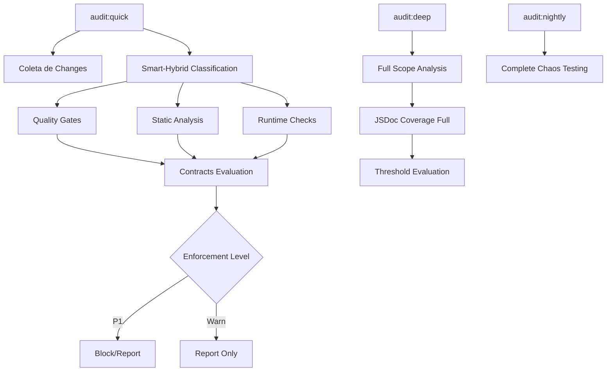
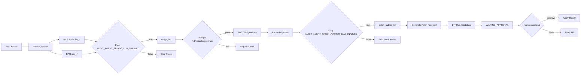
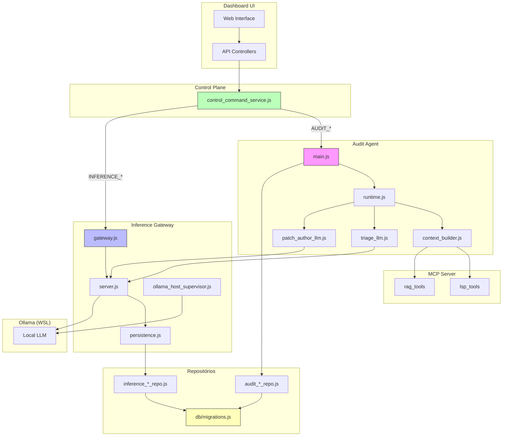

# CODEX_AUDIT_ANALISE_ARQUITETURA_PLANEJAMENTO

**Data da Análise:** 2026-02-22 **Versão:** 1.0.0 **Status:** Em construção (atualização contínua)

---

## Índice

1. [Resumo Executivo](#1-resumo-executivo)
2. [Mapeamento de Arquivos e Módulos](#2-mapeamento-de-arquivos-e-módulos)
3. [Análise Detalhada das Funcionalidades](#3-análise-dalhada-das-funcionalidades)
4. [Problemas, Inconsistências e Áreas de Melhoria](#4-problemas-inconsistências-e-áreas-de-melhoria)
5. [Integrações e Dependências Externas](#5-integrações-e-dependências-externas)
6. [Recomendações para Próximos Passos](#6-recomendações-para-próximos-passos)
7. [Skill do Projeto](#7-skill-do-projeto)
8. [Diagrama de Arquitetura](#8-diagrama-de-arquitetura)

---

## 1. Resumo Executivo

O sistema de auditoria do projeto Codex é uma arquitetura complexa e em evolução que combina
múltiplas camadas de análise de código, governança de qualidade e agente LLM autônomo. O sistema é
composto por quatro subsistemas principais:

### 1.1 Componentes Principais

| Subsistema            | Função                                           | Status                   |
| --------------------- | ------------------------------------------------ | ------------------------ |
| **Audit Runner**      | Motor determinístico de checks/contracts/quality | Estável                  |
| **Audit Agent**       | Agente LLM de engenharia em background           | Em implementação (F0-F9) |
| **Inference Gateway** | Governança de inferência local (Ollama)          | Funcional                |
| **Control Plane**     | SSOT de comandos e mutações                      | Operacional              |

### 1.2 Decisões de Arquitetura Consolidadas

1. **Autonomia V1:** `semi_auto` (apply só com aprovação humana)
2. **Acionamento:** `hibrido` (manual + eventos + agendamento)
3. **Topologia Ollama:** `host WSL + sidecar supervisor`
4. **Interface primária:** `Dashboard + API`
5. **Patches V1:** `patch + dry-run + approve`

---

## 2. Mapeamento de Arquivos e Módulos

### 2.1 Módulo Audit Agent (`src/audit_agent/`)

| Arquivo                                                      | Tamanho | Função Principal                               |
| ------------------------------------------------------------ | ------- | ---------------------------------------------- |
| [`main.js`](src/audit_agent/main.js)                         | 3.8 KB  | Processo HTTP + tick periódico                 |
| [`runtime.js`](src/audit_agent/runtime.js)                   | 21 KB   | Orquestração de jobs em memória                |
| [`server.js`](src/audit_agent/server.js)                     | 3.7 KB  | HTTP local (/health, /metrics, /jobs)          |
| [`context_builder.js`](src/audit_agent/context_builder.js)   | 15 KB   | Coleta de contexto via MCP/LSP/RAG             |
| [`triage_llm.js`](src/audit_agent/triage_llm.js)             | 5.8 KB  | Cliente HTTP para triage via Inference Gateway |
| [`patch_author_llm.js`](src/audit_agent/patch_author_llm.js) | 11.4 KB | Geração de propostas de patch via LLM          |
| [`contracts.js`](src/audit_agent/contracts.js)               | 1.5 KB  | Contratos do domínio Audit Agent               |
| [`db_store.js`](src/audit_agent/db_store.js)                 | 4.3 KB  | Persistência SQLite opcional                   |

### 2.2 Módulo Inference Gateway (`src/inference_gateway/`)

| Arquivo                                                                        | Tamanho | Função Principal                          |
| ------------------------------------------------------------------------------ | ------- | ----------------------------------------- |
| [`main.js`](src/inference_gateway/main.js)                                     | 1.8 KB  | Processo HTTP do gateway                  |
| [`gateway.js`](src/inference_gateway/gateway.js)                               | 11.3 KB | Lógica de governança de inferência        |
| [`server.js`](src/inference_gateway/server.js)                                 | 3.9 KB  | Endpoints REST (/v1/generate, /v1/models) |
| [`persistence.js`](src/inference_gateway/persistence.js)                       | 3.5 KB  | Loader de policies do SQLite              |
| [`client_tags.js`](src/inference_gateway/client_tags.js)                       | 2.2 KB  | Definição de clientTags                   |
| [`policy_config.js`](src/inference_gateway/policy_config.js)                   | 5.6 KB  | Configuração de políticas                 |
| [`ollama_host_supervisor.js`](src/inference_gateway/ollama_host_supervisor.js) | 9.2 KB  | Supervisor de saúde do Ollama             |

### 2.3 Control Plane (`src/server/domain/`)

| Arquivo                                                                      | Tamanho | Função Principal                         |
| ---------------------------------------------------------------------------- | ------- | ---------------------------------------- |
| [`control_command_service.js`](src/server/domain/control_command_service.js) | 52.5 KB | SSOT de comandos AUDIT*\* e INFERENCE*\* |

**Comandos AUDIT\_\* implementados:**

- `AUDIT_JOB_CREATE`, `AUDIT_JOB_RUN`, `AUDIT_JOB_CANCEL`, `AUDIT_JOB_RETRY`
- `AUDIT_PATCH_APPROVE`, `AUDIT_PATCH_REJECT`, `AUDIT_PATCH_APPLY`, `AUDIT_PATCH_APPLY_VALIDATE`
- `AUDIT_WATCH_RULE_UPSERT`, `AUDIT_WATCH_RULE_TOGGLE`

**Comandos INFERENCE\_\* implementados:**

- `INFERENCE_PROFILE_VALIDATE`, `INFERENCE_PROFILE_UPSERT`
- `INFERENCE_CLIENT_POLICY_UPSERT`
- `INFERENCE_BACKEND_UPSERT`, `INFERENCE_BACKEND_TOGGLE`
- `INFERENCE_MODEL_UPSERT`, `INFERENCE_MODEL_TOGGLE`

### 2.4 Repositórios de Persistência (`src/infra/db/`)

| Arquivo                                                                           | Função                             |
| --------------------------------------------------------------------------------- | ---------------------------------- |
| [`audit_job_repo.js`](src/infra/db/audit_job_repo.js)                             | Gerenciamento de jobs de auditoria |
| [`audit_job_run_repo.js`](src/infra/db/audit_job_run_repo.js)                     | Execuções de jobs                  |
| [`audit_finding_repo.js`](src/infra/db/audit_finding_repo.js)                     | Findings de auditoria              |
| [`audit_patch_repo.js`](src/infra/db/audit_patch_repo.js)                         | Propostas de patch                 |
| [`audit_watch_rule_repo.js`](src/infra/db/audit_watch_rule_repo.js)               | Regras de monitoramento            |
| [`inference_profile_repo.js`](src/infra/db/inference_profile_repo.js)             | Perfis de inferência               |
| [`inference_client_policy_repo.js`](src/infra/db/inference_client_policy_repo.js) | Políticas por clientTag            |
| [`inference_backend_repo.js`](src/infra/db/inference_backend_repo.js)             | Backends de inferência             |
| [`inference_model_repo.js`](src/infra/db/inference_model_repo.js)                 | Modelos de inferência              |
| [`migrations.js`](src/infra/db/migrations.js)                                     | Migrações SQLite (v7, v8)          |

### 2.5 Controladores Dashboard (`src/server/api/controllers/`)

| Arquivo                                                                       | Função                                          |
| ----------------------------------------------------------------------------- | ----------------------------------------------- |
| [`dashboard_audit.js`](src/server/api/controllers/dashboard_audit.js)         | APIs de auditoria (jobs, patches, findings)     |
| [`dashboard_inference.js`](src/server/api/controllers/dashboard_inference.js) | APIs de inferência (profiles, backends, models) |

### 2.6 Scripts de Auditoria (`scripts/audit/`)

| Caminho                                                                | Função                               |
| ---------------------------------------------------------------------- | ------------------------------------ |
| [`runner.mjs`](scripts/audit/runner.mjs)                               | Motor principal de auditoria (90 KB) |
| [`collectors/quality.mjs`](scripts/audit/collectors/quality.mjs)       | Coletor de quality gates             |
| [`collectors/static.mjs`](scripts/audit/collectors/static.mjs)         | Coletor de análise estática          |
| [`collectors/runtime.mjs`](scripts/audit/collectors/runtime.mjs)       | Coletor de runtime                   |
| [`lib/quality_targets.mjs`](scripts/audit/lib/quality_targets.mjs)     | Alvos de qualidade                   |
| [`lib/impact_classifier.mjs`](scripts/audit/lib/impact_classifier.mjs) | Classificador de impacto             |
| [`lib/schema.mjs`](scripts/audit/lib/schema.mjs)                       | Schema de telemetria                 |

### 2.7 Contratos de Qualidade (`contracts/domains/quality.json`)

10 contratos definidos (v3 DSL):

- `CONTRACT-QUALITY-NODE-SYNTAX` (P1)
- `CONTRACT-QUALITY-TYPECHECK-NODE` (P1)
- `CONTRACT-QUALITY-TYPECHECK-BROWSER` (P1)
- `CONTRACT-QUALITY-TS-IGNORE-FORBIDDEN` (P1)
- `CONTRACT-QUALITY-LINT-CLEAN` (warn)
- `CONTRACT-QUALITY-PRETTIER-CHECK` (warn)
- `CONTRACT-QUALITY-JSDOC-DELTA-EXPORTS-DOCUMENTED` (warn)
- `CONTRACT-QUALITY-JSDOC-FULL-EXPORTS-DOCUMENTED` (warn)
- `CONTRACT-QUALITY-JSDOC-FULL-COVERAGE-THRESHOLD` (warn)

### 2.8 Testes Unitários

**Audit Agent:**

- [`test_audit_agent_runtime.spec.js`](tests/unit/audit_agent/test_audit_agent_runtime.spec.js)
- [`test_audit_agent_server.spec.js`](tests/unit/audit_agent/test_audit_agent_server.spec.js)
- [`test_audit_agent_contracts.spec.js`](tests/unit/audit_agent/test_audit_agent_contracts.spec.js)
- [`test_audit_job_repo_and_db_store.spec.js`](tests/unit/audit_agent/test_audit_job_repo_and_db_store.spec.js)
- [`test_triage_llm.spec.js`](tests/unit/audit_agent/test_triage_llm.spec.js)
- [`test_patch_author_llm.spec.js`](tests/unit/audit_agent/test_patch_author_llm.spec.js)

**Inference Gateway:**

- [`test_gateway.spec.js`](tests/unit/inference/test_gateway.spec.js)
- [`test_gateway_server.spec.js`](tests/unit/inference/test_gateway_server.spec.js)
- [`test_client_tags.spec.js`](tests/unit/inference/test_client_tags.spec.js)
- [`test_policy_config.spec.js`](tests/unit/inference/test_policy_config.spec.js)
- [`test_ollama_host_supervisor.spec.js`](tests/unit/inference/test_ollama_host_supervisor.spec.js)
- [`test_persistence_loader.spec.js`](tests/unit/inference/test_persistence_loader.spec.js)

**Control Plane:**

- [`test_control_command_service_audit_inference.spec.js`](tests/unit/server/test_control_command_service_audit_inference.spec.js)
- [`test_control_command_service_audit_persistence.spec.js`](tests/unit/server/test_control_command_service_audit_persistence.spec.js)

### 2.9 Skills Codex Existentes

| Skill                                                                              | Função                    |
| ---------------------------------------------------------------------------------- | ------------------------- |
| [`audit-agent-background-llm-ops/`](.codex/skills/audit-agent-background-llm-ops/) | Operações do Audit Agent  |
| [`audit-contracts-v3-ops/`](.codex/skills/audit-contracts-v3-ops/)                 | Operações de contratos v3 |
| [`audit-runbook-observability/`](.codex/skills/audit-runbook-observability/)       | Observabilidade           |
| [`audit-proposal-deep-triage/`](.codex/skills/audit-proposal-deep-triage/)         | Triagem profunda          |

---

## 3. Análise Detalhada das Funcionalidades

### 3.1 Pipeline de Auditoria (Audit Runner)

O sistema de auditoria opera em três modos principais:



**Quality Gates implementados:**

- `node_check` - Verificação de sintaxe Node
- `entrypoint_import_smoke` - Teste de import de entrypoints
- `lint` - Análise ESLint
- `typecheck_node` - Verificação TypeScript Node
- `typecheck_browser` - Verificação TypeScript Browser
- `prettier_check` - Verificação de formatação
- `jsdoc_delta` - Cobertura JSDoc em delta
- `jsdoc_full` - Cobertura JSDoc completa
- `ts_ignore_scan` - Detecção de @ts-ignore

### 3.2 Pipeline LLM do Audit Agent



### 3.3 Control Plane e SSOT

O `control_command_service.js` implementa o padrão de Single Source of Truth para todas as mutações
do sistema:

1. **Validação de entrada:**
   - Normalização de comandos
   - Verificação de reason obrigatória
   - Verificação de idempotency_key obrigatória
   - Validação de if_version para mutações de edição

2. **Execução de comandos:**
   - Proxy local para audit-agent (create/run/cancel/retry)
   - Persistência direta via repositórios (INFERENCE\_\*)
   - Avaliação de readiness para AUDIT_PATCH_APPLY

3. **Eventos e realtime:**
   - Emissão de eventos CONTROL_COMMAND_SUCCEEDED/FAILED
   - Notificação via socket (control:command_status)

### 3.4 Inference Gateway e clientTags

O sistema define clientTags obrigatórios para governança:

| clientTag             | Uso                               |
| --------------------- | --------------------------------- |
| `audit_agent_triage`  | Triagem LLM do Audit Agent        |
| `audit_agent_patch`   | Geração de patches do Audit Agent |
| `audit_agent_review`  | Revisão (V1.1)                    |
| `rag_embed`           | Embeddings RAG                    |
| `mcp_ollama_generate` | Geração via MCP                   |
| `mcp_ollama_embed`    | Embeddings via MCP                |
| `diagnostics_probe`   | Sonda de diagnósticos             |
| `fallback_generic`    | Fallback genérico                 |

### 3.5 Persistência e Migrações

**Migration v7** - Tabelas de auditoria e inferência:

- `audit_jobs`, `audit_job_runs`
- `inference_backends`, `inference_models`
- `inference_profiles`, `inference_client_policies`

**Migration v8** - Tabelas de findings e patches:

- `audit_job_findings`
- `audit_patch_proposals`
- `audit_watch_rules`

---

## 4. Problemas, Inconsistências e Áreas de Melhoria

### 4.1 Problemas Ativos (Riscos)

| ID  | Severidade | Descrição                                                  |
| --- | ---------- | ---------------------------------------------------------- |
| R1  | P0         | `AUDIT_PATCH_APPLY` ainda guardado (sem apply real)        |
| R2  | P1         | Cobertura JSDoc global em ~32% (threshold 80%)             |
| R3  | P1         | Falta de UI dedicada para visualização de llm_triage       |
| R4  | P2         | Cache de quality invalidated com frequência em branch suja |
| R5  | P2         | Sem testes de cache-hit/cache-miss controlados             |
| R6  | P2         | `static.forbidden` fora do cache quality                   |

### 4.2 Inconsistências Identificadas

1. **命名不一致 (Naming):**
   - `inference_profile` vs `InferenceProfile` (mixed snake_case/camelCase)
   - Commands: `AUDIT_PATCH_APPLY_VALIDATE` vs `INFERENCE_PROFILE_UPSERT` (verbos mistos)

2. **Feature Flags inconsistentes:**
   - Algumas features atrás de flags, outras não
   - Nomenclatura de flags não padronizada (underscore vs camelCase)

3. **Cobertura de Testes:**
   - Testes de parser (`eslint JSON`, `prettier --check`, `tsc output`) desacoplados pendentes
   - Testes de integração do `triage_llm` com Ollama stubado necessários

### 4.3 Áreas de Melhoria Prioritárias

1. **Performance:**
   - Implementar cache cross-phase (quality vs static vs runtime)
   - Adicionar paralelismo granular por domínio
   - Deduplicação de findings cross-phase

2. **Observabilidade:**
   - Expor `apply_readiness` em patch detail/list
   - Criar dashboard dedicado para llm_triage
   - Adicionar métricas de cache hit/miss

3. **Governança:**
   - Formalizar TTL/metadata de dry-run
   - Implementar apply real com validação temporal
   - Adicionar benchmark de inference

4. **Documentação:**
   - Documentar contratos de quality gates v3
   - Criar runbook operacional
   - Atualizar SKILL.md com workflows atuais

---

## 5. Integrações e Dependências Externas

### 5.1 Integrações com Serviços

| Serviço          | Integração                        | Status       |
| ---------------- | --------------------------------- | ------------ |
| **Ollama**       | Inference Gateway + Supervisor    | Funcional    |
| **MCP Server**   | context*builder (lsp*_, rag\__)   | Read-only V0 |
| **LSP/TSServer** | Diagnósticos e referências        | Parcial      |
| **RAG**          | Busca de contexto                 | Read-only    |
| **PM2**          | Processos opcionais (behind flag) | Configurado  |
| **SQLite**       | Persistência local                | Operacional  |

### 5.2 Dependências npm Relevantes

- `better-sqlite3` - Banco de dados local
- `puppeteer` - Automação de browser
- `express` - Servidor HTTP
- `ws` - WebSocket
- `dotenv` - Variáveis de ambiente

### 5.3 Variáveis de Ambiente Principais

```bash
# Audit Agent
AUDIT_AGENT_ENABLED=false
AUDIT_AGENT_PERSIST_DB=true
AUDIT_AGENT_HYDRATE_ON_START=false
AUDIT_AGENT_TRIAGE_LLM_ENABLED=false
AUDIT_AGENT_PATCH_AUTHOR_LLM_ENABLED=false
AUDIT_AGENT_PATCH_APPLY_ENABLE_UNSAFE_LOCAL=false
AUDIT_AGENT_CONTEXT_MCP_BUDGET=5000

# Inference Gateway
INFERENCE_GATEWAY_ENABLED=false

# Ollama Supervisor
OLLAMA_SUPERVISOR_ENABLED=false

# PM2 Processes
ENABLE_AUDIT_AGENT_PM2_PROCESSES=false
```

### 5.4 Scripts npm Disponíveis

```bash
# Audit Runner
npm run audit:quick          # Auditoria rápida com smart-hybrid
npm run audit:deep           # Auditoria profunda
npm run audit:nightly        # Auditoria noturna completa
npm run audit:quality        # Fase de qualidade only
npm run audit:deep:jsdoc     # Validação JSDoc full

# Testes
npm run test:unit:audit-agent       # Testes do Audit Agent
npm run test:unit:audit-quality      # Testes de quality gates

# Operacionais
npm run daemon:start:audit-agent     # Inicia processos Audit Agent
npm run daemon:restart:audit-agent   # Reinicia processos
```

---

## 6. Recomendações para Próximos Passos

### 6.1 Curto Prazo (Próxima Rodada)

1. **Fase 9/F8:**
   - Expor read-model detalhado de `llm_patch_author` por job
   - Endurecer `patch_author_llm` com output schema mais estrito
   - Preparar esqueleto de apply real (blocked-by-default)

2. **Fase 8:**
   - Integrar primeiro job manual `patch_suggest` end-to-end
   - Expor resumo de `llm_triage` no detail de job

### 6.2 Médio Prazo

1. **Performance:**
   - Implementar cache cross-phase
   - Adicionar granularidade de cache por domínio
   - Deduplicação de findings

2. **UI/UX:**
   - Criar telas de dashboard para llm_triage
   - Adicionar visualização de apply_readiness
   - Implementar Workflow completo de patch

3. **Testes:**
   - Cobertura de cache-hit/cache-miss
   - Testes de parser desacoplados
   - Integração com Ollama stubado

### 6.3 Longo Prazo

1. **Governança:**
   - Implementar apply real com guardrails completos
   - Adicionar RBAC granular
   - Métricas e benchmarks

2. **Evolução:**
   - Promover contratos quality para P1 seletivo
   - Expandir MCP tools no context_builder
   - Adicionar audit_agent_review

---

## 7. Skill do Projeto

### 7.1 Estrutura de Skill Recomendada

A skill existente `audit-agent-background-llm-ops` precisa ser atualizada para refletir o estado
atual do sistema. A skill deve incluir:

**Conteúdo recomendado:**

1. Visão geral da arquitetura (esta análise)
2. Fluxos de trabalho principais
3. Variáveis de ambiente e flags
4. Comandos disponíveis
5. Scripts npm operacionais
6. Troubleshooting comum

### 7.2 Ação Necessária

Atualizar a skill existente em
[`.codex/skills/audit-agent-background-llm-ops/SKILL.md`](.codex/skills/audit-agent-background-llm-ops/SKILL.md)
com as informações desta análise.

---

## 8. Diagrama de Arquitetura



---

## Histórico de Atualizações

| Versão | Data       | Descrição                 |
| ------ | ---------- | ------------------------- |
| 1.0.0  | 2026-02-22 | Versão inicial da análise |

---

_Este documento será atualizado conforme o desenvolvimento do sistema avançar._
