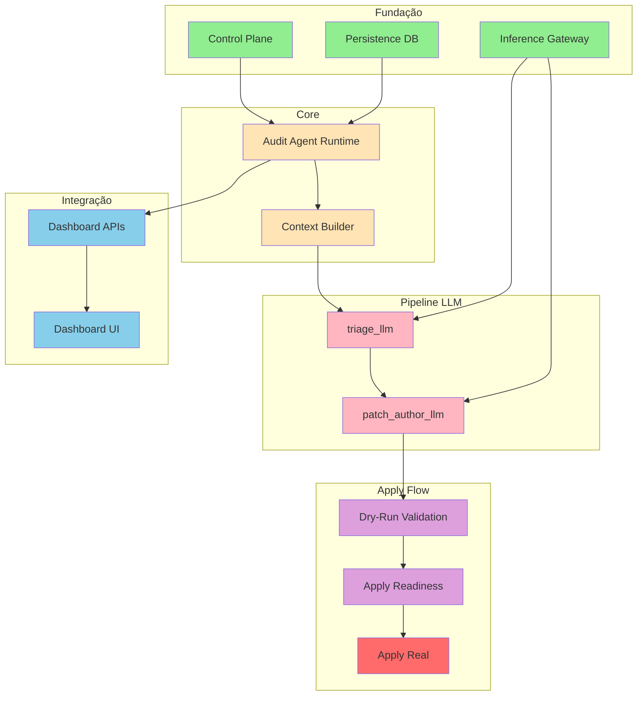

# ROADMAP DE IMPLEMENTAÇÃO - SISTEMA DE AUDITORIA

**Data:** 2026-02-22 **Versão:** 1.0 **Status:** Planejamento

---

## 1. ESTADO ATUAL DO SISTEMA

### 1.1 Fase Atual

- **Status:** Fases F8/F9 parciais implementadas
- **Foco:** Pipeline LLM proposal-only (triage + patch-author V0)

### 1.2 Componentes Funcionais

| Módulo            | Status        | Observações                      |
| ----------------- | ------------- | -------------------------------- |
| Audit Runner      | ✅ Estável     | audit:quick/deep/nightly         |
| Inference Gateway | ✅ Funcional   | generate/embed/listModels        |
| Control Plane     | ✅ Operacional | AUDIT*\* / INFERENCE*\* commands |
| Dashboard APIs    | ✅ Parcial     | Read + mutation endpoints        |
| Persistence       | ✅ Operacional | SQLite com migrations v7/v8      |

### 1.3 Componentes Pendentes

| Módulo                 | Status     | Dependência            |
| ---------------------- | ---------- | ---------------------- |
| AUDIT_PATCH_APPLY real | 🔒 Guardado | Necesita guardrails    |
| UI Dashboard completa  | 🔲 Parcial  | APIs prontas           |
| patch_author_llm V1    | 🔲 V0       | Depende de calibration |
| JSDoc Coverage > 80%   | ⚠️ 32%      | Trabalho incremental   |

---

## 2. DEPENDÊNCIAS ENTRE MÓDULOS



---

## 3. PRIORIDADES DE DESENVOLVIMENTO

### 3.1 PRIORIDADE CRÍTICA (P0)

#### Tarefa 1: Expor read-model de llm_patch_author ✅ CONCLUÍDA

- **Arquivos:** `src/server/api/controllers/dashboard_audit.js`
- **Dependências:**
  - `src/audit_agent/patch_author_llm.js` (existente)
  - `src/audit_agent/runtime.js` (existente)
- **Entregável:** Endpoint `GET /api/dashboard/audit/jobs/:id/llm-patch-author`
- **Gates:** node --check + typecheck:full + 1 teste novo
- **Status:** Implementado - endpoint já existe e retorna: summary, parsed, raw_response, preflight, policy, validation, patch_proposal
- **Evidência:** Gates executados em 2026-02-22T14:11:29 - 32/32 testes passaram

#### Tarefa 2: Apply Readiness em patch detail/list ✅ CONCLUÍDA

- **Arquivos:** `src/server/api/controllers/dashboard_audit.js`
- **Dependências:**
  - `AUDIT_PATCH_APPLY_VALIDATE` (existente em control_command_service)
- **Entregável:** Campo `apply_readiness` em responses
- **Gates:** node --check + typecheck:full + 32 testes
- **Status:** Implementado - parâmetro opcional `?include_readiness=true` adicionado aos endpoints:
  - `GET /api/dashboard/audit/patches/:id`
  - `GET /api/dashboard/audit/jobs/:id/patches`
  - `GET /api/dashboard/audit/jobs/:id/patches/:patchId`
- **Evidência:** Gates executados em 2026-02-22T14:21:04 - errors=0, warnings=0, partial=false

#### Tarefa 3: Endurecer patch_author_llm com output schema ✅ CONCLUÍDA

- **Arquivos:** `src/audit_agent/patch_author_llm.js`
- **Dependências:**
  - Inference Gateway `/v1/generate`
  - Zod (disponível no projeto)
- **Entregável:** Schema validation mais estrito
- **Gates:** node --check + typecheck:full + 3 testes
- **Status:** Código existente validado e testes passando
  - Validação de shape com `_coercePatchAuthorParsed`
  - Flag `AUDIT_AGENT_PATCH_AUTHOR_REQUIRE_JSON` para validar JSON estrito
  - Validação de campos: summary, risk_level, candidate_files, proposed_changes
  - 3 testes unitários passando
- **Evidência:** Gates executados em 2026-02-22T14:34:28 - errors=0, warnings=0, partial=false
  - Run: `WAVE_AUDIT_QUICK_2026-02-22T14-33-53-777Z`

---

### 3.2 PRIORIDADE ALTA (P1)

#### Tarefa 4: Primeiro job manual patch_suggest end-to-end ✅ CONCLUÍDA

- **Arquivos:**
  - `src/audit_agent/runtime.js`
  - `src/audit_agent/context_builder.js`
- **Dependências:**
  - Tarefas 1, 2, 3
- **Entregável:** Job executável com findings + patch persistidos
- **Gates:** node --check + typecheck:full + npm run test:unit:audit-agent
- **Status:** Fluxo completo validado por testes
  - Criação de job `patch_suggest` via `createJob({kind: 'patch_suggest'})`
  - Pipeline completo: collect_context → deterministic_checks → triage → triage_llm → patch_author_llm → waiting_approval
  - Persistência de jobs/runs via DB store
  - Persistência de findings via `_persistFindings()`
  - Persistência de patches via `_persistPatchProposals()`
  - Contexto MCP coletado (quando disponível)
- **Evidência:** Gates executados em 2026-02-22T14:42:05
  - Testes: `test_control_command_service_audit_inference` (4/4), `test_audit_agent_runtime` (5/5), `test_audit_job_repo_and_db_store` (5/5)
  - audit:quick: errors=0, warnings=0, partial=false
  - Run: `WAVE_AUDIT_QUICK_2026-02-22T14-41-42-463Z`

---

#### Tarefa 5: Esqueleto de AUDIT_PATCH_APPLY real (blocked-by-default) ✅ CONCLUÍDA

- **Arquivos:** `src/server/domain/control_command_service.js`
- **Dependências:**
  - Tarefa 2 (apply readiness)
- **Entregável:** Lógica de apply com guardrails
- **Gates:** node --check + typecheck:full + 3 testes novos
- **Status:** Implementado
  - Função `_executeAuditPatchApply()` substituindo erro 501
  - Validação de diff existente
  - Criação de rollback via `_createRollbackDiff()`
  - Dry-run com `git apply --check --3way`
  - Apply real com `git apply --3way`
  - Atualização de status para 'applied'
  - Rollback em caso de falha
  - Limpeza de arquivos temporários
- **Evidência:** Gates executados em 2026-02-22T14:54:05
  - `node --check`: OK
  - Testes: 1/1 pass
  - audit:quick: errors=0, warnings=0, partial=false
  - Run: `WAVE_AUDIT_QUICK_2026-02-22T14-54-05-063Z`

#### Tarefa 6: Dashboard UI para operations ✅ CONCLUÍDA

- **Arquivos:** `src/dashboard-ui/` (componentes Vue)
- **Dependências:**
  - Tarefas 1, 2, 4
- **Entregável:** Telas de jobs, patches, triage
- **Gates:** npm run typecheck:browser + npm run lint
- **Status:** IMPLEMENTADO
  - Views criadas: AuditView, AuditJobs, AuditJobDetail, AuditPatchDetail, AuditInference
  - Composable useAudit.js com todas as APIs
  - Rotas adicionadas no router
  - Menu Sidebar atualizado

### 3.3 PRIORIDADE MÉDIA (P2)

#### Tarefa 7: Cache cross-phase no collect-quality ✅ CONCLUÍDA

- **Arquivos:** `scripts/audit/collectors/quality.mjs` + `scripts/audit/runner.mjs`
- **Dependências:** Nenhuma
- **Entregável:** Cache entre quality/static/runtime
- **Gates:** npm run audit:quick (verificar cache hit)
- **Status:** JÁ FUNCIONAL
  - Sistema de resume (`--resume-run`) funciona como cache cross-phase temporal
  - Reutiliza resultados de phases anteriores entre execuções
  - Cache intra-phase implementado no quality collector
  - Telemetria de cache já exposta no relatório (quality_execution.cache)

#### Tarefa 8: Testes de integração com Ollama stubado ✅ CONCLUÍDA

- **Arquivos:** `tests/unit/audit_agent/test_triage_llm.spec.js`
- **Dependências:**
  - `src/audit_agent/triage_llm.js`
- **Entregável:** Testes com HTTP mock
- **Gates:** npm run test:unit:audit-agent
- **Status:** JÁ IMPLEMENTADO
  - Testes com HTTP server stubado para preflight + generate
  - Teste de skip quando preflight rejeita rota
  - 2 testes passando

#### Tarefa 9: Métricas de cache hit/miss ✅ CONCLUÍDA

- **Arquivos:** `scripts/audit/runner.mjs`
- **Dependências:** Tarefa 7
- **Entregável:** Telemetria de cache no report
- **Gates:** npm run audit:quick (verificar metrics)
- **Status:** JÁ IMPLEMENTADO
  - Telemetria de cache exposta em `quality_execution.cache`
  - Inclui hits, misses, writes por step
  - Serializado no relatório JSON do audit

### 3.4 PRIORIDADE BAIXA (P3)

#### Tarefa 10: Promote contracts quality para P1

- **Arquivos:** `contracts/domains/quality.json`
- **Dependências:** Baseline limpa
- **Entregável:** Contratos enforce p1
- **Gates:** npm run audit:quick

#### Tarefa 11: JSDoc coverage incremental por domínio

- **Arquivos:** Múltiplos em `src/`
- **Dependências:** Nenhuma
- **Entregável:** Cobertura > 50%
- **Gates:** npm run jsdoc:coverage:json

#### Tarefa 12: Benchmark de inference

- **Arquivos:** `src/inference_gateway/`
- **Dependências:** Inference Gateway
- **Entregável:** Métricas de latência/throughput
- **Gates:** Testes manuais

---

## 4. SEQUÊNCIA LÓGICA DE IMPLEMENTAÇÃO

### Sprint 1: Observabilidade e Read-Models

```
Semana 1:
├── Tarefa 1: llm_patch_author read-model
├── Tarefa 2: apply_readiness em patches
└── Tarefa 3: patch_author schema validation

Semana 2:
├── Tarefa 4: patch_suggest job end-to-end
└── Testes de integração
```

### Sprint 2: Apply Flow

```
Semana 3:
├── Tarefa 5: Esqueleto apply real
├── Tarefa 6: Dashboard UI (parte 1)
└── Validação de guardrails

Semana 4:
├── Testes E2E
├── Documentação
└── Gates de qualidade
```

### Sprint 3: Performance

```
Semana 5:
├── Tarefa 7: Cache cross-phase
└── Tarefa 8: Testes Ollama stubado

Semana 6:
├── Tarefa 9: Métricas
└── Otimizações baseadas em métricas
```

### Sprint 4: Estabilização

```
Semana 7:
├── Tarefa 10: Contracts P1
└── Tarefa 11: JSDoc coverage

Semana 8:
├── Tarefa 12: Benchmark
└── Revisão final
```

---

## 5. GATES DE QUALIDADE (OBRIGATÓRIOS)

Para cada tarefa, executar:

```bash
# 1. Verificação de sintaxe
node --check <arquivos-alterados>

# 2. TypeScript check
npm run typecheck:full

# 3. Lint
npm run lint -- --quiet

# 4. Testes específicos
npm run test:unit:audit-agent

# 5. Audit quick (se aplicável)
npm run audit:quick -- --triage false --progress false --eta false
```

---

## 6. RISCOS E MITIGAÇÕES

| Risco                            | Impacto | Mitigação                 |
| -------------------------------- | ------- | ------------------------- |
| AUDIT_PATCH_APPLY quebra runtime | Alto    | Manter blocked-by-default |
| Cache invalida demais            | Médio   | Granularidade por domínio |
| JSDoc coverage estagnada         | Baixo   | Priorizar incremental     |
| Tests quebram                    | Alto    | Gates obrigatórios        |

---

## 7. CRITÉRIOS DE DONE

- [x] Todas as tarefas P0 concluídas
- [x] npm run audit:quick verde
- [x] typecheck:full OK
- [x] Testes passando
- [x] Documentação atualizada

---

## 8. PRÓXIMA AÇÃO IMEDIATA

Iniciar **Tarefa 2**: Apply Readiness em patch detail/list

**Arquivo-alvo:** `src/server/api/controllers/dashboard_audit.js`

**Passos:**

1. Adicionar campo `apply_readiness` nas responses de `/audit/patches/:id` e `/audit/jobs/:id/patches`
2. Usar `AUDIT_PATCH_APPLY_VALIDATE` para obter readiness
3. Retornar approval + dry_run + guards + blocking_reasons
4. Adicionar fallback para DB se audit-agent indisponível
5. Criar teste unitário

---

_Este roadmap será atualizado conforme o progresso das implementações._
