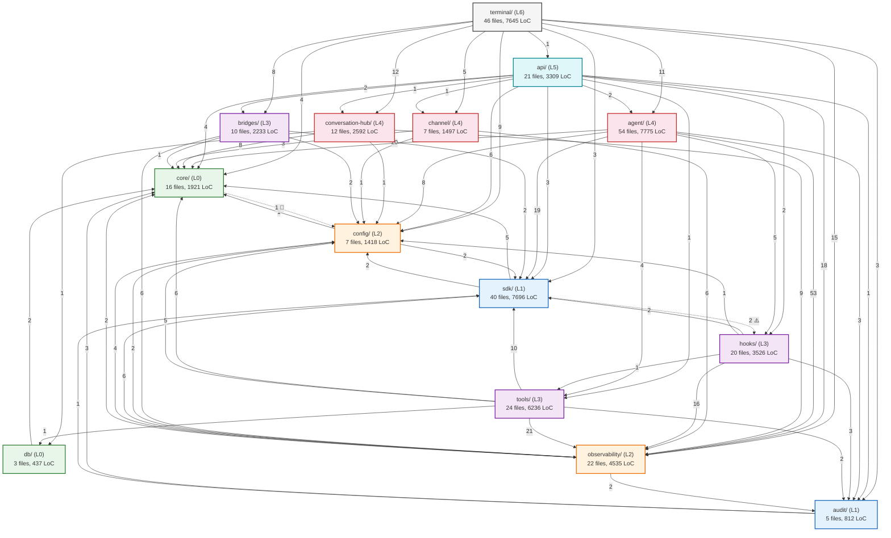
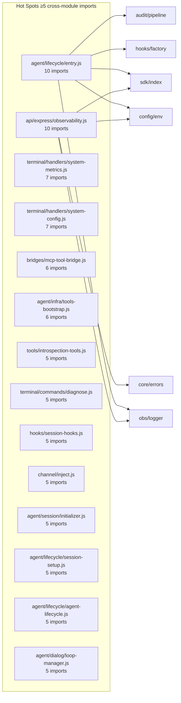
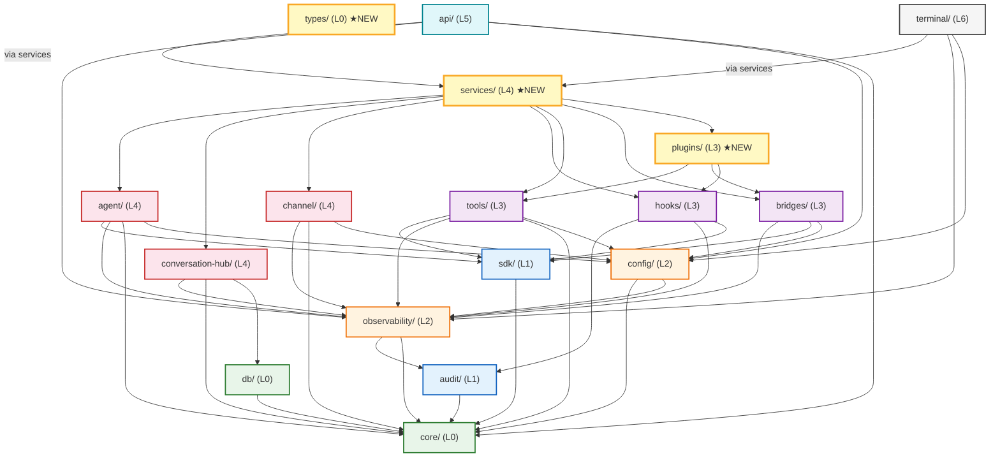
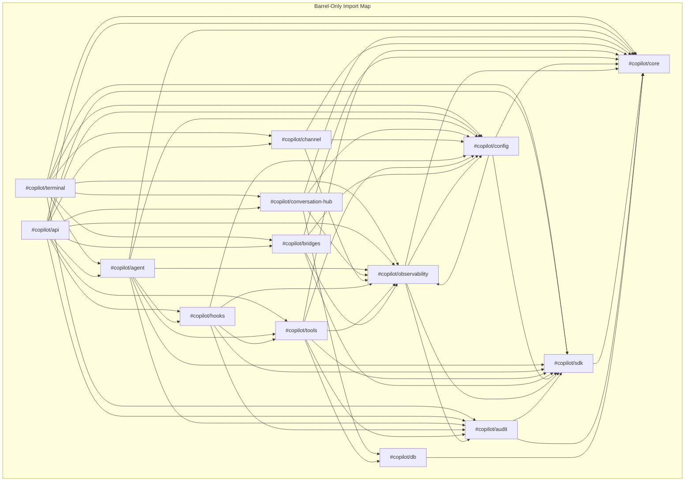

# PARTE-21D — Grafos de Dependências: Atual e Ideal

**Data**: 2026-04-12 | **Status**: BASELINE (grafos pré-Faixa H) | **Versão**: 2.0
**Scope**: Grafos de dependência inter-módulo de `src/copilot` — ponderados por volume de imports
**Referência**: PARTE-21A (baseline), PARTE-21B (ideal), PARTE-21C (roadmap), PARTE-21F (atual)

> **⚠️ ATENÇÃO**: Os grafos neste documento refletem o estado **pré-execução** das Faixas H–N.
> O grafo pós-execução inclui 3 módulos novos (types, services, plugins) e 165 deep imports
> (vs 233 original). Ver PARTE-21F para fan-out atualizado por módulo.

---

## 1. Resumo

Este documento apresenta 4 grafos Mermaid:

1. **Grafo Atual — Módulo-level (ponderado)**: cada aresta indica quantos imports existem
2. **Grafo Atual — File-level (hot-spots)**: os 30 arquivos com mais cross-module imports
3. **Grafo Ideal — Módulo-level (target Wave 3)**: topologia limpa pós-roadmap
4. **Grafo Ideal — Barrel-only**: como ficaria se todos imports usassem barrels

Além dos grafos, inclui análises de:
- Fan-in / Fan-out / Estabilidade (métrica de Martin)
- Coupling clusters (módulos excessivamente acoplados)
- Violation map (arestas ilegais marcadas)

---

## 2. Grafo Atual — Módulo-level (Ponderado)



### 2.1 Arestas Violadoras (marcadas com tracejado)

| Aresta            | Peso | Direção | Tipo de violação             |
| ----------------- | ---- | ------- | ---------------------------- |
| `core` → `config` | 1    | L0→L2   | re-export `export { } from`  |
| `sdk` → `hooks`   | 2    | L1→L3   | re-export factory/permission |

### 2.2 Top 10 Arestas Mais Pesadas

| #   | From     | To      | Weight | Significado                           |
| --- | -------- | ------- | ------ | ------------------------------------- |
| 1   | agent    | obs     | 53     | Agent depende massivamente de logging |
| 2   | tools    | obs     | 21     | Tools logam profusamente              |
| 3   | agent    | core    | 20     | Agent usa muitos utilitários          |
| 4   | agent    | sdk     | 19     | Agent é wrapper principal do SDK      |
| 5   | api      | obs     | 18     | API loga tudo                         |
| 6   | hooks    | obs     | 16     | Hooks logam decisões                  |
| 7   | terminal | obs     | 15     | Terminal em segundo lugar de logging  |
| 8   | terminal | convhub | 12     | Terminal orquestra conversas          |
| 9   | terminal | agent   | 11     | Terminal controla agent lifecycle     |
| 10  | tools    | sdk     | 10     | Tools usam SDK para configs           |

**Insight**: `observability/` é o módulo mais "importado-para" com total de **146 imports recebidos**.
É o hub gravitacional do sistema.

---

## 3. Grafo Atual — File-level (Hot-spots)

### 3.1 Top 30 Arquivos com Mais Imports Cross-Module



### 3.2 Arquivos Hub (High Fan-out, Cross-Module)

| Arquivo                               | Cross-module imports | Módulos distintos |
| ------------------------------------- | -------------------- | ----------------- |
| `agent/lifecycle/entry.js`            | 10                   | 7                 |
| `api/express/observability.js`        | 10                   | 5                 |
| `terminal/handlers/system-metrics.js` | 7                    | 5                 |
| `terminal/handlers/system-config.js`  | 7                    | 5                 |
| `bridges/mcp-tool-bridge.js`          | 6                    | 4                 |
| `agent/infra/tools-bootstrap.js`      | 6                    | 5                 |

**`agent/lifecycle/entry.js`** é o arquivo com maior fan-out — ele é o bootstrap principal que
conecta agent, sdk, hooks, config, audit, observability e tools.

---

## 4. Intra-module Dependencies

Imports dentro do mesmo módulo (indicam complexidade interna):

| Módulo        | Intra-imports | Maior subgrafo interno                             |
| ------------- | ------------- | -------------------------------------------------- |
| hooks         | 22            | lib/ → session-hooks → registry → factory          |
| sdk           | 5             | index → config → types                             |
| channel       | 4             | inject → manager → adapter                         |
| core          | 4             | security/ → errors → constants                     |
| config        | 3             | env → session-config → index                       |
| observability | 3             | presets/ → registry → logger                       |
| agent         | ~8            | lifecycle/ → session/ → dialog/ → infra/           |
| terminal      | ~12           | commands/ → handlers/ → rendering/ → terminal-mode |

> `hooks/` tem o maior número de intra-imports (22), indicando alta coesão interna —
> os arquivos de hooks dependem fortemente uns dos outros.

---

## 5. Análise de Estabilidade (Martin's Instability Metric)

| Módulo              | Ca (Fan-in) | Ce (Fan-out) | I = Ce/(Ca+Ce) | Zona              |
| ------------------- | ----------- | ------------ | -------------- | ----------------- |
| `core/`             | 64          | 1            | 0.02           | Muito estável     |
| `db/`               | 2           | 2            | 0.50           | Neutro            |
| `audit/`            | 14          | 4            | 0.22           | Estável           |
| `sdk/`              | 53          | 14           | 0.21           | Estável           |
| `config/`           | 44          | 5            | 0.10           | Estável           |
| `observability/`    | 146         | 14           | 0.09           | Muito estável     |
| `hooks/`            | 31          | 23           | 0.43           | Neutro            |
| `tools/`            | 8           | 45           | 0.85           | Instável          |
| `bridges/`          | 10          | 11           | 0.52           | Neutro            |
| `channel/`          | 10          | 10           | 0.50           | Neutro            |
| `conversation-hub/` | 13          | 19           | 0.59           | Moderado instável |
| `agent/`            | 14          | 112          | 0.89           | Muito instável    |
| `api/`              | 1           | 41           | 0.98           | Muito instável    |
| `terminal/`         | 0           | 71           | 1.00           | Root (leaf)       |

> Ca = afferent coupling (imports recebidos de outros módulos)
> Ce = efferent coupling (imports feitos para outros módulos)
> I = instabilidade (0 = máxima estabilidade, 1 = máxima instabilidade)

**Observações**:
- `observability/` é o módulo mais estável (I=0.09) — praticamente read-only
- `api/` e `terminal/` são os mais instáveis — esperado para camadas superiores
- `tools/` com I=0.85 é surpreendentemente instável — depende de muitos módulos
- `agent/` com Ce=112 tem o maior fan-out absoluto (volume de imports que faz)

### 5.1 Stable Abstractions Principle (SAP) Check

Para um design saudável (Robert C. Martin), módulos estáveis devem ser abstratos:

| Módulo        | I (instab) | Abstração estimada | Zona  | Posição  |
| ------------- | ---------- | ------------------ | ----- | -------- |
| core          | 0.02       | Alta (contratos)   | OK    | ✅ SAP    |
| observability | 0.09       | Média (impl+API)   | Risco | ⚠️ Rígido |
| config        | 0.10       | Média (env+schema) | Risco | ⚠️ Rígido |
| sdk           | 0.21       | Alta (wrapper)     | OK    | ✅ SAP    |
| tools         | 0.85       | Baixa (impl)       | OK    | ✅ SAP    |
| agent         | 0.89       | Baixa (impl)       | OK    | ✅ SAP    |

> `observability` e `config` estão na "zona de rigidez" — são estáveis mas com implementação
> concreta. Um DI Container (Wave 2) resolve invertendo para interfaces.

---

## 6. Coupling Clusters

### 6.1 Cluster 1: Agent-Observability (Tightest Coupling)

```
agent/ ←(53)→ observability/ ←(16)→ hooks/ ←(5)→ agent/
```

O triângulo `agent ↔ observability ↔ hooks` tem **74 imports** combinados.
Este é o cluster mais acoplado do sistema. Observability é o pivot.

### 6.2 Cluster 2: Terminal-Conversation (Orchestration Coupling)

```
terminal/ ←(12)→ conversation-hub/
terminal/ ←(11)→ agent/
terminal/ ←(8)→ bridges/
terminal/ ←(5)→ channel/
```

Terminal importa de 5 módulos L3-L4 para orquestrar. Isso é esperado para L6,
mas o volume (36 imports) indica lógica de orquestração que deveria estar em `services/`.

### 6.3 Cluster 3: Tools-SDK (Operational Coupling)

```
tools/ ←(10)→ sdk/ ←(2)→ config/
tools/ ←(5)→ config/
```

Tools dependem do SDK para definir schemas e do config para parametrizar. 17 imports.

---

## 7. Grafo Ideal — Módulo-level (Target Wave 3+)



### 7.1 Mudanças Chave no Grafo Ideal

| Aspecto                    | Atual                 | Ideal                               |
| -------------------------- | --------------------- | ----------------------------------- |
| `core → config` (violação) | 1 re-export           | **REMOVIDO**                        |
| `sdk → hooks` (violação)   | 2 re-exports          | **REMOVIDO**                        |
| `api/ fan-out`             | 11 módulos diretos    | **4** (services, obs, config, core) |
| `terminal/ fan-out`        | 10 módulos diretos    | **3** (services, obs, config)       |
| `services/` (novo)         | Inexiste              | **Facade** absorvendo complexidade  |
| `plugins/` (novo)          | Inexiste              | **Registry** para extensibilidade   |
| `types/` (novo)            | Inexiste              | **Shared types** L0                 |
| Arestas com peso > 20      | 5 (agent→obs:53, etc) | **0** (dispersão via DI+bus)        |

### 7.2 Grafo de Violações: Atual vs Ideal

```
ATUAL:
  core ─🔴─→ config   (L0→L2, re-export)
  sdk  ─🟠─→ hooks    (L1→L3, re-export)
  sdk  ─🟠─→ config   (L1→L2, re-export via sdk/config.js)

IDEAL:
  (zero violações — todas arestas são downward ou same-layer)
```

---

## 8. Grafo Ideal — Barrel-Only View

Se todos os 233 deep imports migrassem para barrel imports:



**Neste cenário**, cada módulo tem no máximo ~8 conexões de barrel, o que torna o grafo **plano e
previsível**. O encapsulamento é mantido pois internamente os arquivos de cada módulo importam
livremente entre si, mas cross-module é sempre via barrel.

---

## 9. Tabela Comparativa de Métricas de Grafo

| Métrica                   | Atual       | Ideal (W3)   | Delta |
| ------------------------- | ----------- | ------------ | ----- |
| Total de arestas (module) | ~55         | ~40          | -27%  |
| Arestas violadoras        | 4           | 0            | -100% |
| Aresta mais pesada        | 53 (ag→obs) | ≤15          | -72%  |
| Max fan-out (module)      | 11 (api)    | 4 (api)      | -64%  |
| Max fan-in (module)       | 146 (obs)   | ~80 (obs)    | -45%  |
| Deep imports              | 233         | ≤20          | -91%  |
| Barrel imports            | 88          | ~300         | +241% |
| Coupling clusters         | 3 (tight)   | 0 (loose)    | -100% |
| Módulos com I > 0.8       | 3           | 2 (api,term) | -33%  |
| Unique edges (sem peso)   | ~45         | ~35          | -22%  |

---

## 10. Indicadores de Progresso do Grafo

Para cada Wave do roadmap (PARTE-21C), o grafo deve convergir:

| Wave | Violações | Deep/Barrel ratio | Max fan-out | Coupling clusters |
| ---- | --------- | ----------------- | ----------- | ----------------- |
| 0    | 4→**0**   | 73%/23%→73%/23%   | 11          | 3                 |
| 1    | 0         | **≤20%/≥80%**     | 11          | 2                 |
| 2    | 0         | ≤15%/≥85%         | 11          | 1                 |
| 3    | 0         | ≤5%/≥90%          | **≤4**      | **0**             |

---

## 11. Conclusão

Os grafos revelam que o sistema atual, apesar de limpo em violações de camada (pelo CI), tem
**acoplamento fino excessivo** (233 deep imports), **clusters de coupling** fortemente acoplados,
e **fan-out desbalanceado** (api/ com 11 deps, agent/ com 112 imports feitos).

O grafo ideal, alcançável progressivamente pelas Waves 0-3 do roadmap, elimina violações,
introduz `services/` para absorver fan-out de api/ e terminal/, e migra para barrel-first para
reduzir acoplamento fino a ≤20 deep imports (allow-listed).
