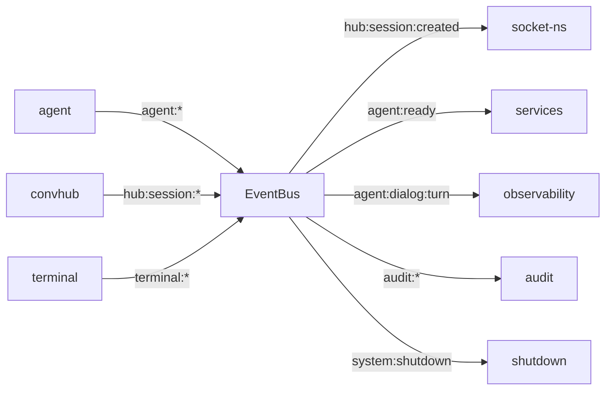

# PARTE-22B — Situação Ideal: Arquitetura Target v3 — Transformação Profunda

**Data**: 2026-04-12 | **Status**: Canônico | **Versão**: 1.0
**Scope**: Arquitetura ideal de `src/copilot` — critérios máximos, sem relativização
**Referência**: PARTE-22A (baseline honesto), PARTE-21B (ideal v2 — parcialmente atingido)

---

## 1. Princípios Arquiteturais da Target v3

A arquitetura target v3 diferencia-se da v2 em **rigor absoluto**, não apenas aspiracional:

| Princípio          | v2 (PARTE-21B)            | v3 (PARTE-22B — exigente)                             |
| ------------------ | ------------------------- | ----------------------------------------------------- |
| Tamanho de arquivo | "Idealmente ≤250 LoC"     | **Máximo 250 LoC — violação = refactor imediato**     |
| EventEmitter       | "Migrar progressivamente" | **ZERO EventEmitter direto — EventBus obrigatório**   |
| DI Container       | "13+ tokens"              | **100% das dependências injetáveis via DI**           |
| Singletons         | "Reduzir"                 | **Zero singletons lazy-init — DI gerencia lifecycle** |
| Testes             | "20+ contract tests"      | **≥70% cobertura funcional por módulo**               |
| TypeScript errors  | "Baseline pré-existente"  | **Zero erros — sem exceções**                         |
| Deep imports       | "≤4 refined"              | **Absolutamente zero — todos via barrel**             |
| fan-out            | "≤10 real"                | **≤6 por módulo — máximo 8 para terminal**            |

---

## 2. Topologia Ideal — Módulos e Layers

### 2.1 Hierarquia v3 (refinada)

```
L8  entry/           — [NOVO] Bootstrap e wiring — ZERO lógica de negócio
L7  applications/    — [NOVO] Entry points: main.js, cli.js, worker.js
L6  terminal/        — REPL slim (≤20 LoC por handler)
L5  api/             — Routing-only (≤150 LoC por rota)
L4  services/        — USE CASES: 1 service = 1 domínio = 1 arquivo
L4  agent/           — Coordenação de sessão (não estado global)
L4  conversation-hub/— Hub slim (≤300 LoC total)
L4  channel/         — Client slim (≤200 LoC)
L3  hooks/           — Contratos de permissão (declarativos)
L3  tools/           — Tool declarations (schema puro + executor)
L3  plugins/         — Plugin registry + loader + sandbox
L3  bridges/         — Adapters externos (circuit-breakered)
L2  config/          — Read-only, imutável em runtime
L2  observability/   — Structured logging + metrics + traces
L1  sdk/             — Wrapper SDK (proxy perfeito)
L1  audit/           — Audit log imutável (event sourcing)
L0  core/            — Utilitários puros (sem deps externas de produçao)
L0  db/              — Persistência abstrata
L0  types/           — Shared types (sem runtime)
L0  events/          — [NOVO] Event schema central (único SSOT de eventos)
```

### 2.2 Módulos Novos Propostos

| Módulo     | Layer | Propósito                                                  | Prioridade |
| ---------- | ----- | ---------------------------------------------------------- | ---------- |
| `entry/`   | L8    | Bootstrap wiring — registry DI, env validation             | Alta       |
| `events/`  | L0    | Schema central de todos os eventos do sistema              | Muito Alta |
| `caching/` | L0    | Cache manager com TTL, LRU, invalidation                   | Média      |
| `locking/` | L0    | Mutex pool com timeout, cleanup automático                 | Média      |
| `timers/`  | L0    | Timer registry com cancelamento em shutdown                | Média      |
| `rpc/`     | L1    | RPC abstraction sobre SDK (substitui rpc-ops, rpc-session) | Alta       |
| `workers/` | L7    | Worker pool horizontal (multi-agent prep)                  | Baixa      |
| `health/`  | L2    | Runtime health checks + readiness probes                   | Alta       |

---

## 3. Situação Ideal por Módulo

### 3.1 `agent/` — Orquestrador Slim

**Atual:** 54 arquivos, 7.779 LoC — `always-alive.js` = 623 LoC god file
**Ideal:**

```
agent/
  index.js                    — barrel (exports públicos apenas)
  agent-context.js            — ≤80 LoC (apenas contexto compartilhado)
  always-alive.js             — ≤150 LoC (delegação pura — ZERO lógica)
  queue-processor.js          — ≤100 LoC
  types.js                    — ≤200 LoC (typedefs apenas)
  config.js                   — ≤50 LoC (constantes)
  dialog/
    loop-manager.js           — ≤150 LoC (coordenação apenas)
    turn-executor.js          — ≤150 LoC
    protocol.js               — ≤100 LoC
    watchdog.js               — ≤100 LoC
    backpressure.js           — ≤100 LoC
    model-fallback.js         — ≤100 LoC
  lifecycle/
    agent-lifecycle.js        — ≤150 LoC
    state-io.js               — ≤100 LoC (sem singletons module-scope)
    reconnect-policy.js       — ≤100 LoC
    entry.js                  — ≤80 LoC
  session/
    initializer.js            — ≤120 LoC
    snapshot.js               — ≤100 LoC
    hook-context.js           — ≤150 LoC
    cleanup.js                — ≤100 LoC
  state/
    agent-state.js            — ≤150 LoC
  infra/
    tools-bootstrap.js        — ≤200 LoC (apenas wiring)
    message-queue.js          — ≤150 LoC
    handoff-manager.js        — ≤120 LoC
    task-executor.js          — ≤150 LoC
```

**Mudanças obrigatórias:**
- `always-alive.js`: remover ALL state, delegate 100% via AlwaysAliveAgent(ctx, di)
- `loop-manager.js`: remover turn execution, delegar para turn-executor.js
- `state-io.js`: sem module-scope let, usar DI-injected cache

### 3.2 `conversation-hub/` — Hub Imutável e Slim

**Atual:** store.js = 561 LoC, socket-ns.js = 482 LoC, orchestrator.js = 438 LoC
**Ideal:**

```
conversation-hub/
  index.js
  hub.js                      — ≤200 LoC (pura coordenação)
  orchestrator.js             — ≤200 LoC (sem EventEmitter — usa EventBus)
  store.js                    — ≤200 LoC (CRUD apenas)
  store-queries.js            — ≤150 LoC (queries)
  store-subscriptions.js      — ≤100 LoC (watchers)
  socket-ns.js                — ≤200 LoC (coordenação apenas)
  socket-ns-auth.js           — ≤100 LoC (auth middleware)
  socket-ns-handlers.js       — ≤150 LoC (session event handlers)
  socket-ns-broadcasts.js     — ≤100 LoC (public broadcast API)
  events.js                   — ≤80 LoC (constantes de evento apenas)
```

### 3.3 `sdk/` — Wrapper Perfeito

**Atual:** 42 arquivos, 569 LoC types.js, sdk/client.js = 416 LoC (state)
**Ideal:**

```
sdk/
  index.js                    — barrel re-exports apenas
  types.js                    — ≤400 LoC (typedefs — pode ser maior)
  client.js                   — ≤150 LoC (no state — DI-injected)
  client-events.js            — ≤200 LoC
  tools.js                    — ≤150 LoC (sem singleton)
  custom-tools.js             — ≤150 LoC
  tools-state.js              — ≤80 LoC (via DI, sem module-scope)
  rpc/                        — [NOVO subdir]
    index.js                  — barrel
    rpc-session.js            — ≤150 LoC + zero TS errors
    rpc-ops.js                — ≤150 LoC + zero TS errors
```

### 3.4 `terminal/` — REPL Slim

**Atual:** 47 arquivos, repl.js = 437 LoC, server.js = 452 LoC
**Ideal:**

```
terminal/
  index.js                    — ≤150 LoC (wiring apenas)
  repl.js                     — ≤200 LoC (loop + dispatch only)
  repl-inline-cmds.js         — ≤150 LoC (inline cmd handlers)
  state.js                    — ≤200 LoC (sem EventEmitter — via EventBus)
  server.js                   — ≤200 LoC (rota apenas + SSE delegate)
  server-routes.js            — ≤200 LoC (HTTP route handlers)
  server-sse.js               — ≤150 LoC (SSE lógica)
  server-ws.js                — ≤100 LoC (WS se necessário)
  dialog/
    engine.js                 — ≤200 LoC (sem singletons)
    engine-persistence.js     — ≤100 LoC
    ...
  handlers/
    system-metrics.js         — ≤150 LoC (split em agent.js + display.js)
    system-config.js          — ≤150 LoC
    ...
```

### 3.5 `observability/` — Structured + Slim

**Atual:** metrics.js = 426 LoC, event-collector.js = 405 LoC
**Ideal:**

```
observability/
  index.js
  logger.js                   — ≤150 LoC (sem singletons)
  metrics.js                  — ≤200 LoC (usa metricsStore via DI)
  metrics-histogram.js        — ≤200 LoC
  event-collector.js          — ≤200 LoC (sem module-scope singleton)
  otel.js                     — ≤200 LoC (OpenTelemetry completo, não esqueleto)
  health.js                   — ≤150 LoC (runtime health checks)
  observers/
    dialog-task-handlers.js   — ≤200 LoC (split em 2 arquivos)
    session-agent-handlers.js — ≤200 LoC (split em 2 arquivos)
```

### 3.6 `services/` — Domínio Completo (Situação Atual vs Ideal)

**Atual:** 5 arquivos, 509 LoC — apenas 4 services superficiais
**Ideal:**

```
services/
  index.js
  session-service.js          — ≤200 LoC (full CRUD + lifecycle)
  conversation-service.js     — ≤200 LoC (messaging + hub)
  audit-service.js            — ≤200 LoC (audit + flush + query)
  tool-service.js             — ≤150 LoC (tools builder + invoke)
  agent-service.js            — [NOVO] ≤200 LoC (agent start/stop/status)
  dialog-service.js           — [NOVO] ≤200 LoC (send + steer + answer)
  metrics-service.js          — [NOVO] ≤150 LoC (metrics aggregation facade)
  config-service.js           — [NOVO] ≤150 LoC (runtime config mutations)
  health-service.js           — [NOVO] ≤150 LoC (health probe + status)
```

**services/ deve ser O ponto único de entrada para todos os casos de uso:**
- api/ importa APENAS de services/
- terminal/ importa agent, conversation de services/
- Nenhum módulo L5/L6 importa de L4 (agent/, channel/, conv-hub/) diretamente

### 3.7 `events/` — Schema Central (NOVO — L0)

```
events/
  index.js
  agent-events.js             — Agent lifecycle events (schema + types)
  hub-events.js               — Hub/session events
  dialog-events.js            — Dialog turn events
  audit-events.js             — Audit events
  terminal-events.js          — Terminal state events
  system-events.js            — System-level events
  all-events.js               — Aggregate + discriminated union
```

**Regra:** Toda string de evento DEVE estar neste módulo. Não existem strings literais de eventos em código de produção.

### 3.8 `core/` — Utilitários Puros (Incremento)

**Atual:** 20 arquivos, 2.659 LoC — já bem organizado
**Adicionar obrigatoriamente:**

```
core/
  ...existing...
  di-container.js             — já existe (manter)
  di-tokens.js                — expandir de 13 → 40+ tokens
  di.js                       — já existe
  event-bus.js                — já existe (manter)
  cache.js                    — [NOVO] LRU/TTL cache manager
  mutex.js                    — [NOVO] Mutex pool com timeout
  timer-registry.js           — [NOVO] Timer lifecycle manager
  shutdown.js                 — já existe (manter)
```

---

## 4. Padrões Arquiteturais Target

### 4.1 EventBus como Único Canal de Comunicação Inter-Módulo

**Regra:** Toda comunicação entre módulos diferentes deve fluir via EventBus.
Exceções: chamadas de função síncronas que retornam dados (query-style).

```js
// ❌ Proibido: EventEmitter direto cross-module
orchestrator.on('SESSION_CREATED', handler);
agent.on('ready', handler);

// ✅ Correto: EventBus com namespace
import { getEventBus } from '#copilot/core';
getEventBus().on('hub:session:created', handler);
getEventBus().on('agent:ready', handler);
```

**Namespaces de evento canônicos (via events/ module):**
```
agent:*         — agent lifecycle
agent:dialog:*  — dialog loop events
hub:session:*   — hub session CRUD
hub:turn:*      — turn events
terminal:*      — terminal state
system:*        — global system events
audit:*         — audit events
rpc:*           — RPC callbacks
```

### 4.2 DI Container como Única Forma de Inicializar Dependências

**Regra:** Nenhum módulo instancia diretamente suas dependências.
Todo `let X = null; function init(val){ X = val }` deve virar DI token.

```js
// ❌ Proibido:
let _agent = null;
export function setAgent(agent) { _agent = agent; }

// ✅ Correto:
import { BRIDGE_AGENT } from '#copilot/core';
// entrada DI via container:
const agent = container.resolve(BRIDGE_AGENT);
```

**40+ tokens DI necessários (adicionais aos 13 existentes):**
```
CONVERSATION_STORE     — ConversationStore
METRICS_STORE          — MetricsStore
AUDIT_PIPELINE         — AuditPipeline
DIALOG_ENGINE          — DialogEngine
ALWAYS_ALIVE_AGENT     — AlwaysAliveAgent
INJECT_SERVER          — InjectServer (terminal HTTP server)
SOCKET_NAMESPACE       — CopilotSocketNamespace
RATE_LIMITER           — InjectRateLimiter
CACHE_MANAGER          — CacheManager
MUTEX_POOL             — MutexPool
TIMER_REGISTRY         — TimerRegistry
SESSION_SERVICE        — SessionService
CONVERSATION_SERVICE   — ConversationService
AGENT_SERVICE          — AgentService
DIALOG_SERVICE         — DialogService
METRICS_SERVICE        — MetricsService
AUDIT_SERVICE          — AuditService
TOOL_SERVICE           — ToolService
HEALTH_SERVICE         — HealthService
CONFIG_SERVICE         — ConfigService
PLUGIN_REGISTRY        — PluginRegistry
ERROR_TRACKER          — ErrorTracker
EVENT_COLLECTOR        — EventCollector
ALERTS_MANAGER         — ErrorAlertingManager
OTEL_TRACER            — OpenTelemetry Tracer
... (mais 15+)
```

### 4.3 Services como Única Porta de Entrada de L5/L6

```
L6 terminal/
  └── import APENAS: services/, core/, config/, observability/ (via DI)
L5 api/
  └── import APENAS: services/, core/, config/, observability/ (via DI)
L4 services/ (orquestra)
  └── import: agent/, conversation-hub/, channel/, audit/, sdk/, hooks/, tools/, bridges/
L3 hooks/, tools/, bridges/, plugins/
  └── import: sdk/, config/, observability/, core/, db/, events/
```

### 4.4 Audit Pipeline com Event Sourcing

```
audit/
  pipeline.js        — Event sourcing: append-only log
  pipeline-replay.js — Replay + projection
  pipeline-query.js  — Query por range, tipo, session
  pipeline-archive.js— Compaction + archival
  index.js
```

**Invariante:** Nenhum evento de audit pode ser modificado depois de registrado.
Implementação: WAL (write-ahead log) em SQLite ou arquivo append-only.

### 4.5 Circuit Breakers em Todas as Dependências Externas

| Serviço/Dependência | Status Atual | Status Target                 |
| ------------------- | ------------ | ----------------------------- |
| MCP server calls    | ✅ CB existe  | Manter + expor via health/    |
| SDK API calls       | ❌ Nenhum     | Circuit breaker com fallback  |
| NERV bridge         | ❌ Nenhum     | CB com reconnect policy       |
| HTTP webhooks       | ❌ Nenhum     | CB + timeout + retry          |
| SQLite writes       | ❌ Nenhum     | CB para disk errors           |
| SSE clients         | ❌ Nenhum     | CB por cliente + backpressure |
| GitHub CLI calls    | ❌ Nenhum     | CB com rate limiting          |

### 4.6 Zero God Files

**Critério:** Nenhum arquivo de lógica com >250 LoC.
**Exceções permitidas:** `types.js` (typedefs), `constants.js`, arquivos `index.js` de barrels com re-exports extensos.

**Método de avaliação por arquivo:**
1. LoC ≤250? Se não, split obrigatório
2. Mais de 2 concerns detectáveis? Split obrigatório
3. Funções/classes ≥6? Extrair arquivo(s)
4. Testa em isolamento total sem mocks? Se não, DI-ready refactor

---

## 5. Métricas Target (Health Score PARTE-22)

| Métrica                         | Atual  | Wave O | Wave P | Wave Q | Wave R (Target)  |
| ------------------------------- | ------ | ------ | ------ | ------ | ---------------- |
| **Score PARTE-22**              | 24/100 | 35/100 | 55/100 | 75/100 | **98/100**       |
| God files (>300 LoC lógica)     | 17     | 10     | 5      | 2      | **0**            |
| EventEmitter direto (files)     | 8      | 4      | 2      | 0      | **0**            |
| EventBus adoption               | 13     | 30     | 60     | 100+   | **≥80 arquivos** |
| DI tokens                       | 13     | 25     | 40     | 55     | **≥55**          |
| Singletons lazy-init            | 53     | 40     | 25     | 15     | **≤15**          |
| Unit test coverage (módulo)     | ~30%   | ~35%   | ~50%   | ~65%   | **≥70%**         |
| TypeCheck errors                | 16     | 8      | 0      | 0      | **0**            |
| Deep imports (absolutamente)    | 4      | 0      | 0      | 0      | **0**            |
| Fan-out max                     | 10     | 8      | 7      | 6      | **≤8 qualquer**  |
| services/ coverage              | 20%    | 40%    | 70%    | 90%    | **100%**         |
| Circuit breakers                | 1      | 4      | 7      | 10     | **≥10**          |
| events/ module (schema central) | 0%     | 50%    | 90%    | 100%   | **100%**         |

---

## 6. Diagrama — Fluxo de Dados Ideal

### 6.1 Terminal → Agent (Fluxo de Injeção)

```
ANTES (atual):
  terminal/index.js → terminal/handlers/ → terminal/dialog/engine.js
    → agent/always-alive.js (direto, com state)

DEPOIS (ideal):
  terminal/repl.js → services/dialog-service.js
    → (via DI) agent/dialog/loop-manager.js
    ─ event: 'terminal:inject' via EventBus ─→ agent handler
```

### 6.2 API → Session (Fluxo HTTP)

```
ANTES:
  api/express/session-crud.js → services/session-service.js
    → conversation-hub/store.js (direto)

DEPOIS:
  api/express/session-crud.js → services/session-service.js
    → (via DI: CONVERSATION_STORE) store
    ─, event: 'hub:session:crud' via EventBus ─→ observers
```

### 6.3 EventBus — Topologia de Eventos



---

## 7. Roteiro de Transformação (Ver PARTE-22C)

A transformação da situação atual para a ideal é estruturada em **4 Ondas** com **22 Faixas**:

| Onda | Faixas  | Foco                                          | Score Target |
| ---- | ------- | --------------------------------------------- | ------------ |
| O    | O-1~O-7 | Deep cleanup + god files priority + DI expand | 35/100       |
| P    | P-1~P-7 | EventBus migration + services completion      | 55/100       |
| Q    | Q-1~Q-5 | Test coverage + typecheck zero + infra core   | 75/100       |
| R    | R-1~R-3 | Events schema + multi-agent prep + polish     | 98/100       |

**Detalhamento completo em PARTE-22C-ROADMAP.md**
