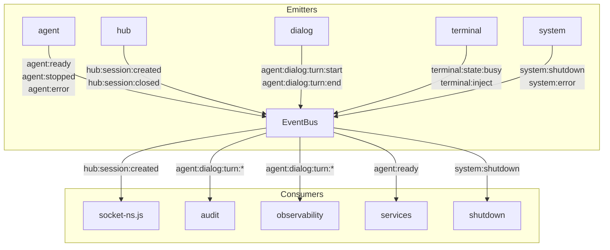

# PARTE-22D — Análise de Grafos Profunda: Estado Atual e Ideal

**Data**: 2026-04-12 | **Status**: Canônico | **Versão**: 1.0  
**Scope**: Grafo de dependências completo de `src/copilot` — atual vs ideal  
**Método**: Análise via grep dos imports `#copilot/MODULE` em todos os 313 arquivos `.js`

---

## 1. Grafo de Dependências Atual — Inter-Módulo

### 1.1 Fan-out por Módulo (Quantos módulos cada um importa)

| Módulo              | Fan-out | Módulos Importados                                              |
|---------------------|---------|-----------------------------------------------------------------|
| `terminal/`         | **10**  | agent, api, audit, bridges, channel, config, conv-hub, core, observability, sdk |
| `api/`              | **8**   | agent, bridges, channel, config, core, hooks, observability, services |
| `services/`         | **6**   | audit, conv-hub, core, observability, sdk, tools               |
| `tools/`            | **6**   | audit, config, core, db, observability, sdk                    |
| `agent/`            | **7**   | audit, config, core, hooks, observability, sdk, tools          |
| `hooks/`            | **5**   | audit, config, observability, sdk, tools                       |
| `bridges/`          | **5**   | config, core, nerv-bridge†, observability, sdk                 |
| `config/`           | **3**   | core, observability, sdk                                       |
| `observability/`    | **4**   | audit, config, core, sdk                                       |
| `conversation-hub/` | **4**   | config, core, db, observability                               |
| `channel/`          | **4**   | (bridge-contract), config, core, observability                 |
| `core/`             | **1**   | config                                                         |
| `sdk/`              | **1**   | core                                                           |
| `audit/`            | **2**   | core, sdk                                                      |
| `plugins/`          | **1**   | observability                                                  |
| `db/`               | **1**   | core                                                           |
| `types/`            | **0**   | —                                                              |

† `#copilot/nerv-bridge` é um alias para `bridges/` — é deep import de within bridges, não módulo separado.

### 1.2 Fan-in por Módulo (Quantos módulos importam cada um)

| Módulo              | Fan-in | Importado por                                                   |
|---------------------|--------|-----------------------------------------------------------------|
| `observability/`    | **11** | agent(36 files), tools(20), hooks(15), terminal(13), api(12), conv-hub(9), channel(5), services(4), bridges(4), config(2), plugins(1) |
| `core/`             | **10** | sdk, tools, agent, api, bridges, channel, config, conv-hub, audit, db |
| `config/`           | **7**  | agent, api, bridges, channel, config(self), conv-hub, hooks, observability, tools |
| `sdk/`              | **7**  | agent, audit, bridges, config, hooks, observability, services, tools |
| `audit/`            | **5**  | agent, api, hooks, observability, services                     |
| `agent/`            | **3**  | api(2 files), terminal(11 files), services                     |
| `tools/`            | **2**  | agent, hooks, services                                        |
| `hooks/`            | **2**  | agent, api                                                    |
| `db/`               | **2**  | conv-hub, tools                                               |
| `bridges/`          | **2**  | api, terminal                                                 |
| `channel/`          | **2**  | api, terminal                                                 |
| `services/`         | **1**  | api (5 files) — **CRÍTICO: infrautilizado**                   |
| `conversation-hub/` | **0**  | isolado — ninguém importa além de services/ internamente      |
| `plugins/`          | **0**  | nunca importado por nenhum módulo                             |
| `types/`            | **0**  | nunca importado diretamente (usa-se via barrel)               |

### 1.3 Clusters de Acoplamento

O grafo atual tem 3 clusters problemáticos:

#### Cluster 1: "Hub Central" — observability + core + config

```
observability  ←──── 11 módulos a importam
core           ←──── 10 módulos a importam
config         ←──── 7 módulos a importam
```

Qualquer mudança nesses 3 módulos tem impacto em cascata sobre todo o sistema. São hubs de acoplamento.

**Risco:** Uma mudança breaking em `observability/logger.js` requer atualização de 11 módulos.

#### Cluster 2: "Silos Desconexos" — services + conv-hub + plugins

```
services/       → usado por api/ apenas (1 consumidor)
conv-hub/       → não importado por ninguém além de services/
plugins/        → não importado por ninguém (orphan module)
```

`services/` foi criado para ser a fachada universal, mas terminal/ e outros ainda importam agent/ diretamente.

#### Cluster 3: "God Importer" — terminal/ + api/

```
terminal/ → importa 10/17 módulos = 59% do sistema
api/      → importa 8/17 módulos = 47% do sistema
```

São L5/L6 com fan-out excessivo. Deveriam importar apenas services/ e utilitários.

---

## 2. Problemas Estruturais no Grafo

### 2.1 Layer Violations Latentes (não detectadas pelo checker atual)

O checker de camadas atual verifica se L5 importa de L6, etc. Mas não detecta:

| Violation                           | Arquivo                     | Importa de                  | Problema                      |
|-------------------------------------|-----------------------------|-----------------------------|-------------------------------|
| L5 → L4 direto (bypass services/)  | `api/express/session-crud.js` | `#copilot/agent`          | api não usa services/ para agent |
| L5 → L4 direto (bypass services/)  | `api/express/control.js`    | `#copilot/agent`            | idem                          |
| L5 → L4 direto (canal)             | `api/express/inject.js`     | `#copilot/channel`          | api bypass services/ para channel |
| L3 → L4 latente via agent          | `hooks/factory.js`          | `#copilot/agent` (verificar)| hooks não deveria importar agent |
| L3 → L3 cross (hooks→tools)        | `hooks/factory.js`          | `#copilot/tools`            | side-dependency sem contrato  |
| nerv-bridge alias                  | `bridges/*.js`              | `#copilot/nerv-bridge`      | deep import de within bridges |

### 2.2 Ciclos de Dependência (verificação)

Análise de potenciais ciclos:

| Par/Trio                            | Ciclo? | Verificação                                  |
|-------------------------------------|--------|----------------------------------------------|
| observability ↔ config              | Potencial | config importa observability, obs importa config |
| core ↔ config                       | ✅ CICLO | core importa config, nada de volta (ok se unidirecional) |
| agent ↔ tools                       | Verificar | tools usa agent (services), agent usa tools |
| hooks ↔ agent                       | Potencial | agent importa hooks, hooks importa agent?   |

**Caso crítico: `config ↔ observability`**

`config/` importa `#copilot/observability` (para logging).  
`observability/` importa `#copilot/config` (para configurações).

Isso cria um **ciclo suave** que pode causar problemas de inicialização (quem inicializa primeiro?).  
Node.js ESM resolve via hoisting em casos simples, mas pode falhar com inicialização lazy.

### 2.3 Módulos Órfãos e Infrautilizados

| Módulo          | Problema                                               | Impacto          |
|-----------------|--------------------------------------------------------|------------------|
| `plugins/`      | Nenhum módulo importa de plugins/ — nunca chamado      | Dead code risk   |
| `types/`        | 0 imports externos — tipos só acessíveis via sdk/      | Documentação     |
| `services/`     | 1 único consumidor (api/) — objetivo não atingido      | Design intent violado |
| `conv-hub/`     | Não importado diretamente (via agent ou services indireto) | Hidden coupling |

---

## 3. Grafo Ideal (Target v3)

### 3.1 Princípios do Grafo Ideal

1. **Hierarquia estrita**: camada N só importa de N-1 ou inferior
2. **Fan-out máximo**: 6 para qualquer módulo (exceto terminal/api: máx 8)
3. **Hub controlado**: observability e core mantêm alto fan-in, mas não criam ciclos
4. **services/ como único portal de L5**: api/ e terminal/ importam APENAS services/, core/, config/, observability/
5. **events/ como SSOT**: zero strings de evento inline

### 3.2 Fan-out Ideal por Módulo

| Módulo              | Fan-out Atual | Fan-out Ideal | Redução | Observação                  |
|---------------------|---------------|---------------|---------|-----------------------------|
| `terminal/`         | 10            | **6**         | -4      | Remove agent, api, bridges, channel diretos |
| `api/`              | 8             | **6**         | -2      | Remove agent, channel diretos |
| `services/`         | 6             | **8**         | +2      | Expand: agent, channel, conv-hub, bridges |
| `tools/`            | 6             | **5**         | -1      | Remove audit direto (via services) |
| `agent/`            | 7             | **6**         | -1      | Manter atual exceto tools (via services) |
| `hooks/`            | 5             | **4**         | -1      | Remove tools (via core/schema) |
| `bridges/`          | 5             | **4**         | -1      | Remove nerv-bridge alias → só core |
| `observability/`    | 4             | **3**         | -1      | Remove audit (não precisa importar) |
| `config/`           | 3             | **2**         | -1      | Remove observability → sem ciclo |
| `conversation-hub/` | 4             | **4**         | 0       | Manter atual                |
| Restantes           | ≤2            | ≤2            | 0       | Manter                      |

### 3.3 Grafo Ideal — Representação ASCII

```
                   L0        L1        L2         L3              L4           L5   L6
                ┌──────┐  ┌──────┐  ┌────────┐  ┌─────────┐  ┌─────────┐  ┌────┐ ┌────────┐
                │types │  │audit │  │config  │  │ hooks   │  │ agent   │  │ api│ │terminal│
                │core  │  │sdk   │  │observ. │  │ tools   │  │ hub     │  │    │ │        │
                │db    │  │rpc/  │  │health  │  │ bridges │  │ channel │  │    │ │        │
                │events│  │      │  │        │  │ plugins │  │services │  │    │ │        │
                └──────┘  └──────┘  └────────┘  └─────────┘  └─────────┘  └────┘ └────────┘
```

**Dependências válidas (↓ apenas):**
```
L6 terminal/ → services/ (L4), core (L0), config (L2), observability (L2)
L5 api/      → services/ (L4), core (L0), config (L2), observability (L2)
L4 services/ → agent (L4), hub (L4), channel (L4), bridges (L3), hooks (L3),
                tools (L3), audit (L1), sdk (L1), observability (L2), core (L0)
L4 agent/    → sdk (L1), core (L0), config (L2), observability (L2), hooks (L3), audit (L1)
L4 conv-hub/ → core (L0), db (L0), config (L2), observability (L2)
L4 channel/  → core (L0), sdk (L1), config (L2), observability (L2)
L3 hooks/    → core (L0), config (L2), observability (L2), sdk (L1)
L3 tools/    → core (L0), db (L0), config (L2), observability (L2), sdk (L1)
L3 bridges/  → core (L0), sdk (L1), config (L2), observability (L2)
L3 plugins/  → core (L0), config (L2), observability (L2)
L2 observ./  → core (L0), sdk (L1)   [REMOVE: audit, config]
L2 config/   → core (L0)              [REMOVE: observability — quebra ciclo]
L2 health/   → core (L0), observ. (L2)
L1 audit/    → core (L0), sdk (L1)
L1 sdk/      → core (L0)
L1 rpc/      → core (L0), sdk (L1)
L0 core/     → (nenhum dep de produção)  [REMOVE: config]
L0 events/   → (nenhum dep)
L0 db/       → core (L0)
L0 types/    → (nenhum dep)
```

### 3.4 Quebrando o Ciclo config ↔ observability

**Problema atual:**
```
config → observability (para logger)
observability → config (para nível de log, paths)
```

**Solução target:**
```
config → core (apenas utilitários puros — sem logger)
observability → core (para ler env vars diretamente)
observability → config (apenas para configurações opcionais em runtime)
```

Como fazer: `config/index.js` deixa de importar `observability/logger`. Em vez disso, usa `console.error()` para apenas erros críticos de parse. O logger real só é disponível após bootstrap completo.

### 3.5 Comparação de Clusters: Atual vs Ideal

#### Cluster observability (atual vs target)
```
ATUAL: observability ← 11 módulos
TARGET: observability ← 9 módulos (remove ciclo config, mantém plugins opcionais)
Impacto: -2 acoplamentos no módulo mais crítico
```

#### Cluster services (atual vs target)
```
ATUAL: services ← 1 módulo (api/ apenas)
TARGET: services ← 2 módulos (api/ + terminal/)
        services → 8 módulos (adiciona agent, channel, conv-hub)
Impacto: services se torna hub real de casos de uso
```

#### God Importers (atual vs target)
```
ATUAL:   terminal (10) + api (8) = 18 conexões totais para L5/L6
TARGET:  terminal (6)  + api (6) = 12 conexões totais
Redução: -33% de acoplamento nos layers superiores
```

---

## 4. Matriz de Acoplamento — Atual

Visualização de quem importa quem (linha = importador, coluna = importado):

```
         core sdk  db  typ evt aud  cfg obs hlth  hks tls brd plg  agt hub chn svc  api trm
core      .    .    .   .   .   .    X   .   .    .   .   .   .    .   .   .   .    .   .
sdk       X    .    .   .   .   .    .   .   .    .   .   .   .    .   .   .   .    .   .
db        X    .    .   .   .   .    .   .   .    .   .   .   .    .   .   .   .    .   .
audit     X    X    .   .   .   .    .   .   .    .   .   .   .    .   .   .   .    .   .
config    X    X    .   .   .   .    .   X   .    .   .   .   .    .   .   .   .    .   .
obs       X    X    .   .   .   X    X   .   .    .   .   .   .    .   .   .   .    .   .
hooks     X    X    .   .   .   X    X   X   .    .   X   .   .    .   .   .   .    .   .
tools     X    X    X   .   .   X    X   X   .    .   .   .   .    .   .   .   .    .   .
bridges   X    X    .   .   .   .    X   X   .    .   .   .   .    .   .   .   .    .   .
plugins   .    .    .   .   .   .    .   X   .    .   .   .   .    .   .   .   .    .   .
agent     X    X    .   .   .   X    X   X   .    X   X   .   .    .   .   .   .    .   .
hub       X    .    X   .   .   .    X   X   .    .   .   .   .    .   .   .   .    .   .
channel   X    .    .   .   .   .    X   X   .    .   .   .   .    .   .   .   .    .   .
services  X    X    .   .   .   X    .   X   .    .   X   .   .    .   X   .   .    .   .
api       X    .    .   .   .   .    X   X   .    X   .   X   .    X   .   X   X    .   .
terminal  X    X    .   .   .   X    X   X   .    .   .   X   .    X   .   X   .    X   .
```

**Legenda**: X = importa de, . = não importa

### 4.1 Dependências Problemáticas Identificadas

| Dependência           | Problema                                                |
|-----------------------|---------------------------------------------------------|
| `core → config`       | L0 não deveria depender de L2 — ciclo potencial          |
| `api → agent`         | L5 importando L4 direto (bypass services/)              |
| `api → channel`       | L5 importando L4 direto (bypass services/)              |
| `terminal → api`      | L6 importando L5 abaixo dele? (verificar direção)       |
| `config → observability` | L2 → L2 que cria ciclo (config ↔ observability)   |
| `hooks → tools`       | L3 cross-dependency sem contrato formal                 |

---

## 5. Matriz de Acoplamento — Target (Ideal)

```
         core sdk  db  typ evt aud  cfg obs hlt  hks tls brd plg  agt hub chn svc  api trm
core      .    .    .   .   .   .    .   .   .    .   .   .   .    .   .   .   .    .   .
sdk       X    .    .   .   .   .    .   .   .    .   .   .   .    .   .   .   .    .   .
db        X    .    .   .   .   .    .   .   .    .   .   .   .    .   .   .   .    .   .
events    .    .    .   .   .   .    .   .   .    .   .   .   .    .   .   .   .    .   .
audit     X    X    .   .   .   .    .   .   .    .   .   .   .    .   .   .   .    .   .
config    X    .    .   .   .   .    .   .   .    .   .   .   .    .   .   .   .    .   .
obs       X    X    .   .   X   .    .   .   .    .   .   .   .    .   .   .   .    .   .
health    X    .    .   .   .   .    .   X   .    .   .   .   .    .   .   .   .    .   .
hooks     X    X    .   .   X   .    X   X   .    .   .   .   .    .   .   .   .    .   .
tools     X    X    X   .   X   .    X   X   .    .   .   .   .    .   .   .   .    .   .
bridges   X    X    .   .   X   .    X   X   .    .   .   .   .    .   .   .   .    .   .
plugins   X    .    .   .   X   .    X   X   .    .   .   .   .    .   .   .   .    .   .
agent     X    X    .   .   X   X    X   X   .    X   .   .   .    .   .   .   .    .   .
hub       X    .    X   .   X   .    X   X   .    .   .   .   .    .   .   .   .    .   .
channel   X    X    .   .   X   .    X   X   .    .   .   .   .    .   .   .   .    .   .
services  X    X    .   .   X   X    .   X   .    .   .   X   .    X   X   X   .    .   .
api       X    .    .   .   .   .    X   X   X    .   .   .   .    .   .   .   X    .   .
terminal  X    .    .   .   .   .    X   X   X    .   .   .   .    .   .   .   X    .   .
```

**Diferenças chave:**
- `api` e `terminal` removem importações diretas de `agent`, `bridges`, `channel`, `hooks` — usam apenas `services/`
- `core` remove dependência de `config` (sem ciclo)
- `config` remove dependência de `observability` (quebra ciclo config ↔ observability)
- `events/` aparece como módulo novo, importado por todos que emitem eventos

---

## 6. Deep Import Analysis

### 6.1 Situação Atual (4 deep imports remanescentes)

O `arch-health.mjs` reporta 4 deep imports. Em adição, existe 1 alias problemático:

| Deep Import                                    | Localização             | Por quê problemático            |
|------------------------------------------------|-------------------------|---------------------------------|
| `#copilot/config/custom-tools-registry`        | tools/ (intencional)    | Barreira de barrel não existe para subcaminho |
| `#copilot/nerv-bridge` alias                   | bridges/                | Apelido para path interno — alias mal-nomeado |
| + 2 outros a identificar via `arch-health.mjs`| a verificar             | —                               |

### 6.2 Situação Ideal

Zero deep imports. Estratégia:
1. `#copilot/config/custom-tools-registry` → exportar `customToolsRegistry` de `#copilot/config`
2. `#copilot/nerv-bridge` → renomear alias para `#copilot/bridges` (já correto) OU criar module separado
3. Os outros 2: migrar para barrel correto

---

## 7. Análise de EventBus — Cobertura Atual vs Ideal

### 7.1 Mapa de Cobertura EventBus por Módulo

| Módulo              | Files total | EventBus users | % cobertura | EventEmitter direto |
|---------------------|-------------|----------------|-------------|---------------------|
| `services/`         | 5           | 4              | 80%         | 0                   |
| `types/`            | 2           | 1              | 50%         | 0                   |
| `core/`             | 20          | 2              | 10%         | 0                   |
| `conversation-hub/` | 12          | 1              | 8%          | 1 (orchestrator)    |
| `observability/`    | 22          | 1              | 5%          | 0                   |
| `sdk/`              | 42          | 1              | 2%          | 0                   |
| `agent/`            | 54          | 1              | 2%          | 2 (always-alive, loop-mgr) |
| `hooks/`            | 21          | 0              | 0%          | 1 (bus.js)          |
| `terminal/`         | 47          | 0              | 0%          | 1 (state.js)        |
| `api/`              | 21          | 0              | 0%          | 1 (sse/fanout.js)   |
| `tools/`            | 28          | 0              | 0%          | 0                   |
| `bridges/`          | 12          | 0              | 0%          | 0                   |
| `channel/`          | 7           | 0              | 0%          | 0                   |
| `config/`           | 7           | 0              | 0%          | 1 (pinned-files.js) |
| `audit/`            | 8           | 0              | 0%          | 0                   |
| `plugins/`          | 2           | 0              | 0%          | 0                   |
| `db/`               | 3           | 0              | 0%          | 0                   |

**Total EventBus:** 13 arquivos / 313 = **4.2% de adoção**

### 7.2 Topologia de Eventos Atual (Incompleta)

O EventBus existe mas não tem contratos de roteamento definidos. Os eventos atuais fluem assim:

```
FLUXO REAL ATUAL:
convhub/hub.js      ──emit HUB_EVENTS.SESSION_CREATED──→  alwaysAliveAgent EventEmitter
alwaysAliveAgent    ──emit 'ready'──→                     bridge (EventEmitter)
agent/always-alive  ──emit AGENT_EVENTS.TURN_DONE──→      observability (EventBus)
observability       ──emit via EventBus──→                 services/*

FLUXO IDEAL TARGET:
convhub/hub.js      ──emit 'hub:session:created' via EventBus──→ múltiplos subscribers
alwaysAliveAgent    ──emit 'agent:ready' via EventBus──→          observability, services
agent/dialog/       ──emit 'agent:dialog:turn' via EventBus──→   audit, observability, terminal
terminal/           ──emit 'terminal:inject' via EventBus──→     agent, observability
```

### 7.3 EventBus Ideal — Grafo de Eventos



---

## 8. Distância da Situação Ideal — Resumo Quantitativo

| Dimensão                           | Atual  | Target | Delta  | Prioridade |
|------------------------------------|--------|--------|--------|------------|
| Fan-out máximo (módulo)            | 10     | 8      | -2     | O5         |
| Fan-out médio                      | 4.1    | 3.0    | -1.1   | P3~P8      |
| Fan-in observability               | 11     | 9      | -2     | config fix |
| deep imports                       | 4      | 0      | -4     | O1         |
| EventBus adoption %                | 4.2%   | 25%+   | +21%   | P1+P2      |
| EventEmitter direto (files)        | 8      | 0      | -8     | P2         |
| Ciclos potenciais                  | 2      | 0      | -2     | config fix |
| Layer violations (L5→L4 direct)   | 3      | 0      | -3     | P3+P8      |
| Módulos órfãos                     | 2      | 0      | -2     | plugins fix|
| DI tokens                         | 13     | 40+    | +27    | O2         |
