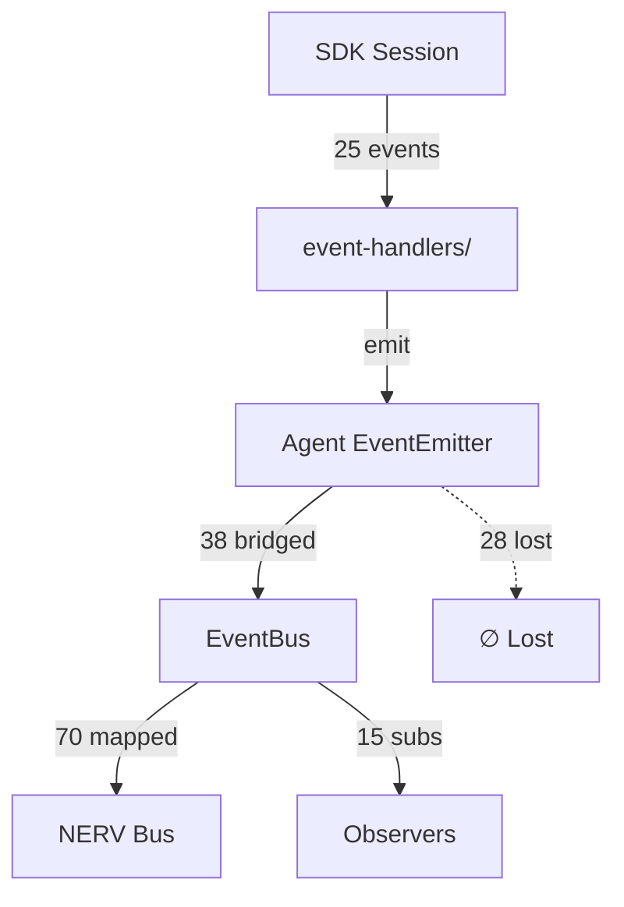

# PARTE-23L-D — Events System: Roadmap v3.0 (Expandido)

**Data**: 2026-04-12 | **Status**: ✅ TODAS AS FAIXAS CONCLUÍDAS | **Versão**: 4.0 **Precedente**:
PARTE-23L-A/B/C v2.0 (re-auditoria completa)

---

## Sumário Executivo

O roadmap v3-4 organizou **18 faixas** (L1–L18) em 4 ondas — **todas concluídas**:

- **Onda 1 (L1–L8)**: ✅ CONCLUÍDA — implementação base
- **Onda 2 (L9–L12)**: ✅ CONCLUÍDA — eliminação de duplicação e cobertura completa
- **Onda 3 (L13–L15)**: ✅ CONCLUÍDA — remoção de legado e migração de observers
- **Onda 4 (L16–L18)**: ✅ CONCLUÍDA — inteligência operacional e observabilidade avançada

---

## Onda 1 — Implementações Base (✅ CONCLUÍDA)

### FAIXA-L1 — HookBus → EventBus bridge ✅ CONCLUÍDO

- `hooks/bus.js`: adicionado `setEventBus(bus)` + bridge em `emitHook()`
- `hooks/index.js`: adicionado `connectToEventBus(bus)`
- `events/hook-events.js`: 5 constantes SSOT
- `copilot-boot-wiring.js`: wiring HookBus → EventBus no bootstrap
- **Commit**: `b3284b0a`

### FAIXA-L2 — SSOT Expansion ✅ CONCLUÍDO

- `events/agent-events.js`: 52 constantes (38 bridgeados)
- `events/hook-events.js`: 5 constantes
- `events/system-events.js`: 5 constantes
- `events/service-events.js`: 5 constantes
- `events/index.js`: barrel consolidado
- **Commit**: `b3284b0a`

### FAIXA-L3 — NervEventBusAdapter ✅ CONCLUÍDO

- `bridges/nerv-event-bus-adapter.js`: novo adapter bidirecional
- `bridges/nerv-events.js`: ~70 EVENTBUS_TO_NERV mappings
- `bridges/index.js`: barrel exportando adapter
- **Commit**: `b3284b0a`

### FAIXA-L4 — EventBus diagnostics ✅ CONCLUÍDO

- `core/event-bus.js`: adicionados `diagnostics()`, `channels()`, `statsByNamespace()`
- Suporte a wildcards `ns:*` para `statsByNamespace()`
- **Commit**: `b3284b0a`

### FAIXA-L5 — SdkSessionBridge ✅ CONCLUÍDO (⚠️ não wired)

- `bridges/sdk-session-bridge.js`: novo bridge SDK→EventBus direto
- `events/sdk-events.js`: 18 constantes `sdk:*`
- ⚠️ `attach(session)` nunca chamado → bridge INERTE em produção
- **Commit**: `b3284b0a`

### FAIXA-L6 — Middleware pipeline ✅ CONCLUÍDO

- `events/middleware/timestamp-enricher.js`: enriquece `_source`, normaliza `timestamp`
- `events/middleware/schema-validator.js`: bloqueia events mal-formados
- `events/middleware/rate-limiter.js`: suprime flood (100/s/type)
- `events/middleware/index.js`: barrel
- **Commit**: `b3284b0a`

### FAIXA-L7 — bridgeEmitter expansion ✅ CONCLUÍDO

- `always-alive.js`: bridgeEmitter expandido de ~8 para 38 events
- 8 DialogLoopManager + 3 HandoffManager events via bridges dedicados
- **Commit**: `b3284b0a`

### FAIXA-L8 — NERV map expansion + health ✅ CONCLUÍDO

- `bridges/nerv-events.js`: expandido para ~70 entries
- `server/routes/health.js`: endpoint `/health/events` para diagnostics
- **Commit**: `b3284b0a`

---

## Onda 2 — Cobertura Completa e Deduplicação

### FAIXA-L9 — Bridge dos 28 Events Perdidos ✅ CONCLUÍDO

**Objetivo**: Bridgear todos os 28 events que o Agent emite mas NÃO chegam ao EventBus. **Commit**:
`96502f4b`

**Arquivos a modificar**:

1. `events/agent-events.js` — adicionar 26 constantes SSOT (`AGENT_ASSISTANT_TURN_START`, etc.)
2. `copilot/always-alive.js` — expandir bridgeEmitter com 26 novas entradas
3. `bridges/nerv-events.js` — expandir EVENTBUS_TO_NERV com 26 mapeamentos
4. `events/index.js` — re-exportar novas constantes no barrel

**Prioridade**: Começar pelos 7 de impacto ALTO:

- `abort`, `session.error`, `session.shutdown`, `session.handoff`
- `session.task_complete`, `assistant.turn_start`, `assistant.turn_end`
- `dialog.delta`

**Critério de conclusão**: `diagnostics().channels` ≥ 82, zero events perdidos

**Estimativa**: ~150 linhas de código em 4 arquivos

### FAIXA-L10 — Remoção do SdkSessionBridge ✅ CONCLUÍDO

**Objetivo**: Eliminar o caminho duplicado SDK→EventBus direto. **Commit**: `96502f4b`

**Justificativa**:

- O SdkSessionBridge (L5) nunca teve `attach()` chamado em produção
- Os 18 eventos dele são subconjunto dos 25 do Caminho A
- Namespace `sdk:*` não tem consumers reais
- Cria potencial de duplicação se `attach()` for ativado no futuro

**Arquivos a modificar**:

1. `bridges/sdk-session-bridge.js` — DELETAR
2. `events/sdk-events.js` — DELETAR
3. `bridges/index.js` — remover export
4. `events/index.js` — remover re-export de sdk-events
5. `copilot-boot-wiring.js` — remover `sdkSessionBridge.init(bus)` se existir
6. `bridges/nerv-events.js` — remover mapeamentos `SDK_*` se existirem

**Critério**: Zero imports de `sdk-events` ou `sdk-session-bridge` no codebase

### FAIXA-L11 — Namespace Normalization ✅ CONCLUÍDO

**Objetivo**: Padronizar todos os event names para formato `namespace:domain:action`.

**Ações**:

1. Auditar todas as strings fora do SSOT (~13 restantes)
2. Substituir por constantes de `events/*.js`
3. Normalizar separadores: `.` → `:` onde aplicável
4. Manter backward-compat via aliases temporários no bridgeEmitter

**Arquivos candidatos** (13 strings hardcoded restantes):

- `copilot/agent/dialog/event-wiring.js` (EVENT_MAP com nomes `.`)
- `copilot/agent/session/event-handlers/streaming.js` (delta emit)
- `copilot/agent/context/agent-context.js` (status emit)
- `copilot/orchestrator/hub.js` (hub events)

**Critério**: `grep -r "emit(" src/copilot | grep -v "events/" | wc -l` → 0

### FAIXA-L12 — SSOT Hardcoded Audit Tool ✅ CONCLUÍDO

**Objetivo**: Script automatizado para detectar event strings fora do SSOT.

**Deliverable**: `scripts/audit-event-strings.mjs`

- Extrai todas as constantes de `events/*.js`
- Compara com todos os `emit(string)` no codebase
- Reporta strings não-SSOT
- Integrado ao `make diagnose` e CI

---

## Onda 3 — Remoção de Legado e Migração

### FAIXA-L13 — Remoção do nerv-bridge.js Legado ✅ CONCLUÍDO

**Objetivo**: Eliminar duplicação Agent→NERV (nerv-bridge + NervEventBusAdapter).

**Pré-requisito**: FAIXA-L9 completa (todos events no EventBus)

**Verificação pré-remoção**:

1. Listar todos os 62 events do nerv-bridge
2. Confirmar que cada um tem equivalente no EVENTBUS_TO_NERV
3. Se existir event no nerv-bridge que NÃO está no adapter → adicionar antes de remover

**Arquivos a modificar**:

1. `bridges/nerv-bridge.js` — DELETAR (~452 linhas)
2. `bridges/index.js` — remover export
3. `copilot-boot-wiring.js` — remover wiring `nervBridge.attach(agent)`
4. Qualquer import de nerv-bridge em outros módulos → remover

**Critério**: Zero imports de `nerv-bridge` no codebase **Ganho**: Eliminação de ~452 linhas de
código legado

### FAIXA-L14 — Observer Migration (direto → EventBus) ✅ CONCLUÍDO

**Objetivo**: Migrar observers de `agent.on()` direto para `bus.on()`.

**Pré-requisito**: FAIXA-L9 completa + L13 completa

**Fases**:

1. **Criar** `observability/observers/eventbus-unified-handlers.js`
   - Mesma lógica de `session-agent-handlers.js` + `dialog-task-handlers.js`
   - Subscreve via `bus.on(SSOT_CONSTANT, handler)` em vez de `agent.on(string, handler)`
   - ~50 handlers migrados

2. **Feature flag** `USE_EVENTBUS_OBSERVERS=true/false`
   - Se true: usa unified handlers via EventBus
   - Se false: mantém legacy handlers via agent
   - Permite rollback seguro

3. **Deprecar** `session-agent-handlers.js` (log warning no attach)
4. **Deprecar** `dialog-task-handlers.js` (log warning no attach)
5. **Remover** legacy handlers + `agent-event-observer.js` factory
6. **Remover** feature flag quando estável

**Critério**: Zero `agent.on()` em observers/, somente `bus.on()`

### FAIXA-L15 — Event-Bus-Observers Upgrade ✅ CONCLUÍDO

**Objetivo**: Transformar bus-observers de log-only para ações reais.

**Adições**:

1. `MetricsCollector` — incrementa contadores/histogramas por event type
2. `ErrorAlerter` — detecta `*:error`, `*:fatal` → trigger alerta
3. `HealthUpdater` — degrada/recupera health score baseado em events
4. `ActivityTracker` — atualiza last-activity para deadlock detection
5. `CorrelationTracer` — injeta `_correlationId` via middleware para tracing

**Deliverable**: `observability/bus-actions/` com 5 módulos **Critério**: `bus.diagnostics()` mostra
≥5 subscribers com `hasAction: true`

---

## Onda 4 — Inteligência Operacional

### FAIXA-L16 — Correlation ID End-to-End ✅ CONCLUÍDO

**Objetivo**: Cada evento carrega um `_correlationId` rastreável do SDK até o NERV.

**Implementação**:

1. Middleware `correlation-id-injector.js` — gera UUID se ausente
2. Propaga via `callbacks.context.correlationId` no SDK handler
3. Preserva no bridgeEmitter → EventBus → NervAdapter
4. Queryable via `bus.diagnostics({ correlationId: 'xxx' })`

**Benefício**: Debug: "de onde veio este event NERV?" → rastreio completo

### FAIXA-L17 — Event Flow Visualizer ✅ CONCLUÍDO

**Objetivo**: Gerar grafos Mermaid automaticamente a partir do código.

**Deliverable**: `scripts/event-flow-graph.mjs`

- AST parse de todos os `emit()` e `on()` no codebase
- Gera `.md` com Mermaid diagram
- Integrado ao `make diagnose`

**Output exemplo**:



### FAIXA-L18 — Event Schema Registry ✅ CONCLUÍDO

**Objetivo**: Definir schemas JSON para cada event type, validação em dev.

**Implementação**:

1. `events/schemas/` — arquivos JSON Schema per event type
2. `schema-validator.js` middleware upgrade — valida payload contra schema registrado
3. Dev mode: strict validation (throw em payload inválido)
4. Prod mode: log warning, não bloqueia

**Benefício**: Detecção de drift entre emitters e consumers, documentação viva

---

## Pré-requisitos e Dependências

```
L9  (Bridge 28)           ──→ independente (pode começar imediatamente)
L10 (Rm SdkBridge)        ──→ independente (pode começar imediatamente)
L11 (Namespace Norm)      ──→ depende de L9 (para normalizar novos names)
L12 (Audit Tool)          ──→ depende de L11 (para validar SSOT 100%)
L13 (Rm nerv-bridge)      ──→ depende de L9 (cobertura completa no adapter)
L14 (Observer Migration)  ──→ depende de L9 + L13
L15 (Bus-Obs Upgrade)     ──→ depende de L14 (observers unificados)
L16 (Correlation ID)      ──→ depende de L9 (todos events no bus)
L17 (Flow Visualizer)     ──→ depende de L12 (usa mesmo AST tooling)
L18 (Schema Registry)     ──→ depende de L12 + L15
```

```
Grafo de Dependências:
          ┌─ L10 (Rm SdkBridge) ─────────────────────────┐
          │                                                │
START ──→ L9 (Bridge 28) ──→ L11 (Namespace) ──→ L12 (Audit Tool) ──→ L18
          │                                        │
          ├──→ L13 (Rm nerv-bridge) ──→ L14 (Observer Migr) ──→ L15 (Bus-Obs) ──→ L18
          │                                                        │
          └──→ L16 (Correlation ID)                                └──→ L17 (Visualizer)
```

---

## Ordem de Execução Recomendada

| Sequência | Faixa | Risco    | Complexidade | Dependência |
| --------- | ----- | -------- | ------------ | ----------- |
| 1         | L9    | 🔴 ALTO  | Média        | Nenhuma     |
| 2         | L10   | ⚠️ ALTO  | Baixa        | Nenhuma     |
| 3         | L11   | 🟡 MÉDIO | Média        | L9          |
| 4         | L13   | 🔴 ALTO  | Média        | L9          |
| 5         | L14   | 🟡 MÉDIO | Alta         | L9 + L13    |
| 6         | L12   | 🟢 BAIXO | Baixa        | L11         |
| 7         | L15   | 🟡 MÉDIO | Média        | L14         |
| 8         | L16   | 🟡 MÉDIO | Média        | L9          |
| 9         | L17   | 🟢 BAIXO | Média        | L12         |
| 10        | L18   | 🟢 BAIXO | Média        | L12 + L15   |

---

## Score Estimado (arch-health)

| Onda      | Score Atual | Score Estimado | Delta |
| --------- | ----------- | -------------- | ----- |
| Pós-L8    | 78/100 (C)  | —              | —     |
| Pós-Onda2 | —           | 80/100 (B-)    | +2    |
| Pós-Onda3 | —           | 85/100 (B)     | +5    |
| Pós-Onda4 | —           | 88/100 (B+)    | +3    |

> Nota: Os maiores ganhos de score virão da remoção de singletons (que NÃO é escopo deste roadmap de
> events). Para atingir 90+, é preciso PARTE-24 (DI Refactoring).

---

## Changelog

| Versão | Data       | Mudanças                                          |
| ------ | ---------- | ------------------------------------------------- |
| 1.0    | 2026-03-XX | 10 gaps, faixas L1–L8 originais                   |
| 2.0    | 2026-04-XX | FAIXA L1–L8 marcadas ✅, status atualizado        |
| 3.0    | 2026-04-12 | Re-auditoria v2, ondas 2–4 (L9–L18), 8 gaps novos |
| 4.0    | 2026-04-12 | Todas 18 faixas marcadas ✅ CONCLUÍDO             |
