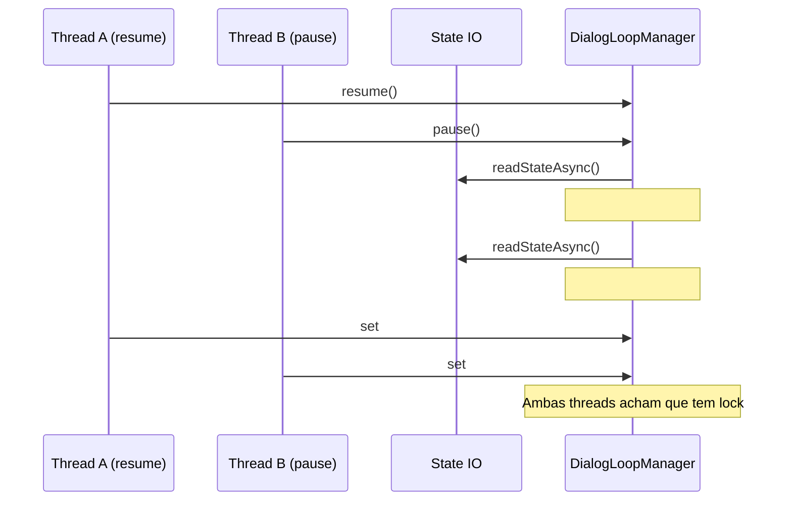

# 16 — Auditoria SDK Copilot: Análise Técnica de Bugs

**Data de elaboração**: 2026-04-18 **Escopo**: Análise profunda dos bugs identificados **Tipo**:
Documento MDS complementar **Referência**:
[15-AUDITORIA-BUGS-GAPS-TD.md](./15-AUDITORIA-BUGS-GAPS-TD.md)

---

## 1. BUG-01: Race Condition no Dialog Loop Pause/Resume

### 1.1 Contexto

O `DialogLoopManager` em `src/copilot/agent/dialog/loop-manager.js` implementa um protocolo de
pause/resume do dialog loop. O método `pause()` (linha 421) e `resume()` (linha 441) devem ser
mutuamente exclusivos e idempotentes.

### 1.2 Análise do Código Problemático

```javascript
// loop-manager.js:441-453
async resume() {
    // F42.6 (BUG-SD-007 fix): previne interleaving entre resume() e start() concorrentes
    if (this.#resuming) {
        log('WARN', '[DialogLoopManager] resume() já em andamento — ignorado.');
        return;
    }
    const state = await readStateAsync();
    if (!state?.dialogPaused) {
        log('WARN', '[DialogLoopManager] resume() sem dialogPaused=true — ignorado.');
        return;
    }

    this.#resuming = true;
    // ...continua
}
```

**Problema identificado**: O guard `#resuming` é setado **após** a leitura assíncrona do estado
(`readStateAsync()`). Isso cria uma janela onde:

1. Thread A chama `resume()`, chega no `readStateAsync()`
2. Thread B chama `pause()` ou `resume()` simultaneamente
3. Thread A continua e seta `#resuming = true`
4. Ambas as threads podem ter lido o mesmo estado inicial, levando a comportamentos inconsistentes

### 1.3 Cenário de Falha



### 1.4 Recomendação de Fix

```javascript
async resume() {
    // Usar mutex para proteger a transição completa
    if (!this.#resumeMutex) {
        this.#resumeMutex = createMutex();
    }

    return this.#resumeMutex.run(async () => {
        if (this.#resuming) {
            log('WARN', '[DialogLoopManager] resume() já em andamento — ignorado.');
            return;
        }

        this.#resuming = true;
        try {
            const state = await readStateAsync();
            if (!state?.dialogPaused) {
                log('WARN', '[DialogLoopManager] resume() sem dialogPaused=true — ignorado.');
                return;
            }
            // ... resto do código
        } finally {
            this.#resuming = false;
        }
    });
}
```

---

## 2. BUG-02: Memory Leak em Event Listeners

### 2.1 Contexto

Em `src/copilot/agent/messaging/agent-messaging.js`, a função `executeTask()` registra event
listeners na sessão SDK. O código currently assume que o cleanup no `finally` sempre executa, mas há
cenários onde isso pode falhar.

### 2.2 Análise do Código Problemático

```javascript
// agent-messaging.js:162-288
export async function executeTask(session, task, callbacks) {
    const unsubDelta = session.on('assistant.message_delta', ...);
    const unsubToolStart = session.on('tool.execution_start', ...);
    const unsubToolComplete = session.on('tool.execution_complete', ...);

    try {
        // ... execução da task
        const execution = await withAgentErrorPolicy(() =>
            session.sendAndWait(sendOpts, task.timeoutMs ?? DEFAULT_TASK_TIMEOUT_MS),
        );

        if (!execution.ok) {
            // tratamento de erro
            return;
        }

        const event = execution.value;
        // ... processamento
        task.resolve(text);
    } finally {
        unsubDelta();
        unsubToolStart();
        unsubToolComplete();
        // ...
    }
}
```

**Problema identificado**: Se `session` for null ou undef, os listeners não são registrados, mas o
finally tenta fazer unsub de undefined. Mais critically, se o `session` for desconectado entre o
registro e o cleanup, pode抛出 erro não tratado no finally.

### 2.3 Cenário de Falha

```javascript
// Se session становится null após registro mas antes do finally:
session.on('assistant.message_delta', callback); // registration succeeds
// ... session.disconnect() happens
unsubDelta(); // pode throw se session já desconectou
```

### 2.4 Recomendação de Fix

```javascript
export async function executeTask(session, task, callbacks) {
    if (!session) {
        callbacks.setStatus('idle');
        task.reject(new Error('Session não disponível'));
        return;
    }

    const listeners = [];

    try {
        const unsubDelta = session.on('assistant.message_delta', ...);
        const unsubToolStart = session.on('tool.execution_start', ...);
        const unsubToolComplete = session.on('tool.execution_complete', ...);
        const unsubIdle = session.on('session.idle', ...);

        // Track all para cleanup seguro
        listeners.push(unsubDelta, unsubToolStart, unsubToolComplete, unsubIdle);

        // ... resto do código
    } catch (error) {
        callbacks.setStatus('idle');
        callbacks.emit('task.error', { taskId: task.id, error: error.message });
        task.reject(error);
    } finally {
        // Cleanup seguro com guard
        for (const unsub of listeners) {
            try {
                if (typeof unsub === 'function') {
                    unsub();
                }
            } catch (cleanupError) {
                log('WARN', `Cleanup listener falhou: ${cleanupError.message}`);
            }
        }
        // ... cleanup de spans
    }
}
```

---

## 3. BUG-03: Persistência Silenciosa

### 3.1 Contexto

O `persistStateWithPolicy()` em `src/copilot/agent/lifecycle/state-io.js` retorna um resultado
estruturado, mas em muitos pontos do código o resultado é ignorado ou tratado com fire-and-forget.

### 3.2 Análise do Código Problemático

```javascript
// always-alive.js:307-322
void this.ctx.backgroundTasks.track(
  persistStateWithPolicy(
    { pendingQuestion: null, pendingQuestionMeta: null },
    { label: 'state.pendingQuestionShadow.clear' },
  ).then((result) => {
    if (!result.ok) {
      throw result.error;
    }
    return undefined;
  }),
  {
    label: 'state.pendingQuestionShadow.clear',
    description: 'Clear ask_user shadow from persisted state',
  },
);
```

**Problema**: O `void` descarta o retorno e o background task track não propaga o erro de forma que
o agente possa tomar ação.

### 3.3 Impacto Operacional

| Cenário                                | Comportamento               | Impacto                                       |
| -------------------------------------- | --------------------------- | --------------------------------------------- |
| Clear pendingQuestion durante shutdown | Pode falhar silenciosamente | pendingQuestion fica na próxima inicialização |
| Persist PR metrics                     | Pode falhar silenciosamente | Métricas perdidas                             |
| Persist dialog state                   | Pode falhar silenciosamente | Estado inconsistente após restart             |

### 3.4 Recomendação de Fix

```javascript
// Adicionar modo de persistência crítica
async function persistStateCritical(data, label) {
  const result = await persistStateWithPolicy(data, { label });
  if (!result.ok) {
    // Log de alta prioridade
    log('ERROR', `[StateIO] Persistência crítica falhou: ${label} - ${result.error.message}`);
    // Considerar throw ou retry
    throw result.error;
  }
  return result;
}

// Para operações não-críticas, usar com retry
async function persistStateWithRetry(data, label, maxRetries = 3) {
  for (let attempt = 1; attempt <= maxRetries; attempt++) {
    const result = await persistStateWithPolicy(data, { label });
    if (result.ok) return result;

    log('WARN', `Persist retry ${attempt}/${maxRetries}: ${result.error.message}`);
    await sleep(100 * attempt); // backoff simples
  }
  return result; // retorna último resultado mesmo se falhou
}
```

---

## 4. BUG-04: Circular Reference em AgentContext

### 4.1 Contexto

O `AgentContext` em `src/copilot/agent/agent-context.js` tem setters que chamam
`invalidateStatusSnapshot()`, o que pode potencialmente criar ciclos com observers.

### 4.2 Análise do Código Problemático

```javascript
// agent-context.js:476-479
setSession(session) {
    this.sessionState.session = session;
    this.invalidateStatusSnapshot();
}

// agent-context.js:717-719
invalidateStatusSnapshot() {
    this.metricsState.statusSnapshotCache = null;
}

// health-check.js: acesso ao snapshot
getStatusSnapshot() {
    // pode tentar ler session que está sendo modificado
}
```

**Problema**: Se um observer está escutando mudanças no `AgentContext` e tenta ler o session durante
o callback de invalidação, pode criar um loop.

### 4.3 Cenário de Falha

```javascript
// Hypothetical observer
this.ctx.on('statusSnapshotInvalidated', () => {
  const snapshot = this.getStatusSnapshot(); // tenta ler enquanto sessão está sendo modificada
  // processamento...
});

// Em algum lugar:
this.ctx.setSession(newSession); // setSession -> invalidateStatusSnapshot -> emit -> observer -> getStatusSnapshot -> session em estado inconsistente
```

### 4.4 Recomendação de Fix

```javascript
setSession(session) {
    if (this.#settingSession) {
        log('WARN', 'setSession reentrante detectado, ignorando');
        return;
    }

    this.#settingSession = true;
    try {
        this.sessionState.session = session;
        this.invalidateStatusSnapshot();
    } finally {
        this.#settingSession = false;
    }
}
```

---

## 5. Resumo de Impacto por Bug

| Bug    | Probabilidade | Impacto | Risco Total |
| ------ | ------------- | ------- | ----------- |
| BUG-01 | Alta          | Médio   | 🔴 Alto     |
| BUG-02 | Média         | Alto    | 🔴 Alto     |
| BUG-03 | Alta          | Médio   | 🟠 Alto     |
| BUG-04 | Baixa         | Alto    | 🟠 Médio    |

---

## 6. Plano de Testes Recomendado

### Teste BUG-01

```javascript
// Teste de concurrency
it('deve prevenir race condition em pause/resume concorrente', async () => {
  const manager = new DialogLoopManager();
  await manager.start();

  // Simular chamada concorrente
  const [pauseResult, resumeResult] = await Promise.all([
    manager.pause('test-session'),
    manager.resume(), // deve ser ignorado
  ]);

  expect(pauseResult).toBe(true);
  expect(resumeResult).toBe(false); // ou undefined, deve ser ignorado
});
```

### Teste BUG-02

```javascript
// Teste de cleanup
it('deve limpar listeners mesmo quando session falha', async () => {
  const session = {
    on: jest.fn(() => () => {}),
    sendAndWait: jest.fn().mockRejectedValue(new Error('Session disconnected')),
  };

  await executeTask(session, task, callbacks);

  // Verificar que todos os listeners foram limpos
  expect(session.on).toHaveBeenCalledTimes(4);
  // Verificar que cleanup aconteceu
});
```

### Teste BUG-03

```javascript
// Teste de persistência
it('deve propagar erro quando persistência falha', async () => {
  const mockPersist = jest
    .spyOn(stateIo, 'persistStateWithPolicy')
    .mockResolvedValue({ ok: false, error: new Error('Disk full') });

  await expect(agent.clearPendingQuestionShadow()).rejects.toThrow();
});
```

---

## 7. Conclusão

Os bugs identificados representam riscos reais para estabilidade do sistema, especialmente em
cenários de alta concorrência ou recuperação de falhas. A correção prioritária destes bugs antes de
qualquer expansão funcional é strongly recomendada.
