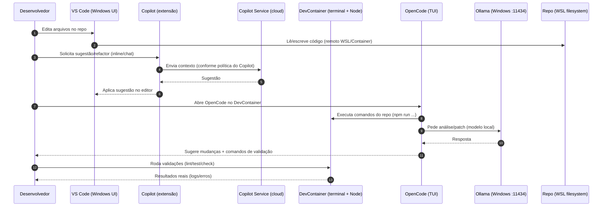
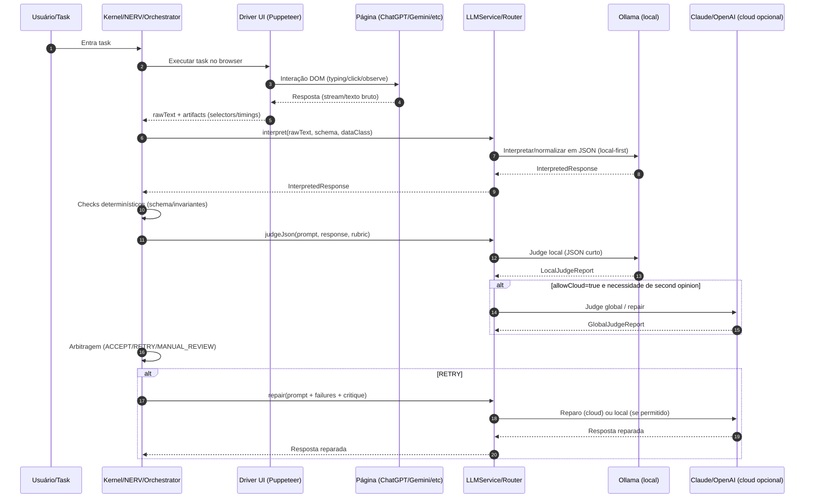

# Diagrama: Ecossistema de Assistentes (Copilot/OpenCode) + Ollama + Runtime (Puppeteer)

Este documento desenha a topologia e os fluxos completos no cenário:

- Docker Desktop no **Windows** (host do Docker)
- Código no **WSL** (filesystem Linux)
- Execução do projeto no **DevContainer**
- Programação assistida com **GitHub Copilot** (VS Code) e **OpenCode** (terminal)
- Uso de **Ollama local** (privacidade/custo) e (opcional) LLMs globais (Claude/OpenAI) por política

> Objetivo: deixar claro “quem chama quem”, onde cada coisa roda, e como integrar isso sem
> substituir o atuador Puppeteer/browser.

---

## 1) Topologia (Windows / WSL / DevContainer / Cloud)

```mermaid
flowchart TB
  %% ======================
  %% User + IDE layer
  %% ======================
  Dev[Desenvolvedor]
  VSCode[VS Code (UI no Windows)]
  Copilot[GitHub Copilot (extensão)]

  Dev --> VSCode
  VSCode --> Copilot

  %% ======================
  %% Host (Windows)
  %% ======================
  subgraph WIN[Windows (Nível 0)]
    DockerDesktop[Docker Desktop\n(rede do Docker)]
    OllamaWin[Ollama Server\n:11434 (dev/runtime)]
    FW[Firewall / Network]
  end

  %% ======================
  %% WSL (filesystem)
  %% ======================
  subgraph WSL[WSL sem container (Nível 1)]
    Repo[(Repo no filesystem WSL)]
    WSLTools[CLIs Linux opcionais]
  end

  %% ======================
  %% DevContainer (runtime + dev)
  %% ======================
  subgraph DC[DevContainer (Nível 2)]
    NodeRuntime[Programa (Node)\nKernel/NERV/Orchestrator]
    Puppeteer[Drivers UI + Puppeteer (connect-only)]
    OpenCode[OpenCode (TUI/CLI)\nassistente de programação]
    LLMService[LLMService/Router\n(local-first)]
  end

  %% ======================
  %% Cloud providers
  %% ======================
  subgraph CLOUD[Cloud (opcional por política)]
    GH[GitHub Copilot Service]
    Claude[Anthropic / Claude API]
    OpenAI[OpenAI API]
  end

  %% ======================
  %% Key connections
  %% ======================
  VSCode <--> Repo
  VSCode <--> DC
  Copilot <--> GH

  OpenCode --> LLMService
  NodeRuntime --> LLMService

  LLMService --> OllamaWin
  LLMService -. allowCloud=true .-> Claude
  LLMService -. allowCloud=true .-> OpenAI

  Puppeteer --> NodeRuntime
  NodeRuntime --> Puppeteer

  DockerDesktop --> DC
  FW --> OllamaWin
```

### Leituras do diagrama

- **Copilot** fica “no VS Code” e conversa com o serviço do Copilot (cloud). Ele acelera a escrita
  de código no editor.
- **OpenCode** roda no **DevContainer** (terminal) e é o “assistente orientado a comandos”, que
  chama LLMs (preferencialmente **Ollama** local).
- **LLMService** (no runtime) é a “porta única” para chamadas de LLM por API (Ollama/Claude/OpenAI),
  com políticas L0/L1/L2 e `allowCloud`.
- **Programa** (Kernel/NERV) e **OpenCode** compartilham o mesmo Ollama se vocês escolherem 1
  servidor (ou podem separar em portas diferentes quando houver contenção).

---

## 2) Fluxo de programação (Dev) com Copilot + OpenCode + comandos do repo

O “contrato único” é: tudo que é ação real vira comando versionado do repo (`npm run ...` /
`scripts/*`).



### Como Copilot e OpenCode se complementam

- **Copilot**: ótimo para produtividade “no teclado” (autocomplete, refactors curtos, boilerplate).
- **OpenCode**: ótimo para tarefas orientadas a **execução e verificação** no ambiente real do
  projeto (DevContainer), com comandos do repo e integração com Ollama.

Padrão recomendado:

- Copilot para micro-edições e suporte contínuo.
- OpenCode para mudanças maiores “com prova” (rodar checks, diagnosticar rede, executar scripts).

---

## 3) Fluxo do programa (Runtime): Puppeteer/UI → resposta bruta → interpretação/validação local/global

Este é o pipeline “Global responde; Local interpreta e valida” (independente do OpenCode).



### O que torna isso “robusto”

- A interpretação/validação local diminui custo e reduz vazamento de dados.
- Os checks determinísticos impedem “string soup” e controlam alucinações.
- A arbitragem explica a decisão (motivos + evidências), facilitando evolução e debug.

---

## 4) Observabilidade e “aprendizado” (artefatos governados)

```mermaid
flowchart LR
  Kernel[Kernel/NERV] --> Telemetry[Eventos/Métricas]
  Kernel --> Artifacts[Artefatos governados\n(traceId, timings, relatórios)]
  Artifacts --> LocalSynth[Síntese local-first\n(“lições”)]
  LocalSynth --> Backlog[Backlog/Issues/PRs assistidos]
  Backlog --> Dev[Time (human gate)]
```

Regras de ouro:

- **L2 nunca vai para cloud**.
- Artefatos salvos devem ser redigidos/hasheados conforme L0/L1/L2.
- “Auto-programação” é PR assistido com gates, nunca escrita direta em produção.

---

## 5) Variante de isolamento (quando 1 Ollama não bastar)

Se houver contenção (dev e runtime competindo por GPU/CPU), use dois endpoints:

- `:11434` = Dev (OpenCode)
- `:11435` = Runtime (programa)

O diagrama fica igual; só muda `baseURL` por cliente.
