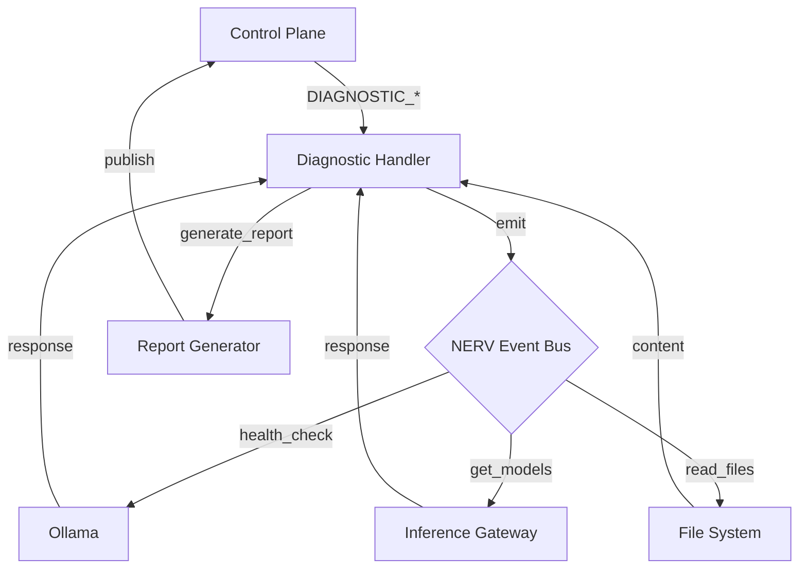

# Plano de Arquitetura: Sistema de Diagnóstico LLM (Ollama)

## Visão Geral do Sistema

Este documento define a arquitetura completa para o Sistema de Diagnóstico LLM (Ollama), um agente
autônomo que roda permanentemente em background via PM2, com foco em diagnóstico de infraestrutura,
leitura direta de arquivos e geração de relatórios estruturados.

### Requisitos Principais

1. Processo permanente via PM2
2. Integração com Inference Gateway existente
3. Comandos para diagnóstico via Control Plane (DIAGNOSTIC\_\*)
4. Leitura direta de arquivos (não só via MCP)
5. Geração de relatórios estruturados
6. Separação de papéis: Diagnostic Agent ≠ Audit Agent

---

## 1. Estrutura de Diretórios

```
src/
├── diagnostic_agent/
│   ├── main.js                    # Entry point do agente
│   ├── diagnostic-agent.js        # Orquestrador principal
│   ├── commands/
│   │   ├── command-handler.js     # Processador de comandos DIAGNOSTIC_*
│   │   ├── diagnostic-health.js   # DIAGNOSTIC_HEALTH
│   │   ├── diagnostic-logs.js     # DIAGNOSTIC_LOGS
│   │   ├── diagnostic-models.js   # DIAGNOSTIC_MODELS
│   │   ├── diagnostic-report.js   # DIAGNOSTIC_REPORT
│   │   ├── diagnostic-system.js   # DIAGNOSTIC_SYSTEM
│   │   └── diagnostic-config.js   # DIAGNOSTIC_CONFIG
│   ├── reporters/
│   │   ├── base-reporter.js       # Classe base para relatórios
│   │   ├── json-reporter.js       # Relatório JSON estruturado
│   │   ├── markdown-reporter.js   # Relatório Markdown
│   │   └── html-reporter.js       # Relatório HTML
│   ├── file-reader/
│   │   ├── direct-reader.js       # Leitura direta de arquivos
│   │   ├── log-parser.js         # Parser de logs
│   │   └── config-reader.js       # Leitor de configurações
│   ├── integration/
│   │   ├── inference-gateway-client.js  # Cliente Inference Gateway
│   │   ├── control-plane-client.js     # Cliente Control Plane
│   │   └── nerv-bridge.js              # Bridge NERV
│   ├── services/
│   │   ├── health-checker.js      # Verificação de saúde
│   │   ├── model-analyzer.js      # Analisador de modelos
│   │   ├── system-monitor.js      # Monitor de sistema
│   │   └── report-generator.js    # Gerador de relatórios
│   └── utils/
│       ├── logger.js               # Logger específico do agente
│       ├── validators.js           # Validadores Zod
│       └── constants.js            # Constantes do agente

tests/
└── unit/
    └── diagnostic_agent/
        ├── test_diagnostic_health.spec.js
        ├── test_command_handler.spec.js
        ├── test_file_reader.spec.js
        └── test_reporters.spec.js
```

---

## 2. Comandos DIAGNOSTIC\_\* (API)

### 2.1 Enum de Comandos

```javascript
// src/diagnostic_agent/utils/constants.js
export const DIAGNOSTIC_COMMANDS = {
  DIAGNOSTIC_HEALTH: 'DIAGNOSTIC_HEALTH',
  DIAGNOSTIC_LOGS: 'DIAGNOSTIC_LOGS',
  DIAGNOSTIC_MODELS: 'DIAGNOSTIC_MODELS',
  DIAGNOSTIC_REPORT: 'DIAGNOSTIC_REPORT',
  DIAGNOSTIC_SYSTEM: 'DIAGNOSTIC_SYSTEM',
  DIAGNOSTIC_CONFIG: 'DIAGNOSTIC_CONFIG',
  DIAGNOSTIC_VERIFY: 'DIAGNOSTIC_VERIFY',
};
```

### 2.2 Definição de Comandos

| Comando             | Descrição                                    | Parâmetros                                                      |
| ------------------- | -------------------------------------------- | --------------------------------------------------------------- |
| `DIAGNOSTIC_HEALTH` | Verifica saúde do Ollama e Inference Gateway | `{ depth: 'basic' 'deep' }`                                     |
| `DIAGNOSTIC_LOGS`   | Analisa logs do sistema                      | `{ lines: number, filter: string }`                             |
| `DIAGNOSTIC_MODELS` | Lista e analisa modelos Ollama               | `{ details: boolean }`                                          |
| `DIAGNOSTIC_REPORT` | Gera relatório completo                      | `{ format: 'json' 'markdown' 'html', scope: 'full' 'summary' }` |
| `DIAGNOSTIC_SYSTEM` | Informações do sistema                       | `{ extended: boolean }`                                         |
| `DIAGNOSTIC_CONFIG` | Valida configurações                         | `{ checkSecrets: boolean }`                                     |
| `DIAGNOSTIC_VERIFY` | Verifica integridade do sistema              | -                                                               |

---

## 3. Integração com Inference Gateway

### 3.1 Cliente Inference Gateway

```javascript
// src/diagnostic_agent/integration/inference-gateway-client.js
import { z } from 'zod';

const OLLAMA_HOST = process.env.OLLAMA_HOST || 'http://localhost:11434';
const INFERENCE_GATEWAY_PORT = process.env.INFERENCE_GATEWAY_PORT || 3009;

const ModelInfoSchema = z.object({
  name: z.string(),
  size: z.number(),
  modified_at: z.string().nullable(),
  details: z
    .object({
      format: z.string(),
      family: z.string(),
      families: z.array(z.string()),
      parameter_size: z.string(),
      quantization_level: z.string(),
    })
    .optional(),
});

const GatewayStatusSchema = z.object({
  ollama_connected: z.boolean(),
  models_available: z.array(ModelInfoSchema),
  total_requests: z.number(),
  active_requests: z.number(),
  uptime_seconds: z.number(),
});

export class InferenceGatewayClient {
  constructor(baseUrl = `http://localhost:${INFERENCE_GATEWAY_PORT}`) {
    this.baseUrl = baseUrl;
  }

  async getStatus() {
    // Implementar chamada HTTP para /status
  }

  async listModels() {
    // Implementar chamada HTTP para /models
  }

  async getMetrics() {
    // Implementar chamada HTTP para /metrics
  }
}
```

### 3.2 Interface NERV

```javascript
// src/diagnostic_agent/integration/nerv-bridge.js
import { createRequire } from 'module';
const require = createRequire(import.meta.url);

// Tentar importar NERV do módulo existente
let nerv;
try {
  nerv = await import('../../nerv/index.js');
} catch {
  // Fallback para standalone
  nerv = null;
}

export class NervBridge {
  constructor() {
    this.nerv = nerv;
  }

  emit(event, data) {
    if (this.nerv?.default?.emit) {
      this.nerv.default.emit(event, data);
    }
    // Log para standalone mode
    console.log(`[NERV] ${event}:`, data);
  }

  on(event, handler) {
    if (this.nerv?.default?.on) {
      this.nerv.default.on(event, handler);
    }
  }
}
```

---

## 4. Leitura Direta de Arquivos

### 4.1 Leitor Direto

```javascript
// src/diagnostic_agent/file-reader/direct-reader.js
import { readFile, readdir, stat } from 'node:fs/promises';
import { join } from 'node:path';

const ALLOWED_PATHS = [process.cwd(), '/workspaces/chatgpt-docker-puppeteer'];

export class DirectReader {
  constructor(allowedPaths = ALLOWED_PATHS) {
    this.allowedPaths = allowedPaths;
  }

  async isAllowed(filepath) {
    const resolved = await this.resolvePath(filepath);
    return this.allowedPaths.some(p => resolved.startsWith(p));
  }

  async resolvePath(filepath) {
    const resolved = await import('node:path').then(p => p.resolve(filepath));
    return resolved;
  }

  async readFile(filepath, options = {}) {
    if (!(await this.isAllowed(filepath))) {
      throw new Error(`Path not allowed: ${filepath}`);
    }
    return readFile(filepath, options);
  }

  async readJson(filepath) {
    const content = await this.readFile(filepath, 'utf-8');
    return JSON.parse(content);
  }

  async listDirectory(dirpath) {
    if (!(await this.isAllowed(dirpath))) {
      throw new Error(`Path not allowed: ${dirpath}`);
    }
    return readdir(dirpath);
  }

  async getFileStats(filepath) {
    if (!(await this.isAllowed(filepath))) {
      throw new Error(`Path not allowed: ${filepath}`);
    }
    return stat(filepath);
  }
}
```

### 4.2 Parser de Logs

```javascript
// src/diagnostic_agent/file-reader/log-parser.js
export class LogParser {
  constructor() {
    this.logPatterns = {
      error: /ERROR|error|Error/i,
      warn: /WARN|warn|Warning/i,
      info: /INFO|info|Info/i,
      ollama: /ollama|Ollama/i,
      inference: /inference|Inference|GATEWAY/i,
    };
  }

  parseLine(line) {
    const entry = {
      raw: line,
      timestamp: null,
      level: 'unknown',
      source: 'unknown',
      message: line,
    };

    // Extrair timestamp
    const tsMatch = line.match(/^\[?(\d{4}-\d{2}-\d{2}[T ]\d{2}:\d{2}:\d{2})/);
    if (tsMatch) {
      entry.timestamp = tsMatch[1];
    }

    // Detectar nível
    for (const [level, pattern] of Object.entries(this.logPatterns)) {
      if (pattern.test(line)) {
        entry.level = level;
        break;
      }
    }

    return entry;
  }

  parseContent(content, options = {}) {
    const { maxLines = 1000, filter = null } = options;
    const lines = content.split('\n').slice(0, maxLines);
    const entries = lines.map(line => this.parseLine(line));

    if (filter) {
      return entries.filter(e => e.message.includes(filter));
    }

    return entries;
  }
}
```

---

## 5. Sistema de Relatórios

### 5.1 Relatório JSON

```javascript
// src/diagnostic_agent/reporters/json-reporter.js
export class JsonReporter {
  generate(data, options = {}) {
    const report = {
      version: '1.0.0',
      generated_at: new Date().toISOString(),
      hostname: options.hostname || process.env.HOSTNAME || 'unknown',
      scope: options.scope || 'full',
      sections: {
        health: data.health || null,
        models: data.models || null,
        system: data.system || null,
        config: data.config || null,
        logs: data.logs?.slice(0, options.maxLogEntries || 100) || null,
      },
      metadata: {
        execution_time_ms: data.executionTime || 0,
        command: data.command || 'DIAGNOSTIC_REPORT',
      },
    };

    return JSON.stringify(report, null, 2);
  }
}
```

### 5.2 Relatório Markdown

```markdown
# Diagnostic Report - {timestamp}

## Health Status

- Ollama: {status}
- Gateway: {status}
- Uptime: {uptime}

## Models

| Name    | Size   | Modified |
| ------- | ------ | -------- |
| {model} | {size} | {date}   |

## System Info

- OS: {os}
- Node: {node}
- Memory: {memory}

## Config Validation

- Valid: {bool}
- Issues: {count}

## Recent Logs
```

{logs}

```

```

---

## 6. Arquitetura de Eventos (NERV)



---

## 7. Configuração PM2

```javascript
// ecosystem.config.cjs (additions)
module.exports = {
  apps: [
    // ... existing apps
    {
      name: 'diagnostic-agent',
      script: 'src/diagnostic_agent/main.js',
      cwd: '/workspaces/chatgpt-docker-puppeteer',
      instances: 1,
      exec_mode: 'fork',
      watch: false,
      env: {
        NODE_ENV: 'production',
        DIAGNOSTIC_PORT: 3010,
        DIAGNOSTIC_LOG_LEVEL: 'info',
      },
      error_file: 'logs/diagnostic-agent-error.log',
      out_file: 'logs/diagnostic-agent-out.log',
      log_date_format: 'YYYY-MM-DD HH:mm:ss Z',
      merge_logs: true,
      max_restarts: 10,
      min_uptime: '10s',
      autorestart: true,
      restart_delay: 4000,
    },
  ],
};
```

---

## 8. Diferenças entre Diagnostic Agent e Audit Agent

| Aspecto        | Diagnostic Agent                     | Audit Agent                               |
| -------------- | ------------------------------------ | ----------------------------------------- |
| **Foco**       | Saúde operacional do Ollama/LLM      | Qualidade e conformidade de código        |
| **Escopo**     | Infraestrutura, modelos, runtime     | Código-fonte, dependências, testes        |
| **Entrada**    | Comandos DIAGNOSTIC\_\*, NERV events | Git diff, arquivos modificados            |
| **Saída**      | Relatórios de saúde, alertas         | Relatórios de auditoria, sugestões de fix |
| **Frequência** | Sob demanda + agendado               | Sob demanda + CI/CD                       |
| **Alvos**      | Ollama, Inference Gateway, sistema   | src/_, tests/_, scripts/\*                |

---

## 9. Todo List de Implementação

### Fase 1: Estrutura Base

- [ ] Criar diretório src/diagnostic_agent/
- [ ] Criar arquivo main.js entry point
- [ ] Criar constants.js com DIAGNOSTIC_COMMANDS
- [ ] Configurar logger específico do agente

### Fase 2: Comandos Core

- [ ] Implementar CommandHandler
- [ ] Implementar DIAGNOSTIC_HEALTH
- [ ] Implementar DIAGNOSTIC_SYSTEM
- [ ] Implementar DIAGNOSTIC_MODELS

### Fase 3: Leitura de Arquivos

- [ ] Implementar DirectReader
- [ ] Implementar LogParser
- [ ] Implementar ConfigReader

### Fase 4: Sistema de Relatórios

- [ ] Implementar JsonReporter
- [ ] Implementar MarkdownReporter
- [ ] Implementar HtmlReporter

### Fase 5: Integração

- [ ] Integrar com Inference Gateway
- [ ] Integrar com NERV
- [ ] Integrar com Control Plane

### Fase 6: PM2 e Finalização

- [ ] Adicionar ao ecosystem.config.cjs
- [ ] Criar npm scripts
- [ ] Escrever testes unitários
- [ ] Criar documentação

---

## 10. Validações (Zod)

```javascript
// src/diagnostic_agent/utils/validators.js
import { z } from 'zod';

export const DiagnosticCommandSchema = z.object({
  command: z.enum([
    'DIAGNOSTIC_HEALTH',
    'DIAGNOSTIC_LOGS',
    'DIAGNOSTIC_MODELS',
    'DIAGNOSTIC_REPORT',
    'DIAGNOSTIC_SYSTEM',
    'DIAGNOSTIC_CONFIG',
    'DIAGNOSTIC_VERIFY',
  ]),
  params: z
    .object({
      depth: z.enum(['basic', 'deep']).optional(),
      lines: z.number().int().positive().max(10000).optional(),
      filter: z.string().optional(),
      details: z.boolean().optional(),
      format: z.enum(['json', 'markdown', 'html']).optional(),
      scope: z.enum(['full', 'summary']).optional(),
      checkSecrets: z.boolean().optional(),
    })
    .optional(),
  requestId: z.string().uuid().optional(),
  timestamp: z.string().datetime().optional(),
});

export const HealthResponseSchema = z.object({
  status: z.enum(['healthy', 'degraded', 'unhealthy']),
  ollama: z.object({
    connected: z.boolean(),
    version: z.string().nullable(),
    responseTimeMs: z.number().nullable(),
    error: z.string().nullable(),
  }),
  gateway: z.object({
    connected: z.boolean(),
    uptime: z.number(),
    activeRequests: z.number(),
  }),
  system: z.object({
    cpu: z.number(),
    memory: z.number(),
    uptime: z.number(),
  }),
  timestamp: z.string().datetime(),
});
```

---

## 11. Considerações de Segurança

1. **Allowlist de Paths**: Apenas caminhos permitidos podem ser lidos
2. **Validação de Entrada**: Todos os comandos validados com Zod
3. **Sanitização**: Logs e relatórios não expõem secrets
4. **Rate Limiting**: Limitar frequência de comandos
5. **Audit Trail**: Log de todas as operações

---

## 12. Próximos Passos

1. Revisar este plano e aprovar
2. Implementar estrutura base
3. Iterar em funcionalidades
4. Testar integração com Inference Gateway
5. Configurar PM2
6. Documentar uso
