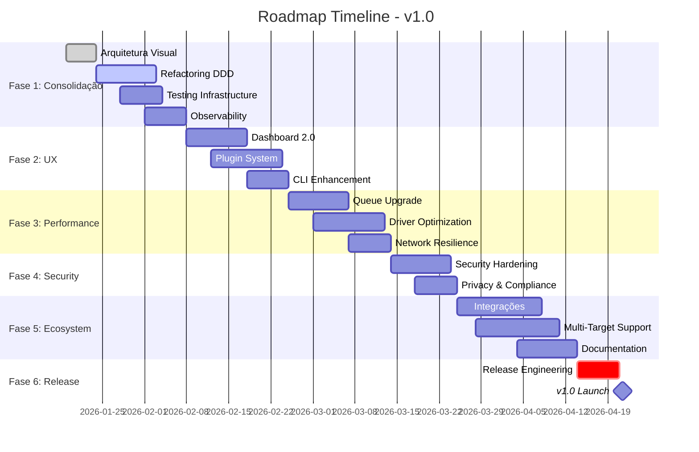

# 🗺️ Project Roadmap - chatgpt-docker-puppeteer

> **Status Atual**: Pre-v1.0 - Sistema funcional em fase de consolidação arquitetural
> **Última atualização**: 19 de Janeiro de 2026

---

## 🎯 Visão e Objetivos

### Visão de Longo Prazo
Criar o **framework de referência open-source** para automação autônoma de LLMs via browser automation, com arquitetura extensível, observabilidade completa e deployment simplificado.

### Objetivos Estratégicos
1. **Estabilidade**: Sistema production-ready com ≥99.5% uptime
2. **Extensibilidade**: Suporte a novos targets via plugins
3. **Observabilidade**: Telemetria e debugging profundos
4. **Developer Experience**: Setup em <10 minutos, docs completas
5. **Performance**: <5s latência média, ≥100 tasks/hora

---

## 📊 Fase Atual: Consolidação Arquitetural

### ✅ O Que Já Temos (Implementado)

#### Core Engine
- [x] Loop principal com polling adaptativo
- [x] Sistema de queue baseado em arquivos JSON
- [x] Lock distribuído com validação de PID
- [x] Backoff exponencial adaptativo
- [x] Coleta incremental de respostas
- [x] Validação de qualidade via schemas Zod
- [x] Classificação de falhas (task vs infra)
- [x] Forensics automáticos em crashes

#### Driver System
- [x] Factory pattern para múltiplos targets
- [x] BaseDriver com template method
- [x] ChatGPTDriver completo
- [x] Analyzer para detecção de elementos
- [x] InputResolver com human-like typing
- [x] BiomechanicsEngine (delays, cursor movement)
- [x] RecoverySystem para retry inteligente
- [x] Stabilizer para esperas adaptativas

#### Infrastructure
- [x] Gestão de locks com detecção de orphans
- [x] Cache reativo com file watchers
- [x] Atomic writes para persistência
- [x] Safe reads com tratamento de corrupção
- [x] DNA Store para identidade do agente
- [x] Health endpoint com métricas
- [x] Logging estruturado com níveis

#### Monitoring & Control
- [x] Dashboard web com Socket.io
- [x] Real-time updates de progresso
- [x] Visualização de fila
- [x] Controle via REST API
- [x] PM2 ecosystem para daemon mode

#### DevOps
- [x] CI/CD com GitHub Actions
- [x] Docker setup (desenvolvimento)
- [x] Suite de testes automatizados
- [x] Scripts de diagnóstico
- [x] Documentação completa (Quick Start, API, Architecture)

---

## 🚀 Roadmap de Desenvolvimento

### 🔥 Fase 1: Consolidação (Semanas 1-3) - **EM ANDAMENTO**

#### 1.1 Arquitetura Visual ✨ **AGORA**
- [ ] Diagramas Mermaid para todos os fluxos
- [ ] Documentação C4 model (Context, Container, Component)
- [ ] Dependency graph automatizado
- [ ] Architecture Decision Records (ADRs)
- [ ] Guia de contribuição atualizado com arquitetura

**Entregável**: `DOCUMENTAÇÃO/ARCHITECTURE_DIAGRAMS.md` completo

#### 1.2 Refactoring Estrutural
- [ ] Migrar para ES Modules (type: "module")
- [ ] Reorganizar `src/` seguindo DDD rigoroso
  ```
  src/
  ├── core/           # Domain logic
  ├── application/    # Use cases
  ├── infrastructure/ # Technical concerns
  ├── interfaces/     # API, CLI, Dashboard
  └── shared/         # Cross-cutting
  ```
- [ ] Centralizar configurações em `src/core/config/`
- [ ] Unificar schemas em `src/core/schemas/`
- [ ] Extrair constantes para `src/shared/constants/`

**Entregável**: Branch `refactor/ddd-structure`

#### 1.3 Testing Infrastructure
- [ ] Coverage target: ≥80%
- [ ] Unit tests para domain logic
- [ ] Integration tests para drivers
- [ ] E2E tests para fluxos completos
- [ ] Smoke tests para CI
- [ ] Benchmarks de performance

**Entregável**: `npm test` com coverage report

#### 1.4 Observability Enhancement
- [ ] Structured logging com pino/winston
- [ ] Distributed tracing (correlationId por task)
- [ ] Metrics export (Prometheus format)
- [ ] Error tracking (Sentry integration opcional)
- [ ] Performance profiling tools

**Entregável**: Endpoint `/metrics` com Prometheus metrics

---

### 🎨 Fase 2: UX e Extensibilidade (Semanas 4-6)

#### 2.1 Dashboard 2.0
- [ ] Interface redesenhada (Tailwind CSS)
- [ ] Gráficos de performance (Chart.js)
- [ ] Live logs viewer
- [ ] Task editor inline
- [ ] Filtros e busca avançada
- [ ] Theme switcher (dark/light)

#### 2.2 Plugin System
- [ ] Plugin API documentada
- [ ] Lifecycle hooks (onLoad, onExecute, onComplete)
- [ ] Plugin marketplace local
- [ ] Templates para novos drivers
- [ ] CLI para scaffold plugins: `npm run plugin:create`

#### 2.3 CLI Enhancement
- [ ] Commander.js CLI moderno
- [ ] `gpt-agent start|stop|status|logs`
- [ ] Interactive task creation wizard
- [ ] Config validator: `gpt-agent config:validate`
- [ ] Diagnostics: `gpt-agent doctor`

---

### ⚡ Fase 3: Performance e Escalabilidade (Semanas 7-9)

#### 3.1 Queue System Upgrade
- [ ] Suporte a Redis (opcional)
- [ ] Priority queues
- [ ] Scheduled tasks (cron-like)
- [ ] Batch processing
- [ ] Dead letter queue

#### 3.2 Driver Optimization
- [ ] Browser pool management
- [ ] Persistent browser sessions
- [ ] Parallel execution (multi-instance)
- [ ] Resource limiting (CPU/memory caps)
- [ ] Lazy loading de drivers

#### 3.3 Network Resilience
- [ ] Retry com circuit breaker
- [ ] Timeout configurável por target
- [ ] Fallback strategies
- [ ] Network condition detection

---

### 🔒 Fase 4: Security e Compliance (Semanas 10-11)

#### 4.1 Security Hardening
- [ ] Secrets management (dotenv-vault)
- [ ] Input sanitization reforçada
- [ ] Rate limiting no dashboard
- [ ] CORS configurável
- [ ] Audit logs de ações sensíveis

#### 4.2 Privacy
- [ ] Encryption at rest para respostas sensíveis
- [ ] PII detection e masking
- [ ] Retention policies configuráveis
- [ ] GDPR compliance checklist

---

### 🌍 Fase 5: Ecosystem e Community (Semanas 12-14)

#### 5.1 Integrações
- [ ] Webhook notifications
- [ ] Slack/Discord bot
- [ ] GitHub Actions integration
- [ ] n8n/Zapier connectors
- [ ] API clients (Python, Go, Rust)

#### 5.2 Multi-Target Support
- [ ] Google Gemini driver (estável)
- [ ] Claude (Anthropic) driver
- [ ] Perplexity driver
- [ ] LLaMA local (Ollama)
- [ ] Driver registry centralizado

#### 5.3 Documentation
- [ ] API reference interativo (Swagger)
- [ ] Video tutorials
- [ ] Migration guides
- [ ] Troubleshooting wiki
- [ ] Contributing guidelines detalhado

---

### 🎓 Fase 6: Versão 1.0 Release (Semana 15-16)

#### 6.1 Release Engineering
- [ ] Semantic versioning estrito
- [ ] Changelog automatizado
- [ ] Release notes detalhadas
- [ ] Migration guides from pre-v1.0
- [ ] Stability guarantees documentation

#### 6.2 Marketing & Outreach
- [ ] Website/landing page
- [ ] Blog post de lançamento
- [ ] HackerNews/Reddit posts
- [ ] ShowHN submission
- [ ] Package publicado no npm registry

#### 6.3 Support Infrastructure
- [ ] GitHub Discussions habilitado
- [ ] Issue templates refinados
- [ ] Community guidelines
- [ ] Sponsor/funding setup
- [ ] Bug bounty program (opcional)

---

## 🔮 Post-v1.0: Roadmap Futuro

### v1.x Features
- [ ] GraphQL API
- [ ] AI-powered retry strategies (MLOps)
- [ ] Visual workflow builder (no-code)
- [ ] Multi-tenancy support
- [ ] Cloud-hosted SaaS version

### v2.0 Vision
- [ ] Microservices architecture
- [ ] Kubernetes deployment
- [ ] Distributed queue (Kafka)
- [ ] Multi-region support
- [ ] Serverless mode (AWS Lambda/GCP Functions)

---

## 📈 Métricas de Sucesso

### Técnicas
- **Uptime**: ≥99.5% em produção
- **Latência**: p95 <5s por task
- **Throughput**: ≥100 tasks/hora por instância
- **Error Rate**: <1% failures por dia
- **Test Coverage**: ≥80%

### Negócio
- **GitHub Stars**: 1,000+ até v1.0
- **Contributors**: 10+ ativos
- **npm Downloads**: 1,000+/semana após v1.0
- **Issues Resolved**: ≥90% em <7 dias

### Community
- **Documentation**: 100% endpoints documentados
- **Support**: <24h response time em issues
- **Tutorials**: 5+ community-created guides

---

## 🤝 Como Contribuir com o Roadmap

1. **Priorize tarefas**: Vote em issues com 👍
2. **Sugira features**: Abra issue com label `enhancement`
3. **Assuma ownership**: Comente "I'll take this" em issues
4. **Submeta PRs**: Siga [CONTRIBUTING.md](../CONTRIBUTING.md)
5. **Revise código**: PRs precisam de 2 approvals

---

## 📅 Timeline Visual



---

## 🔗 Links Relacionados

- [ARCHITECTURE.md](ARCHITECTURE.md) - Arquitetura técnica
- [ARCHITECTURE_DIAGRAMS.md](ARCHITECTURE_DIAGRAMS.md) - Diagramas visuais
- [CONTRIBUTING.md](../CONTRIBUTING.md) - Guia de contribuição
- [CHANGELOG.md](../CHANGELOG.md) - Histórico de versões
- [API.md](API.md) - Referência da API

---

**Última revisão**: 19 de Janeiro de 2026  
**Próxima revisão**: 2 de Fevereiro de 2026
