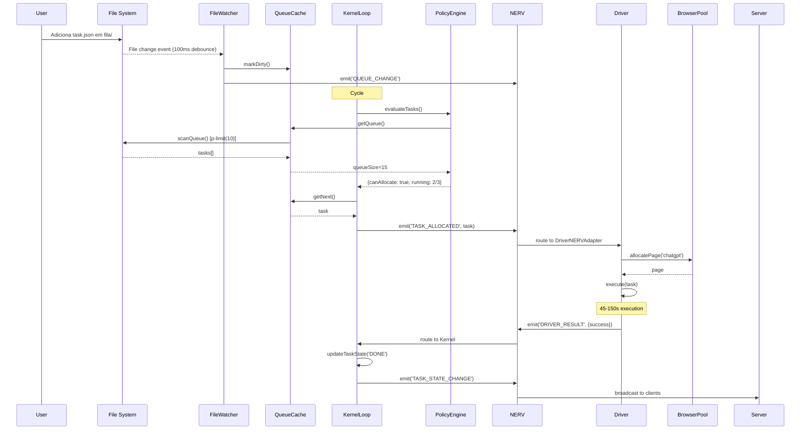
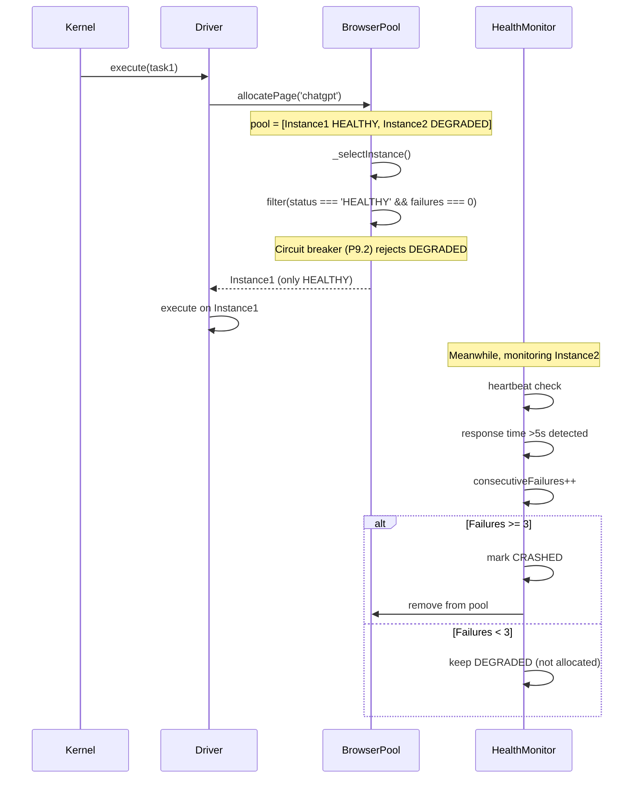
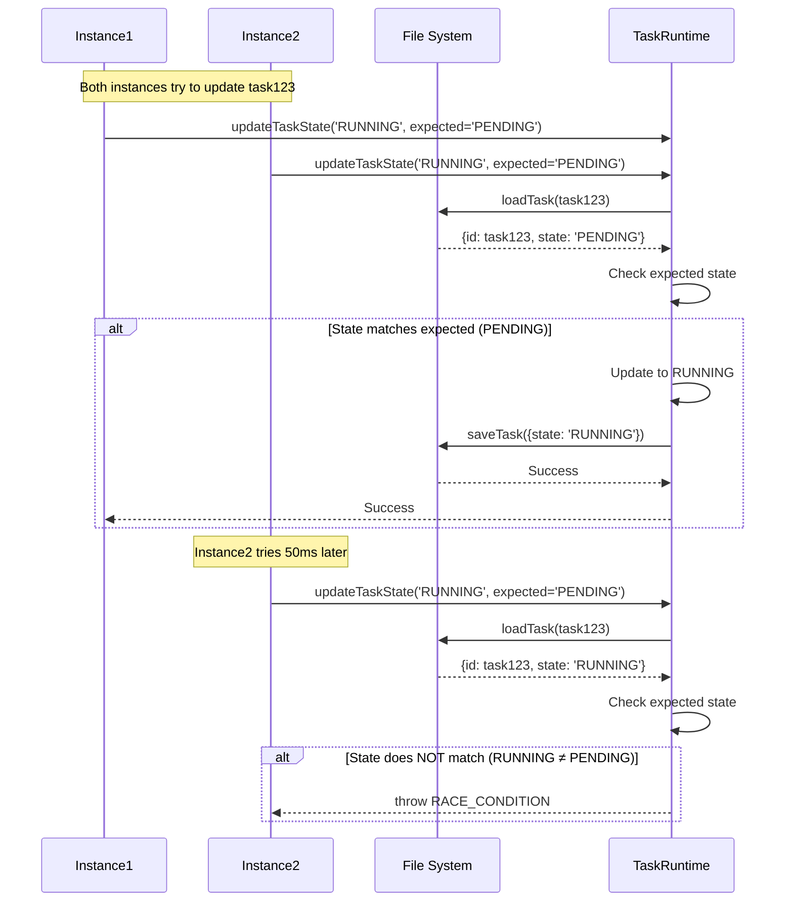

# 🎨 Design do Sistema - Diagramas e Arquitetura Detalhada

**Versão**: 1.0
**Última Atualização**: 21/01/2026
**Público-Alvo**: Arquitetos, desenvolvedores avançados
**Tempo de Leitura**: ~20 min

---

## 📖 Visão Geral

Este documento complementa o [ARCHITECTURE.md](ARCHITECTURE.md) com **diagramas visuais detalhados**: C4 Component diagrams, sequence diagrams para cenários chave, e state machines para lifecycles críticos.

### Propósito

- ✅ **Visualizar** estrutura interna dos componentes principais
- ✅ **Entender** sequências de interação end-to-end
- ✅ **Mapear** estados e transições (task lifecycle, browser health)
- ✅ **Documentar** decisões de design visualmente

---

## 🎯 Objetivos Deste Documento

Ao ler este documento, você aprenderá:

- **Estrutura interna** de KERNEL, DRIVER, NERV, INFRA (C4 Component level)
- **Fluxos de interação** detalhados (sequence diagrams)
- **State machines** para task lifecycle e browser health
- **Padrões arquiteturais** aplicados visualmente

**Pré-requisitos**:
- Leitura de [ARCHITECTURE.md](ARCHITECTURE.md) (visão geral dos containers)
- Conhecimento de C4 Model (optional, mas recomendado)

---

## 📐 C4 Model - Component Level

### 1. KERNEL - Componentes Internos

```
┌───────────────────────────────────────────────────────────────┐
│                        KERNEL                                  │
│                  (Execution Engine)                            │
├───────────────────────────────────────────────────────────────┤
│                                                                │
│  ┌────────────────────────────────────────────────────────┐   │
│  │              KernelMaestro (Main)                      │   │
│  │  - Orchestrates all kernel components                  │   │
│  │  - Manages runningTasks Set                            │   │
│  │  - Handles lifecycle events                            │   │
│  └─────────────────────┬──────────────────────────────────┘   │
│                        │                                       │
│         ┌──────────────┼──────────────────┐                   │
│         │              │                  │                   │
│  ┌──────▼─────┐ ┌──────▼──────┐ ┌────────▼────────┐          │
│  │ KernelLoop │ │PolicyEngine │ │ TaskRuntime     │          │
│  │            │ │             │ │                 │          │
│  │ - 20Hz     │ │ - Evaluate  │ │ - State mgmt    │          │
│  │ - Cycle()  │ │   policies  │ │ - PENDING→      │          │
│  │ - Timeout  │ │ - MAX_      │ │   RUNNING→      │          │
│  │   5s (P9.4)│ │   WORKERS   │ │   DONE/FAILED   │          │
│  └────────────┘ │ - Can       │ │ - Update state  │          │
│                 │   allocate? │ │   (optimistic)  │          │
│                 └─────────────┘ └─────────────────┘          │
│                        │                  │                   │
│         ┌──────────────┼──────────────────┘                   │
│         │              │                                      │
│  ┌──────▼────────┐ ┌──▼───────────┐                          │
│  │ObservationStore│ │KernelNERVBridge│                       │
│  │                │ │                 │                       │
│  │ - History of   │ │ - Emit/receive  │                       │
│  │   observations │ │   NERV events   │                       │
│  │ - Telemetry    │ │ - Canonicalize  │                       │
│  │ - Memoization  │ │   envelopes     │                       │
│  │   (P9.5)       │ │                 │                       │
│  └────────────────┘ └─────────────────┘                       │
│                                                                │
└────────────────────────────────────────────────────────────────┘
```

**Responsabilidades**:

| Componente           | Responsabilidade                                  | Arquivo                                             |
| -------------------- | ------------------------------------------------- | --------------------------------------------------- |
| **KernelMaestro**    | Orquestrador principal                            | `src/kernel/maestro/maestro.js`                     |
| **KernelLoop**       | Loop 20Hz com timeout (P9.4)                      | `src/kernel/kernel_loop/kernel_loop.js`             |
| **PolicyEngine**     | Decisões de alocação (MAX_WORKERS)                | `src/kernel/policy_engine/policy_engine.js`         |
| **TaskRuntime**      | Gerenciamento de estado (optimistic locking P5.1) | `src/kernel/task_runtime/task_runtime.js`           |
| **ObservationStore** | Histórico + telemetria + memoização (P9.5)        | `src/kernel/observation_store/observation_store.js` |
| **KernelNERVBridge** | Integração com NERV (emit/receive)                | `src/kernel/nerv_bridge/nerv_bridge.js`             |

---

### 2. DRIVER - Componentes Internos

```
┌────────────────────────────────────────────────────────────────┐
│                          DRIVER                                │
│                  (Browser Automation)                          │
├────────────────────────────────────────────────────────────────┤
│                                                                 │
│  ┌────────────────────────────────────────────────────────┐    │
│  │              DriverFactory                             │    │
│  │  - Creates driver for target (chatgpt/gemini)         │    │
│  │  - Factory pattern                                     │    │
│  └─────────────────────┬──────────────────────────────────┘    │
│                        │                                        │
│         ┌──────────────┴──────────────────┐                    │
│         │                                 │                    │
│  ┌──────▼─────────┐             ┌─────────▼────────┐           │
│  │ ChatGPTDriver  │             │  GeminiDriver    │           │
│  │                │             │                  │           │
│  │ - execute()    │             │ - execute()      │           │
│  │ - navigate()   │             │ - navigate()     │           │
│  │ - collect()    │             │ - collect()      │           │
│  └────────┬───────┘             └──────────┬───────┘           │
│           │                                │                   │
│           └────────────┬───────────────────┘                   │
│                        │                                       │
│                        │ Uses modules:                         │
│                        │                                       │
│  ┌─────────────────────┼─────────────────────────────┐        │
│  │                     │                             │        │
│  │  ┌──────▼────────┐  ┌──────▼─────────┐  ┌────────▼────┐   │
│  │  │  human.js     │  │ariadne_thread.js│  │collection.js│   │
│  │  │               │  │                 │  │             │   │
│  │  │ - type()      │  │ - locateTextarea│  │ - collect   │   │
│  │  │ - Adaptive    │  │   ()            │  │   Response()│   │
│  │  │   delays      │  │ - navigateThread│  │ - Incremental│  │
│  │  │ - Human-like  │  │   ()            │  │ - Anti-loop │   │
│  │  │ - Sanitize    │  │ - DFS traversal │  │   heuristics│   │
│  │  │   (P8.1)      │  │                 │  │             │   │
│  │  └───────────────┘  └─────────────────┘  └─────────────┘   │
│  │                                                             │
│  └─────────────────────────────────────────────────────────────┘
│                                                                 │
│  ┌────────────────────────────────────────────────────────┐    │
│  │           DriverNERVAdapter                            │    │
│  │  - Listens: TASK_ALLOCATED                            │    │
│  │  - Emits: DRIVER_RESULT, DRIVER_PROGRESS              │    │
│  └────────────────────────────────────────────────────────┘    │
│                                                                 │
└─────────────────────────────────────────────────────────────────┘
```

**Responsabilidades**:

| Componente            | Responsabilidade                      | Arquivo                                        |
| --------------------- | ------------------------------------- | ---------------------------------------------- |
| **DriverFactory**     | Cria driver correto (factory pattern) | `src/driver/factory/driver_factory.js`         |
| **ChatGPTDriver**     | Automação específica ChatGPT          | `src/driver/targets/chatgpt/chatgpt_driver.js` |
| **GeminiDriver**      | Automação específica Gemini           | `src/driver/targets/gemini/gemini_driver.js`   |
| **human.js**          | Digitação humana + sanitização (P8.1) | `src/driver/modules/human.js`                  |
| **ariadne_thread.js** | Navegação de threads (DFS)            | `src/driver/modules/ariadne_thread.js`         |
| **collection.js**     | Coleta incremental com anti-loop      | `src/driver/modules/collection.js`             |
| **DriverNERVAdapter** | Integração com NERV                   | `src/driver/nerv_adapter/nerv_adapter.js`      |

---

### 3. NERV - Componentes Internos

```
┌──────────────────────────────────────────────────────────────┐
│                          NERV                                │
│                   (Event Bus Central)                        │
├──────────────────────────────────────────────────────────────┤
│                                                               │
│  ┌────────────────────────────────────────────────────────┐  │
│  │              NERV Core                                 │  │
│  │  - emit(event, payload)                                │  │
│  │  - on(event, handler)                                  │  │
│  │  - once(event, handler)                                │  │
│  └─────────────────────┬──────────────────────────────────┘  │
│                        │                                     │
│         ┌──────────────┼──────────────────┐                 │
│         │              │                  │                 │
│  ┌──────▼──────┐ ┌─────▼────────┐ ┌──────▼────────┐        │
│  │  Emission   │ │  Reception   │ │  Correlation  │        │
│  │             │ │              │ │               │        │
│  │ - Create    │ │ - Match      │ │ - Generate    │        │
│  │   envelope  │ │   handlers   │ │   IDs         │        │
│  │ - Add       │ │ - Execute    │ │ - Track       │        │
│  │   correlationId│ │   callbacks │ │   lineage    │        │
│  │ - Enqueue   │ │ - Error      │ │ - Serialize   │        │
│  │             │ │   handling   │ │   (P9.5)      │        │
│  └─────────────┘ └──────────────┘ └───────────────┘        │
│                        │                                     │
│         ┌──────────────┼──────────────────┐                 │
│         │              │                  │                 │
│  ┌──────▼──────┐ ┌─────▼────────┐ ┌──────▼────────┐        │
│  │  Buffers    │ │  Transport   │ │  Telemetry    │        │
│  │             │ │              │ │               │        │
│  │ - Inbound   │ │ - Route      │ │ - Event       │        │
│  │ - Outbound  │ │   messages   │ │   counts      │        │
│  │ - FIFO      │ │ - Backpressure│ │ - Performance │        │
│  │ - Overflow  │ │   control    │ │   metrics     │        │
│  │   limit     │ │              │ │ - Health      │        │
│  │   10k (P9.3)│ │              │ │   checks      │        │
│  └─────────────┘ └──────────────┘ └───────────────┘        │
│                                                               │
└───────────────────────────────────────────────────────────────┘
```

**Envelope Structure**:
```javascript
{
    messageType: 'TASK_ALLOCATED',     // Event type
    payload: { taskId, target, ... },  // Data
    correlationId: 'uuid-v4',          // Tracing
    timestamp: 1737469200000,          // Unix epoch
    _serialized: null                  // Memoization cache (P9.5)
}
```

---

### 4. INFRA - Componentes Internos

```
┌──────────────────────────────────────────────────────────────┐
│                          INFRA                               │
│                  (Shared Services)                           │
├──────────────────────────────────────────────────────────────┤
│                                                               │
│  ┌─────────────────────────────────────────────────┐         │
│  │         Browser Pool                            │         │
│  │                                                 │         │
│  │  ┌──────────────┐  ┌────────────────────────┐  │         │
│  │  │PoolManager  │  │ConnectionOrchestrator  │  │         │
│  │  │              │  │                        │  │         │
│  │  │ - pool[]     │  │ - Mode: hybrid/       │  │         │
│  │  │ - allocate   │  │   launcher/external   │  │         │
│  │  │   Page()     │  │ - connectExternal()   │  │         │
│  │  │ - release    │  │ - launchBrowser()     │  │         │
│  │  │   Page()     │  │ - Domain whitelist    │  │         │
│  │  │ - Circuit    │  │   (P8.2)              │  │         │
│  │  │   breaker    │  │                        │  │         │
│  │  │   (P9.2)     │  │                        │  │         │
│  │  └──────────────┘  └────────────────────────┘  │         │
│  │                                                 │         │
│  │  ┌─────────────────────────────────────────┐   │         │
│  │  │      HealthMonitor                      │   │         │
│  │  │  - heartbeat checks                     │   │         │
│  │  │  - degradation detection (>5s)          │   │         │
│  │  │  - consecutiveFailures counter          │   │         │
│  │  │  - HEALTHY/DEGRADED/CRASHED states      │   │         │
│  │  └─────────────────────────────────────────┘   │         │
│  └─────────────────────────────────────────────────┘         │
│                                                               │
│  ┌─────────────────────────────────────────────────┐         │
│  │         Queue Cache                             │         │
│  │                                                 │         │
│  │  ┌──────────────┐  ┌────────────────────────┐  │         │
│  │  │  Cache.js    │  │   FileWatcher          │  │         │
│  │  │              │  │                        │  │         │
│  │  │ - globalQueue│  │ - watch fila/          │  │         │
│  │  │   Cache[]    │  │ - 100ms debounce       │  │         │
│  │  │ - markDirty()│  │ - markDirty() on      │  │         │
│  │  │ - scanQueue()│  │   change               │  │         │
│  │  │ - p-limit(10)│  │                        │  │         │
│  │  │   (P9.7)     │  │                        │  │         │
│  │  │ - Cache      │  │                        │  │         │
│  │  │   metrics    │  │                        │  │         │
│  │  │   (P9.6)     │  │                        │  │         │
│  │  └──────────────┘  └────────────────────────┘  │         │
│  └─────────────────────────────────────────────────┘         │
│                                                               │
│  ┌─────────────────────────────────────────────────┐         │
│  │         Lock Manager                            │         │
│  │                                                 │         │
│  │  - acquireLock(taskId, target)                 │         │
│  │  - releaseLock(taskId)                         │         │
│  │  - isLockOwnerAlive(pid)                       │         │
│  │  - Two-phase commit                            │         │
│  │  - PID validation (orphan recovery)            │         │
│  │  - UUID-based race-safe recovery               │         │
│  └─────────────────────────────────────────────────┘         │
│                                                               │
│  ┌─────────────────────────────────────────────────┐         │
│  │         Storage (I/O)                           │         │
│  │                                                 │         │
│  │  - loadTask(taskId)                            │         │
│  │  - saveTask(task)                              │         │
│  │  - saveResponse(taskId, text)                  │         │
│  │  - markDirty() BEFORE writes (P5.2)           │         │
│  │  - Symlink validation (P8.8)                   │         │
│  │  - Path traversal protection (P8.7)           │         │
│  └─────────────────────────────────────────────────┘         │
│                                                               │
└───────────────────────────────────────────────────────────────┘
```

---

## 🔄 Sequence Diagrams - Cenários Chave

### Cenário 1: Task Allocation (Happy Path)



---

### Cenário 2: Circuit Breaker (Browser Degraded)



---

### Cenário 3: Optimistic Locking (Race Condition Prevented)



---

## 🎰 State Machines

### 1. Task Lifecycle

```
                    ┌──────────┐
                    │  CREATED │
                    └─────┬────┘
                          │
                          │ Added to fila/
                          ↓
                    ┌──────────┐
              ┌─────│ PENDING  │────┐
              │     └─────┬────┘    │
              │           │         │
    Manual    │           │ Kernel  │ Timeout
    cancel    │           │ allocates│ (300s)
              │           ↓         │
              │     ┌──────────┐    │
              │     │ RUNNING  │    │
              │     └─────┬────┘    │
              │           │         │
              │      ┌────┴────┐    │
              │      │         │    │
              │  Success   Failure  │
              │      │         │    │
              ↓      ↓         ↓    ↓
         ┌────────┐ ┌──────┐ ┌────────┐
         │CANCELED│ │ DONE │ │ FAILED │
         └────────┘ └──────┘ └────────┘
```

**Transições**:

| From    | Event            | To       | Condition                 |
| ------- | ---------------- | -------- | ------------------------- |
| CREATED | File added       | PENDING  | Always                    |
| PENDING | Kernel allocates | RUNNING  | canAllocate && hasWorkers |
| PENDING | Manual cancel    | CANCELED | User action               |
| PENDING | Timeout          | FAILED   | >300s in queue            |
| RUNNING | Driver success   | DONE     | Response collected        |
| RUNNING | Driver error     | FAILED   | Exception thrown          |
| RUNNING | Manual cancel    | CANCELED | User action (rare)        |

---

### 2. Browser Instance Health

```
                    ┌──────────┐
                    │ CREATED  │
                    └─────┬────┘
                          │
                          │ Launch/connect
                          ↓
                    ┌──────────┐
              ┌─────│ HEALTHY  │────┐
              │     └─────┬────┘    │
              │           │         │
    Manual    │           │ Heartbeat│ Response
    shutdown  │           │ fail    │ time >5s
              │           ↓         │
              │     ┌──────────┐    │
              │     │ DEGRADED │◄───┘
              │     └─────┬────┘
              │           │
              │           │ Failures >= 3
              │           ↓
              ↓     ┌──────────┐
         ┌────────┐ │ CRASHED  │
         │SHUTDOWN│ └──────────┘
         └────────┘
```

**Transições**:

| From     | Event           | To       | Action                  |
| -------- | --------------- | -------- | ----------------------- |
| CREATED  | Launch success  | HEALTHY  | Add to pool             |
| HEALTHY  | Heartbeat fail  | DEGRADED | consecutiveFailures++   |
| HEALTHY  | Response >5s    | DEGRADED | Performance degradation |
| DEGRADED | Heartbeat OK    | HEALTHY  | consecutiveFailures=0   |
| DEGRADED | Failures >= 3   | CRASHED  | Remove from pool        |
| HEALTHY  | Manual shutdown | SHUTDOWN | Graceful close          |
| CRASHED  | -               | -        | Terminal state          |

**Circuit Breaker (P9.2)**:
- HEALTHY instances: ✅ Can be allocated
- DEGRADED instances: ❌ Skipped by circuit breaker
- CRASHED instances: ❌ Removed from pool

---

## 🔍 Padrões Arquiteturais Aplicados (Visual)

### 1. Event-Driven Architecture (NERV)

```
┌──────────────┐                    ┌──────────────┐
│  Component A │                    │  Component B │
│              │                    │              │
│ [Business    │                    │ [Business    │
│  Logic]      │                    │  Logic]      │
└──────┬───────┘                    └──────┬───────┘
       │                                   │
       │ emit('EVENT')                     │ on('EVENT')
       ↓                                   ↑
       └───────────→ [NERV] ──────────────┘
                     Event Bus
```

**Benefícios**:
- ✅ A não conhece B, B não conhece A
- ✅ Testabilidade isolada
- ✅ Extensibilidade (novo C só conhece NERV)

---

### 2. Factory Pattern (Driver)

```
┌──────────────────────────────────────┐
│        DriverFactory                 │
│                                      │
│  create(target: string) {            │
│    switch(target) {                  │
│      case 'chatgpt':                 │
│        return new ChatGPTDriver();   │
│      case 'gemini':                  │
│        return new GeminiDriver();    │
│    }                                 │
│  }                                   │
└──────────────┬───────────────────────┘
               │
       ┌───────┴───────┐
       │               │
       ↓               ↓
┌─────────────┐ ┌─────────────┐
│ ChatGPT     │ │   Gemini    │
│ Driver      │ │   Driver    │
│             │ │             │
│ execute()   │ │ execute()   │
└─────────────┘ └─────────────┘
```

**Benefícios**:
- ✅ Adicionar novo target (Claude, etc) não quebra código existente
- ✅ Polimorfismo (interface comum)
- ✅ Centralização de criação

---

### 3. Circuit Breaker (Browser Pool)

```
Request → Circuit Breaker → Backend Service
            │
            │ Monitor health
            │
            ↓
    ┌─────────────┐
    │   CLOSED    │ ←──┐ Success
    │ (Allowing)  │    │
    └─────┬───────┘    │
          │            │
          │ Failures >= threshold
          ↓            │
    ┌─────────────┐    │
    │    OPEN     │    │
    │ (Blocking)  │    │
    └─────┬───────┘    │
          │            │
          │ Timeout    │
          ↓            │
    ┌─────────────┐    │
    │ HALF-OPEN   │ ───┘
    │ (Testing)   │
    └─────────────┘
```

**No Sistema**:
- HEALTHY = CLOSED (allocate pages)
- DEGRADED = OPEN (block allocations)
- Recovery = HALF-OPEN (test if healthy again)

---

### 4. Observer Pattern (File Watcher)

```
┌──────────────┐
│ File System  │
│   (Subject)  │
└──────┬───────┘
       │
       │ Notifies on change
       │
       ↓
┌──────────────┐
│ FileWatcher  │
│  (Observer)  │
└──────┬───────┘
       │
       │ Triggers
       ↓
┌──────────────┐
│ markDirty()  │
│ emit(...)    │
└──────────────┘
```

**Benefícios**:
- ✅ Reação automática a mudanças
- ✅ Desacoplamento (FS não conhece watcher)
- ✅ Debounce (100ms) evita spam

---

## 📚 Referências

### Documentos Relacionados

- [ARCHITECTURE.md](ARCHITECTURE.md) - Visão geral dos containers
- [PHILOSOPHY.md](PHILOSOPHY.md) - Decisões arquiteturais fundamentais
- [DATA_FLOW.md](DATA_FLOW.md) - Fluxos de dados detalhados
- [PATTERNS.md](PATTERNS.md) - Padrões arquiteturais completos

### Recursos Externos

- [C4 Model](https://c4model.com/) - Context, Container, Component, Code
- [Mermaid.js](https://mermaid.js.org/) - Diagramas em Markdown
- [Event-Driven Architecture](https://martinfowler.com/articles/201701-event-driven.html) - Martin Fowler

---

## ❓ FAQ

### 1. Por que não usar UML completo?

**Resposta**: C4 Model é mais leve e pragmático. UML completo é overkill para maioria dos casos. Mermaid.js renderiza inline em Markdown (conveniente).

### 2. Diagramas ficam desatualizados?

**Resposta**: Sim, é risco. Solução:
- Revisar diagramas em cada major release
- Adicionar data de última revisão
- Automatizar onde possível (ex: dependency graphs)

### 3. Como gerar PNG dos Mermaid diagrams?

**Resposta**:
```bash
# CLI
npm install -g @mermaid-js/mermaid-cli
mmdc -i diagram.mmd -o diagram.png

# Ou usar online
https://mermaid.live/
```

---

*Última revisão: 21/01/2026 | Contribuidores: AI Architect, Core Team*
