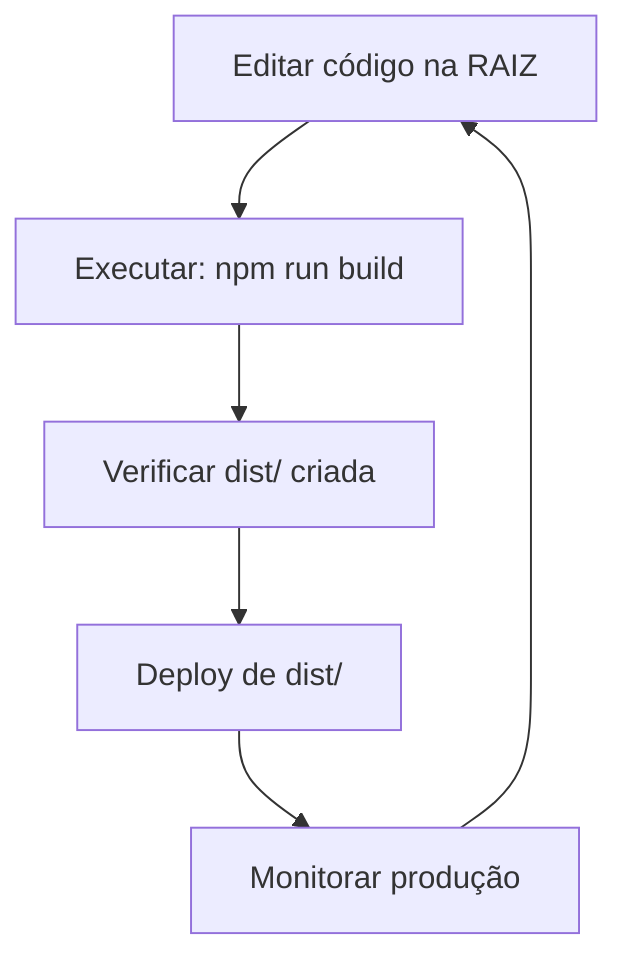

# 🏠 Ambientes: Desenvolvimento vs Produção

## 🎯 O Problema
Durante o desenvolvimento, é fácil confundir:
- **Código fonte** (raiz do projeto) - para editar
- **Código buildado** (`dist/`) - para executar

## 📋 Regras de Ouro

### ✅ SEMPRE edite código na RAIZ
```
💻 /workspaces/chatgpt-docker-puppeteer/  ← EDIÇÃO AQUI
├── src/
├── scripts/
├── package.json
└── index.js
```

### ✅ SEMPRE execute da DIST
```
📦 /workspaces/chatgpt-docker-puppeteer/dist/  ← EXECUÇÃO AQUI
├── main.bundle.js
├── start.js
└── node_modules/
```

## 🔍 Como Verificar Ambiente

### Comando Rápido:
```bash
npm run check:env
```

### Manual:
```bash
# Na raiz (desenvolvimento)
pwd  # Deve mostrar: /workspaces/chatgpt-docker-puppeteer

# Na dist (produção)  
pwd  # Deve mostrar: /workspaces/chatgpt-docker-puppeteer/dist
```

## 🚀 Comandos por Ambiente

### Desenvolvimento (raiz):
```bash
npm start              # Executar desenvolvimento
npm run dev           # Com hot-reload
npm run build         # Criar dist/
npm run test          # Testes
```

### Produção (dist/):
```bash
cd dist
node start.js                    # Executar
npx pm2 start ecosystem.config.cjs  # PM2
```

## ⚠️ Sinais de Alerta

### ❌ NUNCA faça isso:
- Editar arquivos em `dist/`
- Executar `npm install` em `dist/`
- Commits com mudanças em `dist/`
- Deploy direto da raiz (sem build)

### ✅ SEMPRE faça isso:
- Edite apenas na raiz
- Execute build antes do deploy
- Use `npm run check:env` se duvidar
- Verifique `pwd` antes de comandos importantes

## 🔄 Workflow Correto



## 🛠️ Ferramentas de Ajuda

### Verificar ambiente:
```bash
npm run check:env
```

### Build e verificação:
```bash
npm run build && npm run check:env
```

### Limpeza se necessário:
```bash
rm -rf dist/          # Remove build
npm run build        # Recria
```

## 🎯 Checklist Antes do Commit

- [ ] Estou editando arquivos na **raiz** (não em `dist/`)?
- [ ] Executei `npm run build` recentemente?
- [ ] Testei a aplicação em **desenvolvimento**?
- [ ] Verifiquei se `dist/` existe e está atualizada?
- [ ] Não há arquivos modificados em `dist/` no git status?

## 📞 Quando Duvidar

**Sempre pergunte:**
1. `pwd` - Onde estou?
2. `npm run check:env` - Que ambiente é este?
3. Estou editando ou executando?

**Lembre-se:** A raiz é para **criar**, a dist é para **executar**! 🚀
