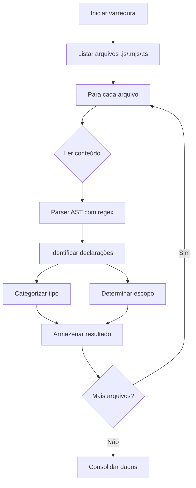
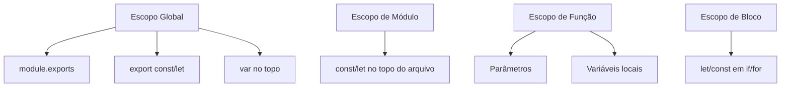

# Plano de Análise de Variáveis e Constantes

## Visão Geral do Projeto

O projeto `chatgpt-docker-puppeteer` é uma aplicação Node.js/Puppeteer que automatiza tarefas usando
Chrome headless, com múltiplos módulos:

- **src/core/** - Núcleo da aplicação (boot, config, logging, schemas)
- **src/infra/** - Infraestrutura (browser pool, database, queue, storage)
- **src/integration/** - Integrações (OLLAMA, MCP, LSP, tools)
- **src/kernel/** - Motor de execução de tarefas
- **src/nerv/** - Sistema de comunicação/emissão
- **src/orchestrator/** - Orquestrador de contexto e estado
- **src/server/** - APIs e serviços de domínio
- **scripts/** - Scripts auxiliares
- **agents/** - Agentes IA

## Escopo de Análise

### Diretórios Incluídos

- `src/` - Código principal
- `scripts/` - Scripts auxiliares
- `agents/` - Código dos agentes
- `tests/` - Testes (se existirem)

### Extensões de Arquivo

- `.js` - JavaScript
- `.mjs` - ES Modules
- `.ts` - TypeScript

### Exclusões

- Arquivos de configuração (`.json`, exceto se contiverem código)
- Arquivos `.md` de documentação
- Arquivos `node_modules/`
- Arquivos de build/output

---

## Metodologia de Análise

### Fase 1: Coleta de Dados

#### 1.1 Varredura de Arquivos



#### 1.2 Padrões de Declaração a Identificar

| Padrão           | Exemplo                        | Categoria      |
| ---------------- | ------------------------------ | -------------- |
| `const X =`      | `const API_URL = '...'`        | const          |
| `let X =`        | `let counter = 0`              | let            |
| `var X =`        | `var globalVar = true`         | var            |
| `function X(`    | `function processData()`       | function       |
| `class X`        | `class TaskManager`            | class          |
| `export const X` | `export const VERSION = '1.0'` | export const   |
| `export let X`   | `export let currentState`      | export let     |
| `module.exports` | `module.exports = {}`          | module export  |
| `export default` | `export default app`           | export default |

### Fase 2: Categorização por Tipo

#### 2.1 Tipos Primitivos

- **Inteiro (number)**: `let count = 0`, `const MAX_RETRIES = 5`
- **String**: `const NAME = 'app'`, `let message = 'hello'`
- **Booleano**: `const IS_ENABLED = true`, `let isReady = false`
- **Null/Undefined**: `let value = null`

#### 2.2 Tipos Compostos

- **Objeto**: `const config = { key: 'value' }`
- **Array**: `const items = [1, 2, 3]`
- **Função**: `const handler = function() {}`
- **Classe**: `class Manager { }`

#### 2.3 Inferência de Tipo

Para valores literais, inferir o tipo:

```javascript
// Inferir do valor
const PORT = 3000; // → number
const DEBUG = false; // → boolean
const NAME = 'app'; // → string
const ITEMS = []; // → array (vazio)
const CONFIG = {}; // → object (vazio)
```

### Fase 3: Mapeamento de Escopo

#### 3.1 Categorias de Escopo



#### 3.2 Definições de Escopo

| Escopo             | Descrição                             | Identificação  |
| ------------------ | ------------------------------------- | -------------- |
| **Global Público** | `export const/let` no topo do arquivo | export         |
| **Global Privado** | `const/let` no topo, sem export       | módulo atual   |
| **Função**         | Declarações dentro de function        | function       |
| **Bloco**          | Declarações dentro de if/for/while    | bloco          |
| **Parâmetro**      | Argumentos de função                  | function param |

### Fase 4: Mapeamento de Dependências

#### 4.1 Análise de Uso

Para cada variável global, identificar:

- **Modificada**: `X = value`, `X++`, `X.prop = val`
- **Consultada**: `console.log(X)`, `if (X)`, `return X`

#### 4.2 Relations Mapping

```javascript
// Exemplo de dependência
const API_BASE = 'http://api'; // ← Dependência base
const API_URL = API_BASE + '/v1'; // ← Depende de API_BASE
```

### Fase 5: Detecção de Problemas

#### 5.1 Variáveis Não Utilizadas

- Declaradas mas nunca referenciadas
- Marcadas com prefixo `_` (convenção)

#### 5.2 Variáveis Duplicadas

- Mesmo nome em diferentes arquivos
- Mesmo nome em diferentes escopos

#### 5.3 Variáveis Redundantes

- Atribuídas uma única vez e nunca modificadas (candidatas a const)
- Valores duplicados (magic numbers/strings)

#### 5.4 Magic Values

- Números mágicos: `if (status === 1)` → `if (status === STATUS_ACTIVE)`
- Strings mágicas: `'active'` → `const STATUS_ACTIVE = 'active'`

### Fase 6: Avaliação de Tipagem

#### 6.1 Identificar candidatas a ENUM

- Conjuntos finitos de valores
- Valores que representam estados
- Strings/números usados como tipos

#### 6.2 Identificar candidatas a TypeScript

- Interfaces implícitas (objetos com propriedades fixas)
- Uniões de tipos (variáveis que aceitam múltiplos tipos)

---

## Estrutura do Relatório

### Arquivo de Saída: `VARIABLE_ANALYSIS_REPORT.md`

```markdown
# Relatório de Análise de Variáveis

## Sumário Executivo

- Total de arquivos analisados
- Total de variáveis identificadas
- Total de globais públicas
- Total de globais privadas
- Total de não utilizadas
- Recomendações gerais

## 1. Variáveis Globais Públicas

### 1.1 Por Módulo

#### src/core/config.js

| Nome   | Tipo   | Valor Inicial | Propósito           | Locação  |
| ------ | ------ | ------------- | ------------------- | -------- |
| CONFIG | object | {...}         | Configuração global | linha 42 |

## 2. Variáveis Globais Privadas

## 3. Variáveis Locais (Agrupadas por Função)

## 4. Constantes do Sistema

## 5. Problemas Identificados

### 5.1 Não Utilizadas

### 5.2 Duplicadas

### 5.3 Magic Values

## 6. Recomendações de Refatoração

### 6.1 Criar ENUMs

### 6.2 Converter para TypeScript

### 6.3 Extrair Magic Values
```

---

## Script de Implementação

O script será criado em `scripts/analysis/analyze-variables.mjs` com as seguintes funcionalidades:

1. **FileScanner** - Varredura recursiva de arquivos
2. **VariableParser** - Parse de declarações
3. **TypeInferrer** - Inferência de tipos
4. **ScopeResolver** - Determinação de escopo
5. **DependencyMapper** - Mapeamento de dependências
6. **ReportGenerator** - Geração do relatório MD

---

## Critérios de Classificação

### Nomenclatura (Boas Práticas)

| Padrão               | Exemplo                  | Status    |
| -------------------- | ------------------------ | --------- |
| SCREAMING_SNAKE_CASE | `const MAX_RETRIES`      | ✅         |
| camelCase            | `let userName`           | ✅         |
| PascalCase           | `class TaskManager`      | ✅         |
| Prefixo booleano     | `isEnabled`, `hasAccess` | ✅         |
| Prefixo `_` privado  | `_internalVar`           | ⚠️ warning |

### Coesão e Acoplamento

- Variáveis devem estar próximas de onde são usadas
- Evitar dependências circulares entre módulos
- Preferir imutabilidade (const > let > var)

---

## Próximos Passos

1. [ ] Executar script de análise
2. [ ] Revisar relatório gerado
3. [ ] Validar identificações manuais
4. [ ] Aplicar recomendações de refatoração
5. [ ] Criar ENUMs sugeridos
6. [ ] Adicionar tipagem TypeScript

---

_Plano gerado em: 2026-02-21_ _Projeto: chatgpt-docker-puppeteer_
