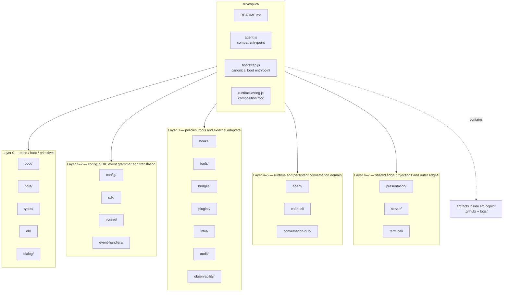
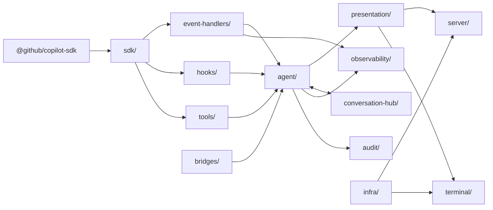
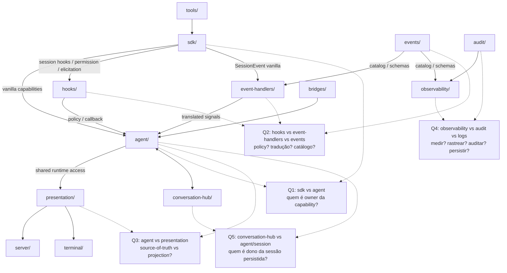
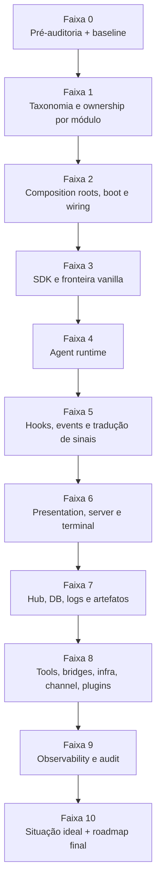

# 04 — Grafos e Fronteiras de `src/copilot`

Este documento concentra os **grafos iniciais da pré-auditoria**, com foco em:

1. topologia global por camadas;
2. fluxo operacional canônico do runtime;
3. zonas de fronteira críticas a investigar;
4. pipeline documental da auditoria ampla.

> Estes grafos são propositalmente **macroestruturais**. O inventário exaustivo de pastas e arquivos
> está nos anexos 01–03.

---

## 1. Grafo macroestrutural atual de `src/copilot`

---

## 2. Fluxo operacional canônico declarado hoje

### Leitura do grafo

- o **vendor SDK** deveria entrar apenas por `sdk/`;
- a **tradução de eventos vanilla** deveria ocorrer primeiro em `event-handlers/`;
- o **runtime vivo** deveria ser propriedade do `agent/`;
- o **consumo compartilhado de borda** deveria subir por `presentation/`;
- `server/` e `terminal/` deveriam consumir projeções/handlers, não reinventar semântica do runtime;
- `hooks/`, `tools/`, `bridges/`, `observability/` e `audit/` são áreas transversais, mas com papéis
  distintos que a auditoria precisa tornar inequivocamente explícitos.

---

## 3. Grafo das fronteiras mais críticas a auditar

---

## 4. Grafo do plano de execução da auditoria ampla

---

## 5. Observações de uso destes grafos

1. Eles **não substituem** o inventário de arquivos; eles organizam o raciocínio arquitetural.
2. Eles devem ser lidos junto com os anexos 01–03.
3. Durante a auditoria ampla, este arquivo deverá crescer com:
   - grafos por subsistema;
   - grafos de comunicação real vs. ideal;
   - grafos de migração por faixas/fases;
   - grafos específicos de `sdk ↔ agent ↔ hooks ↔ presentation ↔ terminal/server`.
