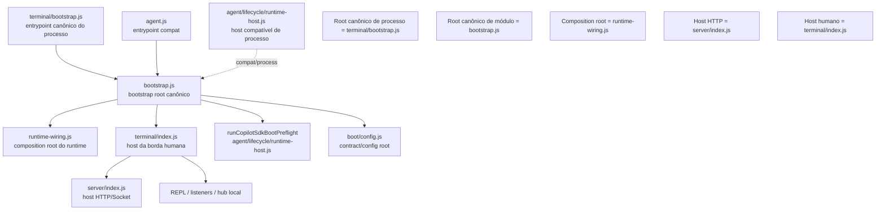

# 06 — Composition Roots, Boot e Runtime Wiring de `src/copilot`

**Status**: auditoria ativa **Última atualização**: 2026-04-27 **Escopo desta etapa**: `agent.js`,
`terminal/bootstrap.js`, `bootstrap.js`, `runtime-wiring.js`, `terminal/index.js`,
`server/index.js`, `boot/config.js` e `agent/lifecycle/runtime-host.js`.

---

## 1. Objetivo deste documento

Este documento audita a pergunta estrutural mais importante do runtime Copilot:

> **qual é o caminho canônico de boot e quais módulos têm autoridade real sobre a composição do
> processo?**

Em sistemas grandes, uma das fontes mais comuns de confusão não está nas features, mas em:

- múltiplos entrypoints com responsabilidades parcialmente sobrepostas;
- bootstrap distribuído entre vários arquivos que parecem “root” ao mesmo tempo;
- módulos de host que misturam concerns de processo, concerns de runtime e concerns de borda;
- compat shims que permanecem vivos por tempo demais e começam a competir com o root canônico.

Este documento existe para separar com precisão:

1. **entrypoint compatível**;
2. **entrypoint canônico**;
3. **composition root**;
4. **host de borda humana**;
5. **owner do servidor HTTP**;
6. **sem host compatível paralelo** — o runtime local possui um único owner executável.

---

## 2. Mapa factual dos roots atuais

## 2.1 Arquivos auditados nesta etapa

| Arquivo                                       | Papel observado                                                 |
| --------------------------------------------- | --------------------------------------------------------------- |
| `src/copilot/terminal/bootstrap.js`           | entrypoint canônico do Terminal Permanente LLM-B                |
| `src/copilot/bootstrap.js`                    | entrypoint canônico do módulo copilot                           |
| `src/copilot/runtime-wiring.js`               | composition root do runtime Copilot                             |
| `src/copilot/terminal/index.js`               | host da borda terminal; orquestra server, hub, REPL e listeners |
| `src/copilot/server/index.js`                 | owner do servidor HTTP/Socket.IO                                |
| `src/copilot/boot/config.js`                  | painel canônico de configuração de boot                         |
| `src/copilot/agent/lifecycle/runtime-host.js` | helpers de host do runtime já integrados ao fluxo canônico      |

## 2.2 Hierarquia factual atual

A leitura direta dos arquivos indica a seguinte hierarquia operacional:

```text
npm run terminal:llm-b / PM2 llm-b-terminal
  -> src/copilot/terminal/bootstrap.js
    -> bootCopilot()
      -> bootstrapObservability()
      -> bootstrapLateDeps()
      -> runCopilotSdkBootPreflight()
      -> wireCopilotRuntimeDI()
      -> startTerminalServer(...)
        -> startCopilotServer(...)
        -> initTerminalConversationHub()
        -> startRepl()
```

E existe um helper de host de processo reutilizado pelo fluxo canônico:

```text
src/copilot/agent/lifecycle/runtime-host.js
  -> signals / IPC / graceful shutdown / preflight helpers
```

---

## 3. Classificação taxonômica dos roots

## 3.1 Tabela-mestra

| Arquivo                           | Categoria arquitetural            | Deve ser owner de quê?                                                               | Não deve ser owner de quê?                |
| --------------------------------- | --------------------------------- | ------------------------------------------------------------------------------------ | ----------------------------------------- |
| `terminal/bootstrap.js`           | entrypoint canônico de processo   | inicializar o modo terminal-runtime canônico e conectar ao shutdown central          | não deve virar composition root detalhado |
| `bootstrap.js`                    | bootstrap root canônico do módulo | fases globais de boot: observability, late deps, preflight, chamada ao host terminal | não deve virar host HTTP nem REPL         |
| `runtime-wiring.js`               | composition root do runtime       | registrar tokens DI, wire legacy setters, compor dependências do runtime             | não deve virar borda terminal/server      |
| `terminal/index.js`               | host de borda humana              | subir servidor, hub, watchers, REPL e wiring da UX local                             | não deve reimplementar DI do runtime      |
| `server/index.js`                 | host HTTP                         | criar app/server/socket e expor `close()` idempotente                                | não deve iniciar REPL nem runtime sozinho |
| `agent.js`                        | compat shim                       | delegar para o boot canônico e avisar deprecação/compat                              | não deve competir como root autônomo      |
| `boot/config.js`                  | contract/config root              | centralizar variáveis, paths, contract e baseline de boot                            | não deve carregar side effects de runtime |
| `agent/lifecycle/runtime-host.js` | process-host helper compatível    | sinais, IPC, shutdown e preflight do host compatível                                 | não deve se tornar segundo boot canônico  |

---

## 4. Análise detalhada por root

## 4.1 `src/copilot/terminal/bootstrap.js`

### Papel atual observado

Este arquivo é o **entrypoint canônico para o Terminal Permanente LLM-B**.

Ele:

- registra handlers mínimos de shutdown do terminal;
- chama `bootCopilot()`;
- termina o processo em falha fatal.

### Diagnóstico

A responsabilidade atual está **corretamente estreita**. Isso é bom.

Ele não parece tentar:

- construir DI por conta própria;
- iniciar o servidor diretamente;
- decidir workspace, SDK ou hub;
- reimplementar boot phases.

### Situação ideal

Deve continuar sendo:

- **o entrypoint canônico do processo**;
- fino;
- explícito;
- sem crescimento semântico excessivo.

### Risco atual

**baixo** — desde que permaneça fino.

### Regra proposta

`terminal/bootstrap.js` deve continuar tendo no máximo:

1. wiring mínimo de sinais específicos da borda terminal;
2. chamada ao boot canônico;
3. tratamento de fatal boot.

---

## 4.2 `src/copilot/bootstrap.js`

### Papel atual observado

É o **bootstrap root canônico do módulo Copilot**.

Ele concentra as fases globais:

- leitura de `readCopilotBootConfig()`;
- criação do plano de boot;
- bootstrap de observabilidade;
- bootstrap de late deps;
- validação de tokens críticos de DI;
- preflight do SDK/CLI;
- import tardio de `runtime-wiring`, `terminal/index.js` e limpeza de TODOs;
- chamada de `startTerminalServer()` com dependências injetadas.

### Diagnóstico

Este arquivo já está muito perto do papel ideal de **bootstrap root de alto nível**.

Pontos fortes:

- separa fases;
- injeta dependências em vez de chamar tudo diretamente;
- mantém `server/index.js` e `terminal/index.js` abaixo de si;
- usa `runtime-wiring.js` explicitamente como composition root.

Ponto de atenção:

- `bootstrap.js` ainda conhece bastante da orquestração de fase e do acoplamento entre runtime e
  terminal host;
- isso é aceitável, mas deve continuar como **orquestração de fase**, não como owner dos detalhes
  internos do runtime ou da borda.

### Situação ideal

`bootstrap.js` deve ser:

- o único lugar onde se decide a ordem macro das fases;
- o root dos side effects globais de boot;
- o ponto onde composition root e edge host são conectados.

Ele **não** deve virar:

- host terminal detalhado;
- host HTTP;
- root de payloads;
- owner de runtime state.

### Risco atual

**baixo-médio** — saudável, mas precisa ser defendido contra crescimento excessivo.

---

## 4.3 `src/copilot/runtime-wiring.js`

### Papel atual observado

Este arquivo é o **composition root do runtime Copilot**.

Ele:

- configura DI do runtime via `wireCopilotRuntimeDI()`;
- registra tokens do agent, hub, store e bridge agents;
- injeta setters legados;
- valida tokens críticos;
- registra shutdown handler do agent.

### Diagnóstico

`runtime-wiring.js` é hoje um dos arquivos mais importantes para a sanidade arquitetural do sistema.

Ele deixa claro algo muito valioso:

> composição de runtime não deve acontecer nem em `server/` nem em `terminal/`.

Isso é excelente.

### Situação ideal

Deve continuar sendo:

- **o composition root do runtime**;
- owner da composição DI do grafo do agent/hub/bridges;
- módulo capaz de conhecer internals do runtime porque ele **não é borda**.

Não deve virar:

- entrypoint de processo;
- boot global;
- projection layer;
- owner de REPL/HTTP/SSE.

### Risco atual

**baixo** — a menos que a borda volte a compor dependências por fora dele.

### Decisão preliminar

Toda tentativa de compor runtime diretamente em `server/`, `terminal/` ou em algum route handler
deve ser tratada como regressão arquitetural.

---

## 4.4 `src/copilot/terminal/index.js`

### Papel atual observado

É o **host da borda humana local**.

Ele:

- carrega aliases;
- chama `wireRuntime()` injetado;
- inicializa pinned files e bridge correspondente;
- inicializa conversation hub e session local;
- sobe o servidor HTTP canônico via `startCopilotServer()`;
- registra listeners de eventos do agent;
- inicia reflection loop;
- inicia o REPL.

### Diagnóstico

Este arquivo é claramente o **host operacional da UX terminal**, não o bootstrap global.

Isso está correto.

Mas também é um arquivo naturalmente propenso a acúmulo, porque a borda humana costuma ser onde:

- watchers;
- loops de reflexão;
- prompt/render;
- comandos;
- SSE local;
- hub session local;
- aliases;
- fallback UX

acabam se encontrando.

### Situação ideal

`terminal/index.js` deve continuar como owner de:

- experiência operacional humana;
- sequencing da borda terminal;
- inicialização do REPL;
- listeners e feedback local.

Mas deve depender de:

- `bootstrap.js` para o macro-boot;
- `runtime-wiring.js` para o runtime graph;
- `server/index.js` para o servidor;
- `presentation/` para projections compartilhadas.

### Risco atual

**médio** — risco natural de virar “host de tudo”.

### Ação arquitetural futura provável

Pode valer a pena, em ondas futuras, separar dentro do terminal host:

- boot da UX;
- boot do hub local;
- boot de activity/watchers;
- boot do REPL.

Mas sem quebrar a autoridade do arquivo como host de borda.

---

## 4.5 `src/copilot/server/index.js`

### Papel atual observado

É o **owner do servidor HTTP/Socket.IO do Copilot local**.

Ele:

- cria app Express;
- monta rotas;
- registra error handler;
- cria `http.Server`;
- cria socket opcional;
- expõe `close()` idempotente;
- registra graceful shutdown.

### Diagnóstico

A missão está correta e relativamente limpa.

Ponto forte:

- o próprio arquivo afirma explicitamente que **não inicia REPL nem runtime agent sozinho**.

Esse tipo de declaração arquitetural é muito valioso.

### Situação ideal

`server/index.js` deve ser rigorosamente:

- host de protocolo HTTP/Socket;
- owner do `app` e do `httpServer`;
- nunca owner do runtime nem do boot global.

### Risco atual

**baixo** — desde que rotas continuem consumindo `presentation/` e não recomponham semântica do
runtime por conta própria.

---

## 4.6 `src/copilot/agent.js`

### Status atual

**Removido em 2026-05-04**.

### Decisão arquitetural

O runtime local passa a admitir um único owner executável:

- `src/copilot/terminal/bootstrap.js`

Qualquer reintrodução de entrypoint paralelo deve ser tratada como regressão arquitetural.

### Decisão preliminar

Qualquer lógica nova de boot adicionada em `agent.js` deve ser tratada como regressão.

---

## 4.7 `src/copilot/boot/config.js`

### Papel atual observado

É o **painel canônico de configuração do boot Copilot**.

Ele centraliza:

- env keys de boot;
- workspace context;
- host/port/token do servidor;
- baseline de SDK/CLI;
- telemetria;
- flags de terminal/PM2;
- paths persistentes;
- entrypoints e fases do contract.

### Diagnóstico

Esse arquivo reforça uma tese arquitetural importante:

> runtime não deve decidir localmente portas, skills, entrypoints e baseline de SDK.

Isso é estruturalmente correto.

### Situação ideal

`boot/config.js` deve continuar:

- declarativo;
- side-effect free;
- concentrando dados e contract de boot.

Não deve virar:

- bootstrap executor;
- adapter de runtime state;
- lugar de lógica operacional incremental.

### Risco atual

**baixo-médio** — risco típico de config builder começar a absorver policy demais.

---

## 4.8 `src/copilot/agent/lifecycle/runtime-host.js`

### Papel atual observado

É um conjunto de **helpers do host compatível de processo**.

Ele cobre:

- plugin discovery em background;
- shutdown host do runtime;
- process signals;
- IPC do runtime compatível;
- registro de eventos de processo do agent;
- preflight do SDK.

### Diagnóstico

O próprio arquivo faz a distinção correta entre:

- host de processo;
- boot canônico;
- host interno do dialog loop.

Isso é excelente, porque reduz ambiguidade semântica do termo “host”.

### Situação ideal

Esse módulo deve existir como:

- helper especializado de processo compatível;
- utilitário do entrypoint legado/compatível;
- repositório de concerns como signals, IPC e graceful shutdown específico do host compatível.

Não deve virar:

- segundo bootstrap root;
- segundo composition root;
- caminho canônico de boot.

### Risco atual

**médio** — não porque esteja errado, mas porque arquivos com nome “runtime-host” costumam ser
puxados indevidamente para papéis muito maiores do que deveriam ter.

---

## 5. Grafo auditado dos roots e hosts



---

## 6. Fronteiras ideais do boot

## 6.1 O que cada root pode conhecer legitimamente

### `terminal/bootstrap.js`

Pode conhecer:

- `bootCopilot()`;
- shutdown central.

Não deveria conhecer:

- tokens DI;
- details do hub;
- details do server;
- graph do runtime.

### `bootstrap.js`

Pode conhecer:

- observability bootstrap;
- late deps;
- config/boot contract;
- preflight;
- composition root;
- host terminal.

Não deveria conhecer profundamente:

- payloads HTTP;
- commands do REPL;
- state stores do runtime;
- semântica de borda detalhada.

### `runtime-wiring.js`

Pode conhecer:

- DI container;
- agent;
- hub;
- bridges;
- setters legados.

Não deveria conhecer:

- HTTP server;
- REPL;
- prompts;
- render/SSE terminal.

### `terminal/index.js`

Pode conhecer:

- projeções terminal;
- hub local;
- activity state;
- server host;
- REPL.

Não deveria conhecer:

- graph DI interno do runtime;
- semântica vanilla do SDK além do que consome via façades/projections.

### `server/index.js`

Pode conhecer:

- app, routes, socket, shutdown.

Não deveria conhecer:

- REPL;
- startup de agent;
- composition root do runtime.

---

## 7. Principais confusões arquiteturais evitadas pelo desenho atual

O desenho atual já evita algumas regressões clássicas:

1. **server como root de processo** — evitado;
2. **terminal como composition root do runtime** — evitado via `wireRuntime()` injetado;
3. **agent.js como root canônico rival** — evitado pelo shim fino;
4. **runtime-host como segundo bootstrap** — evitado pela documentação interna do próprio arquivo;
5. **config como executor de boot** — evitado por `boot/config.js` ser declarativo.

Isso é sinal de maturidade arquitetural real.

---

## 8. Riscos ainda abertos

## 8.1 Crescimento excessivo de `terminal/index.js`

É o risco mais evidente desta etapa.

O terminal host já concentra muitas rotinas legítimas. O perigo é ele se tornar, ao longo do tempo,
um agregado onde:

- toda nova necessidade operacional local é adicionada “porque já existe wiring ali”.

### Sinal de regressão

Sempre que `terminal/index.js` começar a:

- compor DI novo;
- reinterpretar runtime state profundo;
- definir semântica que deveria ser compartilhada por `presentation/`;
- ou duplicar boot logic;

teremos regressão arquitetural.

## 8.2 Crescimento excessivo de `bootstrap.js`

O bootstrap root está correto, mas roots canônicos sofrem de uma tendência natural a virar “arquivo
central de tudo”.

### Regra de defesa

Toda nova lógica em `bootstrap.js` deve responder a uma destas perguntas:

- isso é realmente fase macro de boot?
- isso é conexão entre fase e host?
- isso é side effect global do processo?

Se a resposta for “não”, provavelmente o código pertence a outro owner.

## 8.3 Ambiguidade futura de `runtime-host.js`

Mesmo estando bem documentado hoje, o nome pode induzir uso excessivo.

### Regra de defesa

`agent/lifecycle/runtime-host.js` deve permanecer limitado a concerns de:

- signals;
- IPC;
- shutdown;
- preflight;
- compat process hosting.

---

## 9. Situação ideal proposta para boot e composition

## 9.1 Cadeia TO-BE

```text
entrypoint canônico de processo
  -> bootstrap root canônico
    -> contract/config root
    -> observability bootstrap
    -> runtime composition root
    -> edge host terminal
      -> server host
      -> repl host
```

## 9.2 Autoridades explícitas desejadas

| Autoridade                   | Owner ideal                           |
| ---------------------------- | ------------------------------------- |
| entrypoint do processo local | `terminal/bootstrap.js`               |
| bootstrap do módulo copilot  | `bootstrap.js`                        |
| composition root do runtime  | `runtime-wiring.js`                   |
| contract/config de boot      | `boot/config.js` + `boot/contract.js` |
| host HTTP                    | `server/index.js`                     |
| host humano local            | `terminal/index.js`                   |
| host compatível de processo  | `agent/lifecycle/runtime-host.js`     |
| compat shim legado           | `agent.js`                            |

---

## 10. Decisões preliminares desta etapa

1. **`terminal/bootstrap.js` é o entrypoint canônico de processo e deve permanecer fino**.
2. **`bootstrap.js` é o bootstrap root canônico do módulo e não deve competir com hosts locais**.
3. **`runtime-wiring.js` é o composition root do runtime e precisa permanecer o único owner desse
   grafo**.
4. **`terminal/index.js` é host de borda humana, não root do runtime**.
5. **`server/index.js` é host HTTP puro e deve continuar sem iniciar runtime/REPL por conta
   própria**.
6. **`agent.js` deve permanecer exclusivamente como compat shim**.
7. **`agent/lifecycle/runtime-host.js` deve continuar sendo host helper compatível, não boot
   canônico alternativo**.

---

## 11. Conclusão desta etapa

A auditoria desta frente encontrou um resultado importante e positivo:

> `src/copilot/` já possui um desenho de boot muito mais explícito do que o normal em sistemas
> equivalentes.

Em vez de múltiplos roots rivais, o sistema já caminha para uma cadeia relativamente clara:

- processo entra por `terminal/bootstrap.js`;
- boot macro acontece em `bootstrap.js`;
- runtime é composto em `runtime-wiring.js`;
- borda humana é hospedada em `terminal/index.js`;
- borda HTTP é hospedada em `server/index.js`.

A principal tarefa futura aqui não é “reinventar o boot”, e sim **proteger essa clareza contra novo
acúmulo** — principalmente em:

- `terminal/index.js`;
- `bootstrap.js`;
- `agent/lifecycle/runtime-host.js`.

A próxima etapa natural da auditoria é aprofundar a fronteira vanilla:

- `07-SDK-E-FRONTEIRA-VANILLA.md`
- seguida de:
- `08-AGENT-RUNTIME-E-FRONTEIRAS.md`
- `09-HOOKS-E-POLICIES.md`
