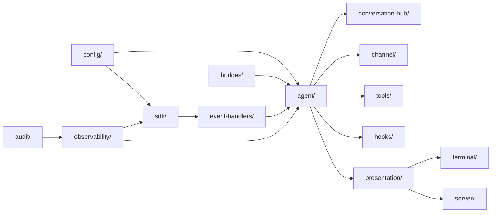

# 19 — Matriz de Comunicação Cross-Module em `src/copilot`

**Status**: auditoria ativa **Última atualização**: 2026-04-27 **Escopo desta etapa**: consolidar
como os módulos de `src/copilot/` se comunicam hoje, por quais seams, com quais contratos, e onde os
caminhos parecem corretos ou excessivos.

---

## 1. Objetivo deste documento

Este documento não substitui os relatórios por módulo. Ele os costura.

Seu objetivo é responder:

1. quem chama quem;
2. por qual seam essa chamada acontece;
3. se o seam é arquiteturalmente legítimo;
4. onde há excesso de caminhos concorrentes;
5. quais rotas devem ser canonizadas no TO-BE.

A base factual desta matriz combina:

- READMEs canônicos dos módulos;
- barrels e arquivos centrais lidos na auditoria;
- sinais de importação reais encontrados em `src/copilot/**/*.js`;
- gates arquiteturais já existentes;
- documentação do boundary `sdk ↔ agent` e do runtime.

---

## 2. Tipos de seam considerados

| Seam                     | Definição                                                                |
| ------------------------ | ------------------------------------------------------------------------ |
| **barrel/module import** | import direto de superfície pública de outro módulo                      |
| **façade**               | camada semântica intermediária que protege o consumer do detalhe interno |
| **port**                 | contrato explícito de capability/integração                              |
| **event bus**            | comunicação assíncrona por eventos internos                              |
| **registry/store**       | acesso a estado compartilhado estabilizado                               |
| **HTTP/SSE/Socket**      | protocolo de borda                                                       |
| **DI token/container**   | ligação indireta via injeção de dependência                              |
| **artifact path**        | comunicação via arquivos/estado persistido                               |

---

## 3. Fluxo canônico macro hoje

Esse fluxo não cobre todos os caminhos, mas já mostra a espinha dorsal desejável:

- `sdk/` produz semântica vanilla;
- `event-handlers/` traduz;
- `agent/` orquestra runtime;
- `presentation/` projeta;
- `server/` e `terminal/` expõem/consomem.

Os demais módulos cercam essa espinha com concerns auxiliares.

---

## 4. Matriz de comunicação por módulo-fonte

## 4.1 `bootstrap.js` / roots

Sinais reais observados:

- `bootstrap.js` importa `audit`, `boot`, `hooks`, `observability`, `sdk`, `tools`.
- `runtime-wiring.js` importa `agent`, `bridges`, `conversation-hub`.

### Leitura

Os composition roots são pontos legítimos de cruzamento denso.

### Julgamento arquitetural

- **aceitável e desejável**;
- composition roots são exatamente onde o sistema pode ver várias camadas ao mesmo tempo.

---

## 4.2 `sdk/`

### Consumidores principais observados

- `config/sdk-config-port.js`
- `agent/facades/*`
- `tools/*`
- `bootstrap.js`
- `observability/bootstrap.js`
- `server/routes/sdk/*`

### Seams corretos já consolidados

| Fonte                       | Destino | Seam                           | Julgamento |
| --------------------------- | ------- | ------------------------------ | ---------- |
| `agent/facades/*`           | `sdk/`  | barrel `#copilot/sdk`          | correto    |
| `tools/*`                   | `sdk/`  | barrel/tool helpers            | correto    |
| `config/sdk-config-port.js` | `sdk/`  | port explícito                 | correto    |
| `server/routes/sdk/*`       | `sdk/`  | adapter HTTP da superfície SDK | correto    |

### Risco remanescente

- multiplicidade de consumers legítimos não é problema;
- problema seria reabrirem a topologia interna de `sdk/` fora dos seams permitidos.

---

## 4.3 `event-handlers/`

### Comunicação principal

- consome `events/` (`SESSION_EVENTS` etc.);
- consome `observability/` para log;
- é acionado a partir dos eventos vanilla do SDK.

### Leitura

`event-handlers/` é um módulo de **tradução especializada**, não de orquestração.

### Julgamento

- comunicação com `events/` e `observability/` é correta;
- qualquer crescimento em direção a `presentation/` ou `server/` seria smell.

---

## 4.4 `agent/`

### Comunicação central observada

`agent/` conversa com:

- `events/`
- `hooks/`
- `config/`
- `boot/`
- `sdk/` (via façades)
- `conversation-hub/`
- `observability/`
- `audit/`
- `bridges/`

### Leitura

Isso confirma o papel de `agent/` como maior ponto de convergência do runtime vivo.

### Julgamento

- alta conectividade é esperada;
- o problema não é quantidade, é **tipo de seam**.

Seams saudáveis em `agent/`:

- façades para SDK;
- ports para integrações vivas;
- consumo de `events/` como gramática;
- `boot/` para entrada/configuração inicial;
- `conversation-hub/` para stores e orquestração persistida.

Seams perigosos:

- imports diretos demais para detalhes internos de outros domínios;
- acesso cru a registries/handles sem façade semântica;
- duplicação de projection de borda.

---

## 4.5 `presentation/`

### Comunicação observada

Os sinais reais mostram `presentation/` consumindo:

- `agent/`
- `conversation-hub/`
- `config/`
- `bridges/`
- `observability/`
- `audit/`

### Leitura

`presentation/` não é um simples formatter. Ele já é um **shared edge layer** robusto.

### Julgamento

Isso é arquiteturalmente correto **desde que**:

- consuma superfícies públicas e snapshots;
- não reabra runtime interno;
- não vire segundo owner da semântica do agente.

### Sinal muito importante

`presentation/runtime-sdk-session.js` consome `agent/` — isso confirma a promoção da fronteira
`agent ↔ sdk` via façade e reforça a tese de `presentation/` como consumer de alto nível.

---

## 4.6 `server/`

### Comunicação esperada e observada

`server/` tende a consumir:

- `presentation/`
- `sdk/` em rotas SDK específicas;
- `core/`/`config/`/`observability/` para concerns de borda.

### Julgamento

- `server/` deve consumir projeções e handlers, não inventar domínio;
- rotas `/sdk` são exceção legítima por serem adapter da superfície vanilla wrapper.

### Risco

- router sprawl;
- duplicação de projection já existente em `presentation/`;
- segundo eixo de tradução de evento em SSE/socket.

---

## 4.7 `terminal/`

### Comunicação observada

Sinais reais mostram `terminal/` consumindo:

- `boot/`
- `config/`
- `events/`
- `observability/`
- `bridges/`
- `channel/`
- `conversation-hub/`
- `presentation/` (via runtime/frontend docs já auditados)

### Leitura

`terminal/` é a borda mais densa depois de `server/`, porque combina:

- UX humana;
- comandos;
- render;
- SSE;
- consumo de runtime e de bridges.

### Julgamento

Aceitável, desde que:

- o domínio permaneça fora do terminal;
- `terminal/` consuma `presentation/` e `channel/` como seams canônicos;
- não recrie owners locais.

---

## 4.8 `tools/`

### Comunicação observada

Sinais reais mostram `tools/` consumindo:

- `sdk/` (`createTool`, registries, RPC tools)
- `boot/`
- `config/`
- `audit/`
- `observability/`
- `bridges/` em alguns pontos

### Leitura

`tools/` é capability layer e, por isso, naturalmente conversa com muitos módulos.

### Julgamento

Isso é correto se respeitar a distinção:

- `tools/` implementa capability;
- `hooks/` decide policy;
- `sdk/` fornece envelope vanilla de tool.

---

## 4.9 `hooks/`

### Comunicação observada

`agent/context-factories.js` consome `createQueuedElicitationHandler` de `hooks/`, o que confirma o
papel de `hooks/` como provider/callback policy surface.

### Julgamento

Correto, desde que `hooks/` permaneça slot/callback/policy e não runtime owner.

---

## 4.10 `observability/`

### Comunicação observada

Sinais reais mostram `observability/` consumindo:

- `events/`
- `audit/`
- `config/`
- `hooks/`
- `sdk/`
- `tools/`

Além disso, `observability/bootstrap.js` liga concerns cross-cutting por bootstrap.

### Leitura

`observability/` é o principal consumer transversal do sistema.

### Julgamento

Correto — desde que permaneça **consumer/correlator**, não reinterpretador paralelo do runtime.

---

## 4.11 `bridges/`

### Comunicação observada

`bridges/` conversa com:

- `sdk/` (MCP tool projection etc.)
- `observability/`
- `core/`
- `config/`

E entrega capabilities para:

- `terminal/`
- `presentation/`
- `runtime-wiring.js`
- eventualmente `agent/`.

### Julgamento

Correto como adapter externo.

---

## 4.12 `channel/`

### Comunicação observada

`channel/` consome:

- `agent/`
- `config/`
- `events/`
- `observability/`
- `boot/`

### Leitura

Isso confirma `channel/` como transporte especializado entre LLM-A e LLM-B, não como módulo neutro.

### Julgamento

Correto, mas exige fronteira muito vigiada com `conversation-hub/` e `terminal/`.

---

## 4.13 `types/`

### Comunicação observada

`types/index.js` reexporta tokens de:

- `audit/`
- `bridges/`
- `conversation-hub/`
- `sdk/`
- `events/`
- `core/`

### Leitura

`types/` funciona como contract surface transversal.

### Julgamento

Aceitável, mas de alto risco se crescer sem disciplina.

---

## 5. Matrizes específicas de comunicação

## 5.1 Matriz de consumers da espinha dorsal

| Owner/origem        | Consumers principais                                   | Seam dominante                          | Risco atual |
| ------------------- | ------------------------------------------------------ | --------------------------------------- | ----------- |
| `sdk/`              | `agent/facades`, `tools`, `server/routes/sdk`          | barrel + wrappers                       | médio       |
| `event-handlers/`   | `agent/`, `observability/`                             | tradução de evento                      | baixo-médio |
| `agent/`            | `presentation`, `terminal/channel`, `conversation-hub` | façades, event bus, direct runtime APIs | alto        |
| `presentation/`     | `server`, `terminal`                                   | projections/accessors                   | médio       |
| `conversation-hub/` | `presentation`, `terminal`, `runtime wiring`           | store/orchestrator APIs                 | alto        |

## 5.2 Matriz de cross-cutting

| Cross-cutting    | Observa/consome                    | Papel correto                      |
| ---------------- | ---------------------------------- | ---------------------------------- |
| `observability/` | `events`, `sdk`, `hooks`, `tools`  | medir, correlacionar, bootstrapar  |
| `audit/`         | `events`, `tools`, permissões      | trilha de governança/evidência     |
| `config/`        | `boot`, env, `sdk-config-port`     | declarar e montar                  |
| `types/`         | tokens/contratos de vários módulos | estabilizar superfície transversal |

## 5.3 Matriz de borda

| Borda       | Consome diretamente                | Idealmente deveria consumir por            |
| ----------- | ---------------------------------- | ------------------------------------------ |
| `server/`   | `presentation`, `sdk` routes       | `presentation` e adapters específicos      |
| `terminal/` | `presentation`, `channel`, bridges | `presentation` + `channel` + commands seam |

---

## 6. Seams canônicos que a arquitetura deve institucionalizar

1. `sdk/` → `agent/` por **barrel + façades/ports**
2. `sdk/` → bordas por **rotas SDK dedicadas**, nunca por crude calls
3. `event-handlers/` → runtime por **tradução estabilizada**
4. `agent/` → `presentation/` por **snapshots/commands semânticos**
5. `presentation/` → `server/terminal` por **projections e handlers compartilhados**
6. `agent/` ↔ `conversation-hub/` por **contracts claros de sessão persistida vs sessão viva**
7. `tools/` ↔ `hooks/` por **capability vs policy**, nunca colapso
8. `bridges/` ↔ resto do sistema por **adapters explícitos**
9. `observability/` ↔ sistema por **consumo/correlação**, não ownership de semântica

---

## 7. Principais excessos de caminhos já inferíveis

1. múltiplas rotas para semântica de sessão (`sdk`, `agent`, `conversation-hub`, `channel`)
2. múltiplas rotas para sinais (`sdk events`, `event-handlers`, `events`, `observability`)
3. múltiplas rotas de exposição de estado (`agent`, `presentation`, `server`, `terminal`)
4. múltiplos polos de policy/callback/control (`hooks`, `agent`, `tools`, `audit`)

Esses excessos não significam necessariamente bug.

Mas significam:

> custo cognitivo alto, risco de owner acidental e potencial drift semântico.

---

## 8. Decisões preliminares desta etapa

### D19-01

A espinha dorsal correta de comunicação continua sendo:

`sdk → event-handlers → agent → presentation → server/terminal`

### D19-02

`agent/` permanece como maior concentrador de comunicação legítima, mas isso exige intensificar o
uso interno de façades e ports.

### D19-03

`presentation/` deve monopolizar ainda mais o consumo compartilhado por bordas.

### D19-04

`conversation-hub/` e `channel/` são os módulos mais sensíveis fora do núcleo porque tangenciam o
conceito de sessão e conversa por caminhos diferentes.

### D19-05

As próximas matrizes devem focar explicitamente em duplicação e fronteiras para reduzir o número de
caminhos concorrentes por responsabilidade.

---

## 9. Conclusão desta etapa

A comunicação cross-module de `src/copilot` não é aleatória. Ela já tem uma espinha dorsal
reconhecível.

O problema é que essa espinha dorsal convive com módulos densos e concernentes demais, o que gera
**caminhos paralelos legítimos demais**.

A revolução arquitetural necessária não é destruir a conectividade; é:

- reduzir caminhos concorrentes;
- explicitar seams canônicos;
- tornar cada owner menos discutível.
