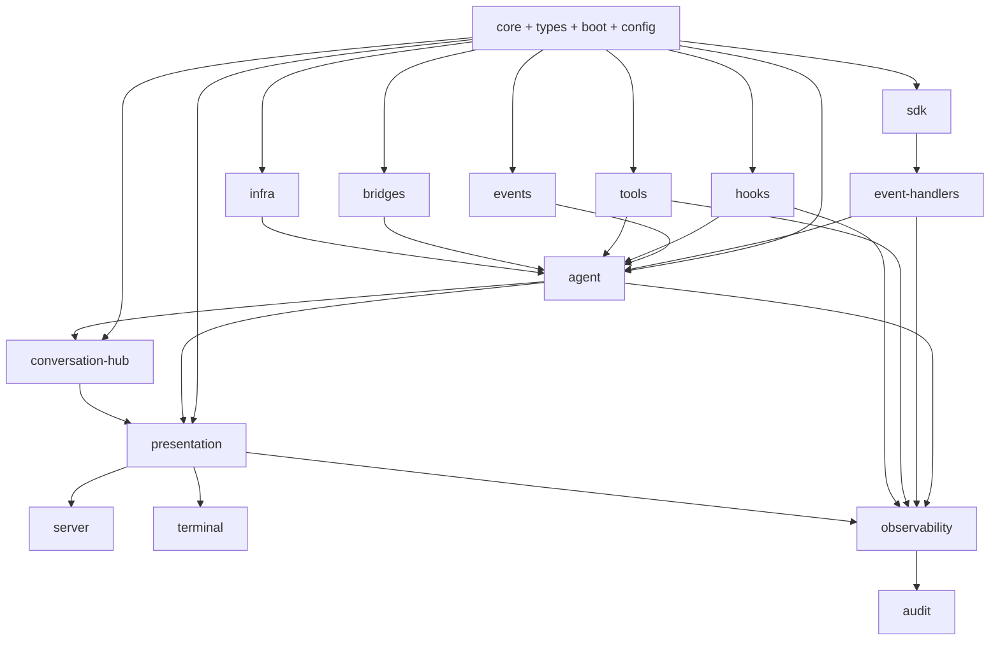

# 22 — Situação Ideal Alvo (TO-BE) para `src/copilot`

**Status**: proposta arquitetural alvo **Última atualização**: 2026-04-27 **Escopo desta etapa**:
consolidar a arquitetura ideal de `src/copilot/` após a revolução proposta por esta auditoria.

---

## 1. Objetivo deste documento

Os relatórios anteriores disseram:

- o que existe;
- o que está certo;
- onde há confusão;
- quais owners competem;
- quais fronteiras precisam endurecer.

Este documento responde a pergunta mais importante de todas:

> **como deve ficar `src/copilot/` quando a revolução arquitetural estiver madura?**

---

## 2. Princípios do estado ideal

O TO-BE ideal de `src/copilot/` deve obedecer aos seguintes princípios não negociáveis.

### P1 — Soberania por responsabilidade

Cada responsabilidade central deve ter:

- owner principal;
- consumers explícitos;
- seams canônicos;
- anti-fronteiras claras.

### P2 — Semântica única por camada

A mesma semântica não pode ser reinterpretada em cinco lugares diferentes. Se vários módulos tocam o
mesmo tema, cada um deve tocar por papéis inequivocamente diferentes.

### P3 — SDK vanilla isolado e reverenciado

O vanilla do `@github/copilot-sdk` deve continuar confinado a `sdk/` como SSOT, com promoção
controlada para o runtime local.

### P4 — Runtime vivo separado de projeção de borda

`agent/` não deve se confundir com `presentation/`, e `presentation/` não deve se confundir com
`server/` ou `terminal/`.

### P5 — Persistência separada da sessão viva

A sessão viva e a sessão persistida não devem competir pelo mesmo conceito de ownership.

### P6 — Cross-cutting não reinterpreta domínio

`observability/`, `audit/`, `types/` e `infra/` devem servir ao sistema, não concorrer com seus
owners de domínio.

### P7 — Artefatos deixam o centro semântico do código

`logs/` e `.github/` internos deixam de parecer módulos arquiteturais.

### P8 — Transformação sem big-bang

A revolução será profunda, mas precisa acontecer em ondas, mantendo funcionamento, gates e rollback.

---

## 3. A topologia ideal de alto nível

Leitura do diagrama:

- `core/types/boot/config` sustentam o sistema;
- `sdk` fala com o vendor;
- `event-handlers` traduzem o vanilla;
- `agent` governa o runtime vivo;
- `conversation-hub` governa a persistência/multi-sessão;
- `presentation` governa projeções compartilhadas;
- `server` e `terminal` apenas adaptam protocolo/UX;
- `observability` observa;
- `audit` governa a trilha.

---

## 4. Missão ideal por módulo

## 4.1 Núcleo principal

### `core/`

Base técnica mínima, estável e impessoal.

### `types/`

Superfície mínima de contratos realmente transversais.

### `boot/`

Contrato de inicialização, resolução de paths, plano de boot, composição operacional inicial.

### `config/`

Declaração, builders, env, prompt, registries declarativos e ports explícitos.

---

## 4.2 Boundary e runtime

### `sdk/`

Única fronteira com `@github/copilot-sdk`.

### `event-handlers/`

Tradução vanilla → sinais internos.

### `events/`

Gramática e catálogo de eventos internos.

### `agent/`

Runtime vivo, lifecycle, health, queue, dialog loop, orchestration da sessão ativa.

### `conversation-hub/`

Store persistente, replay, multi-sessão, sincronização e ownership persistido da conversa.

---

## 4.3 Capabilities e policies

### `hooks/`

Policies e callbacks do SDK.

### `tools/`

Capabilities executáveis do runtime.

### `bridges/`

Adapters externos para sistemas não-Copilot.

### `infra/`

Substrato técnico compartilhado, sem semântica de domínio.

### `plugins/`

Mecanismo de extensão apenas se tiver mandato explícito; caso contrário, módulo interno de
composição controlada.

---

## 4.4 Bordas

### `presentation/`

Camada única de projeção compartilhada para bordas.

### `server/`

Adapter HTTP/SSE/Socket.

### `terminal/`

Adapter humano/REPL/render/UX.

### `channel/`

Transporte interno entre LLM-A e LLM-B, sem invadir domínio conversacional ou projection.

---

## 4.5 Cross-cutting

### `observability/`

Medição, correlação, tracing, coleta, bootstrap observável.

### `audit/`

Trilha de governança, evidência, compliance operacional.

### `logs/`

Apenas output artifact.

### `.github/` interna

Apenas estado/artefato operacional temporário, preferencialmente realocado.

---

## 5. O que muda conceitualmente no TO-BE

## 5.1 A palavra “sessão” deixa de ser ambígua

No estado ideal, haverá no mínimo três conceitos separados e documentados:

1. **sessão vanilla do SDK** — `sdk/`
2. **sessão ativa viva do runtime** — `agent/`
3. **sessão persistida/conversa multi-surface** — `conversation-hub/`

Hoje esses conceitos já existem, mas ainda se roçam demais.

## 5.2 A palavra “evento” deixa de ser multissignificado

No estado ideal:

- evento vanilla = `sdk` / `event-handlers`
- gramática interna = `events`
- coleta e correlação = `observability`
- trilha de auditoria = `audit`

## 5.3 A palavra “tool” deixa de ser genérica demais

No estado ideal:

- envelope/tool infra do SDK = `sdk/tools/*`
- capability executável local = `tools/`
- extension pack opcional = `plugins/` (se aprovado)
- adapter externo que alimenta capability = `bridges/`

## 5.4 A palavra “dialog” deixa de ser vaga

No estado ideal:

- protocolo READY/REPLY = `dialog/` ou `contracts/protocols`
- runtime dialog = `agent/dialog/*`
- UX dialog = `terminal/dialog/*`

---

## 6. Reorganizações estruturais desejáveis no TO-BE

## 6.1 Reorganizações conceituais obrigatórias

1. **`presentation/` monopoliza projeções compartilhadas**
2. **`hooks/` é podado para policy/callbacks בלבד**
3. **`conversation-hub/` explicita soberania sobre persistência conversacional**
4. **`channel/` é explicitamente reduzido a transporte/protocolo interno**
5. **`observability/` integra sem dominar semântica**
6. **`audit/` separa-se melhor de logs e métricas**
7. **artefatos saem da primeira leitura semântica do código**

## 6.2 Reorganizações físicas prováveis

Estas não são ainda decisões obrigatórias, mas são candidatas fortes:

1. realocar `logs/` para diretório explicitamente runtime/output;
2. realocar `.github/hooks/state/` para caminho resolvido por `boot/` ou storage de runtime;
3. mover o microdomínio `dialog/` para uma taxonomia mais precisa (`contracts/`, `protocols/` ou
   equivalente), se a auditoria final confirmar essa necessidade;
4. tornar `plugins/` mais explícito como interno ou externo.

---

## 7. Como deve ficar a hierarquia de owners

## 7.1 Owners soberanos

| Responsabilidade                | Owner soberano      |
| ------------------------------- | ------------------- |
| vendor SDK vanilla              | `sdk/`              |
| runtime vivo                    | `agent/`            |
| sessão persistida/multi-sessão  | `conversation-hub/` |
| callbacks/policies SDK          | `hooks/`            |
| capabilities executáveis        | `tools/`            |
| adapters externos               | `bridges/`          |
| projeção compartilhada de borda | `presentation/`     |
| protocolos HTTP/SSE/Socket      | `server/`           |
| UX humana terminal              | `terminal/`         |
| gramática de eventos internos   | `events/`           |
| tradução de eventos vanilla     | `event-handlers/`   |
| observação operacional          | `observability/`    |
| trilha de governança            | `audit/`            |
| configuração declarativa        | `config/`           |
| base técnica                    | `core/`             |

## 7.2 Owners secundários legítimos

Esses módulos continuam tocando alguns desses temas, mas apenas secundariamente:

- `presentation/` pode tocar sessão, mas só como projection;
- `channel/` pode tocar conversa, mas só como transporte;
- `hooks/` pode tocar runtime, mas só pela interface do SDK;
- `tools/` pode tocar bridges, mas apenas como capability consumidor.

---

## 8. O que deve desaparecer do TO-BE

Não necessariamente como código, mas como **confusão arquitetural**.

### Deve desaparecer:

1. owner implícito de sessão em múltiplos módulos;
2. projeções paralelas entre `presentation/`, `server/` e `terminal/`;
3. drift de `hooks/` para runtime helper genérico;
4. logs e state artifacts aparecendo como módulos;
5. extensibilidade sem mandato explícito;
6. barrels transversais que escondem acoplamento indevido;
7. interpretação múltipla do mesmo evento.

---

## 9. Invariantes do estado ideal

1. `sdk/` continua sendo a única fronteira com o vendor.
2. `agent/` governa somente runtime vivo.
3. `conversation-hub/` governa somente persistência/multi-sessão.
4. `presentation/` é a única shared edge layer.
5. `server/` e `terminal/` não reinventam domínio.
6. `hooks/` governa callbacks e policy do SDK, não runtime.
7. `observability/` mede e correlaciona, não reinterpreta domínio.
8. `audit/` governa evidências, não projections.
9. artefatos operacionais não se apresentam como domínios do sistema.

---

## 10. Visão final do TO-BE

A arquitetura ideal de `src/copilot/` não é minimalista no sentido ingênuo. Ela continua sendo um
sistema grande.

Mas passa a ser um sistema grande com:

- owners claros;
- tensões produtivas em vez de duplicações confusas;
- seams oficiais;
- camadas auditáveis;
- cross-cuttings disciplinados;
- bordas que consomem o que devem consumir;
- e uma distinção inequívoca entre:
  - vanilla;
  - runtime;
  - persistência;
  - projection;
  - protocol;
  - observação;
  - governança.

Essa é a situação ideal alvo que o roadmap dos próximos documentos vai perseguir.
