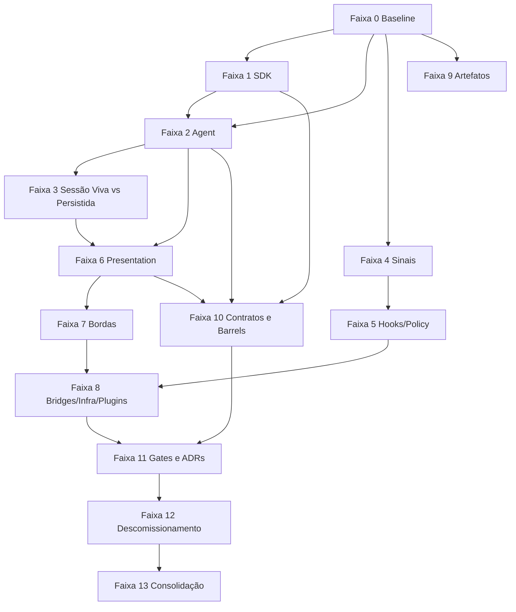

# 23 — Roadmap Macro: Faixas, Fases e Programas da Revolução Arquitetural

**Status**: plano macro TO-BE **Última atualização**: 2026-04-27 **Escopo desta etapa**: descrever,
em nível macro, o programa de transformação completo que levará `src/copilot/` do estado atual para
a situação ideal alvo.

---

## 1. Objetivo deste documento

Este não é um roadmap curto. Este é o **plano macro de uma revolução arquitetural**.

Ele parte da premissa de que `src/copilot/` não será corrigido por uma única refatoração heroica. A
transformação exigirá:

- múltiplas faixas paralelas;
- dezenas de fases encadeadas;
- estabilização contínua por gates;
- documentação crescente;
- migrações sem big-bang;
- e endurecimento institucional das decisões.

O objetivo deste documento é organizar essa revolução em programas grandes o suficiente para dar
visibilidade estratégica, mas concretos o suficiente para orientar execução real.

---

## 2. Estrutura do roadmap

Este roadmap macro é dividido em **14 faixas**.

Cada faixa contém:

- objetivo central;
- problemas que resolve;
- entregáveis macro;
- dependências;
- sinais de pronto;
- riscos.

O detalhamento fino virá no documento seguinte (`24-ROADMAP-SUBFASES-E-ORDEM-DE-ATAQUE.md`).

---

## 3. Faixa 0 — Congelamento Semântico e Linha de Base Executável

### Objetivo

Congelar a semântica do estado atual antes da revolução, para impedir que a migração destrua
comportamento útil por acidente.

### Problemas atacados

- arquitetura densa com pouca linha-base explícita;
- risco de refatoração apagar comportamento verdadeiro;
- falta de snapshots arquiteturais executáveis por domínio.

### Entregáveis macro

- auditoria ampla completa;
- matrizes de fronteira e duplicação;
- conjunto ampliado de testes estruturais;
- snapshots de superfície pública por módulo sensível;
- documentação de owners canônicos.

### Dependências

- nenhuma; é faixa fundacional.

### Sinais de pronto

- cada eixo crítico com documento próprio;
- gates arquiteturais cobrindo fronteiras essenciais;
- inventário completo da topologia atual.

### Risco principal

- começar a migrar antes de congelar o que é comportamento correto.

---

## 4. Faixa 1 — Soberania Radical do SDK Boundary

### Objetivo

Levar `sdk/` ao ponto em que ele seja incontestavelmente o **único owner do vanilla SDK**.

### Problemas atacados

- drift residual entre `sdk/` e consumers;
- capacidades SDK ainda não totalmente promovidas;
- observabilidade de wrappers ainda incompleta;
- riscos de regressão vendor-facing.

### Entregáveis macro

- fechamento de todos os wrappers públicos restantes;
- cobertura de capabilities ainda ausentes do SDK 0.3.x e posteriores;
- fortalecimento de `sdk/types.js` como SSOT absoluto do vendor;
- fechamento da Fase 4 de observabilidade L1;
- integração de recovery por `SdkErrorKind`.

### Dependências

- Faixa 0.

### Sinais de pronto

- nenhuma crude call fora de `sdk/`;
- nenhum consumer externo dependente de detalhe interno do SDK;
- métricas completas dos wrappers críticos;
- taxonomy de erro vanilla fechada.

### Risco principal

- transformar `sdk/` num supermódulo que passe a carregar semântica do runtime local.

---

## 5. Faixa 2 — Purificação do Runtime Vivo em `agent/`

### Objetivo

Tornar `agent/` um runtime soberano, mas semanticamente mais limpo e menos difuso.

### Problemas atacados

- `AgentContext` muito poderoso;
- `AlwaysAliveAgent` potencialmente largo demais;
- façades ainda não monopolizando tudo que deveriam;
- múltiplos pontos de acesso ao runtime.

### Entregáveis macro

- taxonomia interna do runtime por subdomínio;
- consolidação das superfícies semânticas de leitura/comando;
- redução de acesso cru ao contexto;
- runtime state API explícita;
- lifecycle/documentação de ownership do agent.

### Dependências

- Faixa 1 parcialmente avançada;
- Faixa 0 completa.

### Sinais de pronto

- maioria dos módulos internos consumindo façades/ports em vez de handles crus;
- `agent/` com subdomínios mais explícitos;
- invariantes de runtime documentadas e testadas.

### Risco principal

- podar demais e tornar o runtime excessivamente fragmentado.

---

## 6. Faixa 3 — Separação Absoluta entre Sessão Viva e Sessão Persistida

### Objetivo

Resolver definitivamente a disputa entre `agent/`, `conversation-hub/` e módulos adjacentes sobre o
conceito de sessão.

### Problemas atacados

- ambiguidade entre sessão ativa, sessão SDK e sessão persistida;
- sobreposição entre runtime state e conversation store;
- risco de replay/memory/ownership inconsistentes.

### Entregáveis macro

- modelo canônico de sessão tripartido;
- contratos explícitos entre `agent/` e `conversation-hub/`;
- read/write models separados para sessão viva e sessão persistida;
- sincronização explícita entre runtime e store.

### Dependências

- Faixa 2 em progresso;
- Faixa 0/19/20/21 consolidadas.

### Sinais de pronto

- toda feature de sessão classificada como viva, persistida ou vanilla;
- sem owners concorrentes para history/replay/memory.

### Risco principal

- tentar unificar tudo e matar a flexibilidade multi-surface.

---

## 7. Faixa 4 — Redesenho do Sistema de Sinais

### Objetivo

Tornar inequívoca a separação entre:

- eventos vanilla;
- tradução;
- gramática interna;
- observação;
- auditoria.

### Problemas atacados

- múltiplas interpretações do mesmo sinal;
- dificuldade de localizar source-of-truth de eventos;
- event pipelines densos e pouco pedagógicos.

### Entregáveis macro

- catálogo de eventos consolidado;
- boundary explícito `sdk events` → `event-handlers` → `events`;
- contratos estáveis de observação e auditoria;
- naming e namespaces unificados.

### Dependências

- Faixas 1 e 2 em andamento.

### Sinais de pronto

- qualquer evento importante rastreável do vendor até observabilidade sem ambiguidade;
- `observability/` e `audit/` consumindo sinais estabilizados, não reconstruindo-os.

### Risco principal

- tentar centralizar demais e matar a agilidade de evolução do runtime.

---

## 8. Faixa 5 — Purificação de Hooks, Policies e Capability Governance

### Objetivo

Separar com radicalidade policy, capability e governance.

### Problemas atacados

- `hooks/` crescendo para além de callbacks/policies;
- `tools/` assumindo policy por conveniência;
- `agent/` às vezes reescrevendo lógica que deveria ser de callback/policy.

### Entregáveis macro

- taxonomia formal de policy surfaces;
- mapa de onde cada decisão é tomada;
- separação explícita `hooks` vs `tools` vs runtime control;
- contratos de autorização/interceptação mais estáveis.

### Dependências

- Faixas 1, 2 e 4.

### Sinais de pronto

- cada decisão sobre tool/prompt/session situada em owner inequívoco;
- `hooks/` enxuto e forte.

### Risco principal

- enfraquecer ganchos úteis por tentar “limpar” demais o módulo.

---

## 9. Faixa 6 — Monopólio de Projeção pela `presentation/`

### Objetivo

Fazer `presentation/` vencer definitivamente como shared edge layer.

### Problemas atacados

- `server/` e `terminal/` recalculando projeções;
- superfícies semelhantes mantidas em paralelo;
- snapshots inconsistentes por borda.

### Entregáveis macro

- projection catalog central;
- runtime read models oficiais;
- command handlers compartilhados de borda;
- desacoplamento progressivo de `server/terminal` de domínio cru.

### Dependências

- Faixas 2, 3 e 4.

### Sinais de pronto

- toda informação compartilhada por bordas nasce em `presentation/`;
- `server/terminal` viram consumidores finais.

### Risco principal

- transformar `presentation/` em segundo runtime em vez de camada de projeção.

---

## 10. Faixa 7 — Reestruturação das Bordas (`server/`, `terminal/`, `channel/`)

### Objetivo

Redesenhar as bordas para que cada uma pare de carregar domínio implícito demais.

### Problemas atacados

- router sprawl;
- terminal como acúmulo de exceções;
- `channel/` tangenciando semântica conversacional demais.

### Entregáveis macro

- taxonomia de borda por protocolo;
- separação clara entre UX, transporte e domínio;
- contratos edge-safe;
- simplificação das superfícies públicas.

### Dependências

- Faixa 6.

### Sinais de pronto

- qualquer borda consegue ser descrita como adapter, não como owner de semântica.

### Risco principal

- quebrar a ergonomia de uso humano e operacional do sistema.

---

## 11. Faixa 8 — Reordenação de Capabilities Externas (`bridges/`, `plugins/`, `infra/`)

### Objetivo

Delimitar rigidamente adapters externos, infra técnica e extensibilidade.

### Problemas atacados

- `infra/` semântico demais;
- `bridges/` ricos demais;
- `plugins/` sem mandato claro.

### Entregáveis macro

- policy de classificação para modules técnicos;
- bridge contracts formais;
- plano estratégico para `plugins/`;
- limpeza de registries e surfaces infraestruturais.

### Dependências

- Faixa 5 e parcialmente Faixa 7.

### Sinais de pronto

- qualquer módulo desse grupo tem missão curta, objetiva e não concorrente com domínio.

### Risco principal

- eliminar flexibilidade útil em nome de pureza teórica.

---

## 12. Faixa 9 — Rebaixamento de Artefatos e Higienização do Código-Árvore

### Objetivo

Remover artefatos operacionais do centro semântico de `src/copilot/`.

### Problemas atacados

- `.github/` e `logs/` parecendo módulos;
- mistura entre código, estado e output;
- dificuldade de leitura arquitetural limpa.

### Entregáveis macro

- relocation plan para artefatos;
- resolução explícita de paths de estado/output via `boot/config`;
- limpeza da árvore de código.

### Dependências

- Faixas 0 e 21.

### Sinais de pronto

- árvore `src/copilot/` lida como código e contratos, não como mistura com resíduos de runtime.

### Risco principal

- quebrar fluxos de tooling que hoje assumem paths antigos.

---

## 13. Faixa 10 — Unificação de Contratos e Barrels Públicos

### Objetivo

Reduzir o custo cognitivo do consumo entre módulos sem criar mega-barrels perigosos.

### Problemas atacados

- superfícies públicas assimétricas;
- barrels demais ou barrels de menos;
- typedef surfaces espalhadas.

### Entregáveis macro

- política de barrel por módulo;
- policy de contract surfaces;
- revisão de `types/`, `index.js`, `facades/index.js`, ports e adapters públicos.

### Dependências

- Faixas 1–9 em progresso.

### Sinais de pronto

- consumer sabe intuitivamente onde importar algo sem reabrir topologia interna.

### Risco principal

- criar barrels tão grandes que escondam a arquitetura em vez de clarificá-la.

---

## 14. Faixa 11 — Endurecimento Institucional (gates, lint, tests, ADRs)

### Objetivo

Transformar a nova arquitetura em realidade **executável e defendida automaticamente**.

### Problemas atacados

- arquitetura só documental;
- regressão por conveniência local;
- conhecimento centralizado demais em poucos maintainers.

### Entregáveis macro

- novos gates por fronteira;
- lint/restricted-imports por domínio;
- structural tests por owner;
- ADRs estruturais resumidas;
- checklists de PR por eixo.

### Dependências

- faixas anteriores suficientemente maduras.

### Sinais de pronto

- regressões arquiteturais passam a falhar automaticamente no CI.

### Risco principal

- gates excessivamente rígidos atrasarem evolução saudável.

---

## 15. Faixa 12 — Migração de Longa Duração e Descomissionamento de Legados

### Objetivo

Remover caminhos antigos, compat shims e owners acidentais restantes.

### Problemas atacados

- legado congelado na árvore;
- caminhos paralelos mantidos “temporariamente” por tempo demais;
- doc drift entre TO-BE e AS-IS migrado.

### Entregáveis macro

- tabela de deprecações internas;
- plano de remoção de módulos/entrypoints/shims;
- limpeza final de imports históricos;
- revisão final da topologia.

### Dependências

- Faixas 1–11 substancialmente completas.

### Sinais de pronto

- arquitetura efetiva convergida com a arquitetura documentada.

### Risco principal

- descomissionar cedo demais e quebrar compatibilidade operacional.

---

## 16. Faixa 13 — Consolidação da Arquitetura Revolucionada

### Objetivo

Fechar a revolução com arquitetura estabilizada, governada e mensurável.

### Problemas atacados

- transformação longa sem fechamento formal;
- risco de nova deriva logo após a migração;
- falta de indicadores de maturidade arquitetural.

### Entregáveis macro

- scorecard arquitetural por módulo;
- versão final da taxonomia;
- documentação de operação e evolução;
- baseline final de owners, seams e gates.

### Dependências

- todas as faixas anteriores.

### Sinais de pronto

- `src/copilot/` deixa de ser apenas “grande e funcional” e passa a ser “grande, funcional e
  governável”.

### Risco principal

- considerar a revolução concluída antes de consolidar governança e manutenção de longo prazo.

---

## 17. Mapa de dependências entre faixas

---

## 18. Critérios de sucesso macro da revolução

A revolução só pode ser considerada bem-sucedida quando todos estes critérios forem verdadeiros:

1. o owner principal de cada responsabilidade central é inequívoco;
2. `sdk/` é incontestável como fronteira vanilla;
3. `agent/` é runtime vivo e apenas runtime vivo;
4. `conversation-hub/` domina o persistido sem invadir o vivo;
5. `presentation/` vence a disputa por projeção compartilhada;
6. `server/terminal` são adapters finais;
7. `hooks/` é policy, `tools/` é capability, `observability/` observa, `audit/` governa;
8. `infra/` e `bridges/` não invadem domínio;
9. artefatos deixam de parecer subdomínios;
10. gates e testes impedem regressão estrutural.

---

## 19. Conclusão desta etapa

O roadmap macro mostra que a transformação necessária não é uma correção tática. É um **programa
arquitetural de longo curso**.

Ele exigirá:

- endurecimento do que já está certo;
- reclassificação do que está ambíguo;
- desmontagem do que virou owner acidental;
- institucionalização da nova ordem.

O próximo documento detalha essa revolução em **subfases, ondas e ordem de ataque**, com
granularidade suficiente para execução extensa e continuada.
