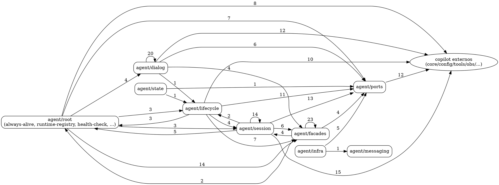
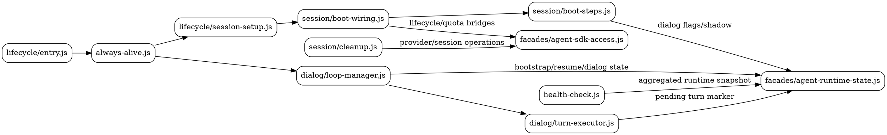
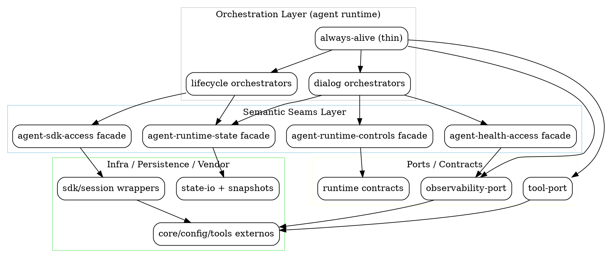

# 57 — Auditoria geral de `src/copilot/agent`: grafos AS-IS, TO-BE e roadmap consolidado

Data: 2026-04-29 Escopo: `src/copilot/agent/**` Base metodológica: continuidade dos checkpoints
42–56 + inspeção estrutural atual + medição factual de dependências.

---

## 1) Resumo executivo

`src/copilot/agent` está em **estágio avançado de convergência semântica** (especialmente em
runtime-state, lifecycle SDK e boot wiring), mas ainda apresenta **densidade alta de acoplamento
transversal** entre eixos de orquestração, estado e observabilidade.

Medições atuais (madge sobre `src/copilot/agent`):

- nós: **178**
- arestas: **431**
- ciclos detectados: **0** (ótimo)
- hotspots de fan-out:
  - `always-alive.js` (18)
  - `facades/index.js` (16)
  - `dialog/loop-manager.js` (15)
  - `lifecycle/agent-lifecycle.js` (14)
- hotspots de fan-in:
  - `ports/observability-port.js` (35)
  - `../config/agent.js` (23)
  - `../core/error-handlers.js` (22)
  - `../tools/logger.js` (21)
  - `../tools/tool-factory.js` (18)
  - `facades/agent-sdk-access.js` (15)

Leitura arquitetural: o módulo já saiu da fase de "acoplamento circular bruto", mas ainda precisa
reduzir pontos de concentração (especialmente observabilidade e root orchestration).

---

## 2) Grafo AS-IS — macro-topologia atual (subdomínios)

### 2.1 Grafo macro (alto nível)

### 2.2 Interpretação

1. **Sem ciclos explícitos**: melhoria forte de robustez estrutural.
2. **`root` ainda denso**: melhor que antes, mas com papel de orchestration + compat ainda elevado.
3. **`facades` já é backbone real**: bom sinal de convergência semântica.
4. **`ports/observability-port` com fan-in muito alto**: risco de virar “semi-god port”.
5. **dependência externa ainda grande**: esperado por fase, mas alvo de redução nas próximas ondas.

---

## 3) Grafo AS-IS — fluxo operacional crítico (boot → loop → health → shutdown)

Interpretação: o fluxo principal está semanticamente melhor delimitado do que nas fases anteriores
(42–56), com `runtime-state` e `sdk-access` sendo seams reais de domínio.

---

## 4) Grafo TO-BE — situação ideal proposta

Princípios TO-BE:

1. **orquestração não persiste estado cru**;
2. **orquestração não fala com SDK vanilla diretamente**;
3. **health/status derivam de snapshots semânticos agregados**;
4. **`always-alive` atua como coordenador fino (não como owner de detalhes)**.

---

## 5) Auditoria de maturidade atual (`src/copilot/agent`)

### 5.1 Pontos já convergidos (consistentes com 42–56)

- lifecycle SDK com seam dedicado (`agent-sdk-access`);
- recuperação de dialog em boot sem `state-io` inline;
- `loop-manager` e `turn-executor` convergidos para runtime-state semântico;
- cleanup com proteção de sessão foreground/last-session;
- health com leitura semântica agregada.

### 5.2 Gaps estruturais restantes

1. **P6 — Presentation monopoly incompleto**
   - status/health/lifecycle ainda montam payloads com padrões parcialmente repetidos.
2. **Hotspot de observabilidade em ports**
   - alto fan-in no `observability-port` pede modularização fina por domínio de sinal.
3. **Root orchestration ainda espesso**
   - `always-alive` evoluiu, porém ainda acumula algumas superfícies transitórias.
4. **SDK model/session debt adjacente**
   - drift residual entre lifecycle, registry e resolução de modelo ainda exige convergência.

---

## 6) Roadmap consolidado (o que falta, junto ao que já avançou)

### Faixa R1 (curto prazo, baixo risco, alto retorno)

- **R1.1**: concluir P6 no `presentation/` (meta/runtime projection unificada, sem montagem paralela
  redundante);
- **R1.2**: reduzir duplicações de metadata runtime em payloads HTTP/SSE;
- **R1.3**: travar contracts de projection com testes estruturais adicionais.

### Faixa R2 (médio prazo, transformação de ownership)

- **R2.1**: fatiar `observability-port` por domínios (`lifecycle`, `dialog`, `quota`, `errors`);
- **R2.2**: reduzir fan-out de `always-alive` com extração de orquestradores de fase;
- **R2.3**: consolidar pipeline boot/start em steps declarativos com relatórios estáveis.

### Faixa R3 (profundidade arquitetural)

- **R3.1**: convergência final SDK session/model lifecycle (registry + cache + resolution);
- **R3.2**: congelar API semântica dos facades com “seam contracts” anti-regressão;
- **R3.3**: reforçar governança de imports (proibir bypass de seams por novos pontos).

---

## 7) Plano de execução recomendado (próximas ondas)

1. **Onda imediata (já em curso)**: P6 em `presentation` + fechamento de metadata runtime
   compartilhada.
2. **Onda seguinte**: descompressão de `always-alive` e de `observability-port`.
3. **Onda subsequente**: convergência final de SDK model/session debts.

Com isso, `src/copilot/agent` transita de “runtime robusto com hotspots de concentração” para
“runtime modular com ownership semântico estável e baixo acoplamento transversal”.
