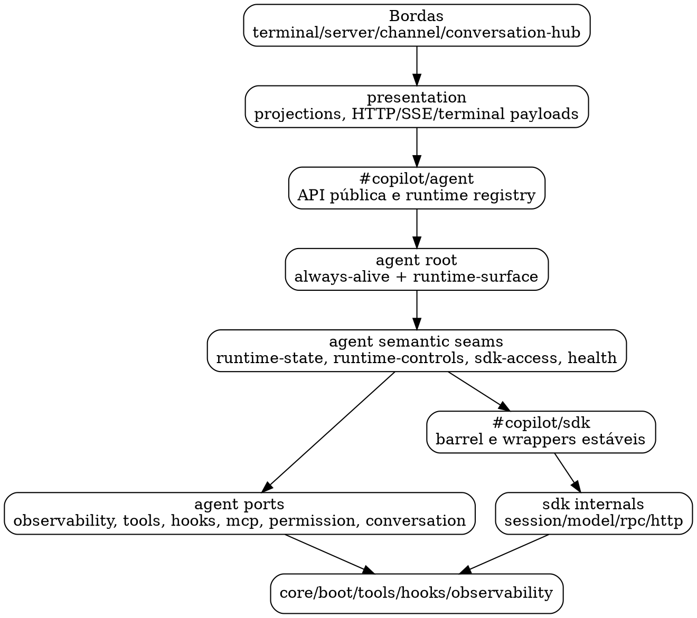

# 58 — Avaliação do faltante para a nova arquitetura de `src/copilot/agent` e integração com `src/copilot`

**Data:** 2026-04-29 **Escopo:** `src/copilot/agent/**` e suas fronteiras com `presentation`,
`terminal`, `server`, `conversation-hub`, `sdk`, `tools`, `hooks`, `observability`, `core` e `boot`.

---

## 1) Estado atual consolidado

O `agent` já está em uma fase estruturalmente melhor que a registrada nos documentos 52–57:

- não há ciclos internos em `src/copilot/agent`;
- `turn-executor` e `loop-manager` convergiram para `agent-runtime-state`;
- `always-alive.js` foi reduzido a root compatível sobre `agent-runtime-surface.js`;
- `observability-port.js` deixou de ser dependência direta do miolo do agent e virou aggregate
  compatível;
- `presentation` começou a consolidar projections reutilizáveis, especialmente metadata de runtime e
  fallback;
- `terminal:llm-b` já preserva `model="auto"` até o SDK, permitindo roteamento nativo quando um
  modelo concreto está bloqueado por quota.

Medição factual desta rodada:

- `npx madge src/copilot/agent --extensions js --circular`: **0 ciclos internos**;
- `npx madge src/copilot --extensions js --circular`: **0 ciclos globais** após a extração da porta
  `sdk/models/client-provider.js`.

Leitura: a nova arquitetura do `agent` está próxima do alvo e a árvore global de `src/copilot` agora
está sem ciclos detectados; permanecem dívidas de boot transacional, projections e governança de
imports.

---

## 2) Situação TO-BE proposta

### 2.1 Camadas desejadas

### 2.2 Regras arquiteturais-alvo

1. Bordas (`server`, `terminal`, `channel`, `conversation-hub`) não conhecem `agent/facades/*`.
2. `presentation` consome `#copilot/agent`, não caminhos profundos internos do agent.
3. O `agent` só acessa SDK vanilla por `agent/facades/*` e `agent/ports/*`.
4. Estado persistido do agent passa por `agent-runtime-state` ou por módulos de storage claramente
   marcados como infra (`state-io`, `snapshot`).
5. `always-alive.js` permanece como singleton/API compatível, não como owner de detalhes.
6. Boot e shutdown produzem relatórios estáveis e rollback previsível.
7. O SDK remove ciclos internos de model/session antes de virar fundação final para multi-runtime.

### 2.3 Critérios objetivos para declarar Arquitetura 2.0

A migração 2.0 só deve ser considerada concluída quando todos os gates abaixo estiverem verdes por
contrato automatizado e por teste operacional:

- **Gate 2.0-A — fronteira pública do agent:** nenhum consumidor fora de `src/copilot/agent` abre
  `agent/facades/*`, `agent/error-policy.js` ou propriedades voláteis (`status`, `sessionId`,
  `dialogLoopActive`, `dialogPaused`) quando já houver façade/projection canônica.
- **Gate 2.0-B — presentation monopoly:** rotas HTTP/SSE, terminal commands e channel clients não
  montam payload operacional de agent diretamente; status, health, capabilities, runtime metadata e
  erros passam por `presentation/*`.
- **Gate 2.0-C — multi-runtime explícito:** todo endpoint associado a agent/SDK aceita ou preserva
  `runtimeId`, responde com `runtimeId/requestedRuntimeId/runtimeFound/usedDefaultRuntimeFallback`
  quando aplicável e nunca usa mutex/estado process-wide para serializar runtimes independentes.
- **Gate 2.0-D — estado global governado:** estado mutável de runtime fica em
  `agent/runtime-registry`, registries explícitos, stores terminal-local documentados ou mapas SSE
  chaveados por runtime. Qualquer outro global deve ter justificativa e contrato.
- **Gate 2.0-E — facades congeladas por contrato:** cada façade crítica possui dono declarado
  (`query`, `mutation`, `lifecycle`, `infra`, `projection`), export público mínimo e teste
  anti-bypass.
- **Gate 2.0-F — operação comprovada:** `typecheck:strict:src.copilot`,
  `typecheck:strict:tests.unit`, `lint`, suíte copilot, `format`, `madge src/copilot --circular` e
  teste live `terminal:llm-b` ficam verdes depois das transformações finais.

---

## 3) Dívidas restantes por domínio

### D1 — Integração externa com o agent

**Situação atual:** parte de `presentation` já consome `#copilot/agent`, mas ainda havia imports
profundos para `agent/facades/*` e `agent/error-policy.js`.

**Meta:** consumidores fora de `agent` acessam somente o barrel público `#copilot/agent`, enquanto
tipos estruturais locais usam `Parameters<>`, `ReturnType<>` ou typedefs próprios de borda.

**Status desta rodada:** aplicada para `presentation` e `conversation-hub`, com contrato estrutural
anti-regressão.

### D2 — SDK model/session cycles

**Situação atual:** o grafo global ainda acusa ciclos entre:

- `sdk/models/helpers.js`;
- `sdk/session/client.js`;
- `sdk/session/lifecycle.js`;
- `sdk/models/index.js`.

**Risco:** esse ciclo mantinha acoplamento bidirecional entre resolução de modelo e lifecycle de
sessão, exatamente a zona associada ao comportamento `auto`, fallback e quotas.

**Status desta rodada:** `sdk/models/helpers.js` deixou de importar `session/client.js`; a listagem
de modelos usa a porta `sdk/models/client-provider.js`, registrada por `session/client.js` quando o
runtime SDK é carregado. Isso removeu a aresta estática/dinâmica `models -> client` e zerou os
ciclos globais detectados por `madge`.

**Meta:** separar `model-catalog/model-resolution` de `session/client`, mantendo `client` dependente
de uma porta estável e não de helpers que retornam ao client.

### D3 — Boot transacional e ownership de recursos

**Situação atual:** a maior parte do boot runner já existe, mas ainda restam itens em 53:

- revisão fina de `timers.cancelAll` versus `agent.stop`;
- rollback direto de subfase antes do shutdown central;
- ampliação da superfície mínima validada conforme recursos obrigatórios crescem;
- métricas agregadas por fase/handler.

**Meta:** cada fase tem owner, timeout, rollback e relatório padronizado.

### D4 — Estado persistido de diálogo e user input

**Situação atual:** `turn-executor` já usa `agent-runtime-state`; nesta rodada, `user-input-handler`
também deixou de tocar `state-io` diretamente e passou a persistir `pendingQuestion` via
`persistAgentRuntimePendingQuestionState`.

**Meta:** todo estado semântico de pending question, shadow, pending turn, dialog paused e shutdown
passa pela façade `agent-runtime-state`.

### D5 — Facades e ports como contratos congelados

**Situação atual:** facades são o backbone real do agent, mas nem todas têm contratos públicos
anti-regressão tão fortes quanto lifecycle/SDK.

**Meta:** cada facade crítica tem:

- teste de export público;
- contrato de “não bypass”;
- tipo/projection esperado;
- ownership claro: query, mutation, lifecycle ou infra.

### D6 — Presentation monopoly

**Situação atual:** metadata de runtime foi centralizada; ainda há projections que podem convergir
mais para `runtime-overview`, `runtime-health`, `runtime-status` e `runtime-controls`.

**Meta:** server/terminal não montam payloads próprios de agent; consomem projections
compartilhadas.

### D7 — Governança global de imports

**Situação atual:** há contratos para alguns boundaries, mas ainda não há uma matriz completa de
regras por camada.

**Meta:** `tests/unit/copilot/contracts` deve codificar a matriz:

- external -> presentation -> `#copilot/agent`;
- agent -> sdk apenas via facades/ports;
- agent -> observability apenas via ports finas;
- server/terminal/channel não abrem internals de agent;
- sdk model/session sem ciclo.

---

## 4) Roadmap completo

### Faixa A — Fechar fronteira externa do agent

- [x] Migrar `presentation` de imports profundos para `#copilot/agent`.
- [x] Migrar typedef profundo em `conversation-hub` para `Parameters<typeof sendAgentDialogTurn>`.
- [x] Exportar `classifyAgentError` pelo barrel público do agent.
- [x] Criar contrato estrutural proibindo `agent/facades/*` e `agent/error-policy.js` fora de
      `agent`.
- [x] Auditar `server`, `terminal`, `channel` e `runtime-wiring` para reduzir imports diretos do
      singleton quando uma projection de `presentation` bastar.

### Faixa B — Remover ciclos globais do SDK

- [x] Remover dependência estática de `sdk/session/client.js` dentro do eixo de models;
- [x] Criar `sdk/models/client-provider.js` como porta interna de provider de client;
- [x] Registrar o provider em `sdk/session/client.js`, preservando a API pública;
- [x] Separar `sdk/models/helpers.js` em:
  - helpers puros de catálogo/model metadata;
  - adapter de lifecycle que recebe dependências por parâmetro;
- [x] Fazer `session/lifecycle.js` depender de uma interface de resolução, não do barrel de models;
- [x] Validar `madge src/copilot --circular` sem ciclos globais.

### Faixa C — Consolidar estado de diálogo

- [x] Promover persistência de `user-input-handler` para `agent-runtime-state`;
- [x] Adicionar capability `persistAgentRuntimePendingQuestionState`;
- [x] Proibir `dialog/*` de importar `lifecycle/state-io.js` diretamente, exceto módulos
      explicitamente infra;
- [x] Cobrir com testes focados em pending question/shadow/recovery e contrato anti-bypass em
      `dialog/*`.

### Faixa D — Boot/shutdown como runtime transacional final

- [x] Finalizar rollback direto de subfase;
- [x] Criar snapshot de timers ativos no diagnóstico;
- [x] Conectar métricas agregadas por fase de boot/shutdown;
- [x] Atualizar validação de superfície obrigatória para cobrir novos exports públicos do agent;
- [x] Reexecutar teste live `terminal:llm-b` com boot, diálogo e `/quit`.

### Faixa E — Congelar facades/ports

- [x] Criar matriz de facades críticas e donos:
  - `agent-runtime-state`: persistência semântica;
  - `agent-runtime-controls`: controles/mutações;
  - `agent-sdk-access`: lifecycle vanilla SDK;
  - `agent-sdk-runtime`: eventos/send/read de sessão;
  - `agent-health-access`: input consolidado de health;
  - portas finas de observability/tools/hooks/mcp/conversation.
- [x] Criar contrato de export público mínimo para facades críticas no barrel `#copilot/agent`.
- [x] Para cada uma, adicionar teste de bypass.
- [x] Reduzir imports cruzados entre facades quando houver caminho de query mais simples.
  - [x] Remover leituras voláteis remanescentes (`status/sessionId/dialogLoopActive/dialogPaused`)
        em `channel`, `runtime-wiring`, `runtime-host`, `runtime-sdk-session` e capability snapshot,
        substituindo por `readRuntimeControlState`, `readAgentStatusSnapshot` e projections de
        `presentation`.
  - [x] Exportar e consumir `readRuntimePermissionMode` pelo barrel público do agent para evitar que
        bordas/projections precisem chamar métodos legados de permission mode diretamente.
  - [x] `agent-runtime-capabilities` passou a reutilizar helpers de governance
        (`readRuntimePermissionMode`, `readRuntimePermissionCapability`,
        `readRuntimeContextFactoryCapabilities`, `readRuntimeToolRegistryEntries`) em vez de
        remontar snapshots do contexto diretamente.
  - [x] Ampliar a matriz de bypass para facades secundárias (`agent-runtime-tools`,
        `agent-runtime-webhooks`, `agent-runtime-todos`) com contrato de consumidor e de ownership
        query/admin.
  - [x] Criar matriz executável de tipo de operação por façade (`query`, `mutation`, `lifecycle`,
        `infra`, `projection`) para bloquear import cruzado que reabra ownership sem necessidade.

### Faixa F — Presentation monopoly final

- [x] Server routes passam a usar somente `presentation/*`;
  - [x] `server/routes/sdk/{agent,client,observability,session-messaging}.js` não montam mais
        status/session/tools a partir de estado vivo do `agent`; usam projections/capabilities
        runtime-aware em `presentation/*`.
  - [x] `server/routes/copilot-api/{control,dialog,tasks,stream}.js` propagam metadata de runtime
        (`runtimeId/requestedRuntimeId/runtimeFound/usedDefaultRuntimeFallback`) via helpers de
        `presentation/runtime-meta`.
  - [x] `server/routes/sessions.js` deixou de abrir `CONVERSATION_STORE`, `container` e
        `getSharedSdkSessionId`; CRUD de hub session passou para `presentation/conversation-hub`.
- [x] Terminal handlers passam a usar somente `presentation/*` para payloads/status;
  - [x] `/tools` deixou de consultar `observability` diretamente e passou a consumir
        `readTerminalToolStatsProjection()`, que usa projection compartilhada em
        `presentation/system-metrics`.
- [x] `presentation/runtime-overview` vira a leitura padrão para status/health/context/pr;
  - [x] `runtime-health.resolveAgentHealthSelection()` passou a usar `readAgentRuntimeOverview()`
        como base da seleção de runtime/health.
  - [x] `/copilot-api/health` deixou de montar health, permission mode, versão de canal/SDK,
        listener diagnostics e health do hub dentro da rota; a montagem passou para
        `buildCopilotApiHealthHttpResponseFromRoute()`.
- [x] Criar contratos impedindo payload ad hoc de status/health fora de `presentation`.
- [x] Inventariar rotas não-agent (`server/routes/sessions.js`, `server/routes/health.js` em
      `/ws/info` e equivalentes) para separar dívida real de payload operacional de runtime de
      payload meramente HTTP/hub.

### Faixa G — Preparação para multi-runtime/multi-agent

- [x] Garantir que todo endpoint aceita/propaga `runtimeId`;
  - [x] `copilot-api` principal propaga metadata de runtime em status/session/capabilities,
        dialog/tasks/stream e fallback explícito;
  - [x] rotas SDK de client/agent/observability agora ecoam metadata canônica também em endpoints
        globais (`ping/auth/models/metrics/errors/logs/audit`);
  - [x] rotas SDK de sessão CRUD/messaging/hooks propagam metadata canônica de runtime em respostas
        HTTP e eventos iniciais SSE;
  - [x] broadcasts SSE de `copilot-api`, `sdk/agent`, `sdk/hooks` e `sdk/session` carregam
        `runtimeId` no payload, e streams de sessão SDK passam a ser chaveados por
        `runtimeId:sessionId` para evitar colisão entre runtimes.
- [x] Separar default runtime de runtime selecionado em projections e comandos;
- [x] Evitar estado global implícito fora de `runtime-registry`;
  - [x] `copilot-api/dialog` deixou de usar mutex global process-wide em `/dialog/turn` e passou a
        chavear concorrência por `runtimeId`, permitindo turnos simultâneos em runtimes distintos.
  - [x] Mapear todos os Maps/sets module-level remanescentes e classificá-los como registry,
        terminal-local, SSE connection state ou dívida arquitetural.
  - [x] Criar contrato executável para os estados vivos de rotas multi-runtime (`dialog/turn`,
        `copilot-api/stream`, `sdk/agent`, `sdk/hooks`, `sdk/session`) exigindo chaveamento por
        `runtimeId`.
- [x] Criar teste de dois runtimes registrados com fallback explícito.

---

## 5) Próxima ordem de ataque recomendada

As Faixas A, B, C e D já estão operacionalmente completas. A próxima onda deve concentrar a migração
2.0 nos pontos que ainda podem gerar comportamento incorreto quando o sistema deixa de ser
single-runtime:

1. **G1 — concorrência por runtime:** remover qualquer mutex/global process-wide de rotas de
   agent/SDK. Primeiro alvo: `/copilot-api/dialog/turn`.
2. **G2 — metadata runtime completa:** fechar endpoints SDK/observability restantes que ainda
   respondem sem metadata canônica em casos de validação, tail, catalog, dead-letter e OTEL.
3. **E2 — contrato semântico de facades:** transformar a matriz de facades em teste executável de
   ownership por operação.
4. **F2 — inventário de rotas não-agent:** marcar explicitamente quais rotas são hub/server-only
   para não contaminarem a métrica de presentation monopoly.
5. **D2 — gates operacionais finais:** após a próxima leva de refactors, rodar typecheck strict,
   lint, suíte copilot, format, madge e novo teste live `terminal:llm-b`.

Critério de conclusão da migração:

- `src/copilot/agent` sem ciclos internos;
- `src/copilot` sem ciclos globais;
- `typecheck:strict:src.copilot` verde;
- `eslint src/copilot --max-warnings=0` verde;
- suíte unitária `tests/unit/copilot` verde;
- `terminal:llm-b` inicia, conversa em `model=auto`, e encerra via `/quit`;
- contracts impedem retorno de deep imports e bypasses críticos.

---

## 6) Checkpoint executado nesta rodada

### Transformações aplicadas

- `presentation` e `conversation-hub` foram alinhados para consumir a superfície pública
  `#copilot/agent`, fechando imports profundos de `agent/facades/*` e `agent/error-policy.js`.
- `classifyAgentError` passou a ser export público do barrel do agent para uso legítimo nas bordas.
- `dialog/user-input-handler` passou a persistir `pendingQuestion` via
  `persistAgentRuntimePendingQuestionState`, reduzindo bypass direto de `lifecycle/state-io.js`.
- `sdk/models/client-provider.js` foi introduzido para quebrar o ciclo model/session sem alterar a
  API externa de listagem de modelos.
- Contratos de arquitetura foram ampliados para proteger:
  - o barrel público do agent;
  - a proibição de deep import externo para facades/error-policy;
  - a ausência de bypass `dialog/* -> lifecycle/state-io.js`;
  - a remoção da dependência `sdk/models/helpers.js -> sdk/session/client.js`.

### Validação executada

- `npm run typecheck:strict:src.copilot`: **verde**.
- `npx eslint src/copilot ... --max-warnings=0`: **verde**.
- `npx madge src/copilot --extensions js --circular`: **0 ciclos globais**.

---

## 15) Checkpoint de continuação — SSE e session routes multi-runtime hardened

### Transformações aplicadas

- `channel/client.js`, `runtime-wiring.js`, `presentation/runtime/sdk-session.js`,
  `agent/facades/agent-runtime-capabilities.js` e `agent/lifecycle/runtime-host.js` deixaram de ler
  propriedades voláteis do agent diretamente (`status/sessionId/dialogLoopActive/dialogPaused`) e
  passaram a consumir snapshots/projections canônicas.
- `server/routes/sdk/session-crud.js` passou a anexar metadata de runtime em respostas de
  `active/last/binding/foreground/list/create/detail/delete/disconnect/resume/compaction-history`,
  incluindo falhas de validação de provider/model e endpoints destrutivos.
- `server/routes/sdk/session-messaging.js` passou a anexar metadata de runtime nas respostas de
  `send/stream/model/log/abort/messages/workspace/ui/permissions/tools/commands/compaction/shell`.
- O estado SSE de `/api/sdk/sessions/:id/stream` deixou de ser global por `sessionId` e passou a ser
  chaveado por `runtimeId:sessionId`, evitando colisão quando dois runtimes têm sessões com o mesmo
  identificador.
- Broadcasts SSE de `copilot-api/stream`, `sdk/agent`, `sdk/hooks` e `sdk/session` passaram a
  incluir `runtimeId` no payload padronizado, não apenas no evento inicial `connected`.
- Respostas de limite SSE (`429/503`) passaram a devolver metadata runtime quando a rota já consegue
  resolver o runtime.
- `test_arch_contracts` foi ampliado para bloquear regressão de:
  - leitura direta de propriedades voláteis nas bordas;
  - SSE sem `runtimeId` em broadcasts;
  - stream SDK de sessão indexado apenas por `sessionId`.

### Validação executada

- `npm run typecheck:strict:src.copilot`: **verde**.
- `eslint` focado em `src/copilot` e contratos alterados: **verde**.
- testes focados:
  - `test_arch_contracts`;
  - `test_sdk_route_session_ownership`;
  - `test_sdk_runtime_projection_routes`;
  - `test_copilot_api_runtime_metadata`;
  - `test_llm_bridge_client`;
  - `test_presentation_runtime_sdk_session`. Resultado: **98/98 testes verdes**.
- `npx madge src/copilot/agent --extensions js --circular`: **0 ciclos internos**.
- `npx vitest run --config vitest.copilot.config.js tests/unit/copilot --testTimeout=60000`: **4303
  testes passaram, 28 skipped**.

### Próximo bloco recomendado

O próximo maior custo-benefício é a **Faixa D**: completar boot/shutdown transacional com rollback
de subfase, diagnóstico de timers ativos e teste live controlado de `terminal:llm-b`. A base de
agent e SDK já está mais limpa; agora vale atacar a confiabilidade operacional do processo vivo.

---

## 7) Checkpoint de continuação — lifecycle transacional

### Transformações aplicadas

- `BootPhaseRunContext.registerRollback()` permite rollback parcial durante a própria fase que
  falha, antes do shutdown central.
- `bootstrap.js` registra rollbacks diretos para:
  - `terminal-pinned-context:pinned-context`;
  - `copilot-http-server:http-server`;
  - `terminal-runtime-listeners:runtime-listeners`.
- `terminal/index.js` ganhou rollbacks idempotentes para pinned context, HTTP server, listeners,
  timers e `SIGHUP`.
- `core/timer-registry.js` expõe `listActiveTimers()` sem vazar handles nativos.
- `runtime-lifecycle` e `/diagnose` passam a exibir timers ativos e métricas agregadas.
- `boot/surface-validation.js` valida `#copilot/core`, novos exports públicos de `#copilot/agent` e
  rollbacks transacionais do terminal.

### Validação parcial executada

- `npm run typecheck:strict:src.copilot`: **verde** após os ajustes de lifecycle.
- Testes focados de boot/surface/shutdown/lifecycle/diagnose/bootstrap: **verdes**.

---

## 8) Checkpoint de continuação — monopoly de presentation nas rotas SDK

### Transformações aplicadas

- `presentation/runtime/tools.js` ganhou `readAgentRuntimeToolsProjectionForRuntime(runtimeId)`.
- `presentation/runtime/status.js` ganhou leituras `readAgentStatusSnapshotForRuntime()` e
  `readAgentStatusValueForRuntime()`.
- `presentation/sdk/sessions.js` ganhou `resolveSdkRuntimeProjectionForRuntime()`, removendo a
  necessidade de passar o singleton vivo do agent para rotas de status/start/state.
- `presentation/runtime/sdk-session.js` ganhou `resolveAgentSdkActiveSessionEntry()`, encapsulando o
  fallback da sessão permanente do AlwaysAlive quando ela ainda não está no registry SDK.
- `agent/facades/agent-health-access.js` passou a ser exportado pelo barrel público do agent e a
  matriz mínima de facades críticas passou a ter contrato de export em `test_arch_contracts`.
- `server/routes/sdk/{agent,client,observability,session-messaging}.js` passaram a consumir essas
  projections/capabilities por `runtimeId`.
- `tests/unit/copilot/contracts/test_arch_contracts.spec.js` agora bloqueia regressões nas rotas SDK
  que voltem a ler `agent.status`, `agent.sessionId`, `routeDeps.agent` ou projections antigas com
  `agent` cru.

### Validação executada

- `npm run typecheck:strict:src.copilot`: **verde**.
- Testes focados de rotas/projections/contratos: `test_sdk_runtime_projection_routes`,
  `test_presentation_runtime_route_deps`, `test_presentation_runtime_status`, `test_arch_contracts`:
  **verdes**.

---

## 9) Checkpoint de continuação — Faixa B com interface explícita de model resolution

### Transformações aplicadas

- `sdk/session/lifecycle.js` deixou de acionar resolução de `model="auto"` por import lazy do barrel
  `../models/index.js`.
- Foi criada a porta `sdk/session/model-resolution-port.js`, com:
  - `setSessionAutoModelResolver()` para injeção de estratégia;
  - `resolveSessionAutoModel()` para consumo canônico no lifecycle.
- Foi criado o adapter `sdk/models/session-resolution-adapter.js`, mantendo a resolução baseada em
  catálogo no domínio de models e oferecendo factory injetável:
  - `createSessionAutoModelResolver({ listModelsFn, resolveModelIdAutoFn })`;
  - `resolveSessionAutoModelFromCatalog()`.
- Contratos arquiteturais foram ampliados em `test_arch_contracts` para garantir:
  - ausência de `models/index` no lifecycle de sessão;
  - dependência explícita da porta `session/model-resolution-port`;
  - presença do adapter dedicado de resolução no domínio `models`.

### Validação executada

- `npm run typecheck:strict:src.copilot`: **verde**.
- `eslint` focado em sdk/session/models + contratos: **verde**.
- testes focados:
  - `test_sdk_session_core_lifecycle`;
  - `test_sdk_session_model_resolution_port`;
  - `test_sdk_models_session_resolution_adapter`;
  - `test_arch_contracts`. Resultado: **58/58 testes verdes**.

---

## 10) Checkpoint de continuação — validação live `terminal:llm-b` (Faixa D)

### Execução realizada

- comando: `npm run terminal:llm-b`;
- evidências observadas no runtime:
  - boot completo do terminal/server/hub/eventbus;
  - `AlwaysAliveAgent` inicializado com sessão retomada;
  - runtime em `model="auto"` preservado até o SDK;
  - loop de diálogo iniciado com `READY`.
- encerramento controlado por comando interativo: `/quit`.

### Resultado

- shutdown gracioso concluído com handlers executados (`timers`, `hub`, `agent.stop`, `server`,
  `eventbus`, `audit.flush`, `event-collector.flush`);
- processo finalizou com **exit code 0**;
- item pendente da Faixa D (“reexecutar teste live com `/quit`”) passa a concluído.

---

## 11) Checkpoint de continuação — presentation monopoly em `health` e `webhooks`

### Transformações aplicadas

- `presentation/runtime/health.js` ganhou `buildAgentHealthHttpResponse(runtimeId)`, encapsulando:
  - resolução de runtime alvo;
  - metadata de fallback;
  - status HTTP derivado do snapshot canônico de health.
- `server/routes/health.js` deixou de montar payload de runtime/health manualmente e passou a
  consumir a projection HTTP de `presentation`.
- `presentation/runtime/webhooks.js` ganhou projections HTTP canônicas:
  - `buildRuntimeWebhooksListHttpPayload(runtimeId)`;
  - `registerRuntimeWebhookHttp(url, runtimeId)`;
  - `unregisterRuntimeWebhookHttp(id, runtimeId)`.
- `server/routes/webhooks.js` deixou de montar metadata ad hoc de runtime e passou a consumir apenas
  essas projections.
- `test_arch_contracts` foi ampliado para bloquear regressões nas rotas `health/webhooks` que voltem
  a montar payload runtime manualmente.

### Validação executada

- `npm run typecheck:strict:src.copilot`: **verde**.
- `eslint` focado (`presentation/runtime-{health,webhooks}` + rotas + contratos): **verde**.
- testes focados:
  - `test_presentation_runtime_health`;
  - `test_presentation_runtime_webhooks`;
  - `test_webhooks_routes`;
  - `test_arch_contracts`. Resultado: **50/50 testes verdes**.
- `madge src/copilot --extensions js --circular`: **0 ciclos globais**.
- `madge src/copilot/agent --extensions js --circular`: **0 ciclos internos**.

---

## 12) Checkpoint de continuação — fechamento da Faixa A em `runtime-wiring`

### Transformações aplicadas

- `runtime-wiring.js` deixou de importar `./agent/index.js` diretamente e passou a consumir a
  superfície pública `#copilot/agent` para:
  - `getAgent`;
  - `alwaysAliveAgent`;
  - `configureHookTools`;
  - `setHub`;
  - `setPermissionAgent`.
- Contrato arquitetural em `test_arch_contracts` ampliado para bloquear regressão que volte a abrir
  import relativo interno de `agent` no composition root.

### Validação executada

- `npm run typecheck:strict:src.copilot`: **verde**.
- `eslint` focado (`runtime-wiring` + contratos): **verde**.
- testes focados:
  - `test_arch_contracts`;
  - `test_facade_bypass_matrix`;
  - `test_bootstrap`. Resultado: **49/49 testes verdes**.

---

## 13) Checkpoint de continuação — `copilot-api` com propagação canônica de runtime metadata (Faixa F/G)

### Transformações aplicadas

- `server/routes/copilot-api/control.js` passou a propagar metadata de runtime em respostas de
  `health/start/stop/permissions/steer` (incluindo falhas), usando `buildRuntimeRouteMetaPayload`;
- `server/routes/copilot-api/dialog.js` passou a propagar metadata runtime em
  `dialog/start|turn|stop`, inclusive em erros de validação/projeção;
- `server/routes/copilot-api/tasks.js` passou a propagar metadata runtime em `send/answer`,
  `answer/clear-shadow` e endpoints de `elicitation`;
- `server/routes/copilot-api/stream.js` passou a incluir metadata de runtime no evento inicial
  `connected` do canal dedicado `/stream/tasks`;
- `test_arch_contracts` foi ampliado com bloco dedicado para garantir uso de
  `buildRuntimeRouteMetaPayload` nas rotas `copilot-api` principais.

### Validação executada

- `npm run typecheck:strict:src.copilot`: **verde**;
- `eslint` focado em `copilot-api/*` + contratos + novo teste: **verde**;
- testes focados:
  - `test_copilot_api_runtime_metadata` (novo);
  - `test_copilot_api_runtime_errors`;
  - `test_agent_health_routes`;
  - `test_arch_contracts`. Resultado: **63/63 testes verdes**;
- `madge src/copilot --extensions js --circular`: **0 ciclos globais**;
- `madge src/copilot/agent --extensions js --circular`: **0 ciclos internos**.

---

## 14) Checkpoint de continuação — Faixa F/G em terminal e rotas SDK globais

### Transformações aplicadas

- `presentation/system-metrics.js` ganhou `readToolStatsProjection()`, uma leitura compartilhada de
  estatísticas de tools com fallback defensivo para ambientes de teste/mocks sem
  `getStatsByCategory`.
- `terminal/frontend/llm-b-frontend.js` deixou de importar `getToolStats()` diretamente de
  `observability`; `/diagnose`, `/metrics` e a nova `readTerminalToolStatsProjection()` passam pela
  projection compartilhada.
- `terminal/commands/tools.js` deixou de acessar `observability` e passou a renderizar apenas a
  projection do frontend do terminal.
- `server/routes/sdk/deps.js` expôs `buildRuntimeRouteMetaPayload` dentro do adapter SDK.
- `server/routes/sdk/{client,agent,observability}.js` passaram a ecoar metadata canônica de runtime
  também nos endpoints antes tratados como globais:
  - `/ping`, `/auth`, `/models`, `/client/stop`, `/client/force-stop`;
  - `/agent/telemetry`, `/agent/telemetry/clear`, `/agent/stream`;
  - `/observability/metrics`, `/quota`, `/errors`, `/errors/stats`, `/logs`, `/log-level`, `/audit`.
- `server/routes/copilot-api/{control,dialog,tasks}.js` deixaram de consultar
  `agent.status/sessionId/dialogLoopActive` diretamente e passaram a consultar
  `readAgentRuntimeControlStateFromRoute()`, preservando o runtime já resolvido/injetado pela rota.
- `tests/unit/copilot/test_copilot_api_multi_runtime.spec.js` cobre dois runtimes registrados e
  fallback explícito para runtime inexistente.
- `tests/unit/copilot/terminal/test_commands_tools.spec.js` cobre o contrato do comando `/tools` via
  projection, incluindo estado vazio.
- `test_arch_contracts` foi ampliado para bloquear regressões em:
  - `/tools` importando `#copilot/observability`;
  - `copilot-api` lendo `agent.status/sessionId/dialogLoopActive` diretamente;
  - rotas SDK que deixem de expor helper de metadata runtime.

### Validação executada

- `npm run typecheck:strict:src.copilot`: **verde**.
- Testes focados:
  - `test_arch_contracts`;
  - `test_commands_tools`;
  - `test_commands_diagnose`;
  - `test_commands_metrics_usage`;
  - `test_sdk_runtime_projection_routes`;
  - `test_presentation_runtime_route_deps`;
  - `test_copilot_api_multi_runtime`. Resultado: **verdes**.
- `npx madge src/copilot --extensions js --circular`: **0 ciclos globais**.

---

## 16) Checkpoint de continuação — main-only, runtime-overview como leitura padrão e facades secundárias

### Transformações aplicadas

- O checkpoint anterior foi aplicado por fast-forward diretamente na `main`, enviado para
  `origin/main`, e a branch temporária do PR foi removida. O trabalho passa a seguir sempre na
  `main`, sem PR intermediário.
- `presentation/runtime/health.js` passou a usar `readAgentRuntimeOverview()` para resolver seleção
  de runtime e snapshot de health, alinhando health com a mesma leitura base usada por status,
  terminal e system config.
- A montagem completa do `/copilot-api/health` saiu de `server/routes/copilot-api/control.js` e
  passou para `buildCopilotApiHealthHttpResponseFromRoute()` em `presentation/runtime/health.js`. A
  rota agora apenas resolve deps runtime-aware e serializa a projection.
- `#copilot/agent` passou a exportar `readRuntimePermissionMode`, permitindo que projections leiam
  permission mode pelo seam público em vez de depender de métodos legados do singleton.
- `agent-runtime-capabilities` passou a depender dos helpers de governance já existentes em
  `agent-runtime-controls`, reduzindo remontagem local de permission/context/tool registry snapshot.
- `test_facade_bypass_matrix` foi ampliado para `agent-runtime-tools`, `agent-runtime-webhooks` e
  `agent-runtime-todos`, cobrindo consumidores internos e proibindo abertura de SDK/state cru nessas
  facades secundárias.
- `test_arch_contracts` agora impede regressão de `control.js` reabrindo `CONVERSATION_STORE`,
  `CHANNEL_VERSION`, `getAgentHealthSnapshotCompat`, `getAgentHealthHttpStatus` ou
  `listenerDiagnostics` diretamente na rota.

### Validação executada

- `npm run typecheck:strict:src.copilot`: **verde**.
- `npm run typecheck:strict:tests.unit`: **verde**.
- Testes focados:
  - `test_presentation_runtime_health`;
  - `test_agent_health_routes`;
  - `test_arch_contracts`;
  - `test_facade_bypass_matrix`;
  - `test_presentation_barrel`.

Resultado parcial desta faixa: **presentation monopoly** avançou de metadata/status para health
operacional completo, e a Faixa E ganhou cobertura executável para facades secundárias.

---

## 17) Checkpoint de continuação — critérios 2.0 e multi-runtime sem mutex global

### Avaliação aplicada

- O documento ganhou gates objetivos para declarar a Arquitetura 2.0, cobrindo fronteira pública do
  agent, monopólio de `presentation`, propagação explícita de `runtimeId`, governança de estado
  global, facades congeladas e validação operacional.
- A ordem de ataque foi atualizada: as Faixas A-D saíram do caminho crítico e a próxima onda passa a
  focar G1/G2/E2/F2/D2.
- A Faixa G foi refinada para separar “dois runtimes registrados” de “dois runtimes operando sem
  colisão de estado process-wide”.

### Transformações aplicadas

- `server/routes/copilot-api/dialog.js` deixou de usar `_turnInFlight` global e passou a usar
  `turnInFlightByRuntime`, chaveado por `deps.runtimeId`.
- O mesmo endpoint ainda rejeita concorrência duplicada dentro do mesmo runtime, mas não bloqueia um
  segundo runtime independente no mesmo processo HTTP.
- `server/routes/sdk/observability.js` passou a anexar metadata runtime também em:
  - validação inválida de `/observability/log-level`;
  - `/observability/audit/flush`;
  - `/observability/audit-tail`;
  - `/observability/otel-status`;
  - `/observability/events/catalog`;
  - `/observability/events/dead-letter`.
- `test_copilot_api_multi_runtime` agora comprova que um turno pendente em `runtimeId=default` gera
  `429` apenas para outro turno do mesmo runtime, enquanto `runtimeId=audit` responde normalmente.
- `test_sdk_runtime_projection_routes` cobre por HTTP real os endpoints remanescentes de
  observability, garantindo que todos ecoem fallback explícito de runtime.
- `test_arch_contracts` passou a bloquear retorno de `_turnInFlight`/mutex global em
  `copilot-api/dialog` e respostas triviais de observability sem `buildObservabilityRuntimeMeta()`.

---

## 18) Checkpoint de continuação — matriz de facades e estado vivo governado

### Transformações aplicadas

- `src/copilot/agent/facades/README.md` passou a declarar owner semântico para cada facade: `query`,
  `mutation`, `lifecycle`, `infra` ou `projection`.
- `test_facade_bypass_matrix` ganhou uma matriz executável cobrindo todas as facades públicas,
  validando:
  - cobertura exata dos arquivos em `agent/facades/*.js`;
  - roles permitidas;
  - imports cruzados entre facades explicitamente declarados.
- Foi criado `test_runtime_state_governance`, contrato dedicado ao Gate 2.0-D, exigindo que o estado
  vivo de rotas multi-runtime seja chaveado por `runtimeId`:
  - `/copilot-api/dialog/turn`;
  - `/copilot-api/stream`;
  - `/api/sdk/agent/stream`;
  - `/api/sdk/hooks/events`;
  - `/api/sdk/sessions/:id/stream`.
- Foi criado `test_server_route_inventory`, separando rotas runtime-aware, hub-only, server-only,
  bridges de presentation e infra de router. O contrato impede que `sessions.js`, `sse.js` e rotas
  server-only sejam confundidas com dívida de metadata runtime.

### Resultado arquitetural

- A Faixa E saiu de “matriz descrita no roadmap” para contrato executável.
- A Faixa G ganhou proteção específica contra regressão de estado vivo compartilhado entre runtimes
  nas rotas mais sensíveis a colisão.
- A Faixa F ganhou inventário executável de rotas, reduzindo ambiguidade entre payload operacional
  de agent e payload meramente HTTP/hub.

---

## 19) Checkpoint de continuação — sessions hub CRUD por presentation

### Investigação detalhada

Após o inventário de rotas, a maior dívida concreta de Faixa F estava em
`server/routes/sessions.js`. A rota era hub-only, portanto não deveria receber metadata de runtime,
mas ainda abria infraestrutura diretamente:

- `CONVERSATION_STORE`;
- `container.resolve`;
- `getSharedSdkSessionId`;
- sanitização HTTP local de erros.

Isso não quebrava multi-runtime, mas mantinha uma ambiguidade arquitetural: a rota era classificada
como hub-only, porém ainda continha regra de domínio e acesso DI direto que deveriam viver em
`presentation/conversation-hub`.

### Transformações aplicadas

- `presentation/conversation-hub.js` ganhou handlers canônicos para:
  - `handleGetHubSession`;
  - `handleCreateHubSession`;
  - `handleCloseHubSession`.
- `server/routes/sessions.js` virou adapter HTTP fino usando `bridgeHandler` para todos os caminhos
  de CRUD de hub session.
- A lógica de fallback para `sdkSessionId` compartilhado foi movida para `presentation`, preservando
  o comportamento de `POST /sessions` sem body explícito.
- `test_sessions_router_shared_binding` passou a cobrir também `GET /sessions/:sessionId` e
  `DELETE /sessions/:sessionId`.
- `test_p4_terminal_shared_conversation_hub` e `test_server_route_inventory` agora bloqueiam
  regressão de `sessions.js` reabrindo `CONVERSATION_STORE`, `container`, `getSharedSdkSessionId` ou
  sanitização local.

### O que ainda falta, objetivamente

- **Governança contínua:** manter os contratos de inventário/runtime-state/facades atualizados em
  novas ondas para evitar regressões de ownership.

---

## 20) Checkpoint de continuação — registries explícitos de estado vivo em rotas multi-runtime

### Transformações aplicadas

- foram criados registries explícitos em `src/copilot/server/runtime-state/` para remover `Map`s
  locais das rotas mais sensíveis a colisão multi-runtime:
  - `copilot-api-dialog.js`;
  - `copilot-api-stream.js`;
  - `sdk-agent-stream.js`;
  - `sdk-hooks-stream.js`;
  - `sdk-session-stream.js`.
- `server/routes/copilot-api/dialog.js` passou a consumir o registry de concorrência do dialog turn,
  deixando de manter mutex local no módulo.
- `server/routes/copilot-api/stream.js`, `server/routes/sdk/agent.js`, `server/routes/sdk/hooks.js`
  e `server/routes/sdk/session-messaging.js` passaram a consumir registries explícitos de
  SSE/runtime state em vez de declarar `Map` local dentro da rota.
- `server/routes/{agent,config,git,memory,observability}.js` foram reavaliadas contra a Faixa F e
  confirmadas como `presentationBridge`, sem reabertura de runtime state ou domínio local.
- foi criado o inventário factual `60-MAPEAMENTO-ESTADO-GLOBAL-VIVO-E-REGISTRIES-MULTIRUNTIME.md`,
  classificando os `Map`/`Set` module-level remanescentes em:
  - catálogos estáticos;
  - registries explícitos legítimos;
  - estado local de UX/cache/infra;
  - pontos que exigem monitoramento.

### Validação executada

- `tests/unit/copilot/contracts/test_runtime_state_governance.spec.js` atualizado para bloquear
  regressão das rotas críticas de volta a `Map` local.
- `tests/unit/copilot/contracts/test_runtime_state_registry_inventory.spec.js` criado para congelar:
  - o inventário de `server/runtime-state/`;
  - a ausência de `Map` local nas rotas críticas;
  - a ligação entre cada rota e seu registry explícito.
- `tests/unit/copilot/contracts/test_server_route_inventory.spec.js` ampliado para garantir que as
  rotas `presentationBridge` permaneçam adapters finos sobre `presentation/*`.

### Leitura arquitetural

Este checkpoint fecha uma parte importante do Gate 2.0-D:

- a rota continua owner da política de concorrência/stream;
- o estado vivo process-wide passa a morar em registry explícito, nomeado e testável;
- o inventário de globals deixa de ser hipótese e vira artefato auditável.

---

## 21) Checkpoint de continuação — desacoplamento profundo entre facades (Faixa E)

### Transformações aplicadas

- foram criados seams internos neutros para leitura compartilhada de runtime:
  - `src/copilot/agent/runtime/status-readers.js`;
  - `src/copilot/agent/runtime/governance-readers.js`.
- `agent-runtime-status.js` foi convertido em façade fina (re-export) sobre
  `runtime/status-readers.js`.
- `agent-runtime-controls.js` deixou de depender de `agent-runtime-status.js` e passou a consumir os
  seams internos neutros.
- `agent-runtime-capabilities.js` deixou de importar facades de mutation/query e passou a consumir
  diretamente os seams internos (`runtime/*`).
- `agent-model-config.js` deixou de importar `agent-runtime-status.js` e `agent-sdk-access.js`,
  reduzindo acoplamento transversal entre facades.
- `agent-session-ops.js` deixou de importar `agent-sdk-access.js` e `agent-sdk-runtime.js`.
- `agent-sdk-access.js` deixou de re-exportar de `agent-sdk-runtime.js` e passou a implementar
  localmente `canReadAgentSdkSessionMessages`/`readAgentSdkSessionMessages`.

### Validação executada

- `tests/unit/copilot/contracts/test_facade_bypass_matrix.spec.js` atualizado e verde com a matriz
  de imports cruzados reduzida.
- `tests/unit/copilot/contracts/test_arch_contracts.spec.js` e contratos de runtime-state
  reexecutados no lote focado: verdes.
- `npm run typecheck:strict:src.copilot`: verde.
- `eslint` focado em facades/runtime/helpers/contratos alterados: verde.

### Resultado arquitetural

- a Faixa E avança de “controle de matriz” para **desacoplamento real** de facades críticas;
- a reutilização compartilhada passa a ocorrer por seams internos com ownership explícito
  (`agent/runtime/*`), não por import cruzado entre arquivos públicos de façade;
- o custo de evolução de cada façade cai, pois os pontos de acoplamento passam a ser por camada, não
  por arquivo vizinho.

---

## 22) Checkpoint de continuação — rate limiting também convergido para `server/runtime-state`

### Transformações aplicadas

- `server/routes/sdk/session-middleware.js` deixou de manter `_rlWindowMap` local em `new Map()`;
- foi criado `src/copilot/server/runtime-state/sdk-session-rate-limit.js` como registry explícito da
  janela de rate limiting por `label:ip`;
- o middleware agora aplica purge/lookup/update via API desse registry, mantendo a política no
  próprio middleware e o estado vivo em camada nomeada.

### Validação executada

- `test_runtime_state_registry_inventory`, `test_runtime_state_governance`, `test_arch_contracts` e
  `test_sdk_runtime_projection_routes`: verdes no lote focado;
- `typecheck:strict:src.copilot`: verde;
- `eslint` focado nos arquivos tocados: verde.

### Leitura arquitetural

Este ajuste fecha um ponto residual da Faixa F/G no Gate 2.0-D: não apenas streams/concorrência, mas
também o estado de rate limiting de sessão passa a ser governado por registry explícito em
`server/runtime-state`.

---

## 23) Checkpoint de continuação — varredura geral final e fechamento de metadata runtime em infra SDK

### Varredura geral aplicada

A varredura factual de gaps remanescentes (roadmap + rotas + contratos) apontou dois pontos
residuais de Faixa F/G:

- `server/routes/sdk/sessions.js` ainda retornava `401 Unauthorized` sem metadata runtime canônica;
- `server/routes/sdk/session-middleware.js` ainda emitia `400/429/500` sem anexar metadata runtime.

### Transformações aplicadas

- `server/routes/sdk/sessions.js` passou a devolver `401` com
  `runtimeId/requestedRuntimeId/runtimeFound/usedDefaultRuntimeFallback` via
  `buildRuntimeRouteMetaPayload(routeDeps)`.
- `server/routes/sdk/session-middleware.js` ganhou helper `buildSessionRouteRuntimeMeta(req)` e
  passou a anexar metadata runtime em respostas:
  - `429` do rate limiter;
  - `400` de `validateBody`;
  - `500` de `withErrorHandler`.
- `test_arch_contracts` foi ampliado para bloquear regressão desses pontos de infra de sessões SDK
  sem metadata runtime.

### Validação executada

- `test_runtime_state_registry_inventory`, `test_runtime_state_governance`, `test_arch_contracts` e
  `test_sdk_runtime_projection_routes`: verdes no lote focado;
- `typecheck:strict:src.copilot`: verde;
- `eslint` focado nos arquivos tocados: verde.

### Leitura arquitetural

Com esse fechamento, a propagação de metadata runtime deixa de ficar restrita aos handlers de
negócio e passa a cobrir também os caminhos de erro infra (auth/validation/rate-limit/fail-safe) no
adapter SDK de sessões.

---

## 24) Checkpoint de continuação — rodada operacional ampla do Gate 2.0-F

### Execução consolidada

Após a varredura geral e os fechamentos de Faixa E/F/G residuais, foi executado o pacote operacional
amplo para evidência final do Gate 2.0-F:

- `npm run typecheck:strict:src.copilot`;
- `npm run typecheck:strict:tests.unit`;
- `eslint src/copilot --max-warnings=0`;
- `npx madge src/copilot --extensions js --circular`;
- `npx vitest run --config vitest.copilot.config.js tests/unit/copilot --testTimeout=60000`.

### Resultado

- typechecks strict: verdes;
- lint amplo de `src/copilot`: verde;
- madge global: **0 ciclos**;
- suíte copilot ampla: **4369 passed, 28 skipped**.

### Observação de execução

- o aviso de compatibilidade `typescript-estree` com TypeScript 6.0.2 permanece apenas como warning
  de ferramenta, sem erro bloqueante nos gates.

### Leitura arquitetural

Com essa rodada, os critérios técnicos de conclusão da migração 2.0 ficam operacionalmente
demonstrados; o trabalho restante passa para governança contínua anti-regressão.
