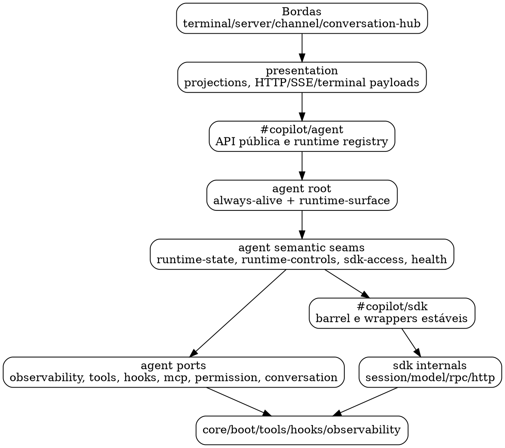

# 58 — Avaliação do faltante para a nova arquitetura de `src/copilot/agent` e integração com `src/copilot`

**Data:** 2026-04-29  
**Escopo:** `src/copilot/agent/**` e suas fronteiras com `presentation`, `terminal`, `server`,
`conversation-hub`, `sdk`, `tools`, `hooks`, `observability`, `core` e `boot`.

---

## 1) Estado atual consolidado

O `agent` já está em uma fase estruturalmente melhor que a registrada nos documentos 52–57:

- não há ciclos internos em `src/copilot/agent`;
- `turn-executor` e `loop-manager` convergiram para `agent-runtime-state`;
- `always-alive.js` foi reduzido a root compatível sobre `agent-runtime-surface.js`;
- `observability-port.js` deixou de ser dependência direta do miolo do agent e virou aggregate
  compatível;
- `presentation` começou a consolidar projections reutilizáveis, especialmente metadata de runtime e
  fallback;
- `terminal:llm-b` já preserva `model="auto"` até o SDK, permitindo roteamento nativo quando um
  modelo concreto está bloqueado por quota.

Medição factual desta rodada:

- `npx madge src/copilot/agent --extensions js --circular`: **0 ciclos internos**;
- `npx madge src/copilot --extensions js --circular`: **0 ciclos globais** após a extração da porta
  `sdk/models/client-provider.js`.

Leitura: a nova arquitetura do `agent` está próxima do alvo e a árvore global de `src/copilot` agora
está sem ciclos detectados; permanecem dívidas de boot transacional, projections e governança de
imports.

---

## 2) Situação TO-BE proposta

### 2.1 Camadas desejadas

### 2.2 Regras arquiteturais-alvo

1. Bordas (`server`, `terminal`, `channel`, `conversation-hub`) não conhecem `agent/facades/*`.
2. `presentation` consome `#copilot/agent`, não caminhos profundos internos do agent.
3. O `agent` só acessa SDK vanilla por `agent/facades/*` e `agent/ports/*`.
4. Estado persistido do agent passa por `agent-runtime-state` ou por módulos de storage claramente
   marcados como infra (`state-io`, `snapshot`).
5. `always-alive.js` permanece como singleton/API compatível, não como owner de detalhes.
6. Boot e shutdown produzem relatórios estáveis e rollback previsível.
7. O SDK remove ciclos internos de model/session antes de virar fundação final para multi-runtime.

---

## 3) Dívidas restantes por domínio

### D1 — Integração externa com o agent

**Situação atual:** parte de `presentation` já consome `#copilot/agent`, mas ainda havia imports
profundos para `agent/facades/*` e `agent/error-policy.js`.

**Meta:** consumidores fora de `agent` acessam somente o barrel público `#copilot/agent`, enquanto
tipos estruturais locais usam `Parameters<>`, `ReturnType<>` ou typedefs próprios de borda.

**Status desta rodada:** aplicada para `presentation` e `conversation-hub`, com contrato estrutural
anti-regressão.

### D2 — SDK model/session cycles

**Situação atual:** o grafo global ainda acusa ciclos entre:

- `sdk/models/helpers.js`;
- `sdk/session/client.js`;
- `sdk/session/lifecycle.js`;
- `sdk/models/index.js`.

**Risco:** esse ciclo mantinha acoplamento bidirecional entre resolução de modelo e lifecycle de
sessão, exatamente a zona associada ao comportamento `auto`, fallback e quotas.

**Status desta rodada:** `sdk/models/helpers.js` deixou de importar `session/client.js`; a listagem
de modelos usa a porta `sdk/models/client-provider.js`, registrada por `session/client.js` quando o
runtime SDK é carregado. Isso removeu a aresta estática/dinâmica `models -> client` e zerou os
ciclos globais detectados por `madge`.

**Meta:** separar `model-catalog/model-resolution` de `session/client`, mantendo `client` dependente
de uma porta estável e não de helpers que retornam ao client.

### D3 — Boot transacional e ownership de recursos

**Situação atual:** a maior parte do boot runner já existe, mas ainda restam itens em 53:

- revisão fina de `timers.cancelAll` versus `agent.stop`;
- rollback direto de subfase antes do shutdown central;
- ampliação da superfície mínima validada conforme recursos obrigatórios crescem;
- métricas agregadas por fase/handler.

**Meta:** cada fase tem owner, timeout, rollback e relatório padronizado.

### D4 — Estado persistido de diálogo e user input

**Situação atual:** `turn-executor` já usa `agent-runtime-state`; nesta rodada, `user-input-handler`
também deixou de tocar `state-io` diretamente e passou a persistir `pendingQuestion` via
`persistAgentRuntimePendingQuestionState`.

**Meta:** todo estado semântico de pending question, shadow, pending turn, dialog paused e shutdown
passa pela façade `agent-runtime-state`.

### D5 — Facades e ports como contratos congelados

**Situação atual:** facades são o backbone real do agent, mas nem todas têm contratos públicos
anti-regressão tão fortes quanto lifecycle/SDK.

**Meta:** cada facade crítica tem:

- teste de export público;
- contrato de “não bypass”;
- tipo/projection esperado;
- ownership claro: query, mutation, lifecycle ou infra.

### D6 — Presentation monopoly

**Situação atual:** metadata de runtime foi centralizada; ainda há projections que podem convergir
mais para `runtime-overview`, `runtime-health`, `runtime-status` e `runtime-controls`.

**Meta:** server/terminal não montam payloads próprios de agent; consomem projections
compartilhadas.

### D7 — Governança global de imports

**Situação atual:** há contratos para alguns boundaries, mas ainda não há uma matriz completa de
regras por camada.

**Meta:** `tests/unit/copilot/contracts` deve codificar a matriz:

- external -> presentation -> `#copilot/agent`;
- agent -> sdk apenas via facades/ports;
- agent -> observability apenas via ports finas;
- server/terminal/channel não abrem internals de agent;
- sdk model/session sem ciclo.

---

## 4) Roadmap completo

### Faixa A — Fechar fronteira externa do agent

- [x] Migrar `presentation` de imports profundos para `#copilot/agent`.
- [x] Migrar typedef profundo em `conversation-hub` para `Parameters<typeof sendAgentDialogTurn>`.
- [x] Exportar `classifyAgentError` pelo barrel público do agent.
- [x] Criar contrato estrutural proibindo `agent/facades/*` e `agent/error-policy.js` fora de
      `agent`.
- [ ] Auditar `server`, `terminal`, `channel` e `runtime-wiring` para reduzir imports diretos do
      singleton quando uma projection de `presentation` bastar.

### Faixa B — Remover ciclos globais do SDK

- [x] Remover dependência estática de `sdk/session/client.js` dentro do eixo de models;
- [x] Criar `sdk/models/client-provider.js` como porta interna de provider de client;
- [x] Registrar o provider em `sdk/session/client.js`, preservando a API pública;
- [ ] Separar `sdk/models/helpers.js` em:
  - helpers puros de catálogo/model metadata;
  - adapter de lifecycle que recebe dependências por parâmetro;
- [ ] Fazer `session/lifecycle.js` depender de uma interface de resolução, não do barrel de models;
- [x] Validar `madge src/copilot --circular` sem ciclos globais.

### Faixa C — Consolidar estado de diálogo

- [x] Promover persistência de `user-input-handler` para `agent-runtime-state`;
- [x] Adicionar capability `persistAgentRuntimePendingQuestionState`;
- [x] Proibir `dialog/*` de importar `lifecycle/state-io.js` diretamente, exceto módulos
      explicitamente infra;
- [x] Cobrir com testes focados em pending question/shadow/recovery e contrato anti-bypass em
      `dialog/*`.

### Faixa D — Boot/shutdown como runtime transacional final

- [x] Finalizar rollback direto de subfase;
- [x] Criar snapshot de timers ativos no diagnóstico;
- [x] Conectar métricas agregadas por fase de boot/shutdown;
- [x] Atualizar validação de superfície obrigatória para cobrir novos exports públicos do agent;
- [ ] Reexecutar teste live `terminal:llm-b` com boot, diálogo e `/quit`.

### Faixa E — Congelar facades/ports

- [ ] Criar matriz de facades críticas e donos:
  - `agent-runtime-state`: persistência semântica;
  - `agent-runtime-controls`: controles/mutações;
  - `agent-sdk-access`: lifecycle vanilla SDK;
  - `agent-sdk-runtime`: eventos/send/read de sessão;
  - `agent-health-access`: input consolidado de health;
  - portas finas de observability/tools/hooks/mcp/conversation.
- [ ] Para cada uma, adicionar teste de export público e teste de bypass.
- [ ] Reduzir imports cruzados entre facades quando houver caminho de query mais simples.

### Faixa F — Presentation monopoly final

- [ ] Server routes passam a usar somente `presentation/*`;
- [ ] Terminal handlers passam a usar somente `presentation/*` para payloads/status;
- [ ] `presentation/runtime-overview` vira a leitura padrão para status/health/context/pr;
- [ ] Criar contratos impedindo payload ad hoc de status/health fora de `presentation`.

### Faixa G — Preparação para multi-runtime/multi-agent

- [ ] Garantir que todo endpoint aceita/propaga `runtimeId`;
- [ ] Separar default runtime de runtime selecionado em projections e comandos;
- [ ] Evitar estado global implícito fora de `runtime-registry`;
- [ ] Criar teste de dois runtimes registrados com fallback explícito.

---

## 5) Próxima ordem de ataque recomendada

1. **A** — fechar fronteira externa do agent (baixo risco, alto impacto).
2. **C** — remover persistência direta remanescente em `dialog/user-input-handler`.
3. **B** — quebrar ciclos globais do SDK model/session.
4. **D** — completar boot/shutdown transacional.
5. **F/G** — consolidar presentation e preparar multi-runtime real.

Critério de conclusão da migração:

- `src/copilot/agent` sem ciclos internos;
- `src/copilot` sem ciclos globais;
- `typecheck:strict:src.copilot` verde;
- `eslint src/copilot --max-warnings=0` verde;
- suíte unitária `tests/unit/copilot` verde;
- `terminal:llm-b` inicia, conversa em `model=auto`, e encerra via `/quit`;
- contracts impedem retorno de deep imports e bypasses críticos.

---

## 6) Checkpoint executado nesta rodada

### Transformações aplicadas

- `presentation` e `conversation-hub` foram alinhados para consumir a superfície pública
  `#copilot/agent`, fechando imports profundos de `agent/facades/*` e `agent/error-policy.js`.
- `classifyAgentError` passou a ser export público do barrel do agent para uso legítimo nas bordas.
- `dialog/user-input-handler` passou a persistir `pendingQuestion` via
  `persistAgentRuntimePendingQuestionState`, reduzindo bypass direto de `lifecycle/state-io.js`.
- `sdk/models/client-provider.js` foi introduzido para quebrar o ciclo model/session sem alterar a
  API externa de listagem de modelos.
- Contratos de arquitetura foram ampliados para proteger:
  - o barrel público do agent;
  - a proibição de deep import externo para facades/error-policy;
  - a ausência de bypass `dialog/* -> lifecycle/state-io.js`;
  - a remoção da dependência `sdk/models/helpers.js -> sdk/session/client.js`.

### Validação executada

- `npm run typecheck:strict:src.copilot`: **verde**.
- `npx eslint src/copilot ... --max-warnings=0`: **verde**.
- `npx madge src/copilot --extensions js --circular`: **0 ciclos globais**.
- `npx madge src/copilot/agent --extensions js --circular`: **0 ciclos internos**.
- `npx vitest run --config vitest.copilot.config.js tests/unit/copilot --testTimeout=60000`: **4303
  testes passaram, 28 skipped**.

### Próximo bloco recomendado

O próximo maior custo-benefício é a **Faixa D**: completar boot/shutdown transacional com rollback
de subfase, diagnóstico de timers ativos e teste live controlado de `terminal:llm-b`. A base de
agent e SDK já está mais limpa; agora vale atacar a confiabilidade operacional do processo vivo.

---

## 7) Checkpoint de continuação — lifecycle transacional

### Transformações aplicadas

- `BootPhaseRunContext.registerRollback()` permite rollback parcial durante a própria fase que
  falha, antes do shutdown central.
- `bootstrap.js` registra rollbacks diretos para:
  - `terminal-pinned-context:pinned-context`;
  - `copilot-http-server:http-server`;
  - `terminal-runtime-listeners:runtime-listeners`.
- `terminal/index.js` ganhou rollbacks idempotentes para pinned context, HTTP server, listeners,
  timers e `SIGHUP`.
- `core/timer-registry.js` expõe `listActiveTimers()` sem vazar handles nativos.
- `runtime-lifecycle` e `/diagnose` passam a exibir timers ativos e métricas agregadas.
- `boot/surface-validation.js` valida `#copilot/core`, novos exports públicos de `#copilot/agent` e
  rollbacks transacionais do terminal.

### Validação parcial executada

- `npm run typecheck:strict:src.copilot`: **verde** após os ajustes de lifecycle.
- Testes focados de boot/surface/shutdown/lifecycle/diagnose/bootstrap: **verdes**.
