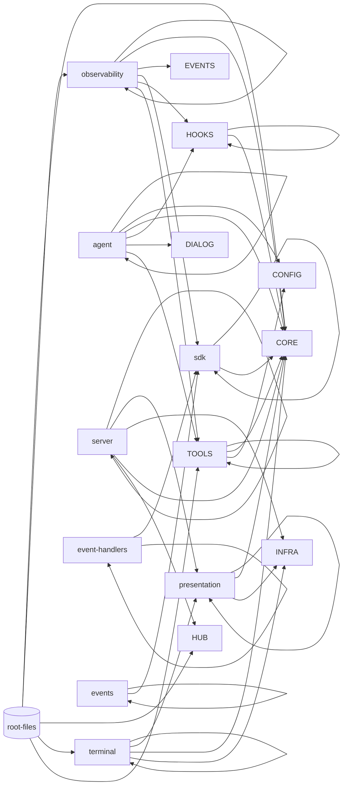
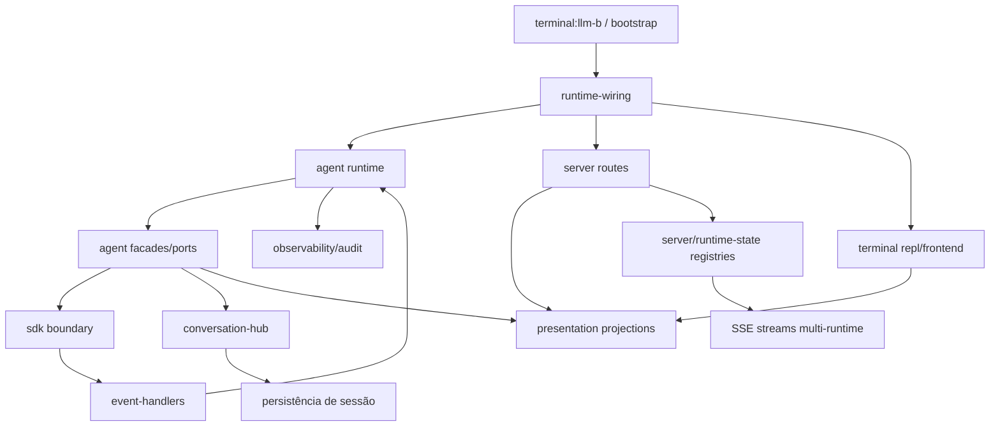

# 65 — Pré-auditoria de rebase arquitetural 2.1 de `src/copilot`

**Data:** 2026-04-30 **Status:** pré-auditoria ativa (continuidade dos documentos 57–64) **Escopo:**
`src/copilot/**` completo, com foco em arquitetura viva pós-Gate 2.0-F e preparação da próxima onda
de transformações amplas/profundas.

---

## 1) Objetivo desta pré-auditoria

Este documento inicia uma nova rodada de auditoria arquitetural **não para recomeçar**, e sim para:

1. rebasear a leitura oficial após as transformações 57–64;
2. medir o estado atual do grafo total de `src/copilot`;
3. definir método e contratos da nova auditoria;
4. preparar a fase de execução das próximas cirurgias estruturais.

---

## 2) Baseline imediata herdada da rodada anterior

Partimos dos seguintes fatos já consolidados na trilha 57–64:

- `src/copilot` está sem ciclos globais em `madge`;
- `src/copilot/agent` está sem ciclos internos;
- blocos de metadata runtime, registries explícitos e anti-bypass avançaram;
- Gate 2.0-F foi evidenciado com typecheck/lint/testes/madge verdes na rodada ampla.

Leitura: a base deixou de ser “resgate emergencial” e passou a ser “plataforma para evolução 2.1”.

---

## 3) Medição factual desta pré-auditoria (snapshot 2026-04-30)

### 3.1 Métricas totais

- Arquivos JS mapeados por `madge`: **530**
- Arestas totais de dependência: **1337**
- Domínios de primeiro nível em `src/copilot`: **23**
- Ciclos globais detectados: **0**
- Ciclos em `src/copilot/agent`: **0**

### 3.2 Distribuição por domínio (arquivos)

- `agent`: 89
- `terminal`: 56
- `sdk`: 51
- `server`: 48
- `observability`: 34
- `tools`: 34
- `presentation`: 32
- `config`: 27
- `hooks`: 26
- `core`: 21
- `events`: 20
- demais domínios: 92 (somados)

---

## 4) Grafos totais de `src/copilot`

## 4.1 Grafo total por domínio (macro)

### 4.2 Grafo total de dependências estruturais (pipeline end-to-end)

### 4.3 Matriz de acoplamentos dominantes (arestas >=2)

| Origem          | Dependências mais fortes                                             |
| --------------- | -------------------------------------------------------------------- |
| `agent`         | `agent` (248), `config` (23), `core` (17), `hooks` (6), `dialog` (5) |
| `server`        | `server` (73), `presentation` (49), `infra` (17), `core` (6)         |
| `terminal`      | `terminal` (110), `presentation` (38), `core` (9)                    |
| `sdk`           | `sdk` (110), `core` (12)                                             |
| `observability` | `observability` (59), `core` (15), `events` (10), `sdk` (7)          |
| `tools`         | `tools` (96), `core` (11), `config` (2)                              |

Leitura: o sistema está sem ciclos, porém com **massa concentrada** em `agent/server/terminal/sdk` e
dependência forte de `core` e `presentation` como hubs estruturais.

---

## 5) Hipóteses de risco para auditar nesta rodada

1. **Risco de macro-hubs estáveis demais** Mesmo sem ciclos, hubs com fan-in/fan-out alto podem
   esconder acoplamento semântico.

2. **Risco de regressão de monopólio de projection** `presentation` avançou, mas bordas podem voltar
   a montar payload ad hoc.

3. **Risco de governança incompleta em estado vivo** `server/runtime-state` evoluiu; ainda requer
   vigilância em novos fluxos.

4. **Risco de drift entre arquitetura oficial e evolução real** A trilha 23/24 era macro; agora
   precisamos uma versão 2.1 executável e incremental.

---

## 6) Método da nova auditoria (2.1)

### Fase A — Diagnóstico AS-IS

- validar grafo e topologia por domínio;
- mapear fluxos críticos (boot, dialog turn, SSE, session CRUD, observability);
- classificar dívida por eixo: owner, seam, estado vivo, contrato, borda.

### Fase B — TO-BE 2.1

- atualizar situação ideal pós-transformações 57–64;
- propor alvos explícitos para multi-runtime pleno e evolução contínua;
- definir novos gates arquiteturais para sustentar profundidade sem regressão.

### Fase C — Roadmap ampliado

- detalhar faixas e subfaixas executáveis;
- ordenar por impacto arquitetural e risco operacional;
- indicar entregáveis/documentos/testes para cada onda.

---

## 7) Critério de pronto desta pré-auditoria

A pré-auditoria termina quando:

- o AS-IS 2.1 estiver consolidado com arquitetura + fluxos;
- o TO-BE 2.1 estiver documentado;
- o roadmap expandido estiver pronto para execução contínua;
- a próxima onda de transformação profunda estiver destravada por contratos/gates.

---

## 8) Próximo passo imediato

A próxima etapa desta rodada é o diagnóstico completo do estado atual em `66-*`, seguido da proposta
TO-BE (`67-*`) e do roadmap de execução profunda (`68-*`).
