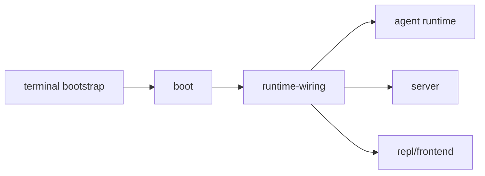
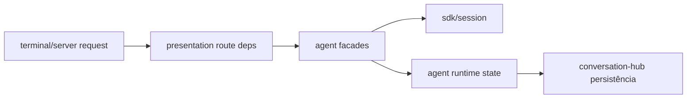
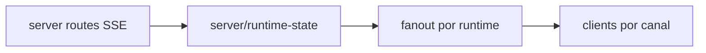

# 66 — Diagnóstico AS-IS atualizado de `src/copilot` (arquitetura e fluxos)

**Data:** 2026-04-30 **Escopo:** fotografia arquitetural atual de `src/copilot/**` pós-checkpoints
57–64.

---

## 1) Resumo executivo

`src/copilot` evoluiu para um estágio de **estabilidade estrutural alta** (sem ciclos globais), com
avanço real em:

- fronteira pública de `agent`;
- monopólio progressivo de `presentation` nas bordas;
- registries explícitos de estado vivo multi-runtime em `server/runtime-state`;
- contratos anti-bypass e inventário arquitetural executável em testes.

Ao mesmo tempo, o sistema segue com **complexidade operacional alta** e concentrações de acoplamento
que exigem nova onda de refatoração profunda.

---

## 2) Estado arquitetural atual por camada

## 2.1 SDK boundary (`sdk/`)

**Situação atual**

- mantém o papel de fronteira vanilla;
- ciclos model/session já desmontados nas rodadas anteriores;
- integração com rotas e projections runtime-aware está mais consistente.

**Ponto de atenção**

- manter separação estrita entre capacidades vanilla, policy local e ergonomia do runtime.

## 2.2 Runtime vivo (`agent/`)

**Situação atual**

- sem ciclos internos;
- `always-alive` mais fino e apoiado em `agent-runtime-surface`;
- facades/ports viraram seam real e coberto por contratos.

**Ponto de atenção**

- alta densidade interna ainda existe (89 arquivos), pedindo nova etapa de simplificação semântica.

## 2.3 Shared edge (`presentation/`)

**Situação atual**

- consolidou payloads de status/health/runtime metadata em múltiplas rotas;
- virou camada central para HTTP/SSE/terminal projections.

**Ponto de atenção**

- impedir regressões para payload ad hoc em rotas futuras.

## 2.4 Bordas (`server/`, `terminal/`, `channel/`)

**Situação atual**

- `server` e `terminal` mais finos em vários fluxos;
- estado SSE/concorrência agora externalizado em registries explícitos;
- `channel` mais alinhado com papel de transporte.

**Ponto de atenção**

- ainda existe grande volume de superfície operacional concentrada nesses módulos.

## 2.5 Governança (`contracts`, `observability`, `audit`)

**Situação atual**

- contratos arquiteturais cobrem import boundaries, ownership de facades, inventário de rotas e
  estado vivo;
- observabilidade segue forte, mas com centralidade elevada no sistema.

**Ponto de atenção**

- risco de sobrecarga de responsabilidades em observability/hubs de core.

---

## 3) Fluxos críticos — leitura atual

## 3.1 Fluxo de boot e host

**Diagnóstico:** fluxo está funcional e canônico, mas ainda sensível à densidade de wiring no
startup.

## 3.2 Fluxo de diálogo e sessão viva

**Diagnóstico:** fluxo semântico está mais limpo que no baseline inicial, com menos bypass cru.

## 3.3 Fluxo de streaming multi-runtime

**Diagnóstico:** melhoria arquitetural significativa; colisão entre runtimes foi tratada nos eixos
principais.

---

## 4) Forças atuais do sistema

1. **Zero ciclos** em grafo global e no `agent`;
2. **Contratos arquiteturais executáveis** maduros;
3. **Separação melhor entre runtime, projection e borda**;
4. **Evolução multi-runtime real** (metadata + registries + testes);
5. **Base pronta para transformação de nível 2.1**, não apenas manutenção.

---

## 5) Dívidas e lacunas abertas

### D-ASIS-1 — Complexidade estrutural ainda alta

- 530 arquivos JS e 1337 arestas;
- concentração em `agent`, `terminal`, `sdk`, `server`.

### D-ASIS-2 — Hubs de acoplamento

- `core` e `presentation` aparecem como hubs fortes;
- risco de novas responsabilidades convergirem sem governança explícita.

### D-ASIS-3 — Evolução contínua de contracts

- matriz de contratos atual é robusta, mas precisa acompanhar cada nova onda (senão vira foto
  antiga).

### D-ASIS-4 — Fronteiras de longo prazo ainda não finalizadas

- temas de plugins/extensibilidade, governança de artifacts e simplificação de bordas ainda têm
  trabalho pendente da trilha macro 23/24.

---

## 6) Diagnóstico final AS-IS

A situação atual pode ser resumida assim:

> `src/copilot` saiu da fase de correção estrutural pesada e entrou na fase de consolidação
> evolutiva.

A arquitetura está mais governável, porém ainda grande e densa. O próximo salto não é “consertar
ciclos”, e sim **reduzir custo cognitivo, reforçar ownership semântico e escalar multi-runtime com
menos atrito**.
