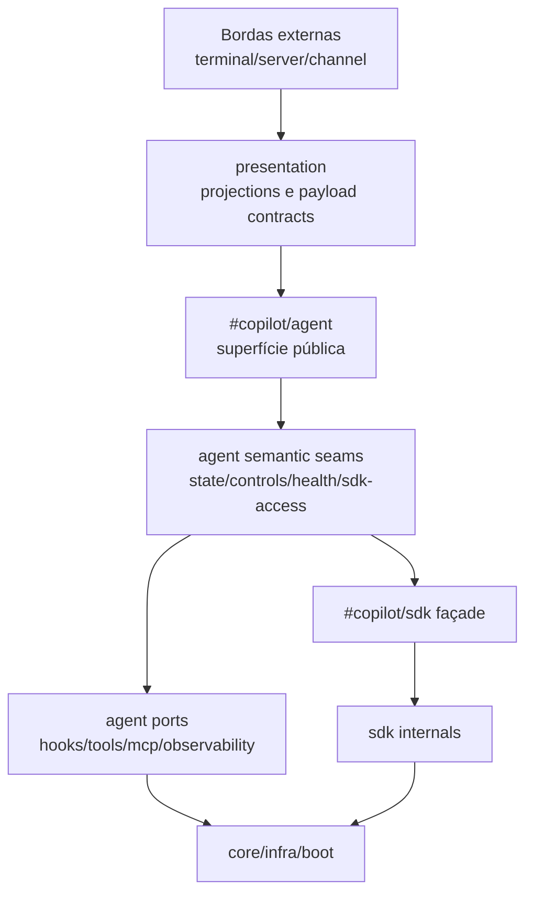

# 67 — Situação ideal alvo 2.1 para `src/copilot`

**Data:** 2026-04-30 **Status:** proposta TO-BE de continuidade (pós 57–64)

---

## 1) Princípio central da Arquitetura 2.1

A Arquitetura 2.1 mantém os ganhos da 2.0 e avança para um objetivo explícito:

> transformar `src/copilot` em um sistema multi-runtime, modular e evolutivo, com complexidade
> controlada por contratos de ownership e por projeções canônicas de borda.

---

## 2) Modelo alvo por camadas

### Regras-alvo

1. bordas não abrem internals de `agent`;
2. `presentation` define payload compartilhado de runtime;
3. `agent` não persiste estado sem seam semântico;
4. `sdk` continua SSOT vanilla;
5. estado global vivo de borda é registry explícito e testável.

---

## 3) Critérios de pronto da situação ideal 2.1

### Gate 2.1-A — Complexidade estrutural controlada

- redução progressiva de arestas efetivas por domínio crítico (`agent/server/terminal`);
- eliminação de hotspots semânticos não justificados.

### Gate 2.1-B — Ownership semântico explícito

- cada façade crítica tem papel (`query/mutation/lifecycle/infra/projection`) e contrato ativo;
- imports cruzados não declarados entre facades permanecem bloqueados.

### Gate 2.1-C — Projection monopoly completo

- payload de status/health/capabilities/session/runtime metadata nasce em `presentation`;
- rotas e comandos atuam como adapters finos.

### Gate 2.1-D — Multi-runtime robusto

- concorrência, stream, fallback e rate-limit chaveados por runtime quando aplicável;
- sem mutex/global ad hoc para fluxos independentes.

### Gate 2.1-E — Governança de evolução

- inventário de rotas, registries e seams atualizado por contrato;
- novos módulos só entram com owner e boundary definidos.

---

## 4) Alvos estruturais concretos da 2.1

## 4.1 Agent runtime 2.1

- `always-alive` mínimo e orientado a orchestration;
- runtime seams internamente desacoplados;
- redução de “knowledge leakage” para `core/config`.

## 4.2 Presentation 2.1

- catálogo de projections versionado por domínio (`runtime`, `session`, `health`, `controls`,
  `metrics`);
- shape ownership explícito por projection.

## 4.3 Bordas 2.1

- `server` dividido por classe de adapter (runtime-aware, hub-only, server-only, infra-only);
- `terminal` com separação mais forte entre UX, orchestration e transport concerns.

## 4.4 SDK boundary 2.1

- zero reintrodução de drift model/session;
- capacidades vanilla novas entram por wrappers tipados e observáveis.

---

## 5) Situação ideal operacional

No estado ideal 2.1, o ciclo operacional deve ser previsível:

1. boot inicia com fases transacionais auditáveis;
2. cada request/stream resolve runtime com metadata canônica;
3. diálogo e eventos fluem por seams públicos estáveis;
4. falhas são classificadas por taxonomy comum e observáveis por domínio;
5. shutdown/cleanup mantém invariantes de sessão/runtime sem efeitos colaterais cruzados.

---

## 6) Diferença-chave entre 2.0 e 2.1

- **2.0**: eliminou ciclos, fechou fronteiras críticas e provou estabilidade ampla.
- **2.1**: reduz densidade estrutural, fortalece governança contínua e prepara escala evolutiva sem
  regressão.

---

## 7) Resultado esperado

Com 2.1 completo, `src/copilot` passa a operar com:

- menor custo de manutenção por módulo;
- menor risco de regressão arquitetural por crescimento de features;
- melhor previsibilidade para novas transformações amplas/profundas.
